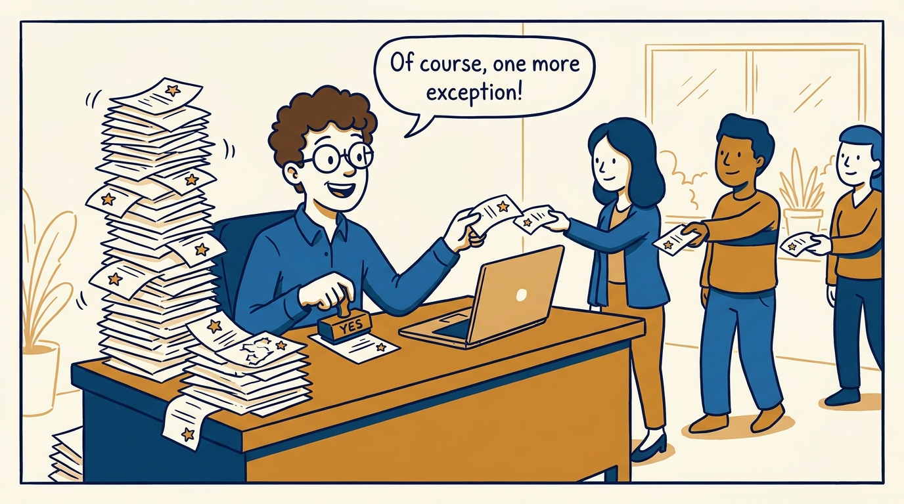
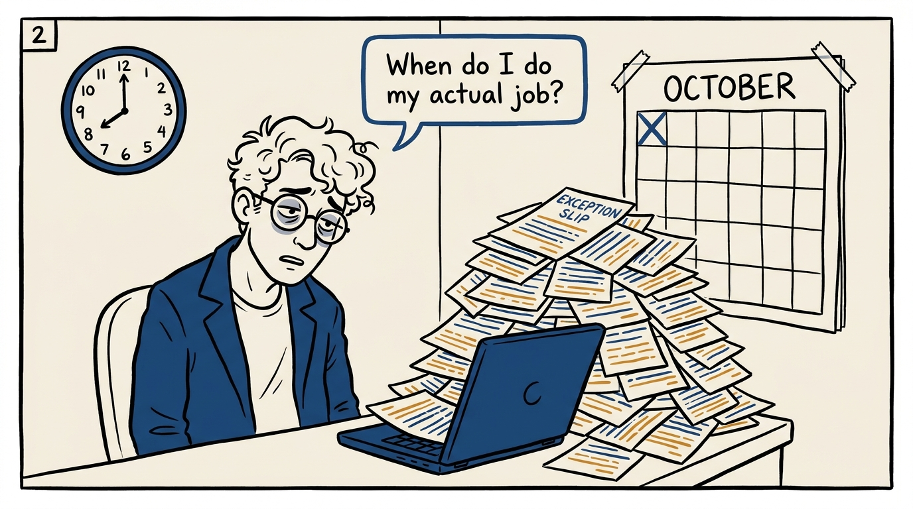
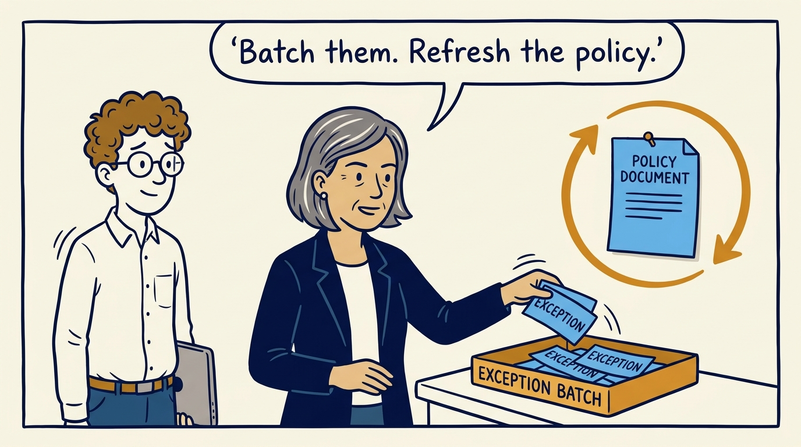
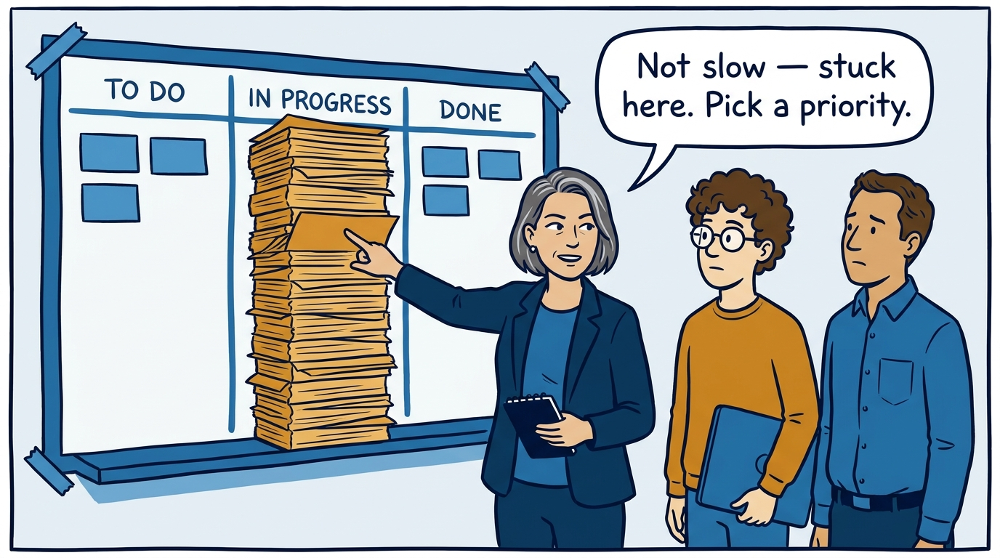
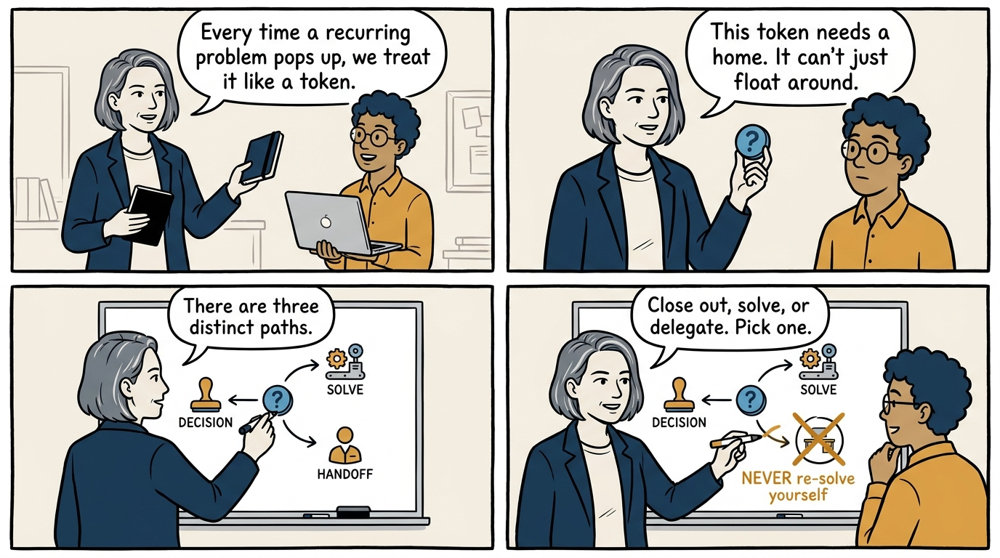
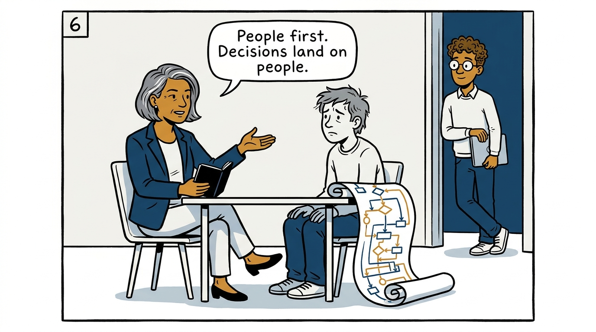
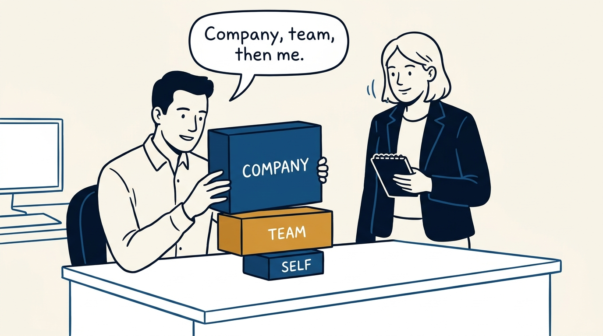
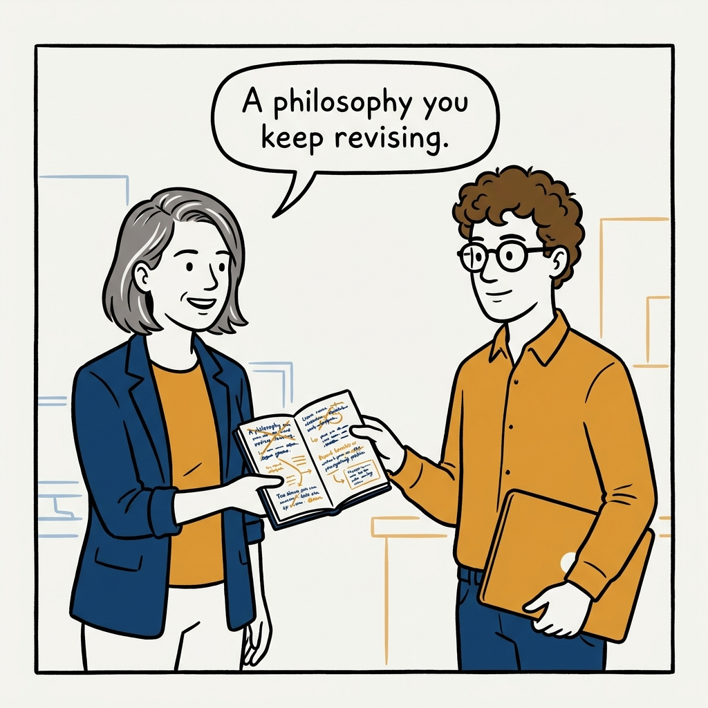

Work the policy, say no with data, and triage what recurs — a management philosophy in eight panels.

<!-- comic-style
{
  "cast": "VERA: a calm, seasoned engineering executive, short gray-streaked hair, dark blazer over a plain t-shirt, carries a small black notebook. LEO: an eager young engineering manager, curly hair, round glasses, laptop under one arm.",
  "style": "Clean two-tone explainer comic, thick ink outlines, flat colors with deep blue and amber accents on a light background, generous white space, hand-lettered speech bubbles with SHORT readable text, no photorealism."
}
-->

**Panel 1:** *The hook: every exception approved on arrival, and the queue keeps growing.*

**Panel 2:** *The problem: one-off exceptions eat the calendar — and quietly erase the policy.*

**Panel 3:** *The principle: exceptions are signals — batch them and let the batch redesign the policy.*

**Panel 4:** *Saying no with data: the board shows whether the problem is velocity or priorities.*

**Panel 5:** *The triage: close out, solve, or delegate — the crossed-out path is doing it all yourself.*

**Panel 6:** *The ethics: when process is failing, choose the person — decisions land on lives, not just numbers.*

**Panel 7:** *The hierarchy: decide in the order company, team, yourself — it is what keeps hard calls defensible.*

**Panel 8:** *The closer: management is a profession — the philosophy is yours, and it keeps evolving.*
