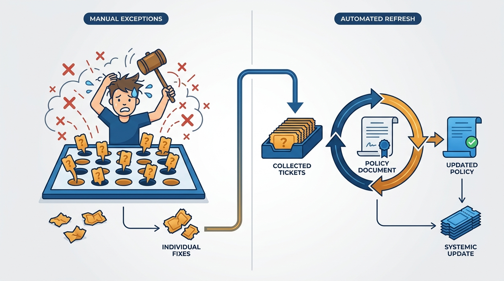
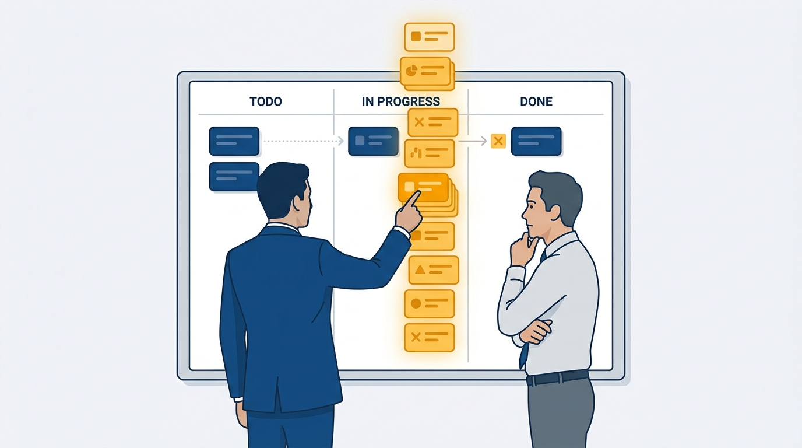
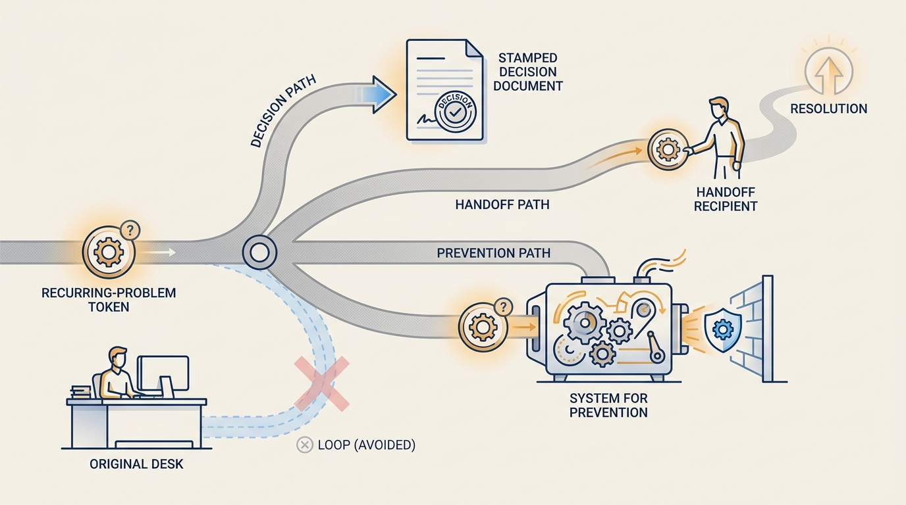

> **Status**: DRAFT
>
> **Principle**: I work the policy, not the exceptions: exceptions are batched into periodic policy refreshes, not granted one by one. I say no with data rather than apology — showing whether the real constraint is velocity, prioritization, or relationships. I treat management as an ethical profession: decisions land on people, not just on business outcomes, and I decide in the order company, team, myself. And for every recurring problem I choose deliberately — close it out, solve the class of problem, or delegate it — because solving everything personally does not scale past a single team.

## Statement

This record collects the durable management approaches I formed as a manager and still run as an executive:

- **Work the policy, not the exceptions.** A policy that constrains nothing is not a policy. Exception requests get collected, not granted on demand; on a cadence, I refresh the policy against the collected batch — without churning it so often that policy and exception become the same thing.
- **Say no effectively.** "No" is a data presentation, not a mood. I show the team's constraints, separate velocity problems from prioritization problems, use a delivery-process view to show where work is actually stuck, and translate vague complaints like "technical debt" into concrete, measurable examples.
- **Hold a management philosophy.** Management is an ethical profession: my decisions change people's lives, not just quarterly numbers. Relationships come before hard problems, people come before failing process, the hard thing gets done now, and decisions are made in the order company, team, myself.
- **Close out, solve, or delegate.** Every recurring problem gets exactly one of three treatments: a clear communicated decision, a system that prevents the class of problem, or a redirect to whoever is better positioned — never me quietly re-solving it every week.

**Figure 1:** *Work the policy: exceptions are signals to batch into the next refresh, not one-off tickets to whack.*

## How to Read This

This is an **appendix record**. The main journal is grounded in Will Larson's *The Engineering Executive's Primer*; this record reaches back to his earlier, manager-focused book, *An Elegant Puzzle: Systems of Engineering Management*, and reads its material through an executive lens — the approaches were formed managing teams, and they mostly sharpen at organizational scale. Where a theme has grown into a full Primer-grounded record of its own, this record links to it instead of repeating it. The working checklist — all nine sections of the book's approaches checklist — lives in the **Checklist** tab of this post.

## Rationale

**Exceptions are cheaper individually and ruinous in aggregate.** Granting each exception as it arrives feels responsive, but every grant erodes the policy's meaning and trains the organization that persistence beats process. Batching keeps the policy credible between refreshes — and the collected exceptions *are* the data about where the policy binds wrongly. The failure on the other side is just as real: refresh too often and the policy stops constraining anything, which is the same as having none.

**A "no" without data reads as a preference; a "no" with data reads as a constraint.** When I decline work, the useful question is *why* the team cannot absorb it — is the constraint capacity, prioritization, or relationships? A kanban-style view of the delivery process shows where work actually gets stuck, separating velocity problems ("we are slow") from prioritization problems ("we are busy with other things you also asked for"). When engineering pushes back with "technical debt," I insist we make it concrete and measurable — vague debt justifies nothing; named debt justifies a plan. Documented asks, explicit selection principles, and priorities tested with stakeholders turn "no" from a negotiation into a shared reading of the same board.

**Figure 2:** *Saying no with data: the board shows where work is stuck, turning a refusal into a shared reading of the same constraint.*

**Management decisions land on people, which makes the profession ethical, not just operational.** A reorganization is a spreadsheet exercise until you remember each cell is someone's mortgage, visa, or confidence. That is why relationships come before hard problems — you cannot navigate a painful decision with someone you have never invested in — and why people beat process when the process is failing. Deciding in the order company, team, myself is what makes the harder calls legible and defensible. And I think independently rather than copying inherited practices; an approach adopted without examination is an ethical stance taken by accident.

**Context decides the style; the style is not a personality.** In growth plates — areas under severe demand — I prioritize execution over endless ideation, work down the backlog of obvious ideas before adding clever ones, and accept that some work will be mediocre because the constraint is real. Outside the growth plates, the job inverts: fundamentals, steady improvement, relationships, developing the team, and preparing for the next change. Most manager failure modes I have seen — including my own — come from running the growth-plate style in a stable area, or vice versa.

**Scope is impact, not headcount — and stuckness is usually self-inflicted.** The traps are well mapped: managing only down or only up, optimizing locally at the company's expense, treating hiring as the cure for everything, disappearing instead of delegating, losing touch with ground truth, and confusing team size or title with impact. The counter-moves are equally concrete: define the role broadly enough to fill gaps, pursue hard cross-cutting problems, build reusable systems that empower others, partner deliberately with my own manager — sharing problems, progress, capacity, and goals, and learning their pressures well enough to help — and celebrate what works, not only what is broken. At senior levels feedback goes scarce, so setting direction becomes my job: mine broadly for ideas, separate discovery from judgment, and distill the result into a few memorable points.

## What This Means in Practice

| What this principle says | What it does **not** say |
| --- | --- |
| Exceptions are batched into periodic policy refreshes. | Exceptions are never granted — a refreshed policy absorbs the legitimate ones. |
| "No" comes with constraints, a board, and data. | "No" is the default answer, or a way to avoid stakeholders. |
| People over process when process is failing. | Process does not matter — good process is how people are protected at scale. |
| Decisions ordered company, team, myself. | The team's interests are expendable — the ordering resolves conflicts, it does not invite them. |
| Accept mediocre work in severe growth plates. | Mediocre work is fine everywhere — outside the plates, fundamentals rule. |
| Scope grows through cross-cutting problems and reusable systems. | Scope grows through headcount — team size is not the gateway to growth. |
| Every recurring problem gets closed out, solved, or delegated. | I personally solve whatever crosses my desk. |

**Figure 3:** *The triage fork: every recurring problem gets exactly one of three treatments — and never the silent loop back to my own desk.*

## Anti-Patterns

- **Exception whack-a-mole.** Granting each exception on arrival — responsive in the moment, and the end of the policy within a quarter.
- **Policy churn.** Rewriting the policy after every complaint, until policy and exception are the same thing with different letterhead.
- **The apologetic no.** Declining work with regret instead of data, which invites escalation rather than re-prioritization.
- **Vague debt.** Accepting — or offering — "technical debt" as an argument without concrete, measurable examples.
- **Hiring as analgesic.** Treating headcount as the answer to problems that are actually prioritization, process, or relationships.
- **Disappearing instead of delegating.** Withdrawing entirely and calling it empowerment — delegation keeps a line to ground truth; disappearance cuts it.
- **The heroic solver.** Personally fixing every recurring problem — which feels indispensable and guarantees the problems recur.
- **Growth-plate style everywhere.** Running execute-execute-execute in stable areas that need fundamentals — or polishing fundamentals inside a growth plate that needs shipping.

## Related Records

- [[managing-energy]] — shares the company → team → myself hierarchy; that record covers its sustainability side.
- [[working-with-your-ceo-peers-and-engineering]] — the Primer-grounded record for managing upward and sideways; "partner with your manager" is its manager-era ancestor.
- [[calibrating-your-standards]] — accepting mediocre work in growth plates is a calibrated exception, not a lowered standard.
- [[inspected-trust]] — staying connected to ground truth is the same instinct as inspection; delegating without disappearing enables both.
- [[organizational-design]] — appendix sibling: team sizing, growth plates as structure, and where scope lives.
- [[systems-and-tools]] — appendix sibling: the systems-thinking models behind "solve" in close-out/solve/delegate.

## Scope and Revisiting

This record governs my default management moves — policy handling, saying no, triage of recurring problems, and the ethical frame — wherever I operate. I revisit it when the exception batch stops shrinking after refreshes (the policy is misaligned with reality), when my calendar shows me repeatedly solving the same class of problem (the triage is not being run), and whenever I catch myself deciding in the reverse order: myself, team, company.

## Authoritative References

- Will Larson, *An Elegant Puzzle: Systems of Engineering Management* (Stripe Press, 2019) — the "Approaches" material this record's checklist distills.
- Many of the book's chapters began as freely available essays on [lethain.com](https://lethain.com/), where the underlying arguments can still be read in their original form.
