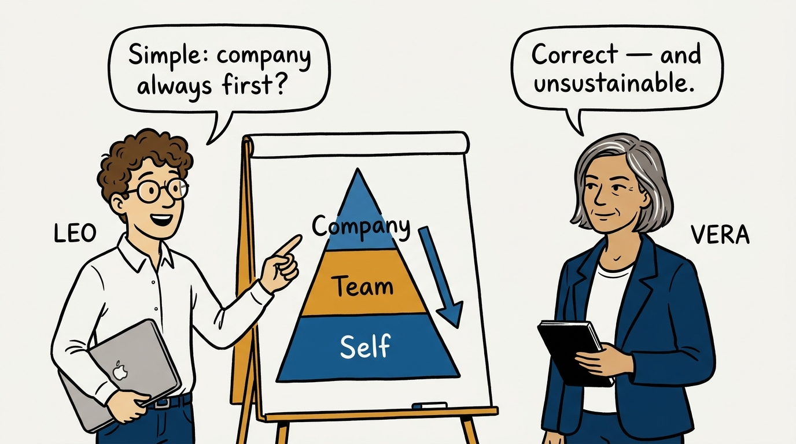
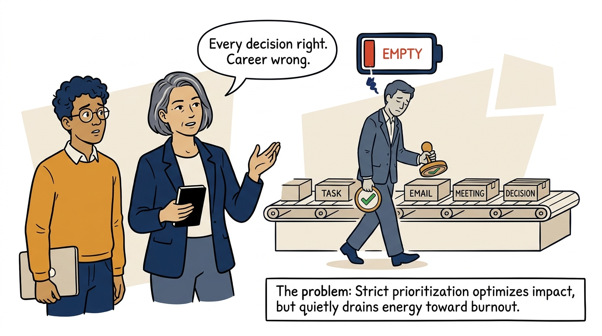
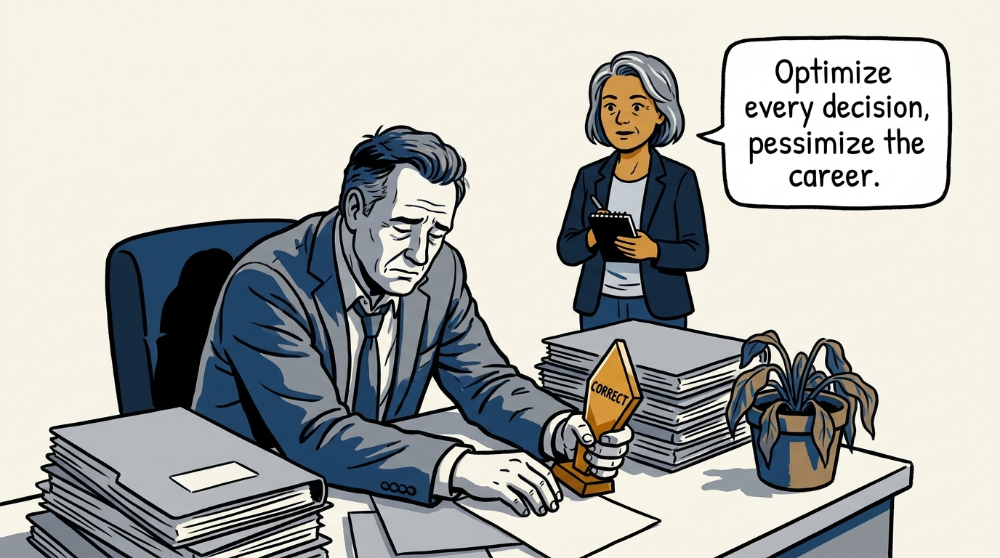
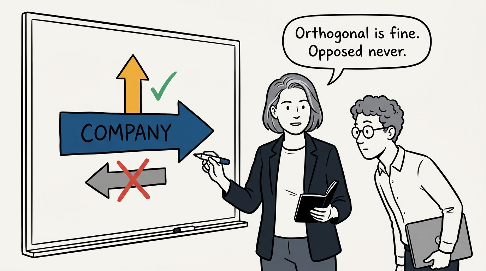
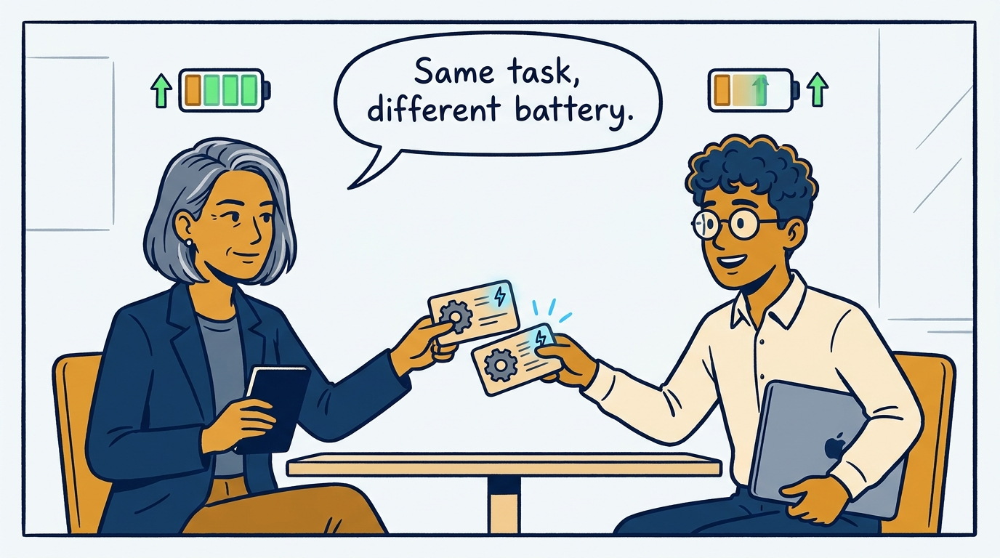
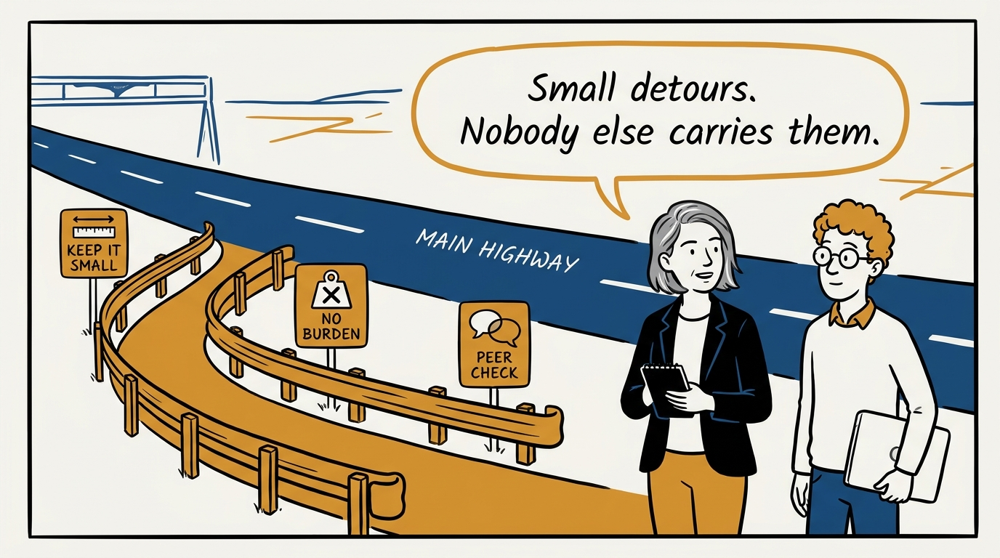
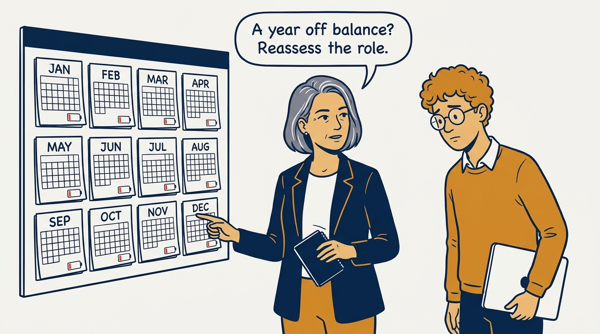
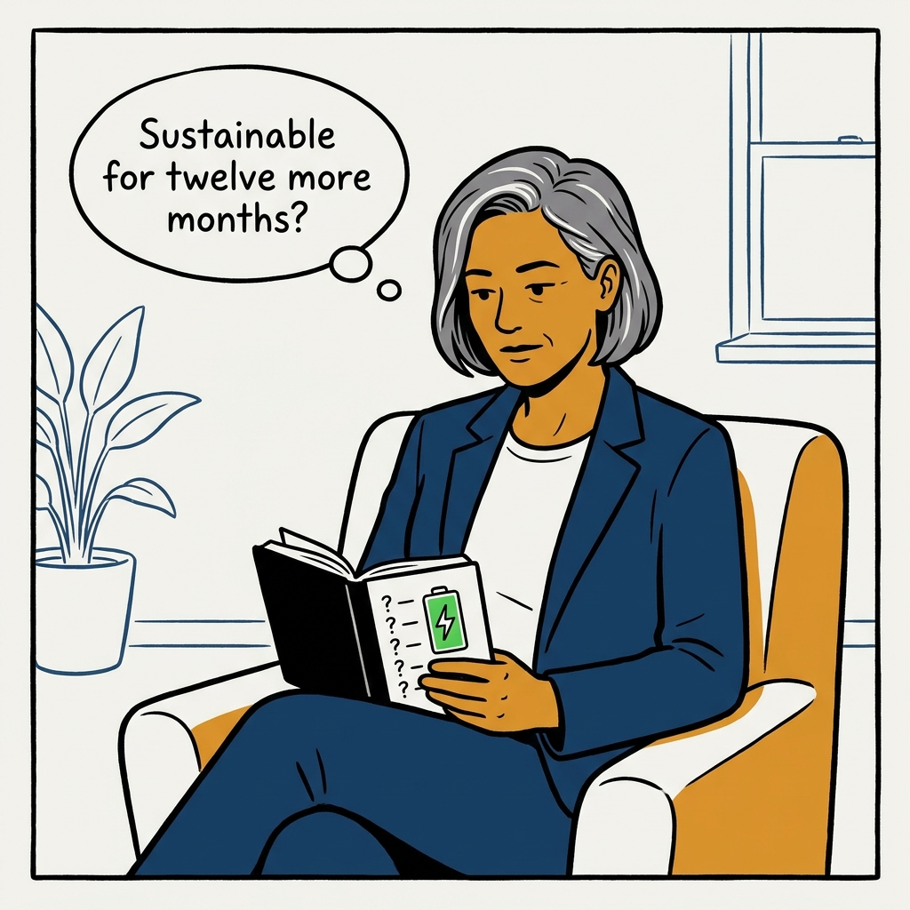

Company first, team second, self third — and why you must break that order a little to survive the job.

<!-- comic-style
{
  "cast": "VERA: a calm, seasoned engineering executive, short gray-streaked hair, dark blazer over a plain t-shirt, carries a small black notebook. LEO: an eager young engineering manager, curly hair, round glasses, laptop under one arm.",
  "style": "Clean two-tone explainer comic, thick ink outlines, flat colors with deep blue and amber accents on a light background, generous white space, hand-lettered speech bubbles with SHORT readable text, no photorealism."
}
-->

**Panel 1:** *The hook: company over team over self is right — and rigidly applied, unsustainable.*

**Panel 2:** *The problem: exclusively draining work — correct in every decision, burned out within two years.*

**Panel 3:** *Anti-pattern: rigid hierarchy martyrdom — all draining work, then surprise burnout.*

**Panel 4:** *The principle: energizing detours must be orthogonal to company needs — never opposed.*

**Panel 5:** *Positive-sum energy: route real work to the people it energizes.*

**Panel 6:** *The guardrails: modest, controlled, burden-free — and gray areas get a peer sanity check.*

**Panel 7:** *The hard trigger: a year of persistent imbalance changes the question from work mix to role fit.*

**Panel 8:** *Closer: a brief weekly reflection — what energized, what drained, and is this sustainable?*
