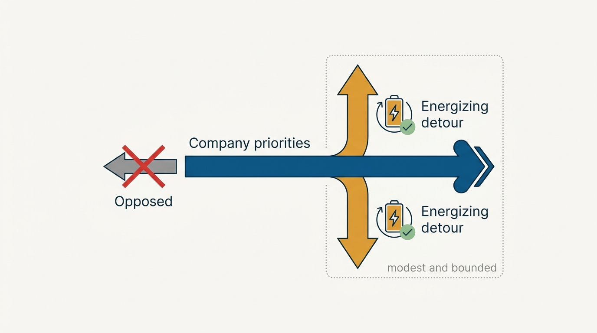
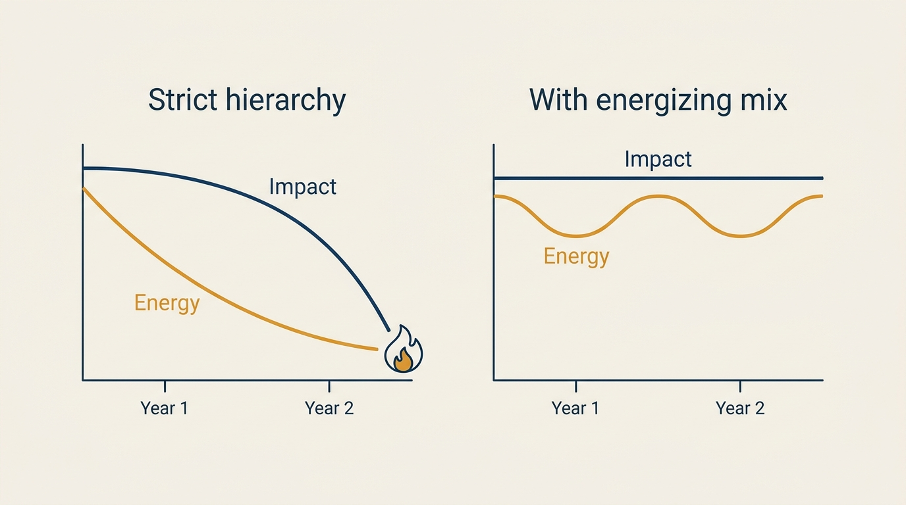
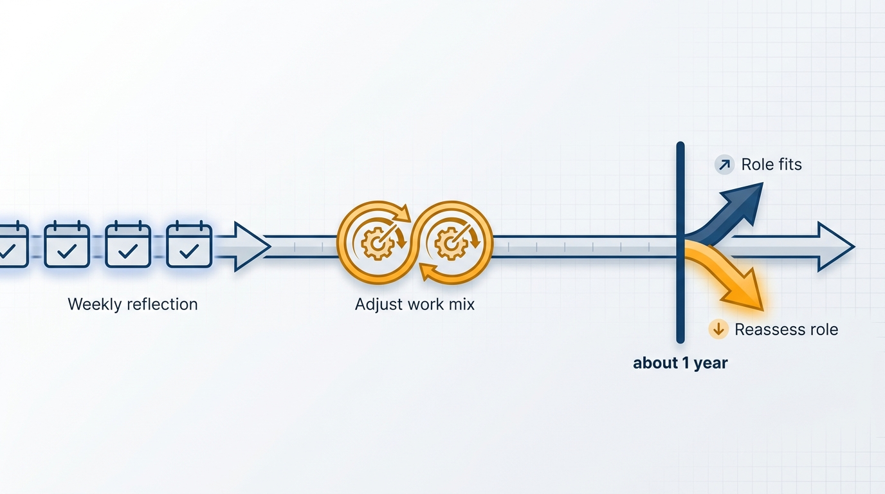

> **Status**: DRAFT
>
> **Principle**: I prioritize company over team over self — and I deliberately break that hierarchy in small, controlled ways to stay energized. A long-term career requires both impact and energy; strict prioritization optimizes the first while quietly draining the second. My guardrail is simple: energizing detours must be modest, must not create burdens for others, and must be orthogonal to company needs — never opposed to them. If the imbalance between impact and energy persists for about a year, the fix is no longer a work-mix adjustment; it is reassessing the role.

## Statement

Two forces govern what I work on:

- **The alignment hierarchy.** Before taking on work I ask, in order: does this serve the company first? Does this strengthen the team? Only then: where do my personal preferences fit? Individual or team preferences do not outrank company priorities.
- **The energy counterweight.** I track what energizes me — and expect every member of my team to know what energizes them — and I intentionally keep some of that work in the mix, even when it is not the maximally important thing available. The same allowance I claim for myself, I extend to others.

The synthesis is **orthogonal, not opposed**: small deviations from strict priority order are acceptable when they restore energy, remain modest and controlled, create no maintenance or coordination burden for others, and are neutral with respect to company goals. Work that runs *against* the company's needs is never acceptable, regardless of how energizing it is.

**Figure 1:** *The guardrail: energizing detours run orthogonal to company needs — never against them.*

## How to Read This

This record explains a pattern my team will occasionally observe: me (or, with my blessing, them) spending a bounded slice of time on work that is not the top priority. That is not inconsistency; it is deliberate policy with guardrails. This is also not a personal-productivity system — no calendar mechanics here — and not health advice; sustainability appears here strictly as an operating constraint on how the role gets done. The organizational-scale version of the same concern — the team's pace, not just mine — starts in [[first-90-days]]. The working checklist, including the weekly reflection, lives in the **Checklist** tab of this post.

## Rationale

**Strict prioritization is correct and unsustainable.** The company→team→self hierarchy is right as a default: an executive who routinely puts personal preference above company need is failing at the job. But applied rigidly, it produces a leader doing exclusively draining work — correct in every individual decision and burned out within two years. Optimizing each decision can pessimize the career.

**Figure 2:** *Optimizing every decision can pessimize the career: energy is the reserve impact draws on.*

**Energy is positive-sum when it is managed openly.** Knowing what energizes each person lets me route real work to the people it energizes — the same task can drain one leader and recharge another. Treating energy as a legitimate planning input, rather than a private struggle, turns it from a hidden tax into an allocation problem with good solutions.

**The repayment is eventual, not immediate.** Leadership roles run on an *eventual quid pro quo*: I generally prioritize company and team over personal work, and trust that the reward arrives — decoupled from any immediate effort. Short-term "what's in it for me?" thinking corrodes exactly the trust an executive most needs. But *eventual* has a boundary: if the imbalance persists for about a year despite deliberately increasing energizing work, the honest conclusion is that the role or environment needs reassessing — not that I should try harder.

**Apparent misalignment is usually missing context.** When someone's priorities look wrong to me — or mine look wrong to them — my first question is: *what context might I be missing?* Seniority creates knowledge gaps as well as insight: I hold strategic context others lack, and I lack tactical context others hold. So I operate from curiosity rather than judgment, share strategic context widely, and deliberately seek tactical context from the people close to execution.

**Rigidity has a relationship cost.** Overvaluing "correctness" — treating every deviation from strict priorities as a character flaw — alienates exactly the people progress depends on. I mute my desire for strict adherence when progress requires flexibility.

## What This Means in Practice

| What this principle says | What it does **not** say |
| --- | --- |
| Company → team → self is the default order. | The hierarchy is absolute — followed too rigidly, it burns people out. |
| Some energizing work stays in the mix, deliberately. | Work whatever you enjoy — deviations are modest, controlled, and orthogonal. |
| Others get the same energy allowance I claim. | Energizing side work may create burdens for other teams. It may not. |
| Persistent imbalance (~1 year) means reassessing the role. | Grind until the role reassesses you. |
| Question apparent misalignment with curiosity. | Tolerate genuine opposition to company needs. |

Two habits make this concrete:

- **The gray-area sanity check.** When I am unsure whether a piece of work is orthogonal or opposed — or whether a deviation is still "modest" — I check it with a trusted peer. Uncertainty about alignment is itself a warning sign.
- **The weekly reflection.** Five questions, briefly: What energized me this week? What drained me? Did I prioritize correctly? Did I adapt intelligently? Is my current path sustainable for 12+ months?

**Figure 3:** *The hard trigger: past a year of imbalance, the conversation is no longer about work mix.*

## Anti-Patterns

- **Rigid hierarchy martyrdom.** Following company→team→self so strictly that every week is 100% draining work, then being surprised by burnout — mine or a team member's.
- **Hobby-driven architecture.** Introducing tools or technologies because they are personally interesting — an "energizing" deviation that saddles other teams with maintenance and coordination cost. That is opposed, not orthogonal.
- **Immediate quid pro quo.** Keeping score on every sacrifice and expecting prompt repayment — leadership rewards are real but decoupled in time.
- **Judgment before context.** Reading a colleague's differing priorities as bad faith instead of asking what context one of us is missing.
- **Correctness over relationships.** Winning every prioritization argument while alienating the peers and team the priorities are for.

## Related Records

- [[first-90-days]] — sustainability practices start during the ramp; this record is their steady-state form.
- [[leadership-styles]] — style choice is another place where self-awareness beats rigid adherence.
- [[working-with-your-ceo-peers-and-engineering]] — the context-awareness habit applied to peer and CEO relationships.
- [[inspected-trust]] — curiosity-before-judgment is the same move inspection makes when concerns arise.

## Scope and Revisiting

This principle governs my own work mix and the allowances I extend to my team. I revisit it at the weekly reflection (cheaply) and whenever the reflection's last question — sustainable for 12+ months? — gets a "no" two weeks running. The one-year imbalance rule is the hard trigger: past it, the conversation changes from work mix to role fit.

## Authoritative References

- Will Larson, *The Engineering Executive's Primer* (O'Reilly, 2024) — the "Managing Priorities and Energy" chapter this record's checklist distills.
- Will Larson, [Manage your priorities and energy](https://lethain.com/frameworks-decision-making/) — the freely available companion essay.
