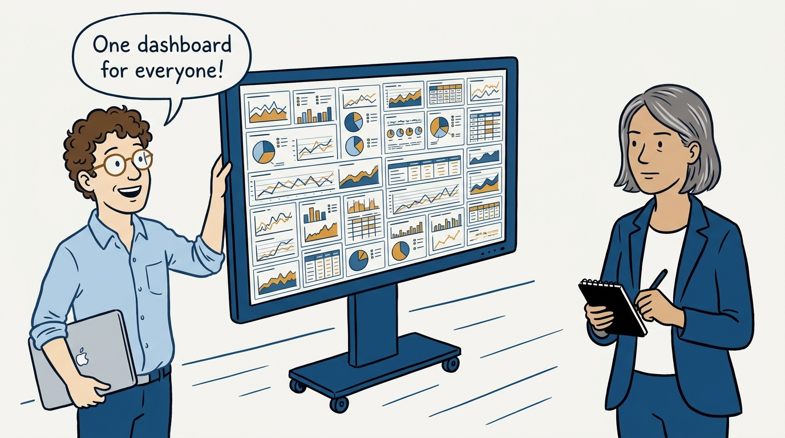
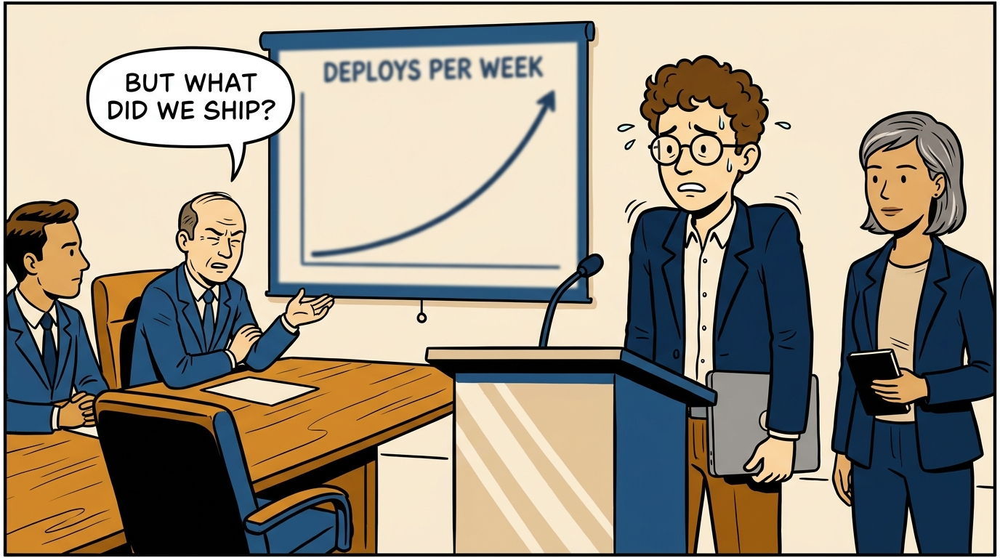
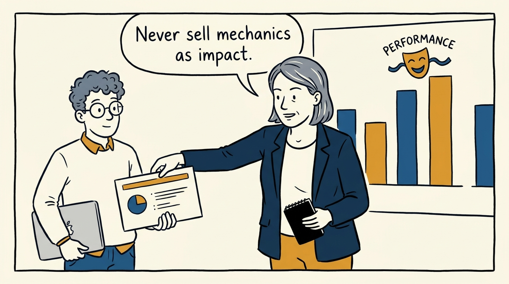
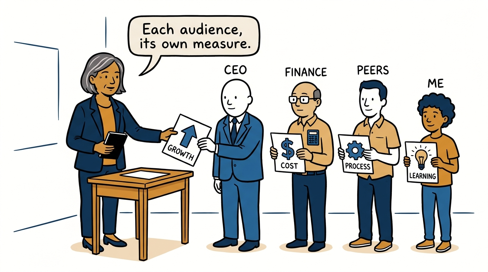
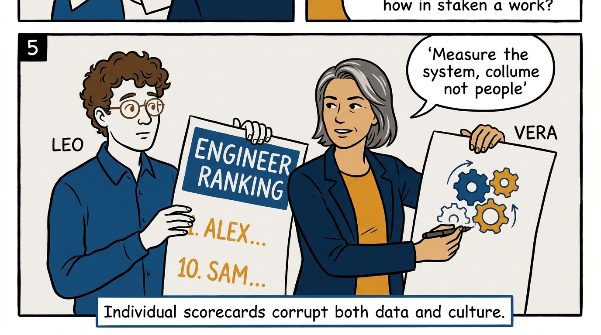
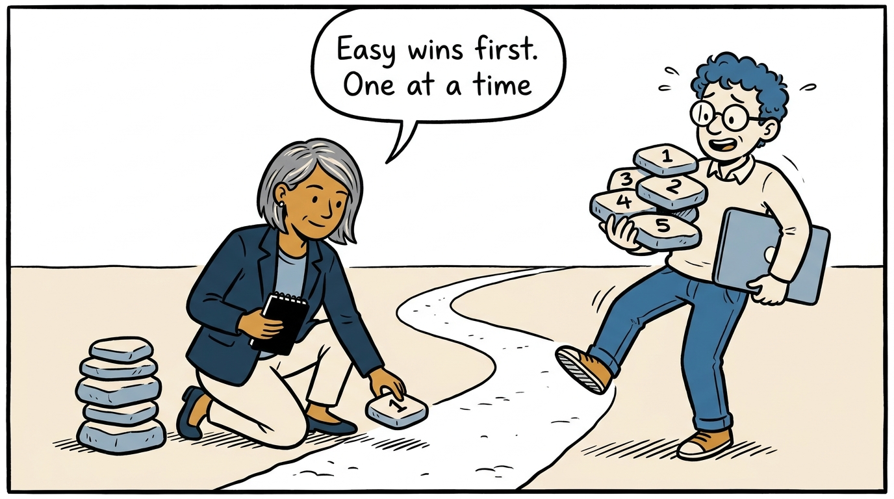
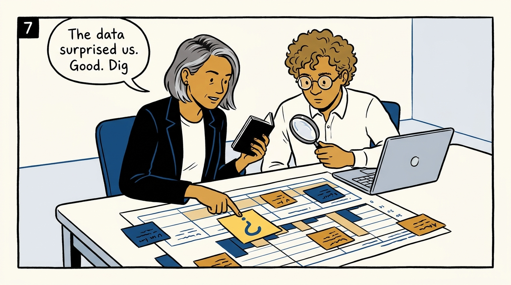
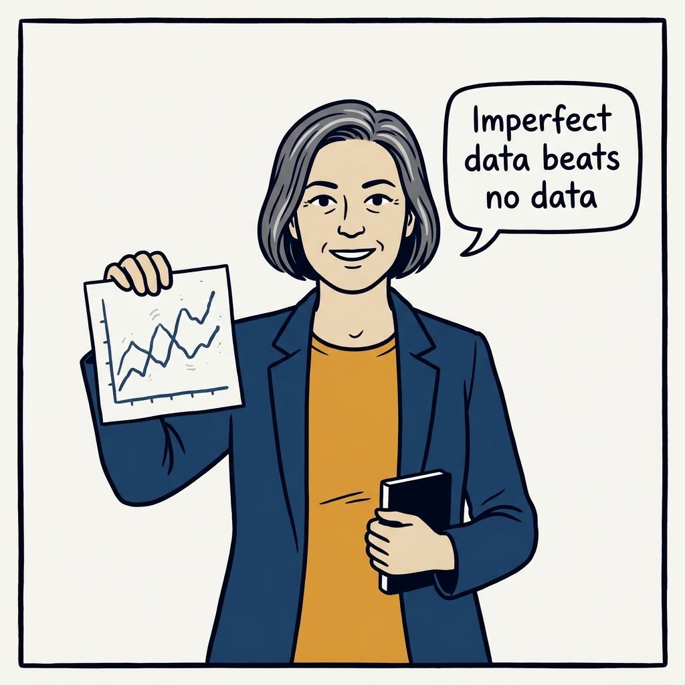

How I measure an engineering organization — for a specific audience, one step at a time — in eight panels.

<!-- comic-style
{
  "cast": "VERA: a calm, seasoned engineering executive, short gray-streaked hair, dark blazer over a plain t-shirt, carries a small black notebook. LEO: an eager young engineering manager, curly hair, round glasses, laptop under one arm.",
  "style": "Clean two-tone explainer comic, thick ink outlines, flat colors with deep blue and amber accents on a light background, generous white space, hand-lettered speech bubbles with SHORT readable text, no photorealism."
}
-->

**Panel 1:** *The hook: one giant dashboard, shown to everyone.*

**Panel 2:** *The problem: deployment frequency tells the CEO nothing about whether Engineering moves the business.*

**Panel 3:** *The wrong way: optimization theater — when business results disappoint, the metrics take the blame.*

**Panel 4:** *The principle: the audience determines the metric — strategy progress for the CEO, budget fidelity for Finance, shared outcomes for peers.*

**Panel 5:** *The line I hold: metrics improve the system — they are never per-person scorecards.*

**Panel 6:** *How it plays out: measure what feeds decisions, start easy to build trust, one initiative at a time.*

**Panel 7:** *Trust the data by working it: weekly collaborative review, hypotheses, and digging into surprises.*

**Panel 8:** *The closer: measuring something imperfect is strictly better than measuring nothing.*
