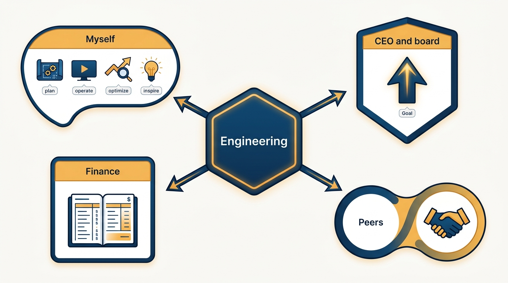
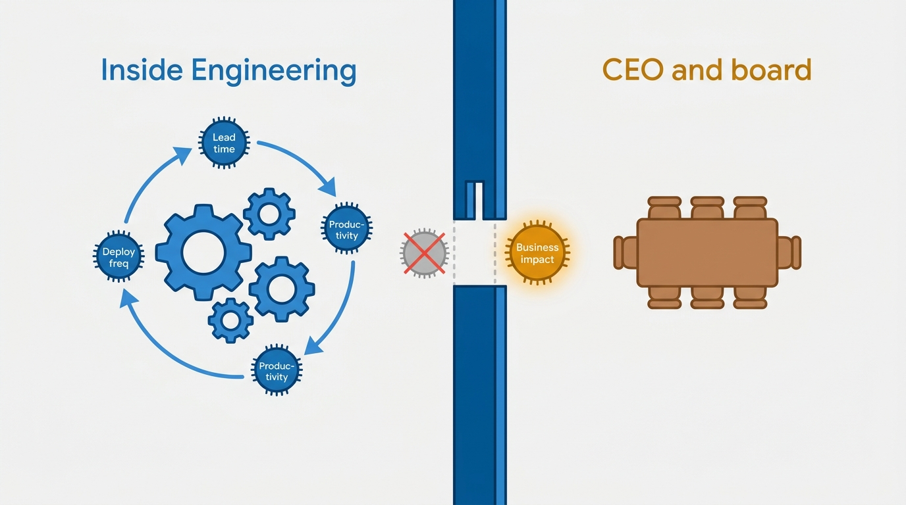
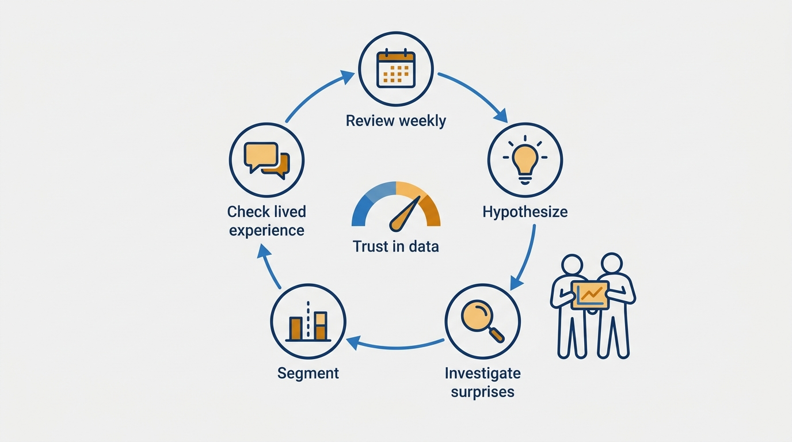

> **Status**: DRAFT
>
> **Principle**: I measure an engineering organization for a specific audience. What I measure for myself — to plan, operate, optimize, and inspire — is not what I present to the CEO and board, Finance, or peer organizations, and I never present optimization metrics as proof of business impact. I sequence measurement deliberately: only measure what feeds decisions, start with easy wins to build trust, take on one initiative at a time. I use metrics to improve the system, never to judge individuals, and I build confidence in the data through regular collaborative review — because measuring something imperfect beats measuring nothing.

## Statement

My measurement practice follows four commitments:

- **Measure for yourself first.** For my own leadership I measure to *plan* (a single view of business, product, and engineering impact), to *operate* (incidents, downtime, latency, cost normalized to a core business metric), to *optimize* (lead time, deployment frequency, developer productivity), and to *inspire and communicate* (the transformational technical investments worth telling the company about).
- **Shape measurement per stakeholder.** The CEO and board get progress against a clear goal aligned to business strategy. Finance gets actuals versus budget and the cost-allocation methodology. Strategic peers (Product, Design, Sales) get shared business outcomes. Tactical peers (Customer Success, Legal) get concrete shared operational metrics with a review cadence.
- **Sequence the work.** Only measure what will be used in decision-making, measure some easy things first to build trust, take on one new measurement initiative at a time, establish baselines, iterate.
- **Trust the data by working it.** Weekly review, month-over-month trends, explicit hypotheses about metric behavior, investigation when data contradicts expectations, collaborative rather than solitary review, segmentation, and comparison of objective metrics to subjective experience.

**Figure 1:** *One organization, four audiences — each gets measurement shaped to the decisions it makes.*

## How to Read This

This record tells the leaders who report metrics with me what I will ask of the numbers, and tells the CEO, board, Finance, and peer executives what I will — and deliberately will not — show them. It is a vision of how I measure, not a metrics catalog or a tooling prescription. The working checklist — audience by audience, plus the sequencing rules and antipatterns — lives in the **Checklist** tab of this post.

## Rationale

**The audience determines the metric.** The same number that helps me run engineering is noise — or worse, misdirection — in a board deck. Deployment frequency helps my leadership team tune the delivery system; it tells the CEO nothing about whether Engineering is moving the business. So each audience gets measurement shaped to the decisions *they* make: strategy progress for the CEO and board, budget fidelity for Finance, shared outcomes for peers. Where possible I reuse planning and operational metrics across audiences — but reuse is an efficiency, not an excuse to show everyone the same dashboard.

**Optimization metrics must never masquerade as impact.** Lead time, deployment frequency, and productivity scores measure how well the engineering system runs — not whether it is building the right things. Presenting them to the CEO as proof of business impact is the classic engineering-executive credibility mistake: it substitutes internal mechanics for business results, and when the business results disappoint, the metrics take the blame. Business impact is demonstrated with business metrics; optimization metrics stay inside the function they optimize.

**Figure 2:** *The boundary: optimization metrics tune the system inside Engineering; only business metrics demonstrate impact outside it.*

**Teams, not individuals, are the unit of measurement.** Engineering output is a property of a system — its tooling, its processes, its interfaces — not a sum of individual scores. Measuring individuals corrupts both the data (people optimize the number) and the culture (metrics become surveillance). I use metrics to improve the system, and I keep performance assessment where it belongs: in management judgment informed by many sources, per [[inspected-trust]].

**Trust in data is built, not assumed — and trust in people is not built with data.** Confidence in metrics comes from working them: reviewing weekly, holding explicit hypotheses, investigating contradictions, segmenting to find hidden issues, checking numbers against lived experience, and reviewing collaboratively so no single narrative goes unchallenged. But no dashboard substitutes for trust-building with stakeholders — a metric can support a relationship; it cannot replace one. And waiting for perfect data before measuring anything is how organizations end up measuring nothing.

**Figure 3:** *Trust in data is built, not assumed: a weekly collaborative loop raises confidence one cycle at a time.*

## What This Means in Practice

| What this principle says | What it does **not** say |
| --- | --- |
| Measure differently for each audience. | Maintain disconnected metric worlds — reuse planning and operational metrics where possible. |
| Never present optimization metrics as business impact. | Hide optimization metrics — they drive real internal improvement. |
| Measure teams and systems, not individuals. | Never assess individuals — that is management's job, done with judgment, not dashboards. |
| Start with easy wins; one initiative at a time. | Stay easy forever — baselines expand across major categories over time. |
| Measure something imperfect now. | Ship numbers you don't trust — confidence is built through weekly collaborative review. |

## Anti-Patterns

- **Metrics as a substitute for trust.** Answering a stakeholder relationship problem with a dashboard. The numbers can support trust already being built; they cannot manufacture it.
- **Waiting for perfect data.** Postponing all measurement until the pipeline is clean, the tooling is bought, and the taxonomy is agreed — measuring nothing for a year in pursuit of measuring everything perfectly.
- **Optimization theater for the board.** Presenting deployment frequency and lead time as proof of business impact — and losing credibility the first time the business asks what shipped.
- **Measuring individuals.** Turning system-improvement metrics into per-person scorecards, corrupting the data and the culture in one move.
- **Strategy in isolation.** Deciding the measurement strategy alone, without the leaders and peers who must act on it — then over-worrying about hypothetical misuse of data instead of reviewing it collaboratively.
- **Boiling the ocean.** Launching several measurement initiatives at once, finishing none, and eroding the very trust that easy early wins were supposed to build.

## Related Records

- [[planning]] — the impact data measured here feeds the allocation reviews and roadmap decisions of the planning cycle.
- [[engineering-strategy]] — the CEO-facing goal that measurement tracks is set by the strategy, not by what is easy to count.
- [[inspected-trust]] — inspection verifies delegated work through sampling and judgment; measurement improves systems — I keep the two instruments separate.
- [[working-with-your-ceo-peers-and-engineering]] — the stakeholder relationships that determine which measurements each audience actually needs.

## Scope and Revisiting

This principle governs how I measure any engineering organization I lead and what I present to its stakeholders. Measurement is an evolving process, not a finished artifact: I revisit the portfolio as baselines are established, as cross-functional needs evolve, and whenever a metric stops feeding a decision — at which point it stops being measured.

## Authoritative References

- Will Larson, *The Engineering Executive's Primer* (O'Reilly, 2024) — the "Measuring Engineering Organizations" chapter this record's checklist distills; the principle above is my operating commitment to it.
- Will Larson, [Measuring an engineering organization](https://lethain.com/measuring-engineering-organizations/) — the freely available companion essay.
