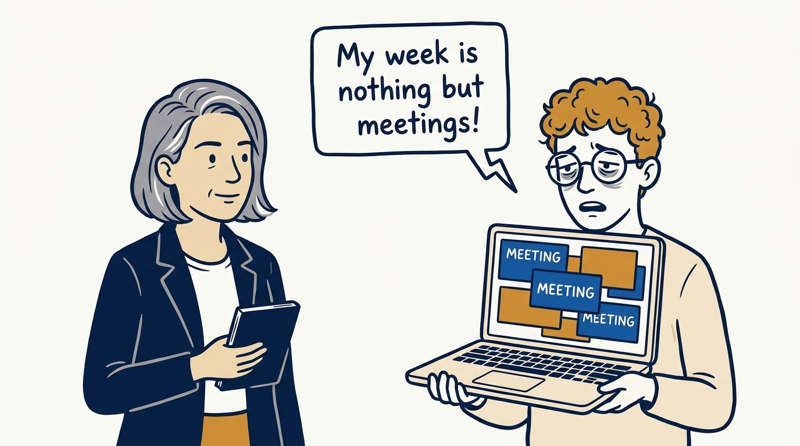
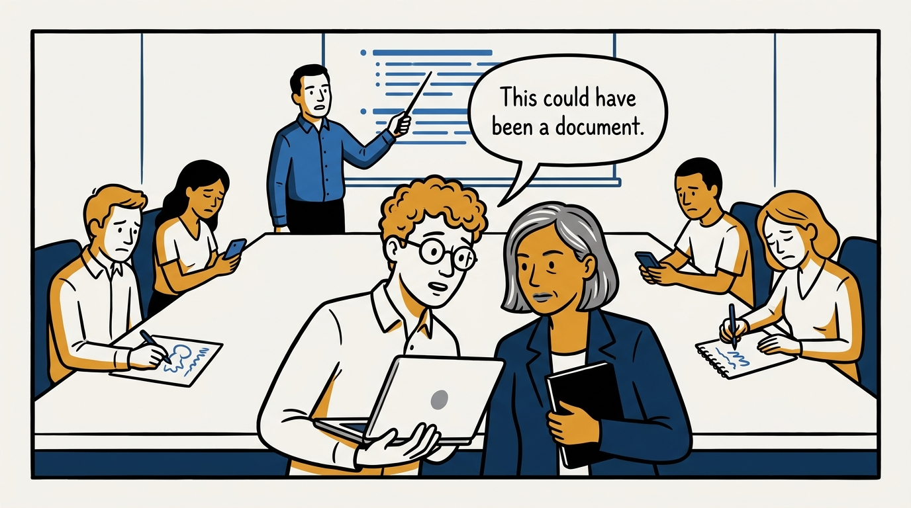
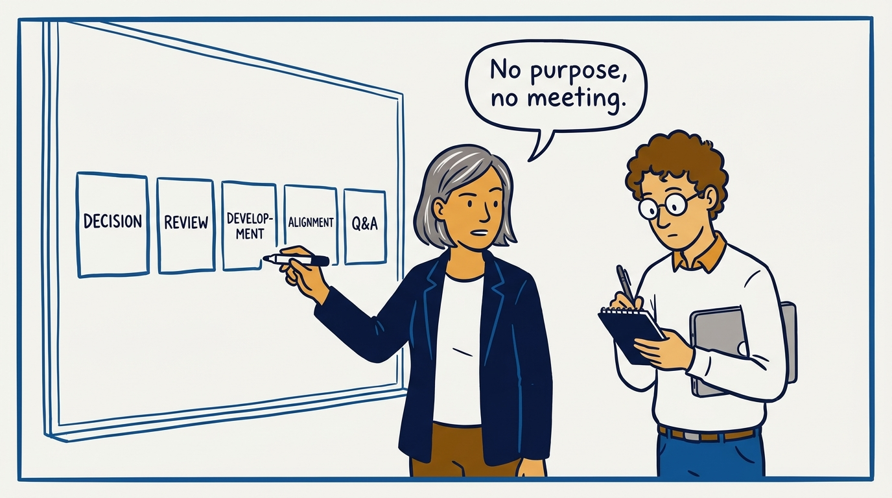
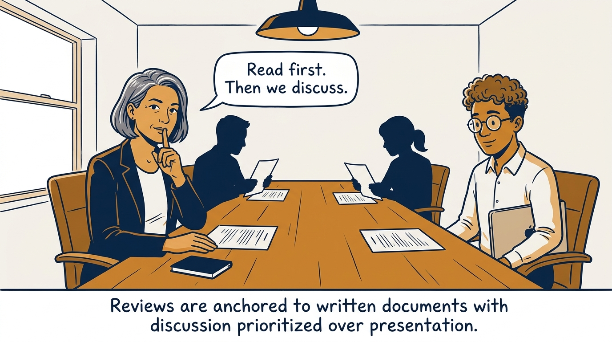
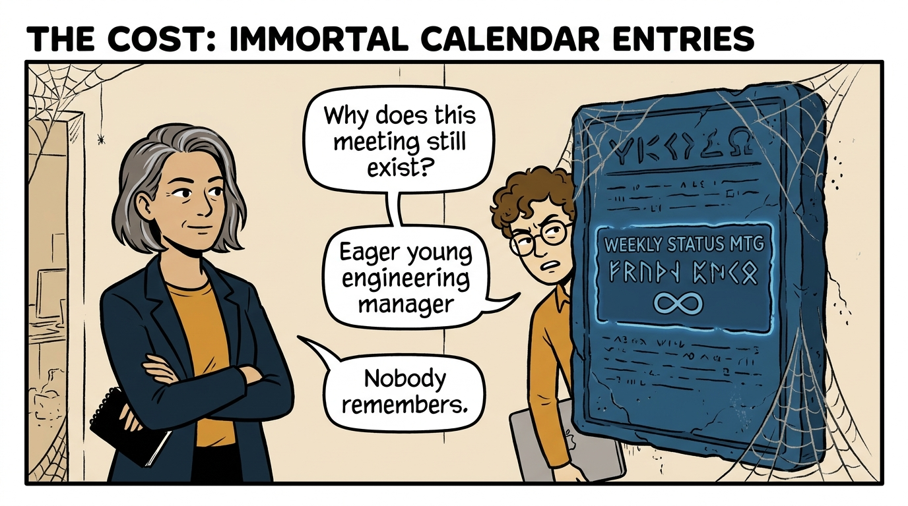
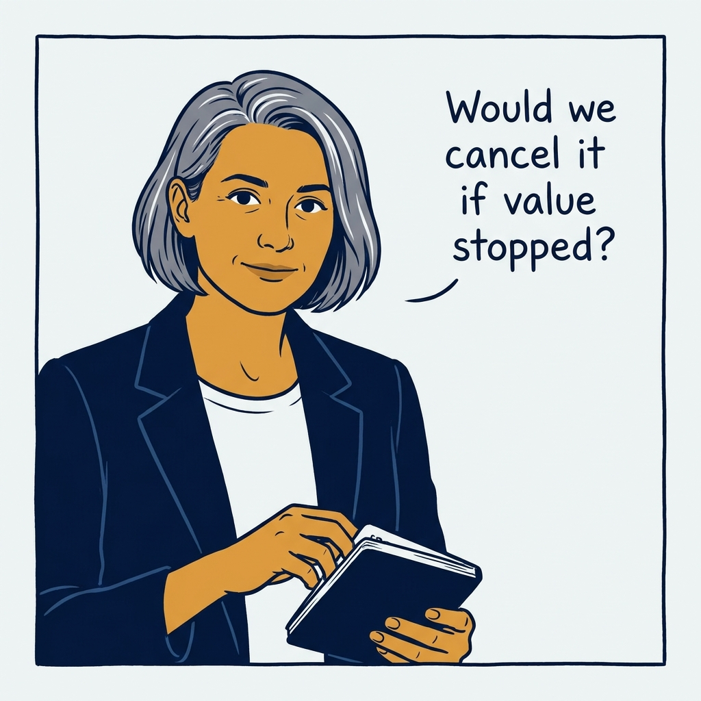

How a deliberate meeting portfolio replaces calendar accretion — in seven panels.

<!-- comic-style
{
  "cast": "VERA: a calm, seasoned engineering executive, short gray-streaked hair, dark blazer over a plain t-shirt, carries a small black notebook. LEO: an eager young engineering manager, curly hair, round glasses, laptop under one arm.",
  "style": "Clean two-tone explainer comic, thick ink outlines, flat colors with deep blue and amber accents on a light background, generous white space, hand-lettered speech bubbles with SHORT readable text, no photorealism."
}
-->

**Panel 1:** *The hook: the calendar fills itself when meetings are the default.*

**Panel 2:** *The problem: meetings are the most expensive communication instrument there is.*

**Panel 3:** *The wrong way: status theater instead of a working session.*

**Panel 4:** *The principle: purpose before existence — a meeting must fill a gap.*

**Panel 5:** *How it plays out: documents anchor, discussion decides.*

**Panel 6:** *What it costs: immortal meetings that no one owns and no one would defend.*

**Panel 7:** *The closer: hold every meeting to the cancellation question.*
