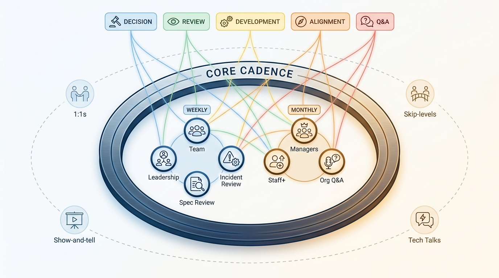
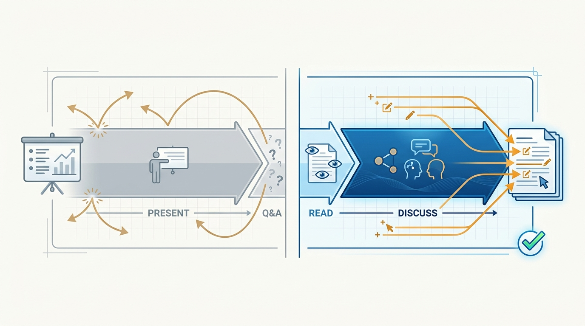
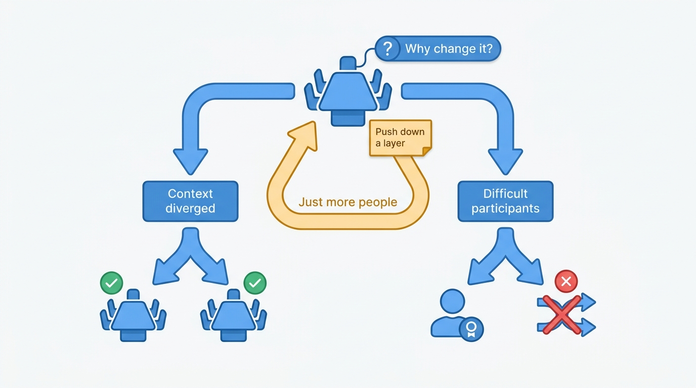

> **Status**: DRAFT
>
> **Principle**: Every meeting I run has a clear purpose — decision, review, development, alignment, or Q&A — and fills a communication gap rather than being the default. I run a small core cadence: weekly team, leadership, tech spec review, and incident review; monthly managers, Staff+, and org-wide Q&A. Every session is anchored to a written document with discussion prioritized over presentation, has a clear owner, and is held to one shared quality bar whose last question is the one that matters: would we cancel this if it stopped adding value?

## Statement

I run meetings as a deliberate portfolio, not a calendar accretion:

- **Purpose before existence.** Each meeting names its purpose — decision, review, development, alignment, or Q&A — and exists to fill a communication gap. Meetings distribute context, communicate culture, and surface concerns; a meeting doing none of these gets iterated, paused, or cancelled.
- **A small core cadence.** Weekly: each manager's team meeting, the engineering leadership meeting (a working session, not status theater), the tech spec review, and the incident review. Monthly: the engineering managers meeting, the Staff+ engineers meeting, and the org-wide Q&A. Around the core sit 1:1s, skip-levels with a fixed time budget, cross-functional execution reviews, show-and-tells, tech talks, and an all-hands that does not duplicate the company's.
- **Documents anchor, discussion decides.** Reviews are anchored to concise written documents — the tech spec, the incident write-up — with reading as a prerequisite (or reading time built in) and discussion prioritized over the author presenting slides.
- **Every meeting has an owner.** A clear owner per recurring session, consistent leader attendance, and executive behavior that models what is expected — and even when I am not leading, I remain accountable for quality.
- **One quality bar for all of it.** Anchored to a document? Discussion over presentation? Right people in the room? Clear output? And: would we cancel this if it stopped adding value?

**Figure 1:** *The meeting portfolio: five purposes, a small weekly and monthly core cadence, and supporting formats around it.*

## How to Read This

This record tells my managers and Staff+ engineers why the meeting portfolio looks the way it does — and what standard any new recurring session must clear. It is a vision of the cadence and its quality bar, not a company-specific calendar of days, durations, and attendee lists. The working checklist — the full cadence, the scaling guidelines, and the quality bar — lives in the **Checklist** tab of this post.

## Rationale

**Meetings must fill communication gaps, not be the default.** A meeting is the most expensive communication instrument an organization owns: it spends everyone's hour simultaneously. That cost is justified exactly when something cheaper cannot do the job — when context needs distributing interactively, when culture needs communicating in person, when concerns need a forum to surface. When a meeting is scheduled because meetings are how things are done, the portfolio grows until it crowds out the work it was meant to coordinate. The written and async layer around meetings is [[internal-communication]]'s territory; this record governs what earns synchronous time.

**Written documents plus discussion beat presentations.** A presentation optimizes for the presenter; a document plus discussion optimizes for the decision. Anchoring spec and incident reviews to concise write-ups — read beforehand or in built-in reading time — means the meeting starts where the thinking ends, feedback lands on substance, and incident reviews stay focused on learning rather than blame. It also builds writing culture as a side effect: authors learn their document must stand on its own. First-time facilitators get a practice run, because facilitation is a skill, not an assumption.

**Figure 2:** *Two review shapes: a presentation optimizes for the presenter; a document plus discussion optimizes for the decision.*

**The Q&A only works if it is safe to ask.** The monthly org-wide Q&A exists to surface concerns, test trust, and highlight contributors — which is why the tone is "no questions off limits", the tooling supports pre-submitted, upvoted, and anonymous questions, and I avoid recording unless necessary: a recorded Q&A is a Q&A where nobody asks the real question. It stays a single shared forum even as the organization grows.

**Scaling is about engagement, not headcount.** Meetings split when participant context genuinely diverges — not because attendance grew, and not because one or two participants are difficult; those participants get held accountable for behavior instead. Developmental sessions stay at ten or fewer active participants, and when the organization outgrows a meeting, it gets pushed down a layer rather than diluted in place.

**Figure 3:** *When to split a meeting: diverged context splits it; headcount and difficult participants do not.*

## What This Means in Practice

| What this principle says | What it does **not** say |
| --- | --- |
| Every meeting has a named purpose and fills a gap. | More meetings mean more alignment — the default is *not* holding one. |
| Run the core cadence: four weekly, three monthly. | The cadence is sacred — every session must keep passing the quality bar. |
| Anchor reviews to documents; discussion over presentation. | Slides are banned — presentation just never substitutes for discussion. |
| Split meetings when context diverges. | Split when attendance grows or two participants are difficult — optimize for engagement, and hold people accountable. |
| Every recurring session has a clear owner. | Ownership outsources accountability — the executive still answers for quality. |

## Anti-Patterns

- **Status theater.** The leadership meeting spent reading out updates that a document could have carried — instead of working prioritized topics from a running shared agenda as a "first team" of leaders.
- **The presentation review.** A tech spec or incident "review" where the author narrates slides to an audience that has not read the document, and feedback never reaches substance.
- **The premature split.** Dividing a well-functioning meeting because one or two participants are difficult — solving a behavior problem with an org-chart tool and paying the fragmentation cost forever.
- **The recorded Q&A.** Recording the org-wide Q&A "for convenience" and then wondering why the submitted questions are all safe ones.
- **The ownerless recurring meeting.** A session on everyone's calendar that no one owns, no one prepares, and no one would defend — surviving purely by recurrence.
- **Immortal calendar entries.** Meetings that continue because they have always existed. If we would not cancel it when it stops adding value, we are not running the meeting — it is running us.

## Related Records

- [[internal-communication]] — the written and async communication system this synchronous portfolio sits inside.
- [[run-engineering-processes]] — who owns and runs processes in general; this record applies that ownership stance to each recurring session.
- [[gelling-your-engineering-leadership-team]] — the weekly leadership meeting is where the "first team" mindset is built or lost.
- [[inspected-trust]] — the Q&A's trust-testing role is inspection in the open: concerns surfacing is evidence the system works.
- [[organizational-values]] — show-and-tells and demos are where culture and values get reinforced in public.

## Scope and Revisiting

This principle governs the meeting portfolio of any engineering organization I lead; exact days, durations, and attendee lists flex with company size and time zones. The revisiting mechanism is built in: every recurring session faces the quality bar continuously, and any session that stops adding value gets iterated, paused, or cancelled — including the ones I like.

## Authoritative References

- Will Larson, *The Engineering Executive's Primer* (O'Reilly, 2024) — the "Meetings" chapter this record's checklist distills; the principle above is my operating commitment to it.
- Will Larson, [Meetings for an effective eng organization](https://lethain.com/eng-org-meetings/) — the freely available companion essay.
