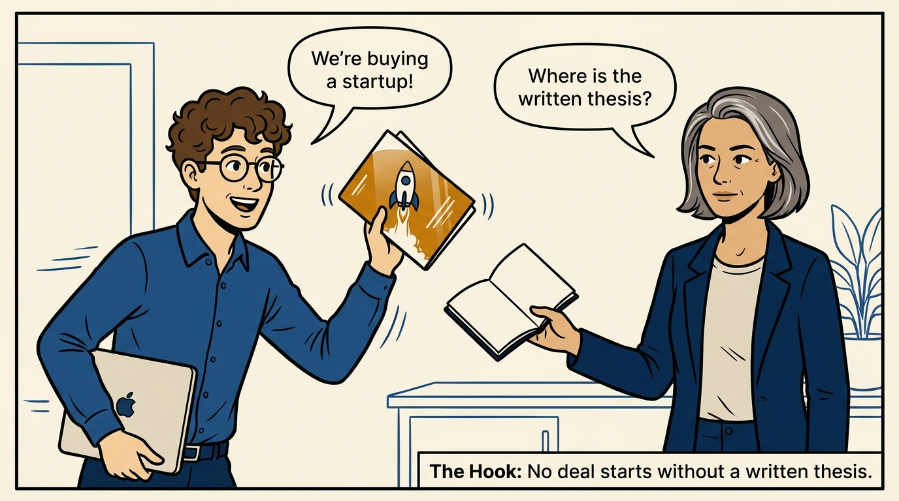
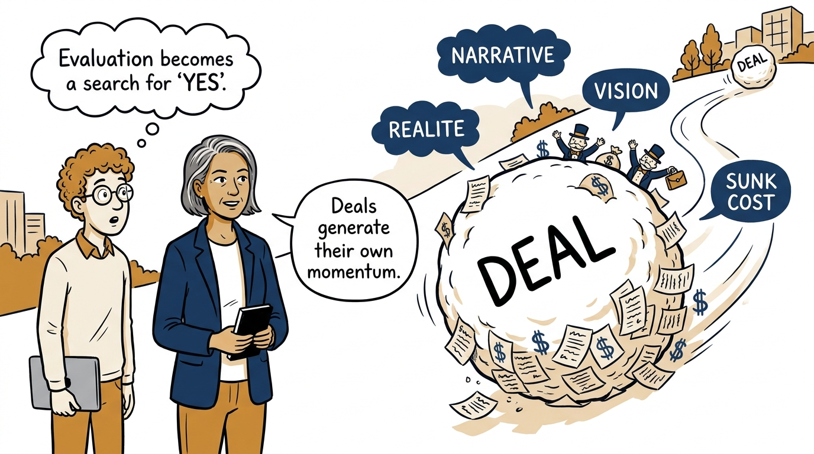
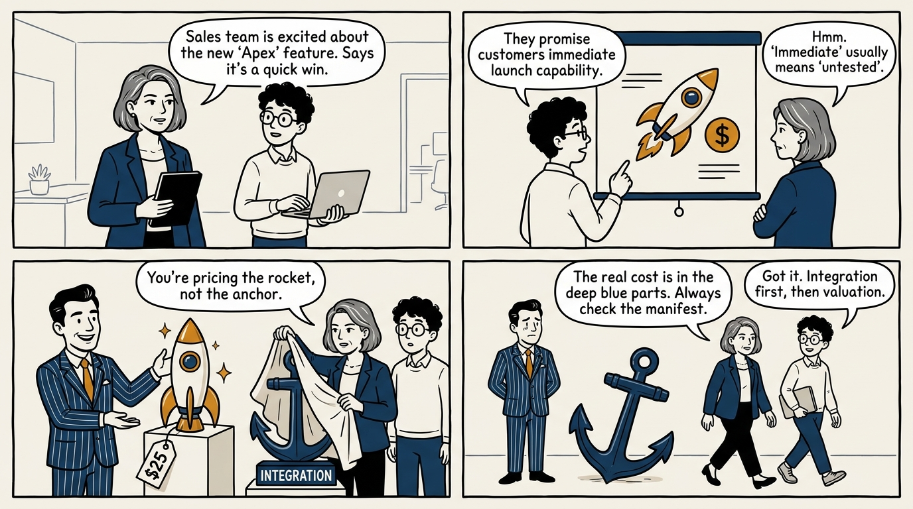
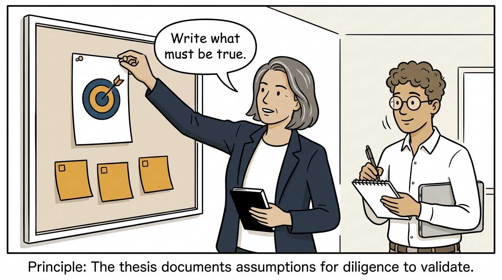
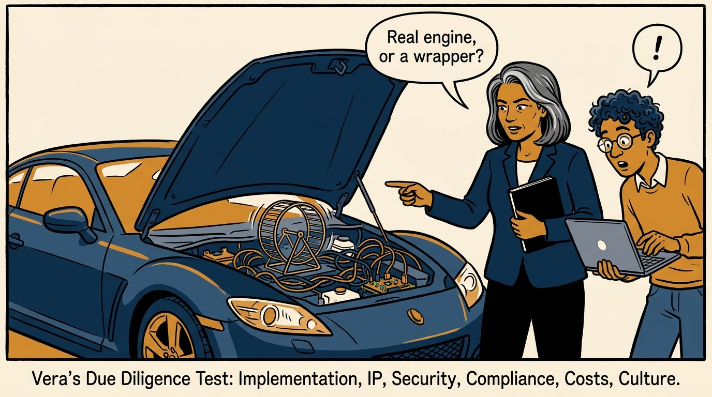
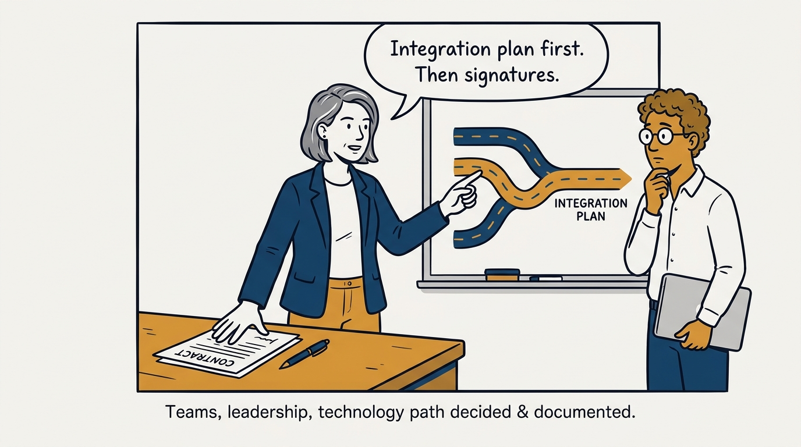
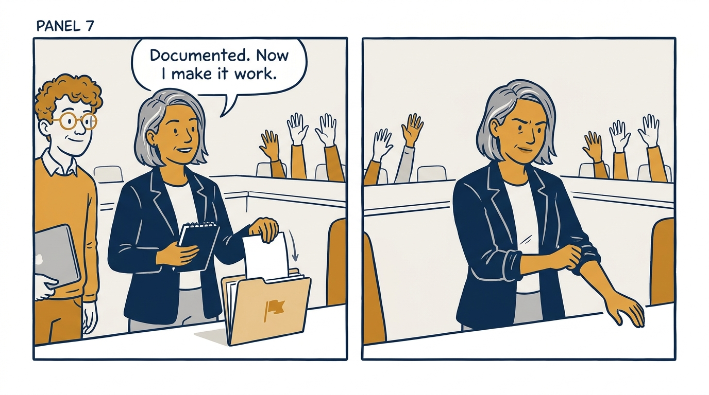
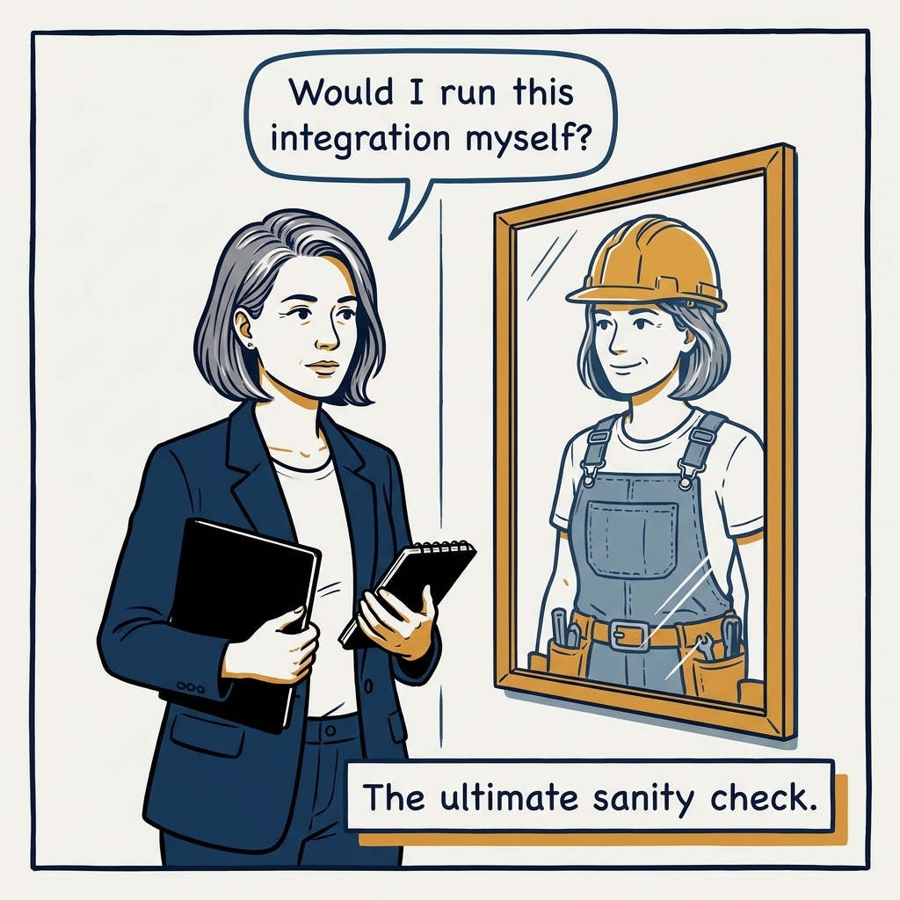

What Engineering actually does in an acquisition — anchor the deal to a written thesis and price the integration honestly.

<!-- comic-style
{
  "cast": "VERA: a calm, seasoned engineering executive, short gray-streaked hair, dark blazer over a plain t-shirt, carries a small black notebook. LEO: an eager young engineering manager, curly hair, round glasses, laptop under one arm.",
  "style": "Clean two-tone explainer comic, thick ink outlines, flat colors with deep blue and amber accents on a light background, generous white space, hand-lettered speech bubbles with SHORT readable text, no photorealism."
}
-->

**Panel 1:** *The hook: before excitement, a written thesis — or no evaluation at all.*

**Panel 2:** *The problem: without an anchor, diligence becomes a search for reasons to say yes.*

**Panel 3:** *Anti-pattern: upside-only valuation — the pitch is presented, the integration is lived.*

**Panel 4:** *The principle: a written thesis turns diligence into testing assumptions, not collecting impressions.*

**Panel 5:** *Diligence is about substance: is the implementation real, owned, secure, and scalable?*

**Panel 6:** *Integration is planned before closing — never discovered after.*

**Panel 7:** *Dissent is a company act: document it professionally, then commit.*

**Panel 8:** *Closer: approve only the deal whose integration you would personally run.*
