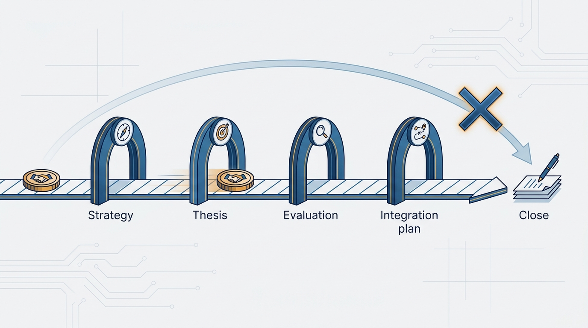
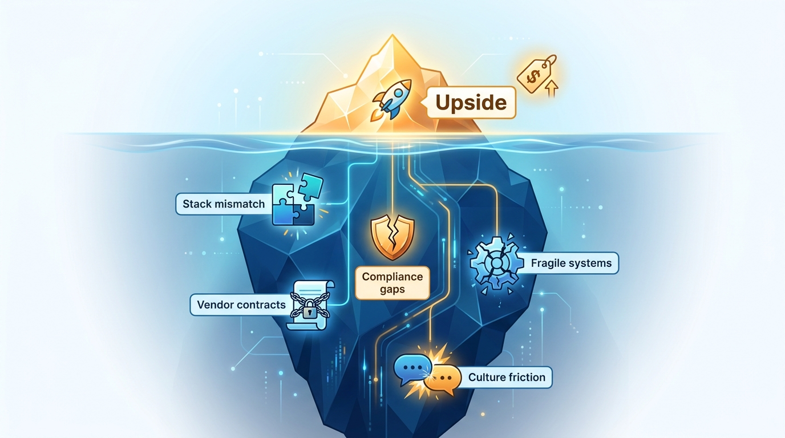
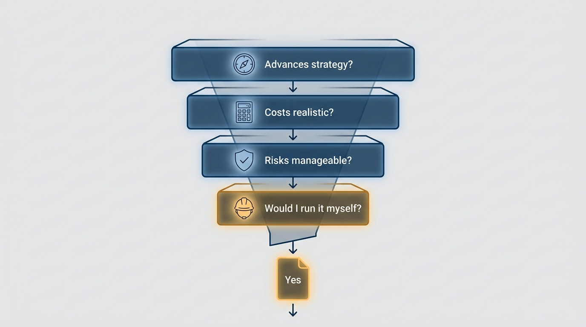

> **Status**: DRAFT
>
> **Principle**: In M&A, strategy comes before deals. I do not start evaluating an acquisition until the business strategy and a written, deal-specific acquisition thesis exist; engineering due diligence is a disciplined evaluation of implementation, IP, security, compliance, integration mismatches, costs, and culture run against that thesis; and the integration plan is drafted before closing, not after. Engineering's job is to validate assumptions and price integration honestly — and when I am overruled, I document my dissent professionally, from a company perspective, not an engineering one. My final sanity check: would I still approve this deal if I had to personally run the integration?

## Statement

When my company considers acquiring — or being acquired — my participation follows four commitments:

- **Strategy before deals.** No evaluation starts until we can say, in writing, how M&A supports the company's strategy: which business lines we are in, what role acquisitions play (growth, new markets, acquihire, reduced competition), what deal types and sizes are acceptable — and until the executive team is aligned on that document.
- **A written, deal-specific thesis.** For each deal: how exactly it fits the strategy, whether it is a permanent pillar or an interim accelerant, which assumptions must hold for it to succeed — documented explicitly — and a valuation that reflects integration cost and risk, not just upside.
- **Disciplined engineering evaluation.** Seven areas — product implementation, intellectual property, security, compliance, integration mismatches, costs and scalability, and engineering culture — evaluated with a standard template customized to this deal's thesis, and synced with Finance and Legal before I make a recommendation.
- **Integration planned before closing.** The baseline approach (run as-is, then consolidate?), the technology path (rewrite, API integration, coexistence, multi-stack tolerance), team and leadership integration — decided and documented before signatures, not discovered after.

**Figure 1:** *The order of operations: strategy, thesis, evaluation, and integration plan all gate the signature — there is no shortcut to Close.*

## How to Read This

This record tells CEOs, CFOs, and corp-dev peers what Engineering will and will not sign off on in a deal, and gives my own leadership team the frame we use when one appears. The full diligence questions and process discipline live in the **Checklist** tab of this post. This is not legal or financial advice — deal structures, tax, and securities stay with Legal and Finance — and the strategy that M&A must serve gets written per [[engineering-strategy]].

## Rationale

**Deals evaluated without a written thesis drift.** An acquisition under discussion generates its own momentum: bankers produce narratives, founders sell visions, and every meeting adds sunk cost. Without a written statement of what must be true for the deal to make sense, the evaluation quietly becomes a search for reasons to say yes. The thesis is the anchor — it turns diligence from impression-gathering into validating or invalidating specific, documented assumptions.

**Valuation must price integration, not just upside.** The upside of a deal is presented; the integration is lived. Stack mismatches, long-term vendor contracts, compliance gaps, fragile systems held together by shortcuts, incompatible operating models — each is a real cost that lands on Engineering after closing. If the valuation reflects only the upside, the company is systematically overpaying, and Engineering is the only function positioned to say so with evidence. That is why the diligence areas are questions about substance: is the implementation real and production-grade or a wrapper on third-party APIs? Does the claimed IP actually exist and does the company own it? Who owns security, and how would they detect a breach? Are compliance controls actually operational? How painful would stack consolidation be — and would separate stacks create long-term subcultures? What does it cost to generate each dollar of revenue, and can the product scale without a rewrite? How are technical decisions actually made, and is the cultural friction manageable?

**Figure 2:** *Pricing the whole iceberg: the upside is presented, but the integration below the waterline is what Engineering lives with.*

**Sunk-cost bias is the failure mode to guard against.** By the time Engineering's evaluation lands, the company has often spent months and real money on the deal. The pressure is to confirm, not to evaluate. My guards are procedural: assumptions documented before diligence, a standard template customized to the thesis, meetings limited to high-value sessions, and an explicit self-check — am I confident we are not falling into sunk-cost bias? The same discipline applies to my own resistance: I separate emotional reluctance from real risk before I argue either way.

**Dissent is a company act, not an engineering veto.** I articulate risks from a company perspective, not just Engineering's. And when the executive team decides against my recommendation, I document my concerns professionally and then support the decision — the disagree-and-commit posture of [[working-with-your-ceo-peers-and-engineering]]. A documented dissent protects the company's learning either way; an undocumented grudge protects nothing.

**The same honesty applies when we are the ones being acquired.** Understanding the acquirer's actual view of the deal (business, product, or acquihire), protecting the team's compensation, clarifying reporting lines, being honest about whether there is a meaningful role for me — the principle does not change sides when the table turns, and helping the team prepare for the transition is part of the job.

## What This Means in Practice

| What this principle says | What it does **not** say |
| --- | --- |
| No deal evaluation before strategy and a written thesis exist. | Engineering vetoes deals — I inform the decision; the executive team makes it. |
| Valuation must reflect integration cost and risk. | Every integration risk kills a deal — known and manageable is acceptable. |
| Diligence validates documented assumptions against the thesis. | Diligence is exhaustive — I limit meetings to high-value sessions and request documentation in advance. |
| The integration plan is drafted before closing. | Integration must mean consolidation — running as-is or long-term multi-stack tolerance are legitimate, explicit choices. |
| Overruled dissent is documented professionally. | Overruled dissent is relitigated — once documented, I commit to making the deal work. |

The last gate is the **final sanity check** before recommending "yes": does this acquisition clearly advance our strategy? Are the integration costs realistic? Are the biggest risks known and manageable? And — the question that keeps the other three honest — would I still approve this deal if I had to personally run the integration?

**Figure 3:** *The final sanity check: four questions gate the recommendation, and the personal-integration question keeps the other three honest.*

## Anti-Patterns

- **Thesis-free diligence.** Evaluating a deal because it appeared, retrofitting the rationale afterward. Without written assumptions there is nothing to validate — only impressions to collect.
- **Upside-only valuation.** Pricing the deal on the pitch deck's future while treating integration cost, compliance gaps, and stack consolidation pain as post-closing details.
- **Diligence theater.** Weeks of meetings that build familiarity instead of testing assumptions — no template, no advance documentation, no clear sync with Finance and Legal before the recommendation.
- **Integration as an afterthought.** Closing first, then discovering nobody decided where the acquired Head of Engineering reports, whether teams merge, or whether the stack lives or dies — burning the acquired team's morale in the confusion.
- **The engineering veto.** Framing my objections purely in engineering terms — stack elegance, technology preference — instead of company terms: cost, risk, strategy fit.
- **Sunk-cost surrender.** Recommending "yes" because the company has already invested too much in evaluating the deal to walk away — the exact bias the written thesis exists to catch.

## Related Records

- [[engineering-strategy]] — the strategy a deal must serve, and the frame the integration's technology choices must align with.
- [[working-with-your-ceo-peers-and-engineering]] — the disagree-and-commit posture my documented dissent belongs to.
- [[onboarding-peer-executives]] — how incoming acquired leaders get set up for success after closing.
- [[engineering-onboarding]] — the machinery that receives acquired engineers once teams integrate.
- [[measuring-engineering-organizations]] — the cost-per-dollar-of-revenue lens applied to a target's engineering organization.

## Scope and Revisiting

This principle governs my participation in M&A from either side of the table — evaluating targets as an acquirer and navigating being acquired. I revisit it after each deal (closed or walked away from): which assumptions the thesis missed, where diligence over- or under-invested, and how the integration plan survived contact with reality.

## Authoritative References

- Will Larson, *The Engineering Executive's Primer* (O'Reilly, 2024) — the "Mergers and Acquisitions" chapter this record's checklist distills; the principle above is my operating commitment to it.
- Will Larson, [Engineering's role in Mergers & Acquisitions](https://lethain.com/engineering-in-mergers-and-acquisition/) — the freely available companion essay.
