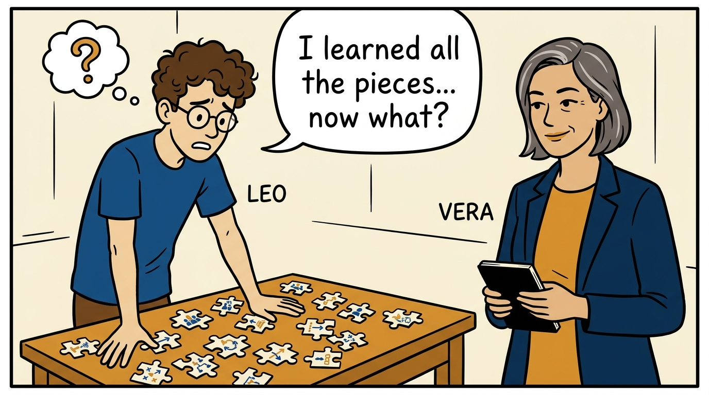
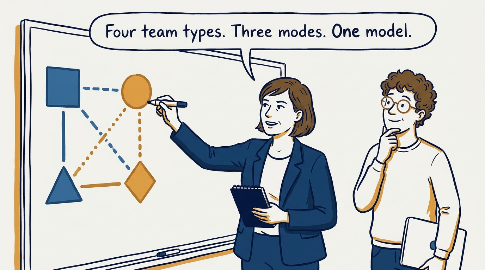
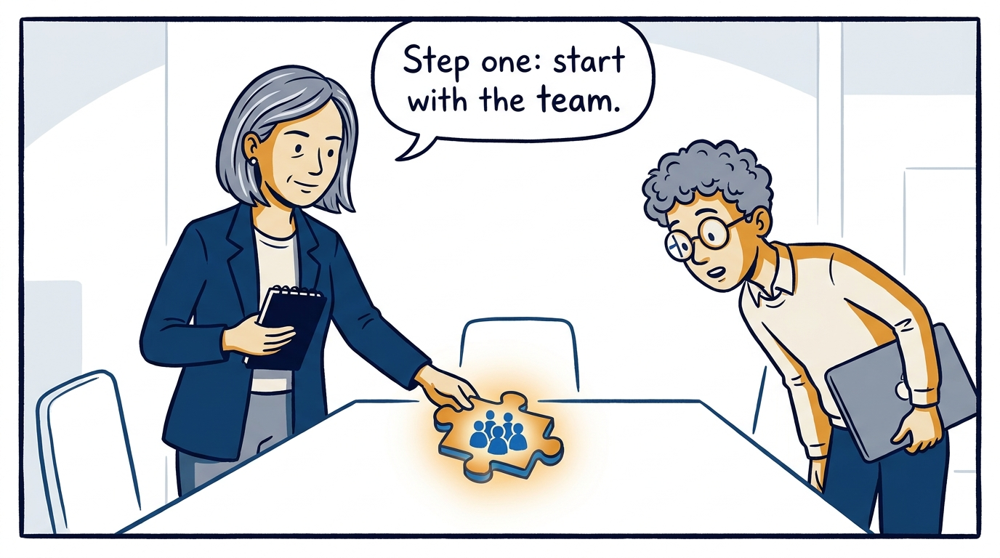
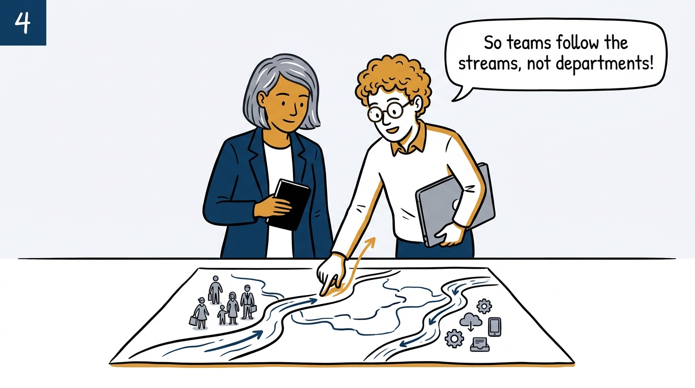
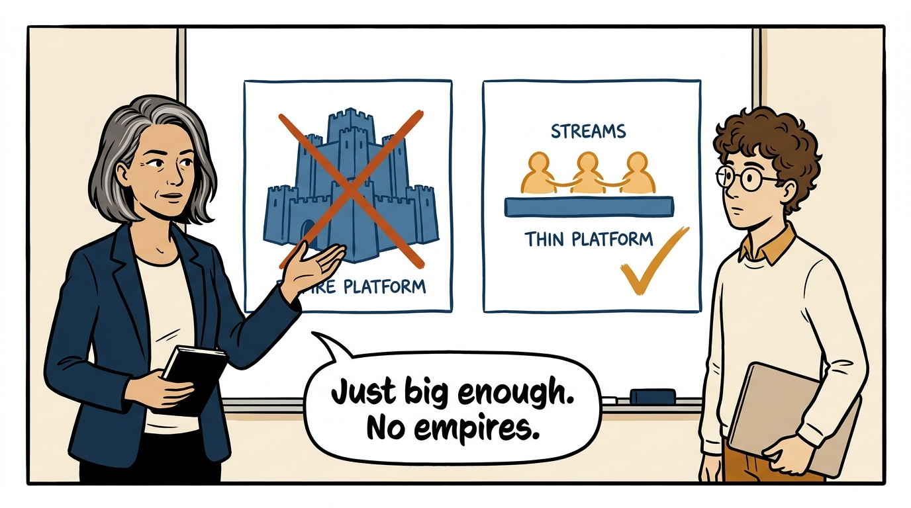
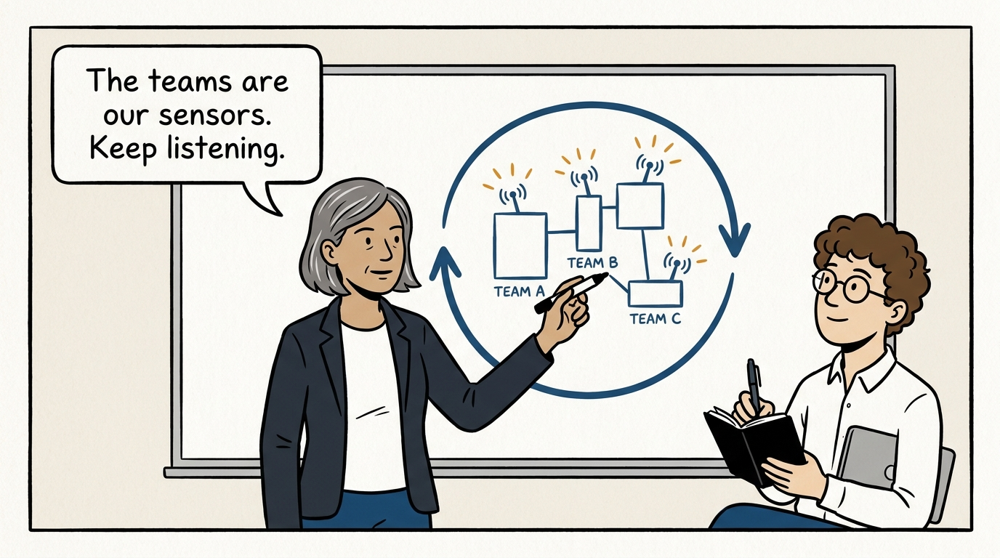
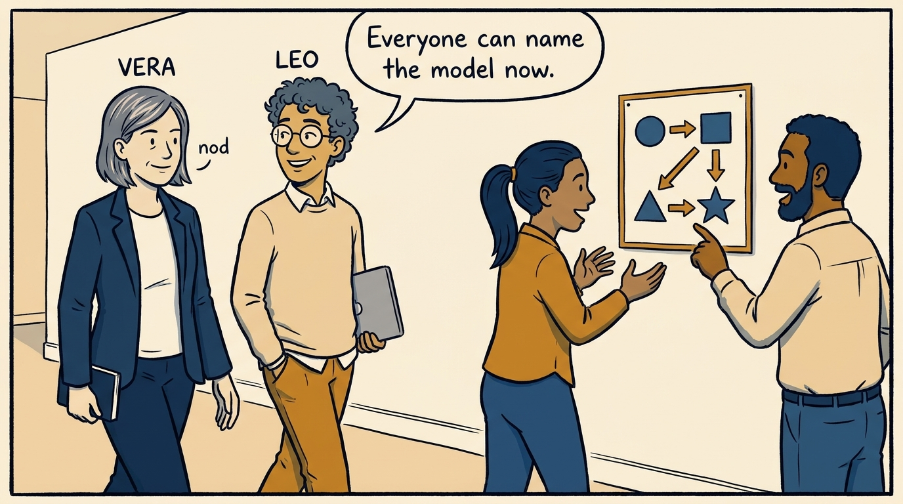
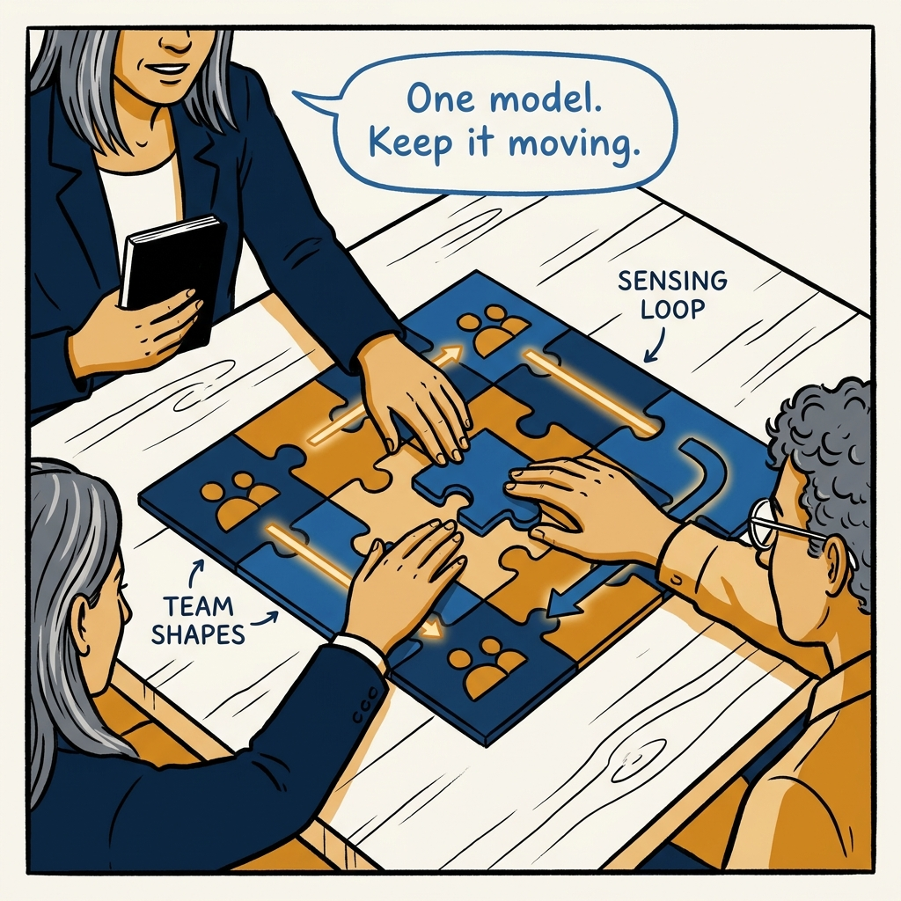

All the pieces become one model — the operating system everyone can name, in eight panels.

<!-- comic-style
{
  "cast": "VERA: a calm, seasoned engineering executive, short gray-streaked hair, dark blazer over a plain t-shirt, carries a small black notebook. LEO: an eager young engineering manager, curly hair, round glasses, laptop under one arm.",
  "style": "Clean two-tone explainer comic, thick ink outlines, flat colors with deep blue and amber accents on a light background, generous white space, hand-lettered speech bubbles with SHORT readable text, no photorealism."
}
-->

**Panel 1:** *The hook: team types, modes, Conway's law — all learned, all scattered.*

**Panel 2:** *The principle: assemble the pieces into one operating model everyone can name.*

**Panel 3:** *Step one: the team is the unit — everything else is built around it.*

**Panel 4:** *Step two: find the real streams of change — and align teams to them, not to departments.*

**Panel 5:** *Step three: the thinnest viable platform — it earns its size, it does not start with one.*

**Panel 6:** *Steps four and five: close the capability gaps the model exposes, then practice sensing — the topology is dynamic, not fixed.*

**Panel 7:** *The payoff: shared vocabulary turns organizational design into an organizational capability.*

**Panel 8:** *The closer: the puzzle assembled — and never quite finished.*
