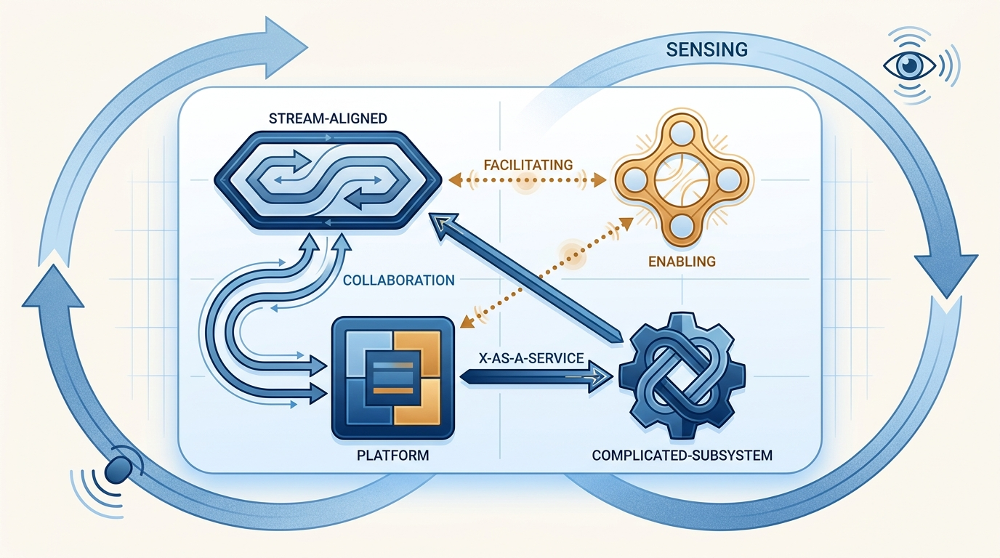
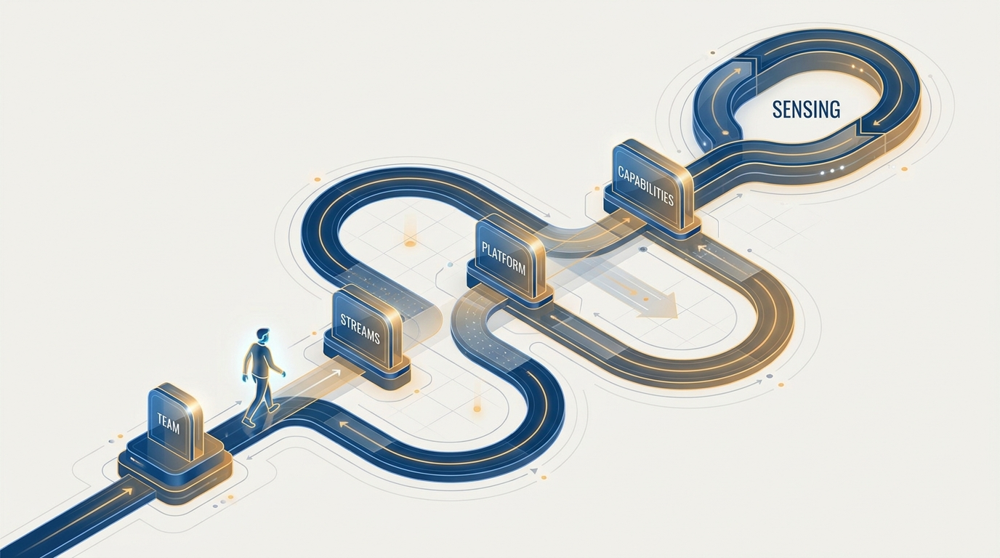
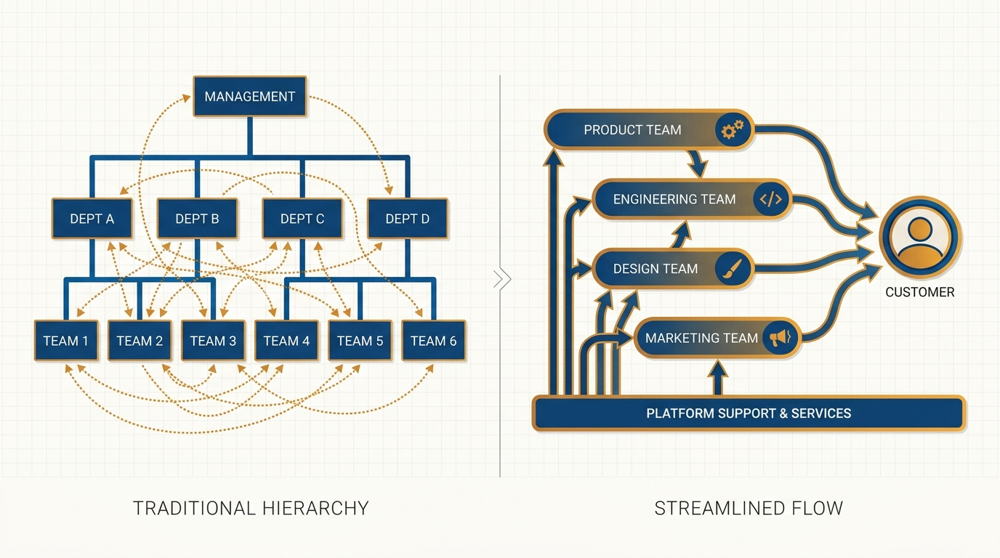

> **Status**: DRAFT
>
> **Principle**: I run the organization on a small, explicit operating model: four team types, three interaction modes, team boundaries sized to cognitive load, Conway's law used deliberately, and continuous organizational sensing — because a structure everyone can name is one everyone can reason about, question, and evolve. The model is not a target org chart; it is a vocabulary plus a feedback loop, and the feedback loop is the part that keeps it honest.

## Statement

The pieces of my operating model are simple, and there are deliberately few of them:

- **Four team types, no more.** Stream-aligned teams carry the main flow of business change; platform teams support them; enabling teams help others learn; complicated-subsystem teams exist only where specialist knowledge truly demands them. Every team maps to one type, and every type has a clear reason to exist.
- **Three interaction modes, made explicit.** Collaboration for joint discovery, X-as-a-Service for consuming what another team provides, facilitating for helping a team learn. No ad hoc, unnamed interaction patterns — and the modes in use are reviewed, because the right mode changes as work matures.
- **Team-first boundaries sized to cognitive load.** The team is the fundamental delivery unit. Subsystems are limited to what one team can understand, own, and operate; architecture that overwhelms a team is a design defect, not a staffing problem.
- **Conway's law used on purpose.** Team structure is my first architectural decision. I align teams with the architecture I want, reduce unnecessary inter-team communication, and make ownership of code, services, and APIs unambiguous.
- **Continuous sensing.** The topology is dynamic, not fixed. Teams are the organization's sensors; I keep asking whether boundaries, types, and modes still fit — and change them when they don't.

**Figure 1:** *The whole model on one canvas: four team types, three interaction modes, and the sensing loop that keeps the topology alive.*

## How to Read This

This is an **appendix record**: unlike the core records in this journal, grounded in Will Larson's *The Engineering Executive's Primer*, this one is grounded in Matthew Skelton and Manuel Pais's *Team Topologies* — read here through an executive lens, complementing the Primer-grounded records. It is also the **synthesis** of the Team Topologies appendix: the sibling records develop the individual pieces — the team types, the interaction modes, Conway's law, the org-chart critique — while this one assembles them into the operating model I actually run. Read it first, as the map, or last, as the capstone. The working checklist — all twelve sections, from diagnosis to the final readiness check — lives in the **Checklist** tab of this post.

## Rationale

**A model everyone can name beats a structure only I understand.** Most organizations run on an implicit design: the org chart says one thing, work flows another way, and every reorg lands as a surprise. When the model is four types and three modes, my leaders can hold the whole thing in their heads. They can say "this collaboration should have become X-as-a-Service by now" — and be understood. Shared vocabulary turns organizational design from an executive privilege into an organizational capability.

**The pieces only work together.** Team types without interaction modes decay into ambiguous relationships; interaction modes without cognitive-load limits just label the overload; Conway's law without sensing freezes yesterday's architecture into tomorrow's constraint. The book's real claim — and mine — is that this is one system, so I refuse to adopt it piecemeal.

**Sensing is what makes it "next-generation".** A fixed topology, however well designed, is a snapshot. What distinguishes this model from a conventional reorg is the built-in expectation of change: collaboration is expected during discovery, stable patterns get pushed into platforms and tooling, boundaries get reviewed as technology and product needs shift. Structure becomes a continuous activity, not an event.

**The conditions matter as much as the shapes.** The model fails in a hostile habitat: blame-driven incident reviews, CapEx/OpEx splits that fragment teams, large-batch project budgeting, training budgets that stop at individuals. Part of my job is clearing that ground — a culture where people speak up, funding that follows long-lived teams, and a clear, explained business vision.

**Figure 2:** *Getting started is a sequence: start with the team, find the streams, thin the platform, close capability gaps, then keep sensing — forever.*

## What This Means in Practice

Adopting the model is a sequence, not a menu. I get started in five moves:

1. **Start with the team.** Before drawing any boxes, I make the team the unit: clear purpose, real ownership of its software, reasonable autonomy, and a cognitive load it can actually carry — with documentation, onboarding, and support inside the team's responsibility.
2. **Identify the streams of change.** I find where business change actually flows — customer tasks, products, purchasing journeys, regional markets, market segments — and align stream-aligned teams to those flows, not to internal departments. Each stream has to reflect real change pressure, or it is a department wearing a costume.
3. **Identify the thinnest viable platform.** I ask what minimum the stream-aligned teams need to move fast, and build just that: big enough to encapsulate complexity and support reliable flow, small enough that it never becomes its own empire.
4. **Close capability gaps.** The model exposes what's missing: team coaching, mentoring, service management, documentation, continuous delivery, pairing and review practices, blameless incident reviews. I fund these as supporting capabilities, because topology without practices is a diagram.
5. **Practice sensing.** I teach the principles, practice the interaction modes deliberately, explain why some teams work closely and others stay apart, and review boundaries on a rhythm. The final readiness check is never "done" — it is the recurring question.

| What this principle says | What it does **not** say |
| --- | --- |
| Four team types and three modes are the whole vocabulary. | Every organization must look identical — the vocabulary is fixed, the topology is yours. |
| Adopt the model as one system, in sequence. | Adopt it in one big-bang reorg — start with the team, not the announcement. |
| The platform is the thinnest viable one. | Platforms are bad — a platform that stays "just big enough" is a force multiplier. |
| The topology is dynamic; expect it to change. | Change it constantly — sensing triggers deliberate evolution, not permanent churn. |
| Culture, funding, and practices are part of the model. | Structure alone will fix delivery — shapes without conditions are theater. |
| Everyone should be able to name the model. | Everyone must read the book — the vocabulary travels in how we explain decisions. |

## Anti-Patterns

- **Stickers on the old org.** Renaming departments "stream-aligned" and "platform" while funding, interactions, and boundaries stay exactly as they were.
- **The big-bang topology reorg.** Announcing the target structure in one move, skipping the sequence — and the explanation — so teams experience it as one more disruptive reorg.
- **The maximal platform.** Building the platform ahead of demand until it becomes a gatekeeping empire the streams route around.
- **Frozen topology.** Designing a beautiful structure once and defending it — no sensing, no boundary reviews, collaborations that never mature into X-as-a-Service.
- **Vocabulary without conditions.** Preaching team types while keeping blame-based reviews, project deadlines, and CapEx/OpEx splits that shred long-lived teams.
- **A fifth team type for every exception.** Inventing new team types instead of asking which of the four the work truly belongs to — the constraint is the value.

**Figure 3:** *Before and after: the org chart describes reporting lines; the operating model describes how change actually flows.*

## Related Records

- [[four-fundamental-team-topologies]] — the four team types this model assembles.
- [[team-interaction-modes]] — the three modes that make the connections explicit.
- [[conways-law]] — why team structure is the first architectural decision.
- [[org-chart-problems]] — the diagnosis this model answers.
- [[engineering-strategy]] — the strategy this operating model exists to serve.
- [[measuring-engineering-organizations]] — how I check that the model is actually producing flow.

## Scope and Revisiting

This principle governs how I structure the whole engineering organization and how I sequence its evolution. I revisit it whenever a new stream of change appears or an old one dries up, whenever the platform's size comes into question, and whenever I catch an interaction that no one can name. The sensing section self-enforces: if the topology has not changed in a year, I treat that as a finding, not as stability.

## Authoritative References

- Matthew Skelton & Manuel Pais, *Team Topologies: Organizing Business and Technology Teams for Fast Flow* (IT Revolution Press, 2019) — the book whose concluding synthesis this record distills.
- The authors maintain ongoing materials, training, and case studies at [teamtopologies.com](https://teamtopologies.com/).
