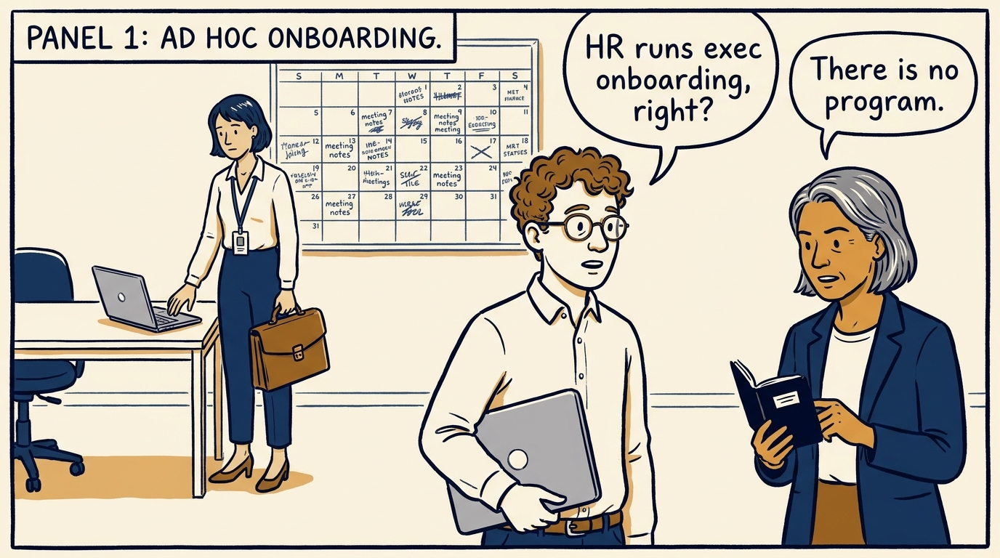
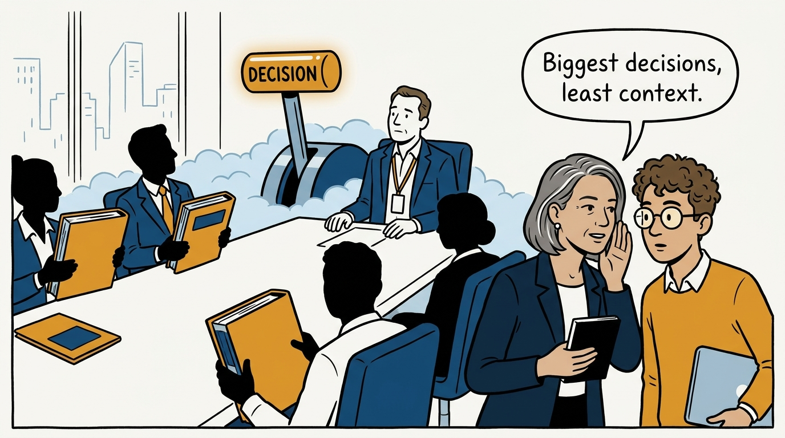
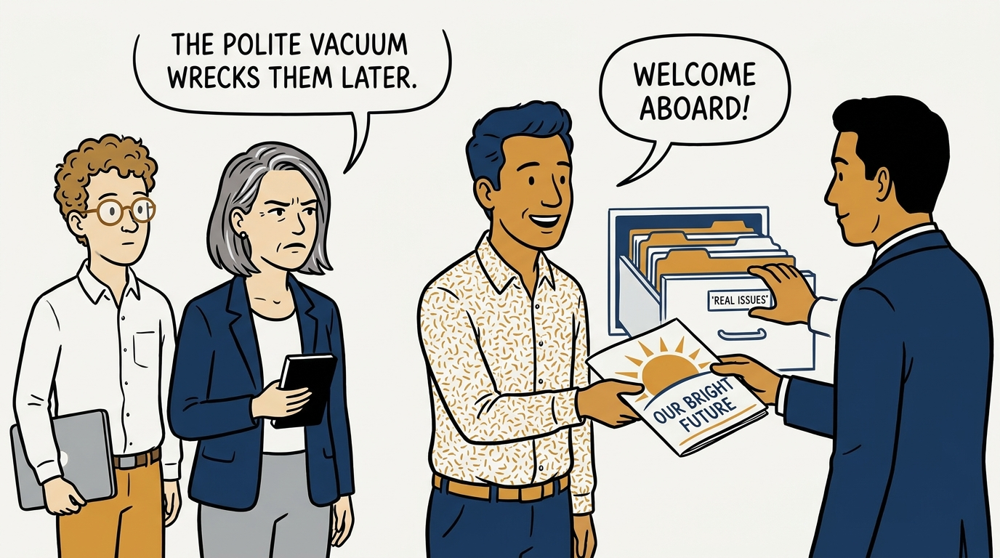
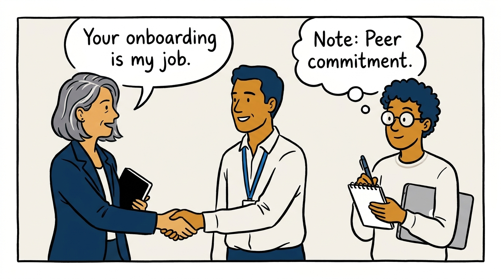
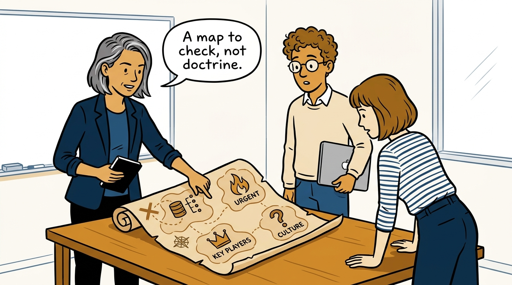
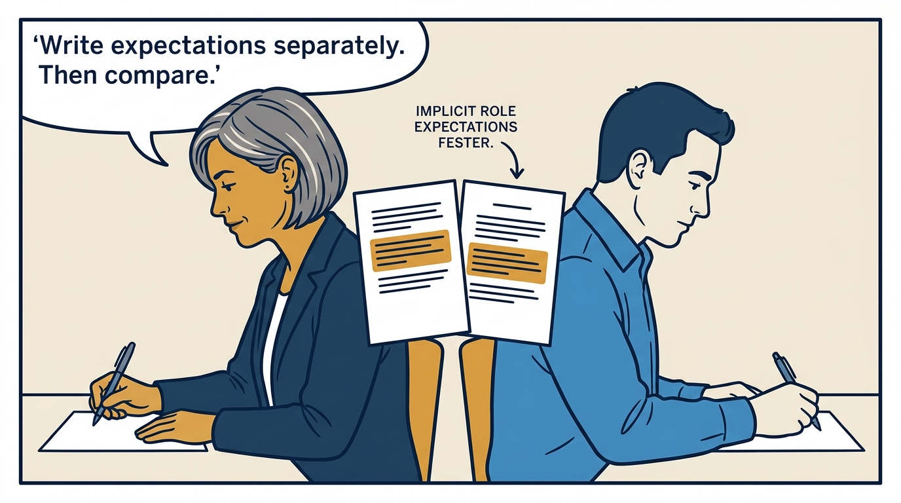
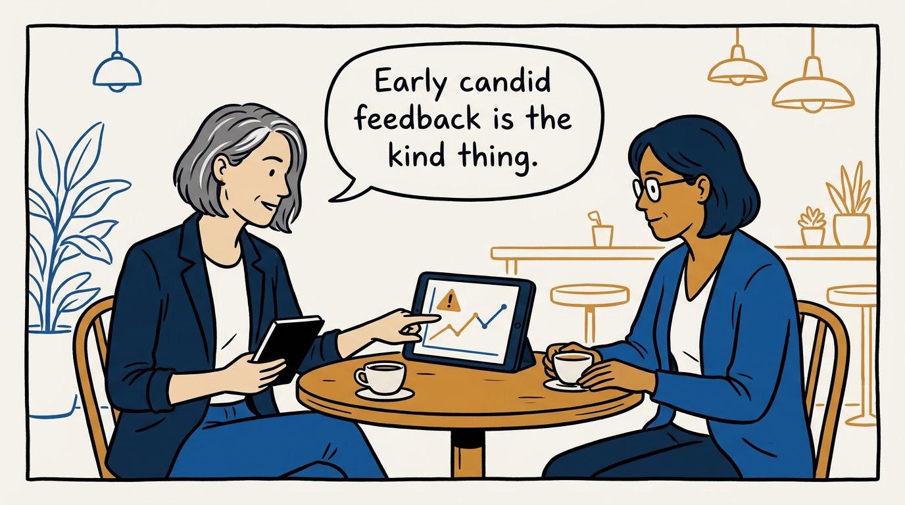
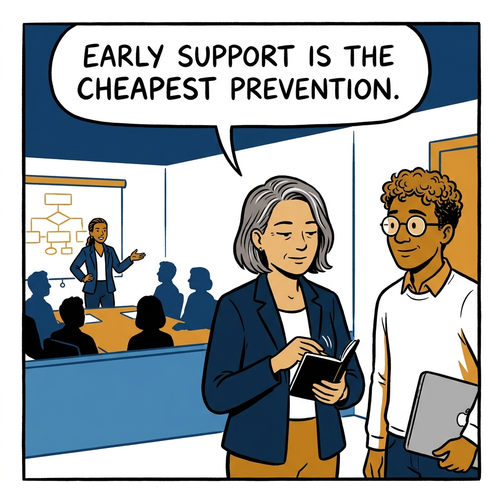

Why a new peer executive's onboarding is my job, not HR's — and what I actually hand them.

<!-- comic-style
{
  "cast": "VERA: a calm, seasoned engineering executive, short gray-streaked hair, dark blazer over a plain t-shirt, carries a small black notebook. LEO: an eager young engineering manager, curly hair, round glasses, laptop under one arm.",
  "style": "Clean two-tone explainer comic, thick ink outlines, flat colors with deep blue and amber accents on a light background, generous white space, hand-lettered speech bubbles with SHORT readable text, no photorealism."
}
-->

**Panel 1:** *The hook: executives get a laptop and a calendar, not an onboarding.*

**Panel 2:** *The problem: consequential decisions arrive before context does.*

**Panel 3:** *Anti-pattern: the polite information vacuum costs the newcomer their credibility.*

**Panel 4:** *The principle: a new peer's onboarding is my job, not HR's.*

**Panel 5:** *First two weeks: hand over the mental framework and encourage validation.*

**Panel 6:** *Make it explicit: independent write-ups surface misalignments while they are cheap.*

**Panel 7:** *Keep the cadence — and name the red flags early, before they compound.*

**Panel 8:** *Closer: early, deliberate support is the cheapest prevention available.*
