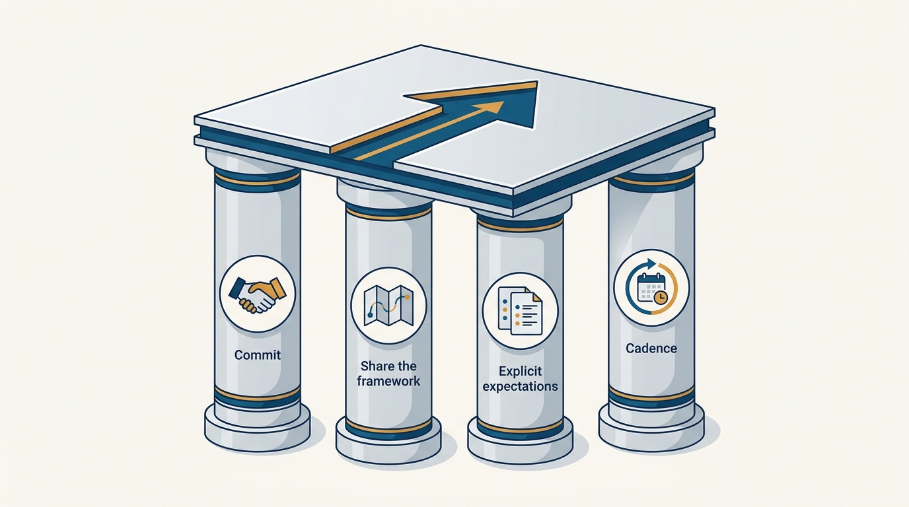
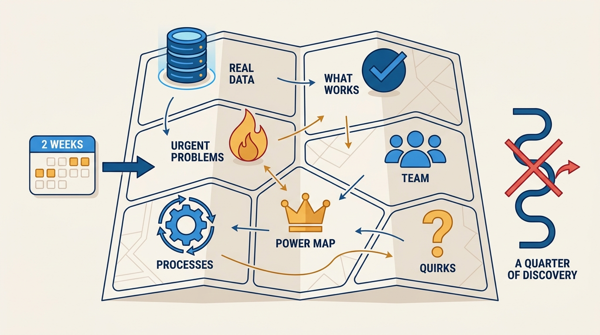
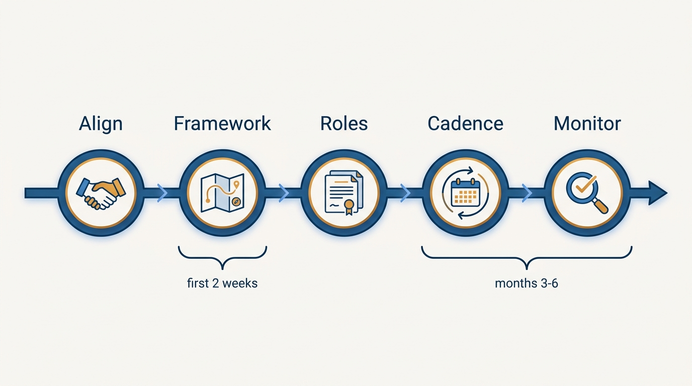

> **Status**: DRAFT
>
> **Principle**: When a new peer executive joins, their onboarding is my job, not HR's. I commit personally to their success: I share my mental framework of the company in their first two weeks — the real data, the urgent problems, what's working, the power map, the processes, the cultural quirks — and I make our mutual role expectations and escalation paths explicit rather than letting them fester as assumptions. Executive onboarding is chronically ad hoc, and mediocre-but-pleasant executives can linger for years; early, deliberate support is the cheapest prevention available.

## Statement

When a peer executive joins a company where I work, I take deliberate ownership of their onboarding. Concretely, this means four commitments:

- **I commit personally to their success.** Executive onboarding is ad hoc and often neglected — there is rarely a program, a buddy, or a curriculum. I fill that gap myself, and where possible I align with the CEO on shared expectations for the new hire and what success looks like in their first 90 days.
- **I share my mental framework in their first two weeks.** Not a slide deck — the working model I actually operate from: where the real data lives, the top urgent problems, budget and headcount norms, what is working well, an honest assessment of their team, the power and influence map, the company's processes, and the cultural quirks that surprise newcomers.
- **I make implicit expectations explicit.** We independently write down what we expect of each other's roles, compare the documents, and resolve the accidental misalignments before they become conflicts. We agree in advance how we handle public disagreement and when and how we escalate to the CEO.
- **I invest in a durable partnership cadence.** Non-transactional time, a weekly structured 1:1 with a shared agenda, joint presence in the forums where our teams intersect — trust built through repeated, small commitments.

**Figure 1:** *The four commitments of peer-executive onboarding: personal commitment, the shared mental framework, explicit expectations, and a durable cadence.*

## How to Read This

This record tells a new peer executive what they can expect from me, and tells CEOs how I support new executive hires. It is a vision of how I operate, not a program I impose. The concrete moves — the full briefing agenda, the role-definition exercise, the cadence — live in the **Checklist** tab of this post. This covers the onboarding window from the incumbent's side; my own ramp as the incoming executive is [[first-90-days]], and the steady-state peer relationship is [[working-with-your-ceo-peers-and-engineering]].

## Rationale

**Executive onboarding is neglected precisely because everyone assumes executives don't need it.** Engineers get onboarding buddies, starter tasks, and documentation. Executives get a laptop and a calendar full of meetings — the assumption being that seniority implies self-sufficiency. But an executive's job is to make consequential decisions early, with far less context than anyone else in the room. The onboarding they need is different in kind, not unnecessary: they need the company landscape — business, team, product, process — and the current critical issues, before they need any tooling.

**A mental framework transfers context faster than discovery does.** A new executive can spend a quarter reconstructing where the real data lives, which processes work, who the unofficial influencers are, and why their team's performance history looks the way it does — or I can hand them my working model in two weeks and let them validate it against reality. I explicitly encourage validation over narratives: the framework is a map to check, not a doctrine to adopt. The honest parts matter most — the transparent team assessment, the historical context behind performance issues, and the steer away from "fixing" what isn't broken.

**Figure 2:** *The mental framework: a two-week transfer of the working model a newcomer would otherwise spend a quarter reconstructing.*

**Implicit role expectations fester; explicit ones get resolved.** Most executive conflict I have seen traces back to two reasonable people holding different unstated assumptions about who owns what. Writing expectations down independently and comparing them surfaces those misalignments while they are still cheap — and pre-agreeing the escalation path removes the ambiguity around decision ownership before the first real disagreement, per [[working-with-your-ceo-peers-and-engineering]].

**Mediocre but pleasant executives can linger — early support is the prevention.** Organizations are slow to correct an executive hire who is likable but ineffective; the cost compounds quietly for years. The cheapest intervention is at the start: watch for the red flags (inaction on key issues, changing what's already working, reverting to old-company playbooks prematurely), give candid feedback early, and address missteps before they compound. Preventing mistakes is far cheaper than recovering from them — the same logic that drives [[inspected-trust]].

## What This Means in Practice

| What this principle says | What it does **not** say |
| --- | --- |
| I own my part of a new peer's onboarding personally. | HR and the CEO have no role — I align with the CEO on expectations where possible. |
| I share my mental framework, including honest team assessments. | The new executive must adopt my views — I encourage validation over narratives. |
| We write role expectations independently and reconcile them. | One conversation settles roles forever — we debrief disagreements as they occur. |
| I give candid feedback early and address missteps before they compound. | I stop investing once things feel "fine" — I continue investing anyway. |
| I steer them away from "fixing" what isn't broken. | Nothing may change — urgent problems are exactly where I want their attention. |

In practice, the arc is: **align on why it matters** (personal commitment, shared expectations with the CEO) → **transfer the mental framework** (first two weeks: data, urgent problems, budget norms, what works, team assessment, power map, processes, cultural norms) → **define roles explicitly** (written expectations, conflict norms, escalation path) → **establish the cadence** (rapport, weekly structured 1:1, joint forums) → **monitor progress** (first three to six months: early signals, candid feedback, public reinforcement). Where an executive assistant is in the picture, I treat that as a two-way partnership too — delegation with investment in their growth, not just offloading.

**Figure 3:** *The onboarding arc: align, transfer the framework, define roles, set the cadence, and keep monitoring into month six.*

## Anti-Patterns

- **Leaving it to HR.** Treating executive onboarding as a people-team deliverable. HR can schedule sessions; only a peer can transfer the power map, the honest team assessment, and the cultural quirks.
- **The polite information vacuum.** Sharing only the flattering version of the company with a new peer — hiding the friction areas and performance history — and letting them discover the real state months later, at the cost of their credibility and my trustworthiness.
- **Implicit role expectations.** Assuming we both "obviously" know where Product ends and Engineering begins, then discovering the overlap in front of the executive team during the first contentious decision.
- **Ignoring red flags.** Watching a new peer stay inactive on key issues, rip up what's working, or replay their old company's playbook — and saying nothing because it feels premature to intervene. Early candid feedback is the kind thing, not the harsh thing.
- **Declaring victory at "fine".** Winding down the investment after month one because nothing is visibly wrong. Mediocre-but-pleasant lingers precisely because "fine" is where scrutiny stops.

## Related Records

- [[first-90-days]] — the same handshake from the other side: how I ramp when I am the incoming executive.
- [[working-with-your-ceo-peers-and-engineering]] — the steady-state peer and CEO relationship this onboarding window sets up.
- [[gelling-your-engineering-leadership-team]] — the team-level version of turning individual executives into a functioning group.
- [[engineering-onboarding]] — why executive onboarding differs from the engineer onboarding my own organization runs.
- [[inspected-trust]] — early observation and candid feedback as the trust-building move, not the trust-violating one.

## Scope and Revisiting

This principle applies whenever a new peer executive joins a company where I hold an executive role — and, with light adaptation, when a new senior leader joins my own organization. I revisit it after each onboarding I run: what the framework briefing missed, which expectations still ended up implicit, and whether the monitoring window was long enough.

## Authoritative References

- Will Larson, *The Engineering Executive's Primer* (O'Reilly, 2024) — the "Onboarding Peer Executives" chapter this record's checklist distills; the principle above is my operating commitment to it.
- Will Larson, [Onboarding peer executives](https://lethain.com/onboarding-peer-executives/) — the freely available companion essay.
