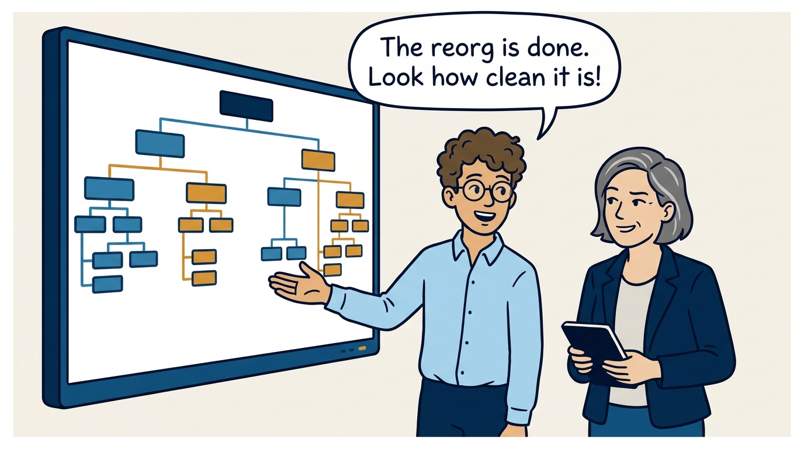
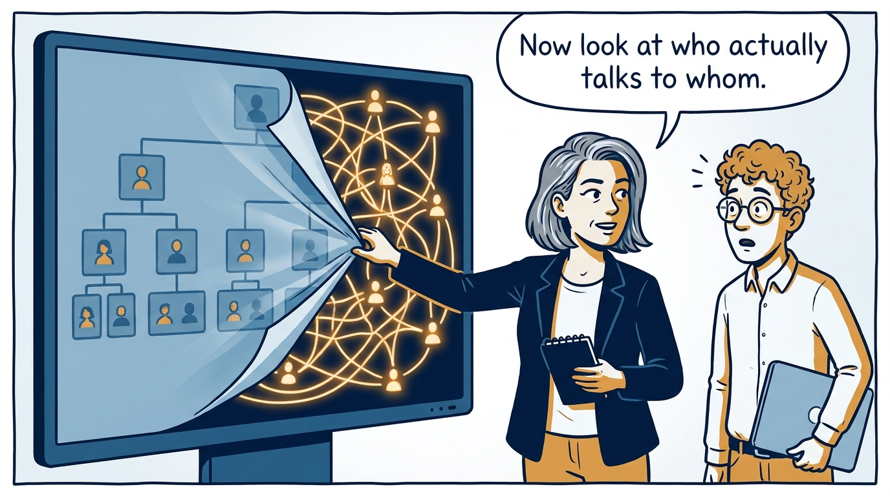
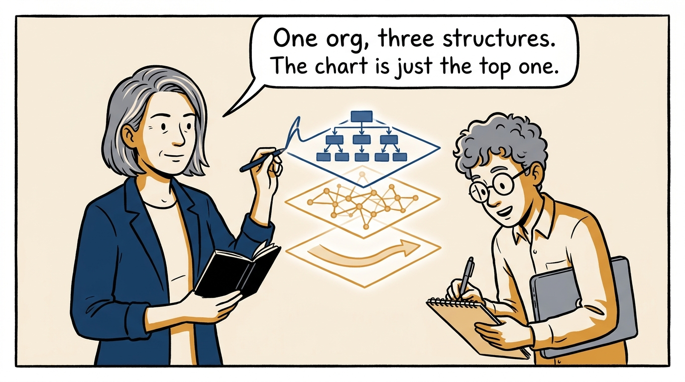
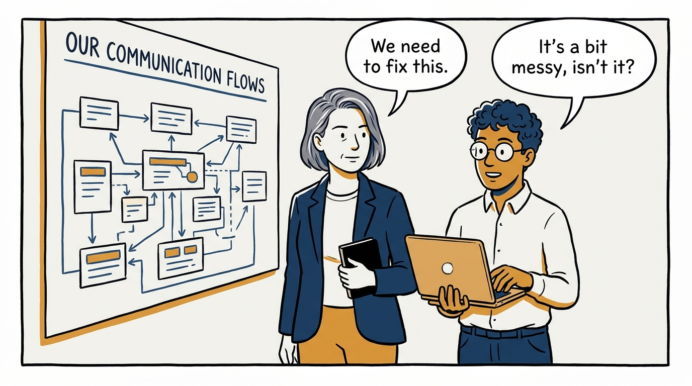
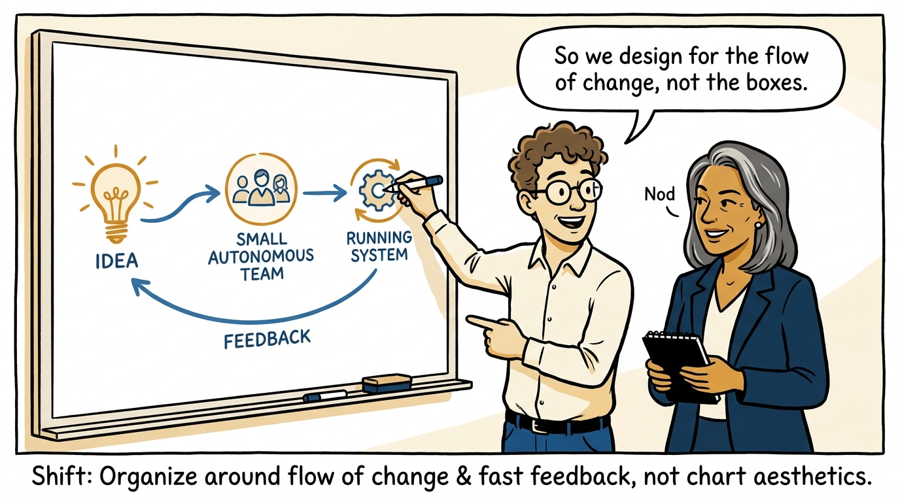
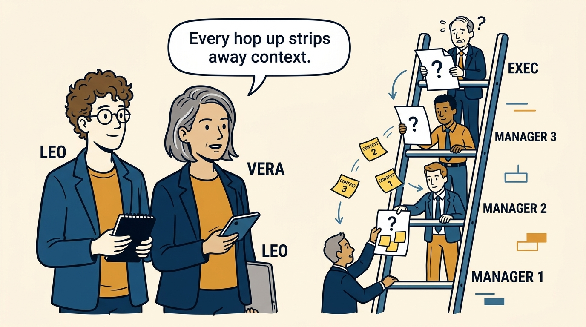
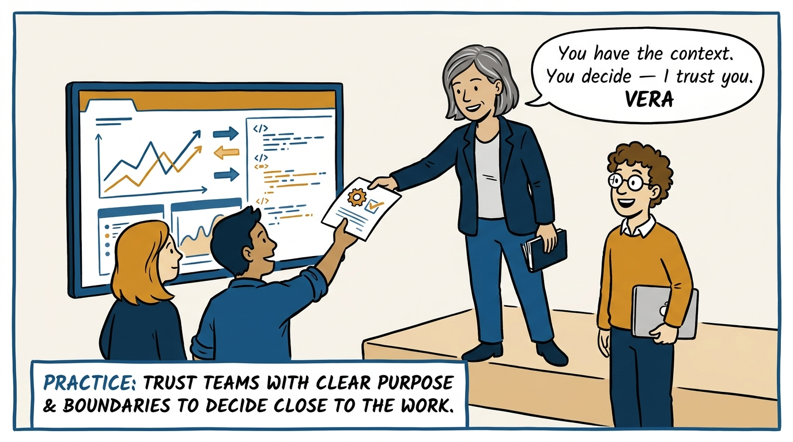
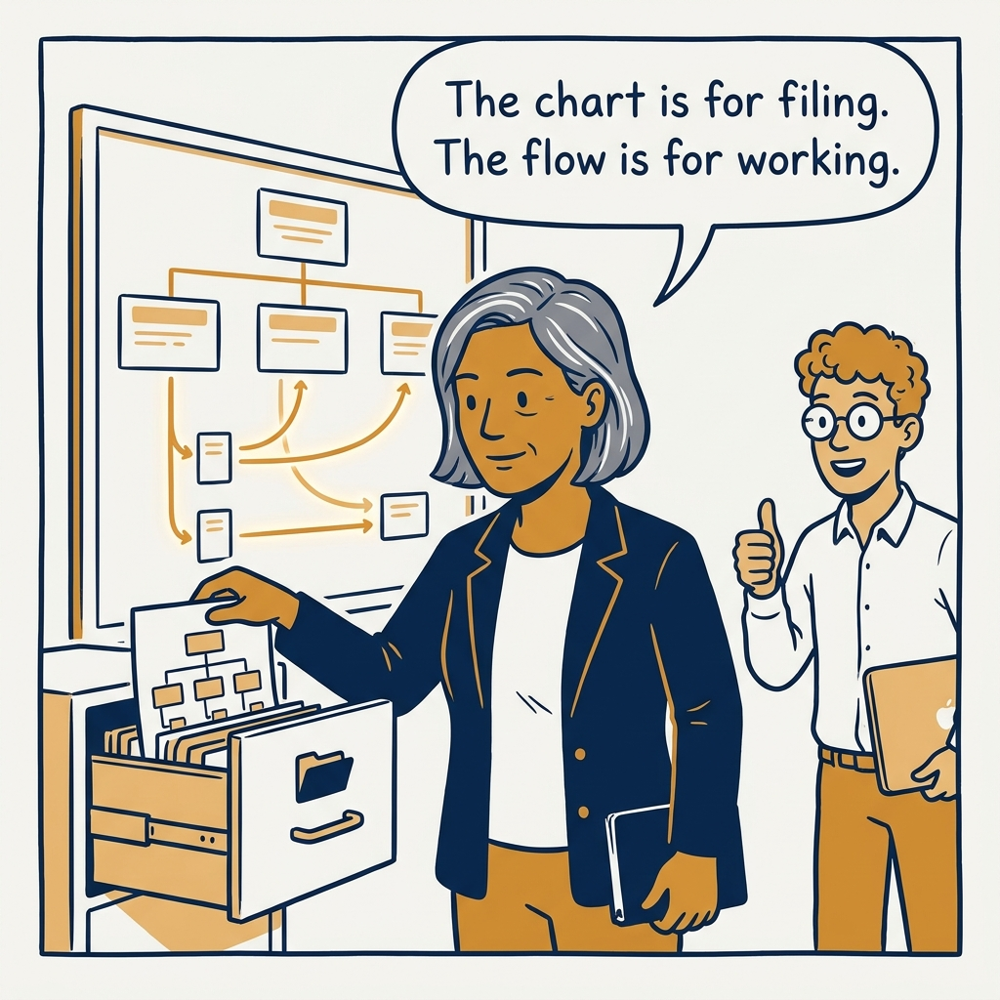

The chart is not the organization — why real work ignores the boxes, in eight panels.

<!-- comic-style
{
  "cast": "VERA: a calm, seasoned engineering executive, short gray-streaked hair, dark blazer over a plain t-shirt, carries a small black notebook. LEO: an eager young engineering manager, curly hair, round glasses, laptop under one arm.",
  "style": "Clean two-tone explainer comic, thick ink outlines, flat colors with deep blue and amber accents on a light background, generous white space, hand-lettered speech bubbles with SHORT readable text, no photorealism."
}
-->

**Panel 1:** *The hook: the reorg is 'done' because the chart looks clean.*

**Panel 2:** *The problem: beneath the chart, work flows through a web of communication the boxes never show.*

**Panel 3:** *The model: formal, informal, and value-creation structures — the chart draws only the first.*

**Panel 4:** *The principle: systems mirror communication paths — design architecture and team interactions together.*

**Panel 5:** *The shift: design for the flow of change and fast feedback — not for tidy boxes.*

**Panel 6:** *The failure mode: decisions decay as they climb — the top has authority but no context.*

**Panel 7:** *The practice: push decisions to the people with the context, with the trust made explicit.*

**Panel 8:** *The closer: the chart is a filing system — the organization runs on flow.*
