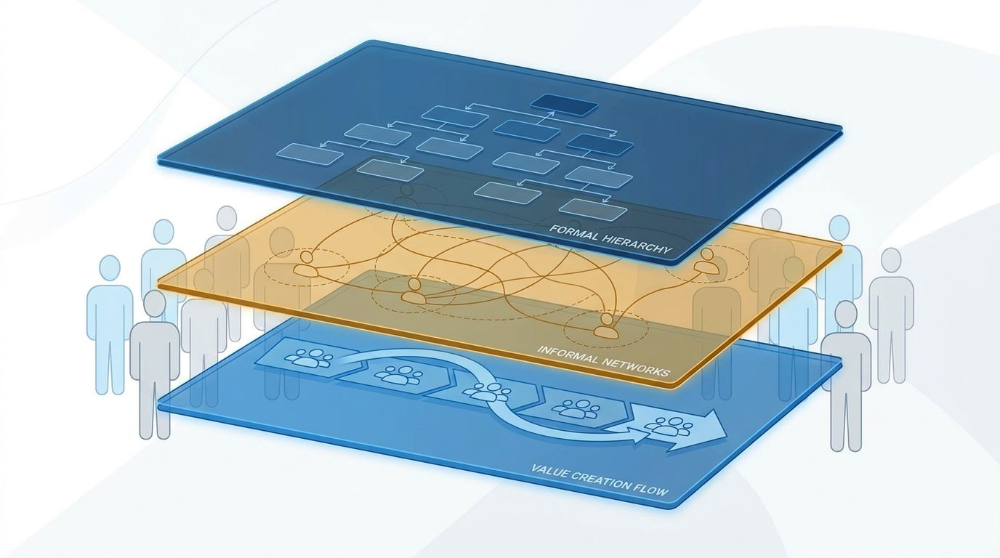
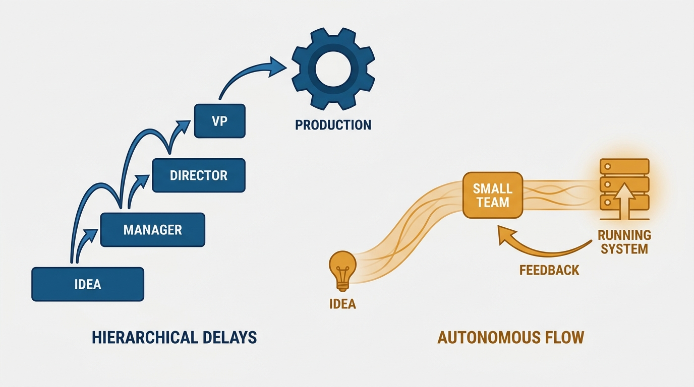

> **Status**: DRAFT
>
> **Principle**: The org chart is not the organization. It is a snapshot drawn for reporting and compliance; real work routes around it through informal networks and value streams the chart never shows. I do not design by rearranging boxes. I design for the flow of change: I map how communication actually happens, make team interactions intentional and limited, shape architecture and team structure together, and push decisions to the people with the context instead of escalating them up reporting lines. I redesign only for a compelling reason, at the right time, with multiple options on the table.

## Statement

My operating model for reading — and refusing to over-read — the org chart has five parts:

- **Three structures, not one.** Every organization runs on a *formal structure* (the chart, for compliance and accountability), an *informal structure* (the networks people actually use), and a *value creation structure* (how work really gets delivered). The chart shows only the first. I manage all three.
- **Communication paths shape systems.** Per Conway's Law, architectures mirror how we communicate, not how we report. So I design software architecture and team interactions together, never separately.
- **Design for the flow of change.** Team interactions are intentional and limited; unnecessary communication paths are reduced; architectures support team-scoped flow and fast feedback from running systems.
- **Decisions in context, not up the chart.** People with the best local information decide. Escalation strips a decision of context at every hop.
- **Redesign is rare and deliberate.** Only for a compelling reason, at the right time, after developing multiple design options — never because the chart looks untidy.

**Figure 1:** *The chart and the reality beneath it: work flows through communication paths the org chart never shows.*

## How to Read This

This is an **appendix record**: unlike the core records in this journal, grounded in Will Larson's *The Engineering Executive's Primer*, this one is grounded in Matthew Skelton and Manuel Pais's *Team Topologies* — read here through an executive lens, complementing the Primer-grounded records. I read the book as the executive who owns the chart and must resist mistaking it for the territory. This record explains why I ask "who does this team actually talk to?" before "who does it report to," and why I send decisions back down when they reach my desk stripped of context. The working checklist lives in the **Checklist** tab of this post.

## Rationale

**The chart answers the wrong question.** An org chart is genuinely useful for what it was built for: compliance, accountability, budget rollups. The trouble starts when I treat it as a plan of how work happens. Plans built on the chart assume people communicate along reporting lines; in practice, people talk to whoever they need to get the job done. When work patterns diverge from the chart, I read that as data, not disobedience — the gap between the formal structure and the real communication pattern is my best diagnostic of where the design is failing.

**Systems mirror communication, whether I like it or not.** Conway's observation — that organizations produce designs that copy their communication structures — is a design constraint with teeth. If four teams must coordinate to ship one change, the architecture grows four-way coupling to match. So I never let an architecture decision and a team-structure decision travel separately: I design them together, choose architectures that support team-scoped flow, and prefer structures that encourage modular, decoupled systems. This inverts a common instinct: more communication between teams is not automatically better. Unnecessary communication paths are a smell; intentional, limited interactions are the goal.

**Figure 2:** *One organization, three structures: the chart draws only the formal layer; the informal and value-creation layers do the work.*

**Three structures, one organization.** The formal structure exists for compliance; the informal structure is the ad-hoc network people improvise; the value creation structure is how work actually gets delivered. Organizations that thrive lean on the second and third: they equip small teams with the context and trust to act, rather than forcing every decision through the first. My job is not to eliminate the chart — it is to stop pretending the chart is where delivery happens.

**Decisions decay as they climb.** When decisions route up the reporting line by default, the people deciding know the least and the people who know the most wait. I get better outcomes by trusting teams with clear purpose and boundaries to decide in place — which is also why excessive matrix management and unclear reporting lines matter: they blur exactly the ownership that in-context decision-making depends on.

**Cognitive load is the sizing constraint the chart cannot see.** The team, not the individual, is the primary unit of delivery, and its responsibilities must fit its cognitive capacity. Too many domains or services on one box looks efficient on paper and produces context switching and delivery bottlenecks in practice. I keep team sizes within effective collaboration limits, bound multi-team groupings by Dunbar's number, and give teams the autonomy, mastery, and purpose that make ownership real. When a team struggles, my first move is to change its environment — load, boundaries, interactions — not its people.

**Reorgs are surgery, not spring cleaning.** Because the informal and value-creation structures carry the delivery, every restructure tears tissue the chart does not show. So I redesign only for a compelling reason, develop multiple options, pick the right time, and keep watching afterward for teams, responsibilities, or communication paths drifting out of alignment as business, technology, and regulation shift.

**Figure 3:** *Design for the flow of change: work moves horizontally through teams and feeds back fast — not up and down the chart.*

## What This Means in Practice

| What this principle says | What it does **not** say |
| --- | --- |
| The chart models reporting, not work; keep it for compliance and accountability. | Throw the org chart away. |
| Map the informal and value-creation structures before redesigning anything. | The informal network is always right and should be formalized wholesale. |
| Reduce unnecessary communication paths; make interactions intentional. | Teams should be isolated — the *right* interactions are the point. |
| Design architecture and team structure together. | Either one dictates the other, one-way. |
| Push decisions to the people with the context. | Nobody escalates anything — genuine cross-cutting calls still come to me. |
| Redesign only with a compelling reason, options, and timing. | The structure is frozen — misalignment signals are acted on. |

Concretely: reorg proposals that arrive as rearranged boxes go back with the question "what flow of change does this improve?" Before any redesign, I want the actual communication patterns, not just the intended ones, and at least two design options. Responsibility discussions include a cognitive-load check: what is this team already carrying? And when a decision reaches me that a team could have made with the context they hold, I return it — with the trust made explicit.

## Anti-Patterns

- **Chart-first reorgs.** Redrawing boxes for symmetry, then discovering the value streams the old informal network quietly carried.
- **The chart as a communication plan.** Assuming information flows along reporting lines, then being surprised when knowledge routes around the hierarchy.
- **More communication as a virtue.** Unbounded communication paths are coordination debt, not culture.
- **Matrix fog.** Excessive matrix management and unclear reporting lines that dissolve the ownership in-context decisions depend on.
- **The overloaded box.** Piling domains and services onto one team because the chart has room in the box, ignoring cognitive capacity.
- **Escalation as the default.** Routing decisions up the chart until they reach someone with authority and no context.
- **Reorg as a reflex.** Restructuring without a compelling reason, without alternatives, at whatever time the calendar allows.

## Related Records

- [[organizational-design]] — appendix sibling; sizing, team states, and investment sequencing within the structure.
- [[internal-communication]] — the communication system that must work with the informal structure, not against it.
- [[conways-law]] — appendix sibling; the mirroring force this record leans on, in full.
- [[team-first-thinking]] — appendix sibling; the team as the unit of delivery, cognitive load as its budget.
- [[next-gen-operating-model]] — appendix sibling; the operating model that replaces chart-first management.

## Scope and Revisiting

This principle governs how I read organizational structure, when I allow redesigns, and where decisions get made. I revisit it whenever a reorg proposal reaches my desk, whenever the gap between chart and observed communication widens, and whenever business, technology, or regulatory shifts change what the value-creation structure must deliver. The review questions in the Checklist tab are the recurring instrument.

## Authoritative References

- Matthew Skelton & Manuel Pais, *Team Topologies: Organizing Business and Technology Teams for Fast Flow* (IT Revolution Press, 2019) — the org-chart-problems material this record's checklist distills.
- The authors maintain ongoing materials, training, and case studies at [teamtopologies.com](https://teamtopologies.com).
