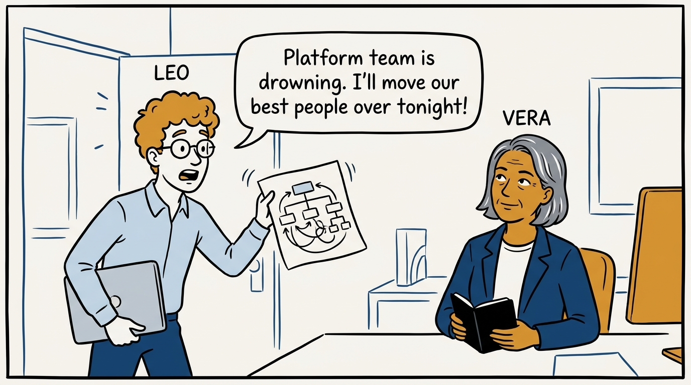
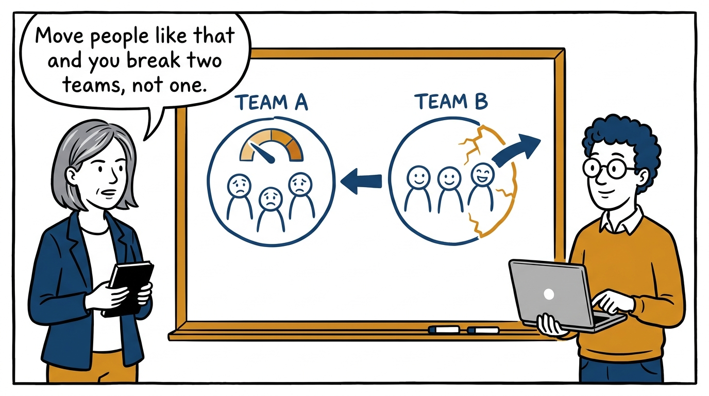
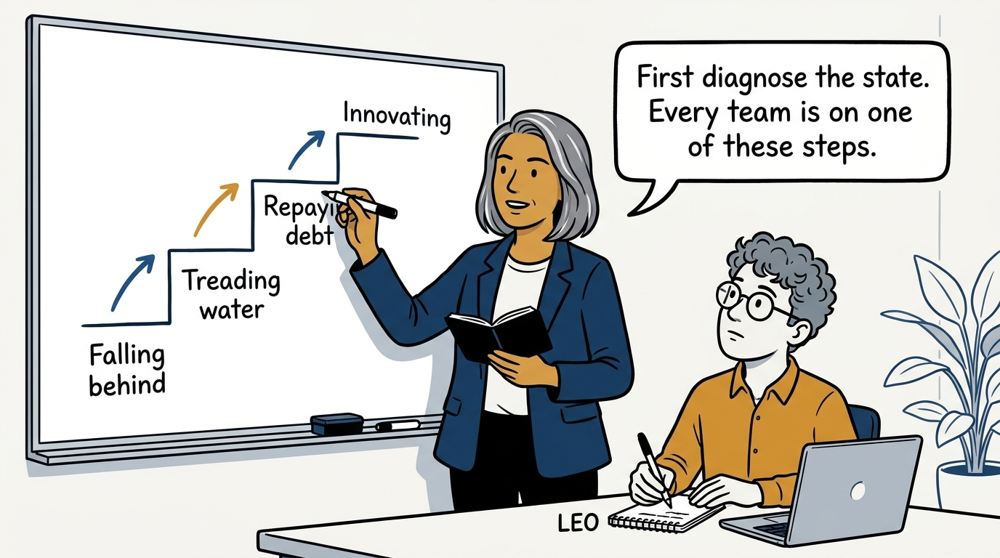
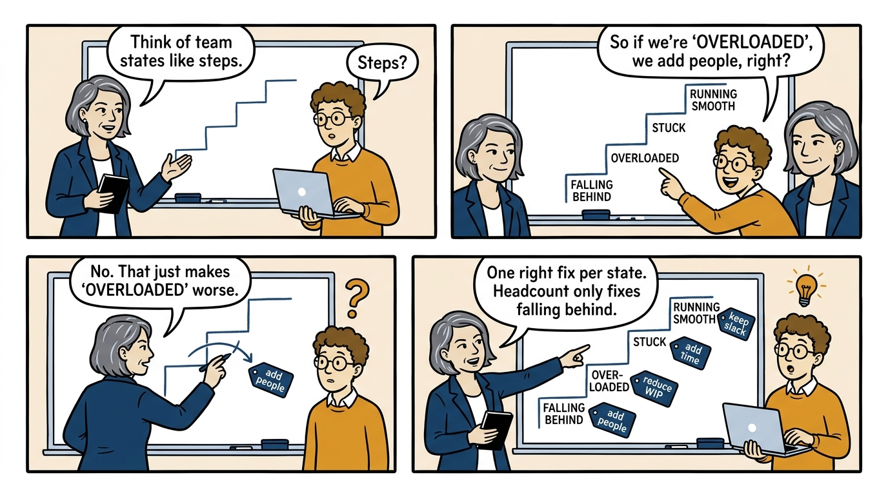
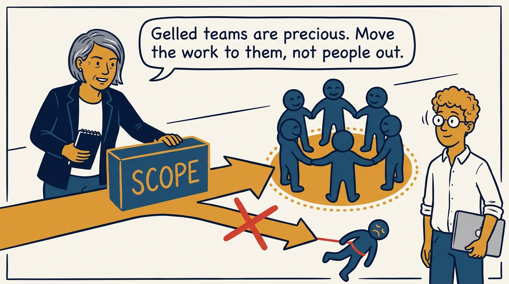
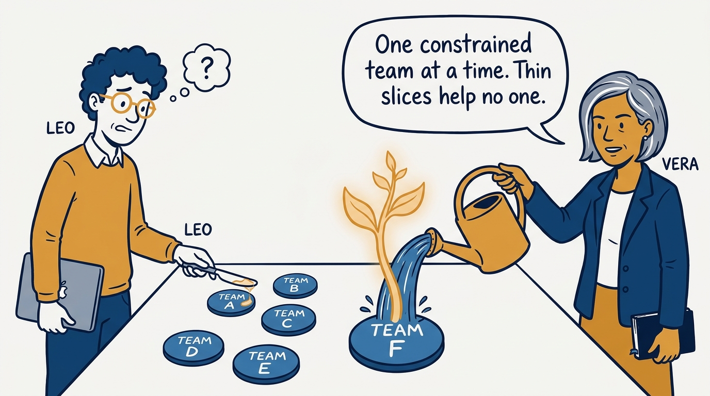
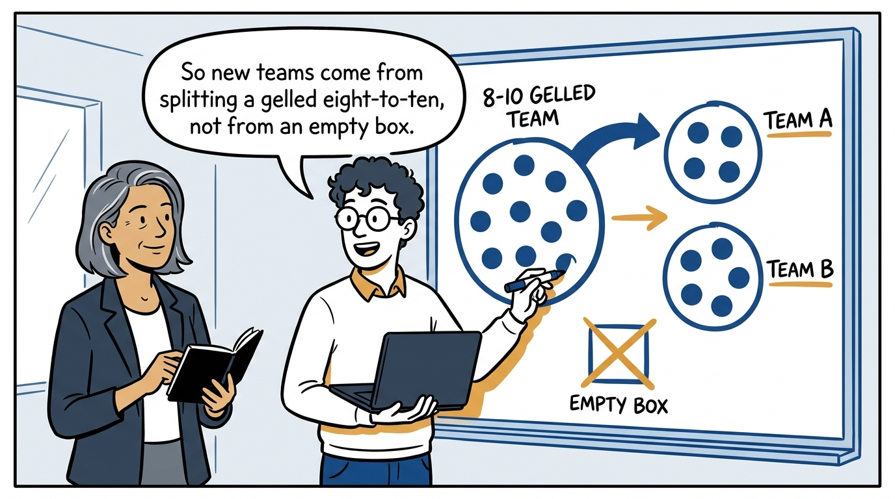
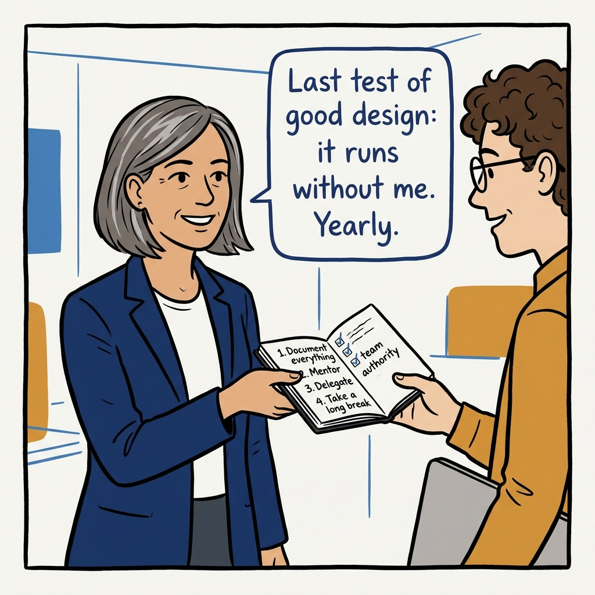

Fix the system, not the symptom — organizational design in eight panels.

<!-- comic-style
{
  "cast": "VERA: a calm, seasoned engineering executive, short gray-streaked hair, dark blazer over a plain t-shirt, carries a small black notebook. LEO: an eager young engineering manager, curly hair, round glasses, laptop under one arm.",
  "style": "Clean two-tone explainer comic, thick ink outlines, flat colors with deep blue and amber accents on a light background, generous white space, hand-lettered speech bubbles with SHORT readable text, no photorealism."
}
-->

**Panel 1:** *The hook: a struggling team, and the instinct to fix it with heroics and a midnight reorg.*

**Panel 2:** *The problem: the quick move breaks the donor team too — now two teams underperform.*

**Panel 3:** *The principle: diagnose first — falling behind, treading water, repaying debt, or innovating.*

**Panel 4:** *The fix follows the diagnosis: add people, reduce WIP, add time, or keep slack — one per state.*

**Panel 5:** *Don't raid gelled teams: shift scope to the team — re-gelling costs more than the seat you saved.*

**Panel 6:** *Consolidate: staff one team to the next healthier state, then move on — don't peanut-butter.*

**Panel 7:** *New teams by mitosis: grow a gelled team to 8–10, split into 4–5 — never an empty box on a chart.*

**Panel 8:** *The closer: succession — a well-designed organization should not need its designer.*
