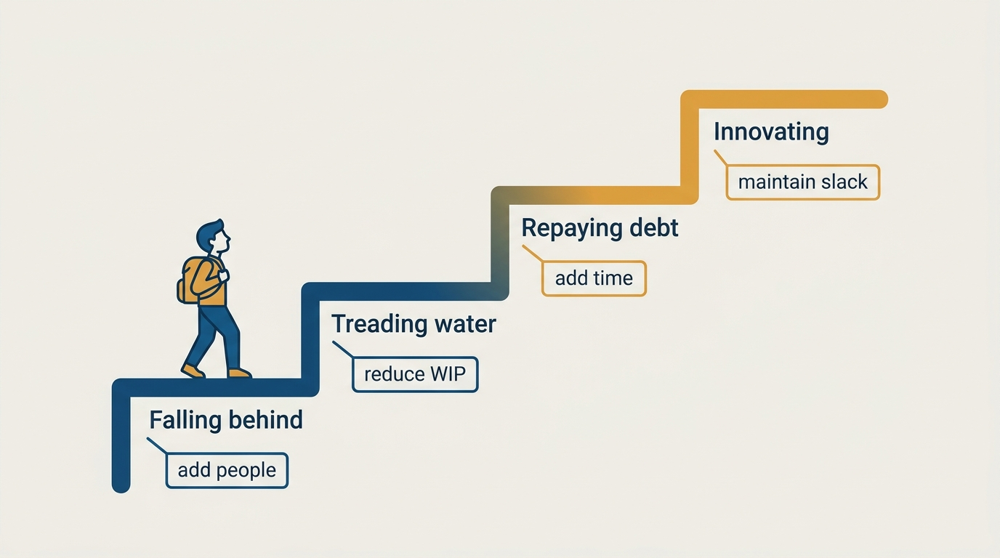
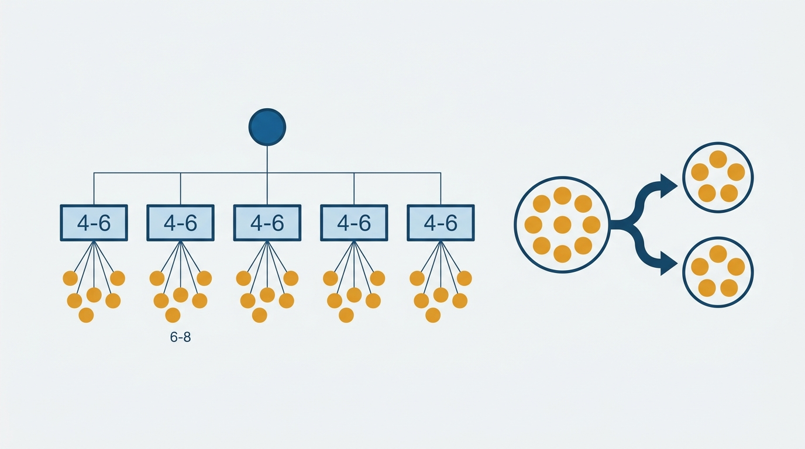
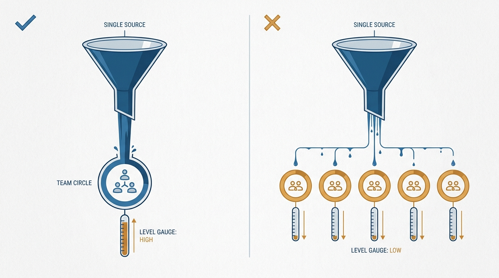

> **Status**: DRAFT
>
> **Principle**: I treat organizational design as a systems discipline, not an org-chart exercise. I choose the right lever for each problem — process, culture, or structure. I size teams deliberately, diagnose each team's state (falling behind, treading water, repaying debt, innovating) before prescribing a fix, and consolidate investment in one constrained team at a time rather than spreading it thin. I do not raid high-performing teams: I shift scope, not people. And I run a yearly succession exercise, because the test of my design is that it works without me.

## Statement

My operating model for organizational design has five parts:

- **Choose the right lever.** Quick, cheap problems get process design. Long-term problems get cultural evolution. When both apply, organizational design bridges them.
- **Size teams deliberately.** Managers support roughly 6–8 engineers; managers-of-managers roughly 4–6 managers; on-call teams need around 8 engineers for a sustainable rotation. New teams come from growing an existing team to 8–10 and splitting into two teams of 4–5. I do not create empty teams.
- **Diagnose before prescribing.** Every team is in one of four states — *falling behind*, *treading water*, *repaying debt*, or *innovating* — and each state has exactly one right fix: add people, reduce work in progress, add time, or maintain slack.
- **Consolidate, don't peanut-butter.** I invest in one constrained team at a time, staff it until it reaches the next healthier state, then move on.
- **Design for my own absence.** Once a year I identify everything only I can do, close the easy gaps, and actively reduce one or two risky ones.

**Figure 1:** *The four team states and the one right fix per state: add people, reduce WIP, add time, maintain slack.*

## How to Read This

This is an **appendix record**: unlike the core records in this journal, grounded in Will Larson's *The Engineering Executive's Primer*, this one is grounded in his earlier, manager-focused book *An Elegant Puzzle: Systems of Engineering Management* — read here through an executive lens, complementing the Primer-grounded records. The book addresses the manager sizing a team; I read it as the executive designing the system those managers operate in. If you lead teams in my organization, this record explains why I ask "what state is the team in?" before approving any headcount request, and why I say no to moves that look locally obvious. The working checklist — all nine sections, with the numbers — lives in the **Checklist** tab of this post.

## Rationale

**Symptoms invite the wrong fix; states prescribe the right one.** The instinct when a team struggles is to add people. But headcount only helps a team that is *falling behind*. A team *treading water* needs less work in progress; a team *repaying debt* needs time and protection; a team *innovating* needs its slack preserved, not harvested. Diagnosing the state first turns staffing into a question with an answer.

**Team size is a design constraint, not an outcome.** A manager stretched across ten engineers is a firefighter; a manager with three is an accidental tech lead. Teams below four people cannot own an on-call rotation or operate independently, so I treat them as temporary exceptions and never create empty teams hoping to fill them. Splitting a gelled team of 8–10 into two teams of 4–5 transfers working culture into the new team — something a team assembled from scratch has to invent under pressure.

**Figure 2:** *Sizing defaults: 6–8 engineers per manager, 4–6 managers per manager-of-managers — and new teams born by splitting a gelled 8–10 into two 4–5s.*

**Gelled teams are the scarcest asset I have.** The visible cost of moving a person is one seat; the invisible cost is months of re-gelling in two teams at once. So I do not casually move people out of high-performing teams. When a healthy team has spare capacity, I move *scope to the team*, not people away from it — or use explicitly temporary rotations. Treating people as fungible is locally rational and globally destructive.

**Consolidated investment compounds; peanut-buttered investment evaporates.** One team taken from falling behind to treading water is a durable improvement. Five teams each given a fifth of the same investment stay exactly where they were. So I prioritize one constrained team at a time and let teams alternate between growth and consolidation periods instead of permanent flux.

**Figure 3:** *Consolidate, don't peanut-butter: one team moved to the next healthier state beats five teams held exactly where they were.*

**Hypergrowth is an entropy problem.** Rapid hiring taxes the very engineers who make the organization worth joining: interviewing, onboarding, and re-coordinating all draw from the same people. So I track that load, give interviewers breaks past about three interviews a week, and refuse to grow faster than training systems can absorb. Structurally, I add a management layer per order of magnitude of engineers and expect most systems to survive only one order of magnitude of growth before needing redesign. Against entropy, I make sure some projects actually finish, funnel interruptions into a small surface area, build ownership registries, and treat gatekeeping as an implementation bug, not a stability feature.

**Some risks are mine to keep.** Organizational debt — toxic pockets, painful processes, struggling leaders, inequitable mechanisms — never fully clears. I pick a few areas to improve deliberately, agree with my manager on what reasonable progress looks like, and permit myself to handle lower-priority risks poorly for a while. I delegate only risks that are realistically solvable; the ones unlikely to go well I keep, because handing someone an unwinnable problem is not delegation but blame assignment.

## What This Means in Practice

| What this principle says | What it does **not** say |
| --- | --- |
| Diagnose the team's state before choosing a fix. | Every struggling team gets more headcount. |
| Sizing numbers (6–8, 4–6, ~8 on-call) are the default. | The numbers are laws — they shift the burden of proof, nothing more. |
| Shift scope to teams; move people rarely and deliberately. | Teams own their scope forever; nothing ever moves. |
| Invest in one constrained team at a time. | The other teams don't matter — their turn is sequenced, not denied. |
| Innovating teams keep their slack. | Healthy teams are idle capacity waiting to be harvested. |
| I keep the risks unlikely to go well. | I keep all the interesting problems for myself. |

Concretely: headcount conversations start with a state diagnosis, not a request size. New teams are created by splitting, not by decree. Reorg proposals must price in re-gelling costs. And every year I re-run the succession exercise — audit my calendar, recurring processes, and my reports' dependencies on my skills, authorization, advice, or knowledge — close the easy gaps with documentation or a handoff, and actively reduce one or two risky ones.

## Anti-Patterns

- **Headcount as the universal medicine.** Adding people to a team that needed less WIP or more time — worsening coordination while the real constraint stays untouched.
- **Raiding the gelled team.** Pulling the "spare" senior engineer out of the high-performing team, and discovering two quarters later that both teams underperform.
- **Peanut-butter investment.** Giving every struggling team a little, so none ever reaches the next state.
- **Empty teams and permanent minnows.** Creating teams before there are people to fill them, or leaving sub-4-person teams as permanent structure that can neither own on-call nor operate independently.
- **Growth outrunning training.** Hiring at a rate where interviewing and onboarding load makes the existing organization slower, not faster.
- **Gatekeeping dressed as rigor.** Approval choke points defended as stability — in a growing organization, gatekeeping is an implementation bug.
- **The indispensable executive.** Never running the succession exercise, so the design quietly depends on one irreplaceable node: me.

## Related Records

- [[gelling-your-engineering-leadership-team]] — the leadership team that operates this design; re-gelling costs apply there most of all.
- [[hiring]] — how I hire; this record governs where the hires go and when.
- [[planning]] — consolidated investment is a planning stance as much as a staffing one.
- [[run-engineering-processes]] — process design is the cheap lever; this record is for when it is not enough.
- [[systems-and-tools]] — appendix sibling; the four-states model is systems thinking applied to teams.
- [[management-approaches]] — appendix sibling on managing within the structure this record designs.

## Scope and Revisiting

This principle governs how I structure, size, and staff my organization, and how I sequence investment across it. I revisit it at every growth inflection (roughly each order of magnitude), whenever a reorg proposal reaches my desk, and whenever I catch myself approving a people-move that a state diagnosis would have rejected. The succession section self-enforces: the exercise repeats yearly.

## Authoritative References

- Will Larson, *An Elegant Puzzle: Systems of Engineering Management* (Stripe Press, 2019) — the organizational-design chapters this record's checklist distills.
- Many of the book's chapters began as freely available essays on [lethain.com](https://lethain.com/), where the underlying material can still be read.
