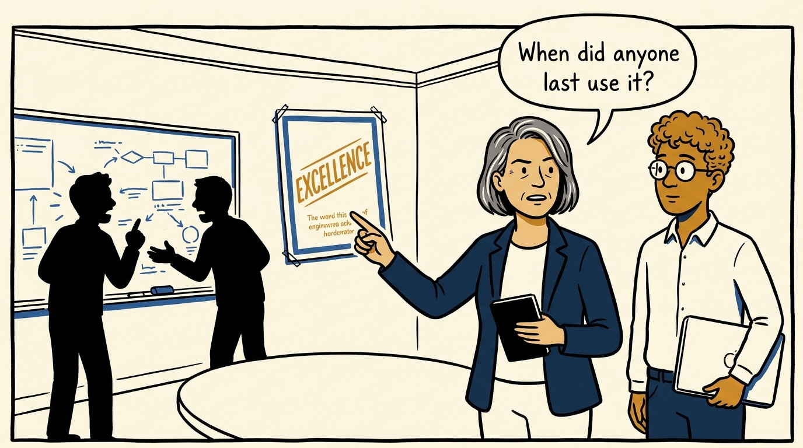
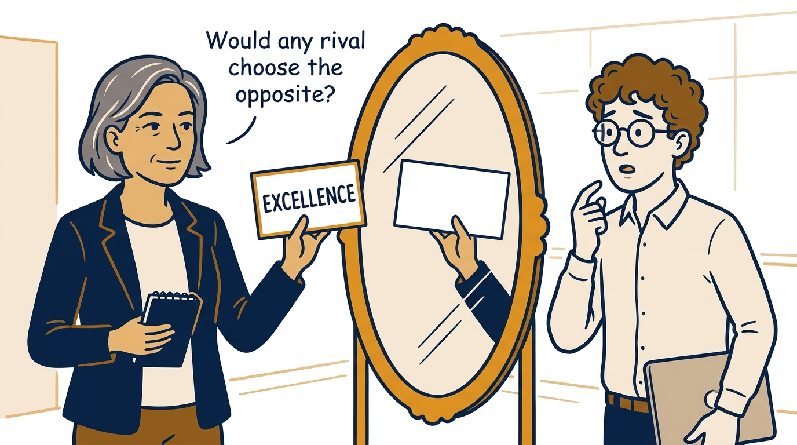
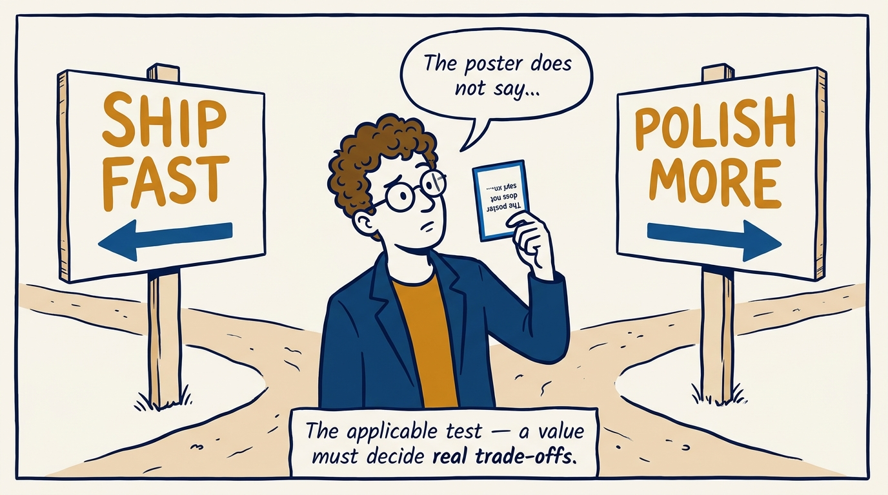
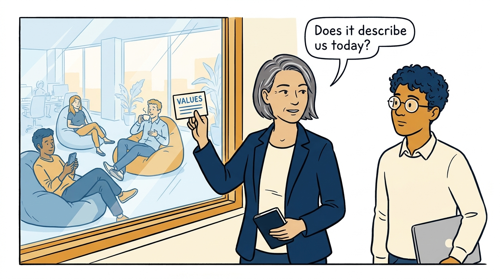
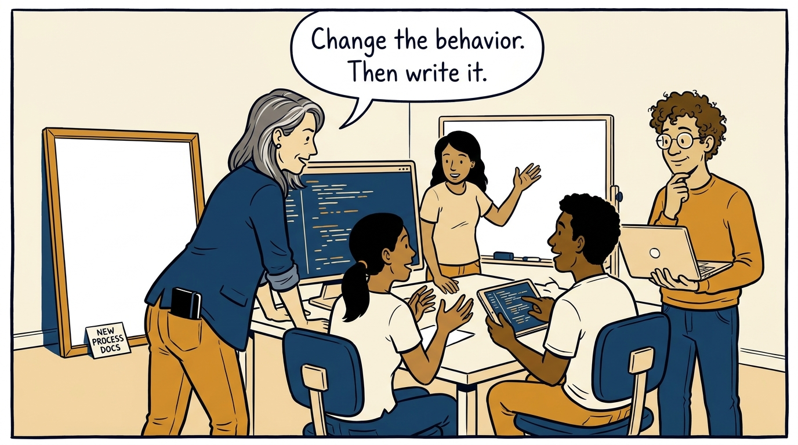
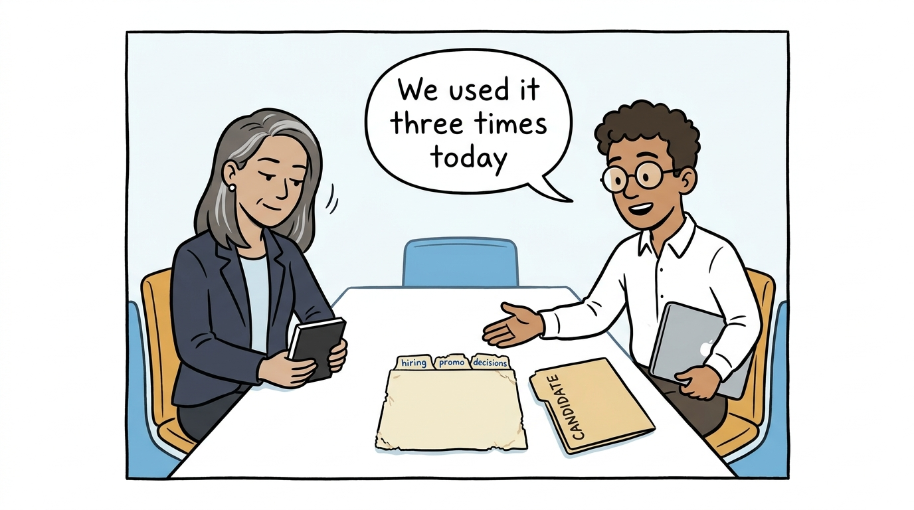
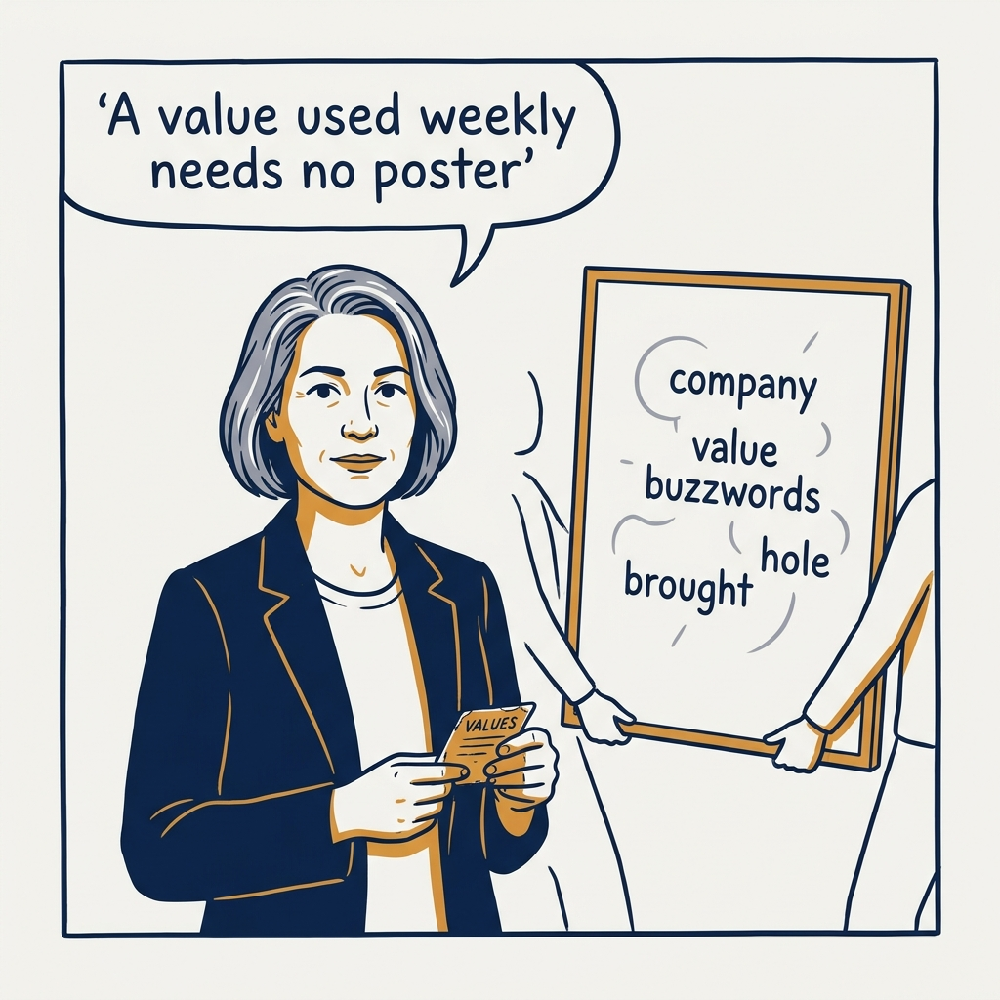

Why values are decision tools, not wall decoration — in eight panels.

<!-- comic-style
{
  "cast": "VERA: a calm, seasoned engineering executive, short gray-streaked hair, dark blazer over a plain t-shirt, carries a small black notebook. LEO: an eager young engineering manager, curly hair, round glasses, laptop under one arm.",
  "style": "Clean two-tone explainer comic, thick ink outlines, flat colors with deep blue and amber accents on a light background, generous white space, hand-lettered speech bubbles with SHORT readable text, no photorealism."
}
-->

**Panel 1:** *The hook: a proud new values poster goes up on the wall.*

**Panel 2:** *The problem: visible everywhere except where decisions are made.*

**Panel 3:** *Test one, reversible: if no successful company would choose the opposite, it is applause, not a choice.*

**Panel 4:** *Test two, applicable: if it cannot decide a speed-versus-quality call, it is a slogan.*

**Panel 5:** *Test three, honest: a value must describe how we actually behave now — or it teaches people the values are fiction.*

**Panel 6:** *The principle: behavior first, documentation second — the value records the change, it does not create it.*

**Panel 7:** *How it plays out: values live in hiring debriefs, promotions, and major decisions — used, not framed.*

**Panel 8:** *The closer: a value used weekly needs no poster.*
