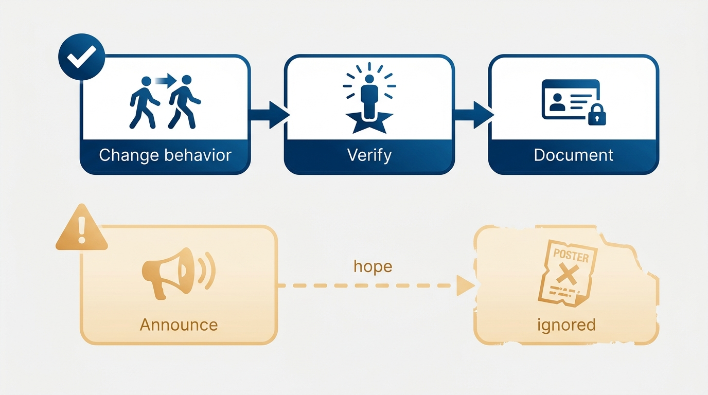
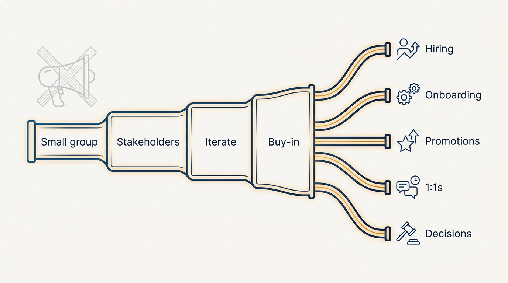

> **Status**: DRAFT
>
> **Principle**: Values are decision tools, not decoration. I test every candidate value three ways: it must be *reversible* (a real strategic choice another successful company might make the other way), *applicable* (usable in concrete trade-offs like speed versus quality), and *honest* (describing how we actually behave today — behavior changes before documentation, never after). I prefer extending existing company values over inventing new ones, roll values out slowly with buy-in rather than top-down announcement, and integrate them into hiring, onboarding, promotions, and major decisions — because a value that is never used in a decision is not a value.

## Statement

My commitments on organizational values:

- **Purpose before wording.** Before writing any value, I articulate which decisions it is meant to guide. Values reinforce cultural changes already underway; they do not magically create new ones. And senior leaders — starting with me — actively model them.
- **Scope deliberately.** I first ask whether extending existing company values beats creating new ones. If new values are needed, I choose intentionally between company-wide, engineering, and engineering-leadership values, and check they are truly relevant to Engineering's work.
- **Three quality tests.** Every value must be reversible, applicable, and honest. A value that fails any test gets rewritten or dropped.
- **Behavior first, documentation second.** If behavior needs to change, we change the behavior — then write the value that describes it. Documenting an aspiration does not create it.
- **Roll out slowly, integrate everywhere.** Small-group testing, early stakeholder involvement, iteration, buy-in over announcement — and then integration into hiring, onboarding, promotions, 1:1s, and major decision discussions.
- **Maintain like any other system.** Values are revisited periodically, adjusted as behavior and strategy evolve, and leaders are consistently held accountable for modeling them.

**Figure 1:** *The quality bar: a value that fails reversible, applicable, or honest gets rewritten or dropped.*

## How to Read This

This record tells my leadership team what standard any proposed value must meet before I will put my name behind it — and tells HR partners and peer executives how Engineering will engage with company-wide values work. It is a vision of how I evaluate and roll out values, not a proposal for which values any specific organization should pick. The working checklist — the quality tests, the traps, and the rollout and integration steps — lives in the **Checklist** tab of this post.

## Rationale

**Reversible, applicable, honest is the quality bar because each test kills a distinct failure mode.** The *reversible* test kills universally good statements: if no successful company would reasonably choose the opposite, the value is not a strategic choice — it is applause. The *applicable* test kills abstractions: a value earns its place only if team members would know how to apply it in a specific scenario — a speed-versus-quality call, a build-versus-buy decision, a planning or promotion discussion. The *honest* test kills aspiration dressed as description: a value must describe how the organization behaves today, with top performers already modeling it. Values that fail these tests do not merely sit unused — they teach people that the written values are fiction.

**Behavior change must precede documentation.** A document cannot change an organization; it can only make an existing change legible and durable. When I want different behavior, the sequence is: change the behavior in practice, verify top performers model it, then document it as a value. Reversing the sequence — announcing the value and hoping behavior follows — produces the most corrosive artifact in organizational life: a wall of values everyone can see nobody follows.

**Figure 2:** *Behavior first, documentation second — the reversed sequence produces values everyone sees and nobody follows.*

**Extending beats inventing.** Existing company values already have recognition and legitimacy; a parallel engineering set competes with them for attention and invites contradiction. So my first move is always to ask whether extending company values covers the need — and only when Engineering genuinely needs its own decision guidance do I add scoped values, chosen deliberately at the right level.

**Rollout is where values live or die.** Values introduced top-down, early in a tenure, before understanding the organization, arrive as an imposition and are treated as one. So I wait long enough to understand the organization first — the patience argued in [[first-90-days]] — test values in small groups, involve key stakeholders early, iterate before finalizing, and build buy-in rather than announcing. Then integration does the real work: values appear in hiring (where candidates can opt out), onboarding, promotions, 1:1s, and major decisions. A value used weekly needs no poster.

**Figure 3:** *Roll out slowly, then integrate everywhere: values live where real trade-offs are made, not on walls.*

## What This Means in Practice

| What this principle says | What it does **not** say |
| --- | --- |
| Every value must pass reversible, applicable, honest. | Values are just strategy restated — they are the decision-guiding layer that clarifies it. |
| Change behavior before documenting it. | Never aspire to change — aspiration drives the behavior change; the value records its arrival. |
| Prefer extending existing company values. | Engineering never gets its own values — scoped values are fine when chosen intentionally. |
| Roll out slowly, with small groups and buy-in. | Values are democratic wordsmithing forever — iteration ends, and leaders are then accountable. |
| Integrate values into hiring, promotion, and decisions. | Values are an HR artifact — they are used wherever real trade-offs are made. |

## Anti-Patterns

- **Identity values.** Statements about how we want to *see ourselves* rather than how we make decisions — the value nobody would ever use when deciding what to do next.
- **Vague prioritization slogans.** Values that gesture at priorities without providing context for any actual trade-off. If it cannot help prioritize work, it is a slogan, not a value.
- **Top-down announcement.** Publishing values before behavior exists, before small-group testing, before stakeholder buy-in — and then wondering why they are ignored.
- **The week-two values exercise.** Introducing new values before understanding the organization, importing them from a previous company's culture rather than deriving them from this one's.
- **Wall art.** Values that appear in the office and the handbook but never in a hiring debrief, a promotion discussion, or a major decision — visible everywhere except where decisions are made.
- **Unaccountable leadership.** Holding the organization to values that its own leaders visibly do not model.

## Related Records

- [[engineering-strategy]] — values reinforce and clarify strategy; the overlap is intentional and coherent, not accidental.
- [[calibrating-your-standards]] — standards are the engineering quality bar; values are the decision-guiding layer above them.
- [[first-90-days]] — the patience to understand the organization before introducing values is the same learning-first discipline.
- [[hiring]] — hiring is one of the primary places values are applied, including letting candidates opt out.
- [[engineering-onboarding]] — onboarding is where new engineers first meet the values explicitly, not incidentally.

## Scope and Revisiting

This principle governs how I evaluate, introduce, and maintain values for any engineering organization I lead, and how I engage with company-wide values work. I revisit it whenever strategy shifts enough that the values stop clarifying it, and periodically regardless — checking each value still passes reversible, applicable, honest against how we behave *now*.

## Authoritative References

- Will Larson, *The Engineering Executive's Primer* (O'Reilly, 2024) — the "Organizational Values" chapter this record's checklist distills; the principle above is my operating commitment to it.
- Will Larson, [Setting engineering org values](https://lethain.com/setting-engineering-org-values/) — the freely available companion essay.
