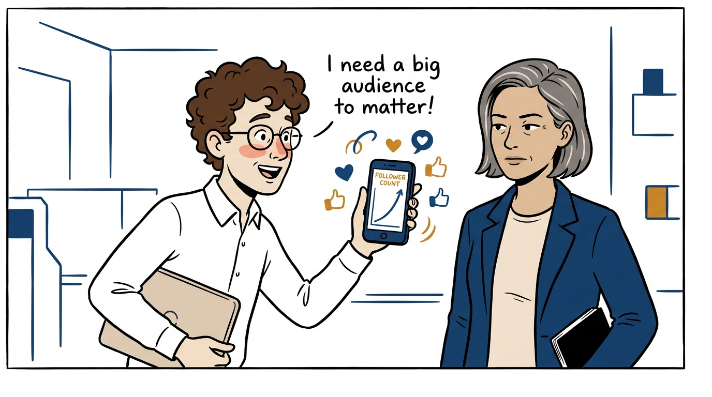
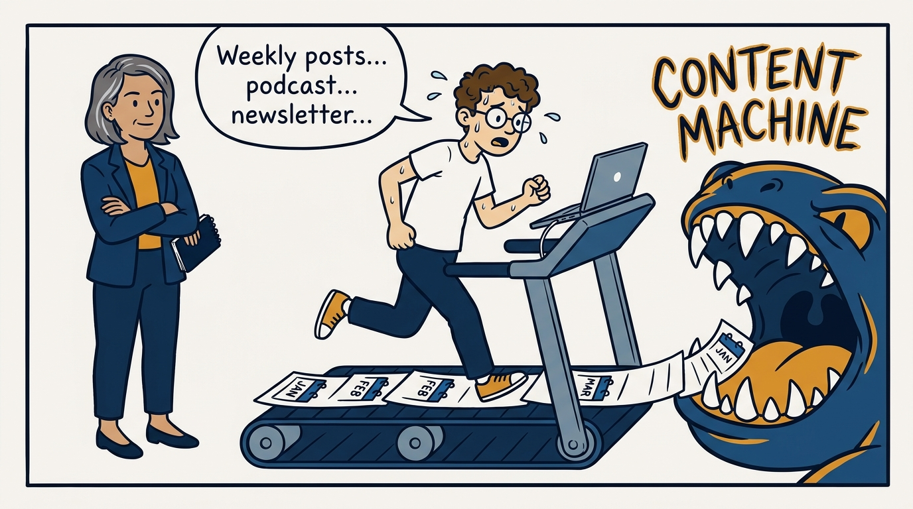
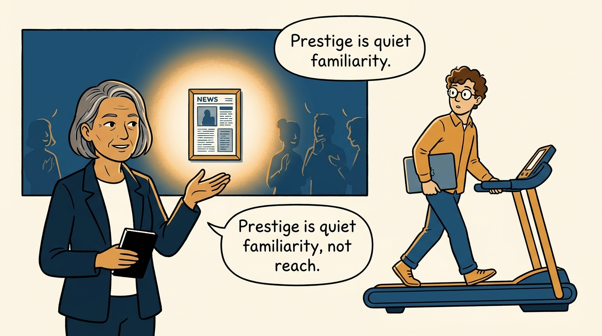
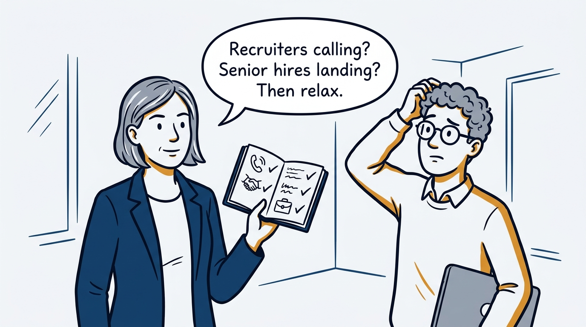
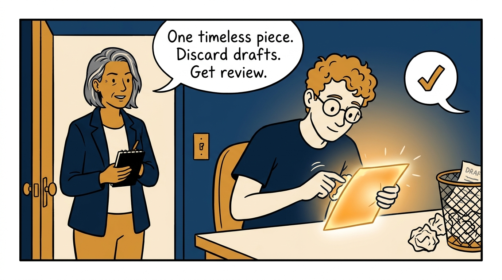
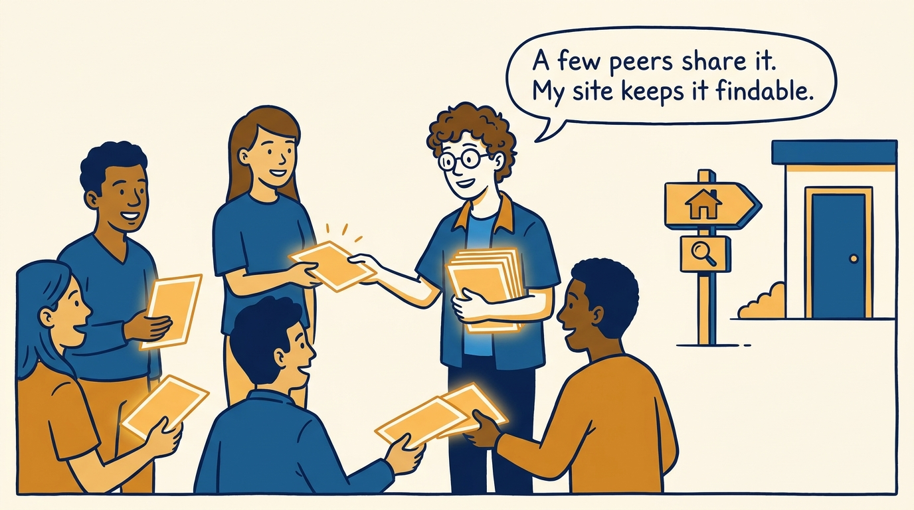
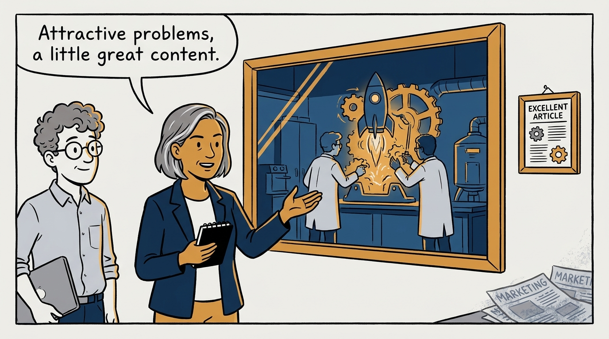
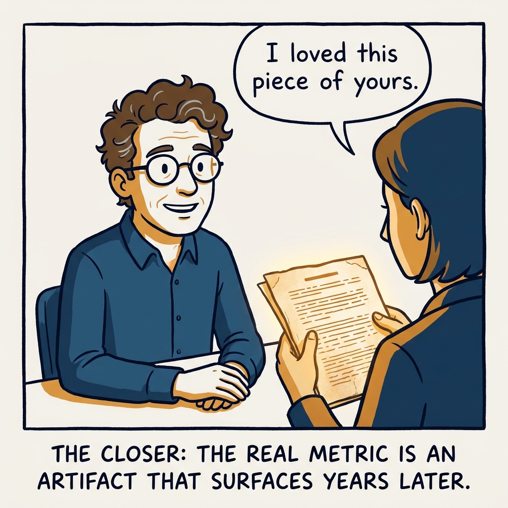

Prestige, not followers — why a few timeless artifacts beat the content machine, in eight panels.

<!-- comic-style
{
  "cast": "VERA: a calm, seasoned engineering executive, short gray-streaked hair, dark blazer over a plain t-shirt, carries a small black notebook. LEO: an eager young engineering manager, curly hair, round glasses, laptop under one arm.",
  "style": "Clean two-tone explainer comic, thick ink outlines, flat colors with deep blue and amber accents on a light background, generous white space, hand-lettered speech bubbles with SHORT readable text, no photorealism."
}
-->

**Panel 1:** *The hook: measuring standing in followers.*

**Panel 2:** *The problem: the content machine must be fed, and it eats the job.*

**Panel 3:** *The principle: ambient, positive, discoverable familiarity.*

**Panel 4:** *Step one: check whether you need to invest at all.*

**Panel 5:** *Create little and well: one timeless artifact beats a year of output.*

**Panel 6:** *Distribute simply, keep it discoverable — then let it work.*

**Panel 7:** *The organization follows the same rule: the work is the brand.*

**Panel 8:** *The closer: the artifact that outlives the algorithm.*
