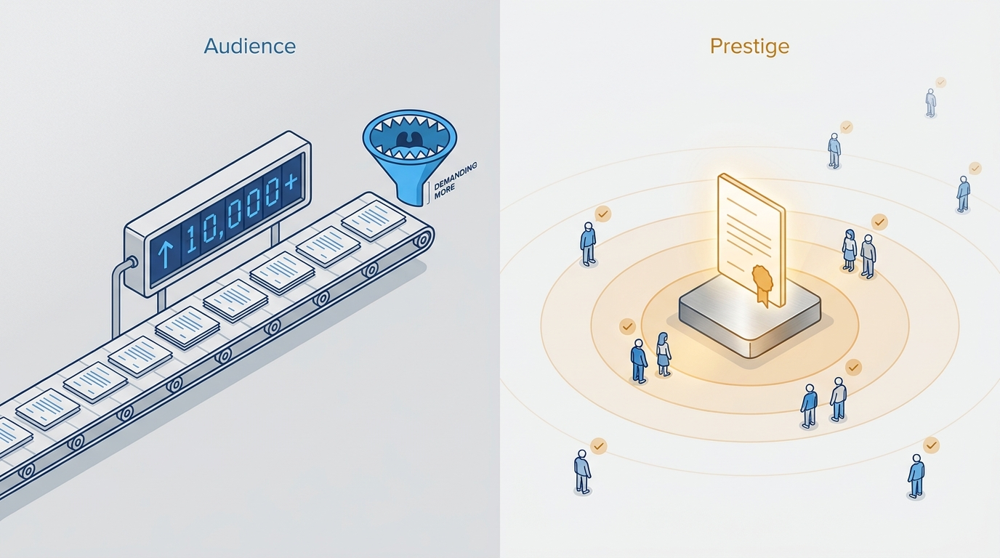
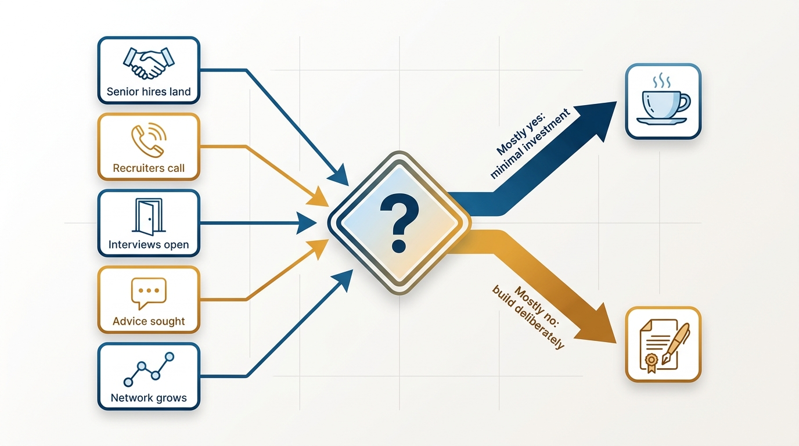
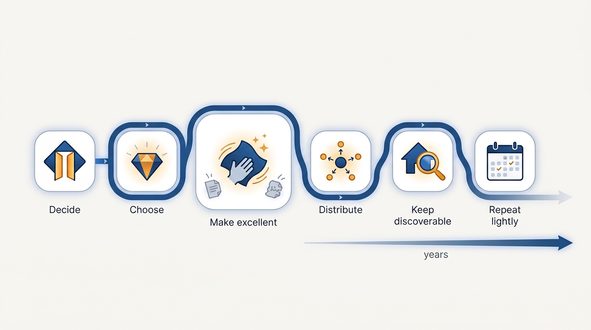

> **Status**: DRAFT
>
> **Principle**: I optimize for prestige — ambient, positive, easily discoverable familiarity — not audience size. Before investing at all, I check whether I need to: if I can hire senior people, recruiters call, and my network expands naturally, minimal investment is required. When I do invest, it is a small number of timeless, high-quality artifacts born from real experience — a blog post, a conference talk — distributed simply, kept discoverable, and repeated only occasionally over years. I never measure this in pageviews or followers, and the same principle governs my organization: meaningful engineering problems and a little excellent content beat a heavy content machine.

## Statement

Prestige is a means, not a scoreboard. Four commitments govern how I build it:

- **I check whether investment is needed before investing.** Can I hire senior candidates successfully? Do people seek my advice beyond my direct reports? Can I start interview processes for the roles I want? Do executive recruiters bring me interesting roles? Is my network naturally expanding to more senior people? Mostly yes — minimal investment needed. Mostly no — build prestige deliberately.
- **I optimize for prestige, not audience.** Prestige is passive, positive awareness — prestige ≠ brand ≠ followers. I deliberately avoid over-investing in content volume.
- **When I create, I create little and well.** A timeless, high-leverage topic where I hold a meaningful, non-obvious perspective grounded in real experience; the format is a blog post or conference talk — small enough to iterate, permanent and discoverable; the quality bar assumes discarding two or three drafts and getting feedback from experienced reviewers. Then: distributed simply (a handful of peers sharing simultaneously, thoughtful posts in relevant communities, no controversy-driven promotion), kept discoverable (personal website, linked from professional profiles, findable by search, collected in one place), and repeated only two or three times over several years.
- **The organization follows the same principle.** We focus on meaningful, attractive engineering problems, highlight prestigious employees and work, produce a small amount of thoughtful, high-quality content — and avoid high-frequency publishing strategies.

**Figure 1:** *Two models: an audience must be fed; prestige radiates from a few durable artifacts.*

## How to Read This

This record is itself an artifact of the principle it states: a small, durable, discoverable piece of writing born from practice — which is exactly how recruiters and hiring managers should read it. The full working practice, from the invest-at-all check to the metrics to avoid, lives in the **Checklist** tab of this post. Writing as a networking channel belongs to [[your-network]]; the hiring funnel that prestige quietly feeds belongs to [[hiring]].

## Rationale

**The invest-at-all check comes first because prestige is instrumental.** Prestige exists to do specific jobs: attract senior candidates, open interview processes, bring recruiter calls, expand the network upward. If those jobs are already being done, more prestige is unpurposed effort — time taken from the actual role. The check turns a vanity question ("am I known enough?") into an operational one ("is anything blocked by insufficient awareness?").

**Figure 2:** *The invest-at-all check: an operational question about blocked jobs, not a vanity question.*

**Prestige is not brand and not followers.** An audience must be fed — the content machine demands volume, and volume competes directly with quality and with the job. Prestige, by contrast, is ambient: people who have never met me have encountered one good artifact, or know someone who has, and arrive positively disposed. One timeless piece that surfaces in interviews for a decade builds more of that than a year of weekly output. That is why volume is the wrong axis: the artifact's half-life matters more than its frequency.

**Bad metrics produce bad artifacts.** Pageviews, social media followers, content volume, and sales are all measurable — and all optimize toward controversy, frequency, and reach rather than depth. I explicitly do not optimize for any of them. Instead I timebox the effort, notice whether the content comes up in interviews and hiring conversations, and observe whether opportunities expand naturally. Thoughtful disagreement with a piece is a good sign; engagement-bait controversy is not, which is why I avoid controversy-driven promotion entirely.

**Organizational prestige rests on the work, not the marketing.** Engineers are drawn to meaningful, attractive problems and to working alongside people they respect. So the organization's prestige strategy mirrors the personal one: make the problems genuinely attractive, highlight the prestigious employees and work we already have, and publish a small amount of excellent content about it — rather than running a high-frequency publishing operation that drains engineering time and reads as marketing. This is the durable version of the engineering-brand effort that [[hiring]] kicks off.

## What This Means in Practice

| What this principle says | What it does **not** say |
| --- | --- |
| Check whether prestige investment is needed before investing. | Never invest — if senior hiring stalls and recruiters are silent, build deliberately. |
| Optimize for ambient, positive, discoverable familiarity. | Build an audience — prestige ≠ brand ≠ followers. |
| A few timeless, high-quality artifacts, repeated over years. | Publish on a cadence — the content machine is explicitly rejected. |
| Distribute simply and keep artifacts discoverable. | Promote via controversy or chase reach. |
| Judge by timeboxed effort and naturally expanding opportunities. | Judge by pageviews, followers, volume, or sales. |

In practice the arc for one artifact is: **decide** (run the invest-at-all check) → **choose** (a timeless topic with a non-obvious perspective from real experience) → **make it excellent** (discard drafts, seek experienced reviewers, verify readers can articulate the key insight) → **distribute simply** (5–10 peers sharing simultaneously, relevant communities) → **keep it discoverable** (personal site, professional profiles, one collected place) → **repeat lightly** (two or three times over several years).

**Figure 3:** *One artifact's arc: most of the effort in the making, most of the payoff in the long discoverable tail.*

## Anti-Patterns

- **The content machine.** Committing to a weekly newsletter, podcast, or posting schedule to "build a brand" — volume crowding out quality, the machine's appetite crowding out the job.
- **Follower-count leadership.** Measuring standing by audience metrics — pageviews, followers, likes — and drifting toward whatever content those metrics reward, which is rarely the timeless kind.
- **Controversy as distribution.** Promoting work by picking fights. It generates reach and destroys exactly the *positive* half of ambient positive awareness.
- **Prestige without substance.** Publishing takes on topics where I hold no real experience or accomplishment — the artifact may circulate, but it cannot survive contact with an informed reader.
- **Undiscoverable excellence.** Writing something genuinely good and letting it die in a feed — no personal site, no profile links, not findable by search, never collected anywhere.
- **The organizational content mill.** Standing up a high-frequency engineering blog for employer branding while the actual engineering problems remain unattractive — marketing the work instead of fixing it.

## Related Records

- [[your-network]] — the active-relationship complement: the network is who I know; prestige is who knows of me.
- [[hiring]] — where prestige pays off operationally: senior candidates who answer, and the engineering-brand efforts begun in the first 90 days.
- [[getting-the-job]] — recruiter relationships and inbound interest as the observable dividends of prestige.
- [[managing-energy]] — the timeboxing discipline: prestige work must stay modest and orthogonal, never a second job.
- [[organizational-values]] — highlighting prestigious work only rings true when the values behind the work are actually practiced.

## Scope and Revisiting

This principle governs my personal reputation investment and how my organization presents engineering externally. I revisit it whenever the invest-at-all check changes its answer — senior hiring stalling or recruiter interest drying up signals more deliberate investment; a naturally expanding network signals the current level is enough — and after each artifact, by observing over months whether it surfaces in conversations and whether opportunities expanded.

## Authoritative References

- Will Larson, *The Engineering Executive's Primer* (O'Reilly, 2024) — the "Personal and Organizational Prestige" chapter this record's checklist distills; the principle above is my operating commitment to it.
- Will Larson, [Building personal and organizational prestige](https://lethain.com/building-prestige/) — the freely available companion essay.
