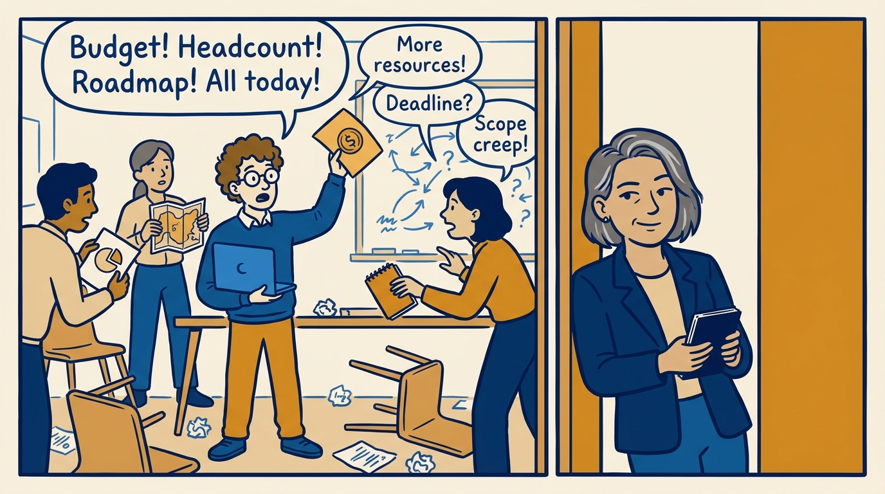
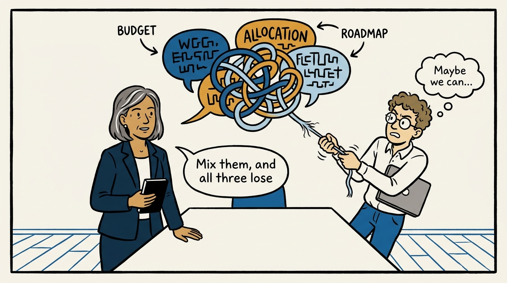
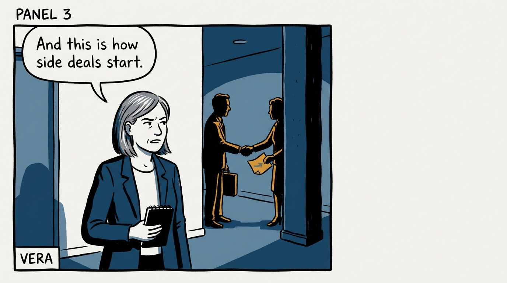
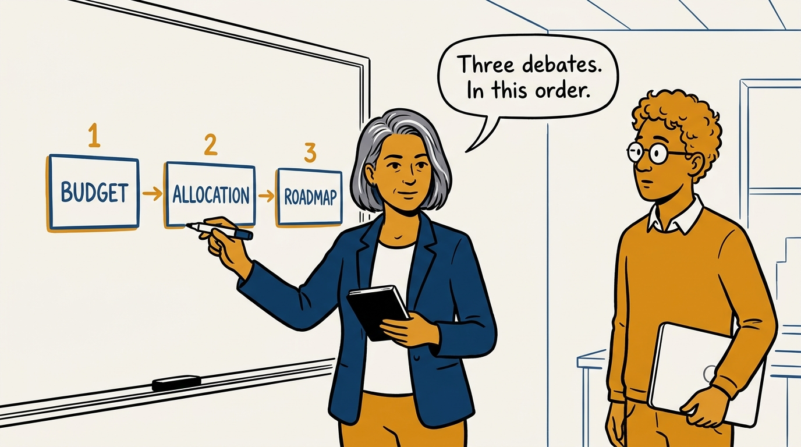
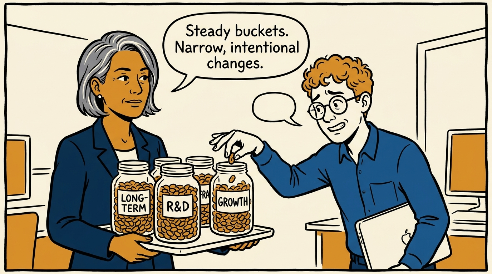
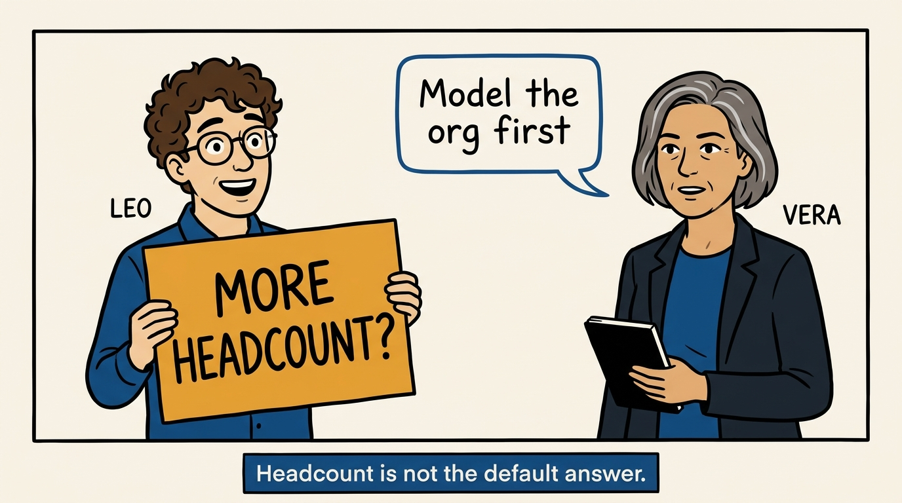
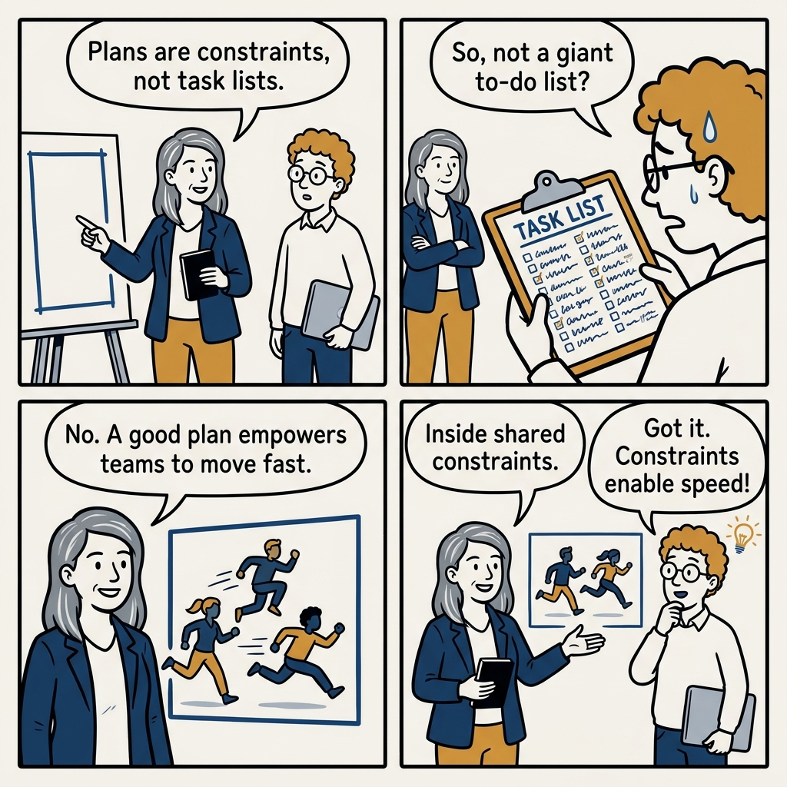

Why I run planning as three separate debates, in strict order — in seven panels.

<!-- comic-style
{
  "cast": "VERA: a calm, seasoned engineering executive, short gray-streaked hair, dark blazer over a plain t-shirt, carries a small black notebook. LEO: an eager young engineering manager, curly hair, round glasses, laptop under one arm.",
  "style": "Clean two-tone explainer comic, thick ink outlines, flat colors with deep blue and amber accents on a light background, generous white space, hand-lettered speech bubbles with SHORT readable text, no photorealism."
}
-->

**Panel 1:** *The hook: planning season — budget, allocation, and roadmap all fighting in one room.*

**Panel 2:** *The problem: every roadmap disagreement reopens the budget, every allocation question becomes a pitch.*

**Panel 3:** *The wrong way: conflicts resolved in hallway side deals instead of open group discussion.*

**Panel 4:** *The principle: sequence the decisions — budget sets the envelope, allocation divides it, the roadmap fills it.*

**Panel 5:** *How it plays out: steady allocation in big buckets beats reactive churn — compounding needs calm.*

**Panel 6:** *The reflex to resist: 'we need more headcount' — asked before modeling the org or checking recruiting capacity.*

**Panel 7:** *The closer: a plan is a shared constraint teams move fast inside — judged by whether it empowers them.*
