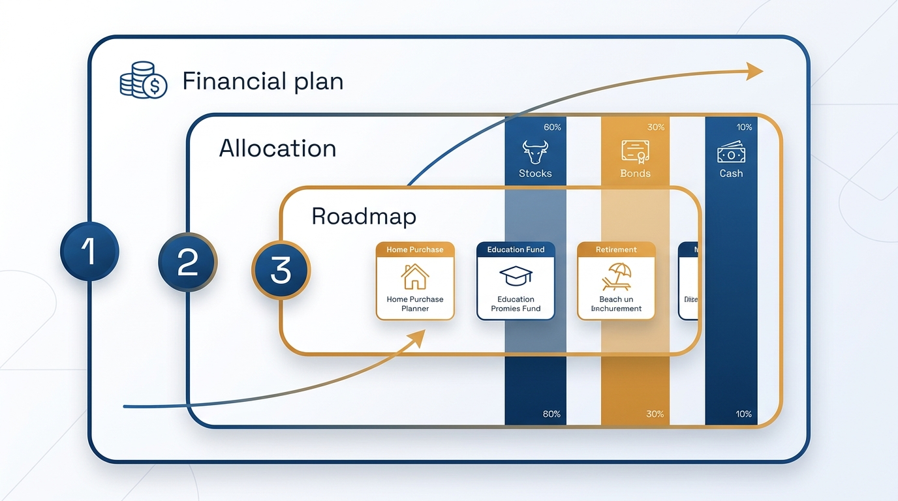
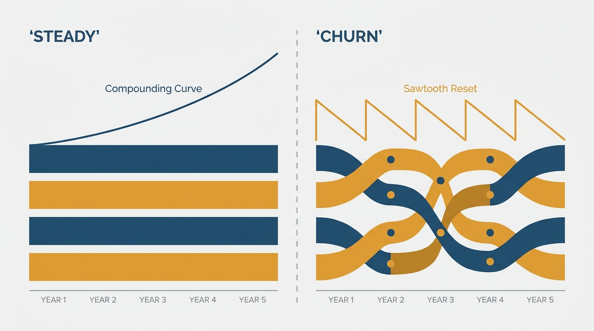
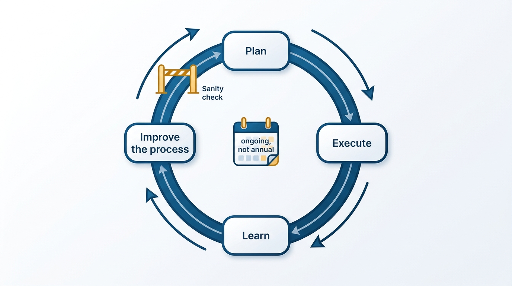

> **Status**: DRAFT
>
> **Principle**: I treat planning as an ongoing, dynamic process — not an annual event — and I sequence it into three deliberately separated phases: establish the financial plan, determine functional portfolio allocation, agree on the roadmap. Debating budget, allocation, and roadmap at once ruins all three debates. I keep allocation steady, prefer durable constraints over flexible ones, emphasize outcomes over micromanaged projects, and judge every cycle by two questions: does this plan empower teams rather than constrain them, and are we improving the system, not just this cycle?

## Statement

My planning practice rests on a small set of commitments:

- **Planning is ongoing, not a season.** The annual budget is prepared before the year starts, functional allocation is reviewed on a rolling basis, quarterly planning happens in the weeks before each quarter — and plans evolve as reality changes.
- **Sequence the decisions.** Financial planning, functional allocation, and roadmap discussions are separate conversations, held in that order. Each phase settles a constraint the next one works within.
- **Prefer durable constraints.** A steady allocation with intentional, narrow changes beats reactive churn; large buckets beat tiny slices; and I avoid overreacting to early results.
- **Emphasize outcomes, not projects.** Executives own trade-offs and outcomes; teams retain autonomy over implementation details. Planning that generates volumes of new, unscoped work — or micromanaged task lists — has failed.
- **Improve the system each cycle.** Planning stays time-boxed, and every year the process itself gets better.

**Figure 1:** *The sequence: each phase settles a constraint the next one works within — budget, then allocation, then roadmap.*

## How to Read This

This record tells my leadership team and peer executives which debate belongs to which phase — so a roadmap conversation does not silently reopen the budget, and a budget conversation does not silently rewrite the roadmap. It is a vision of how I plan, not a planning-process manual. The working checklist — the concrete moves in each phase, the pitfalls, and the final sanity check — lives in the **Checklist** tab of this post.

## Rationale

**Mixing the debates ruins all three.** Budget, allocation, and roadmap are different decisions with different participants and different cadences. When they are debated at once, every roadmap disagreement becomes a budget renegotiation, every allocation question becomes a project pitch, and conflicts get resolved in 1:1 side deals instead of open group discussion. Sequencing fixes this: the financial plan sets the envelope, allocation divides it into steady portfolios, and the roadmap fills the portfolios with outcomes. Coupling roadmap changes directly to budget shifts is how side deals start — I keep them decoupled.

**Steady allocation beats reactive churn.** Allocation is a long-term investment posture — infrastructure, developer experience, product, cross-functional work, and an explicit, long-running budget for validating new ideas. Changing it every time an early result disappoints destroys the compounding those investments need. So I keep allocation fairly steady, make changes narrowly and intentionally, and update it as impact data improves — not as enthusiasm fluctuates. This is also where measurement earns its keep: the impact data that feeds allocation comes from [[measuring-engineering-organizations]].

**Figure 2:** *Steady allocation lets long-term investments compound; reactive churn keeps resetting them.*

**Headcount is not the universal answer.** Before requesting additional headcount I model the org structure that would absorb it and compare the hiring plan against historical recruiting capacity. Velocity discussions that default to "we need more headcount" skip the harder questions — whether expenses are growing faster than revenue in some business lines, and what hypotheses would improve the underperforming segments.

**Plans exist to empower teams.** The point of a plan is a shared set of constraints inside which teams can move fast, not a detailed task list that removes their judgment. Outcomes come first, projects second; teams keep the flexibility to adjust implementation details. A planning process that disempowers teams produces compliance, not commitment.

## What This Means in Practice

| What this principle says | What it does **not** say |
| --- | --- |
| Sequence budget → allocation → roadmap. | The phases never interact — each settles the constraints the next works within. |
| Keep allocation steady; change narrowly and intentionally. | Never update allocation — it moves as impact data improves. |
| Prefer durable constraints over flexible ones. | Plans are fixed — they evolve as reality changes; the process is ongoing. |
| Emphasize outcomes; teams own implementation. | Executives stay out of trade-offs — a clear executive sponsor owns them. |
| Keep planning time-boxed and improve it yearly. | Planning is a yearly checkbox — a plan nobody references afterward is a failed plan. |

Before finalizing any plan, I run the sanity check: are financial constraints clear and stable, is the engineering allocation explicit and steady, is the roadmap aligned with both company goals and real capacity, have we avoided mixing the three debates, does the plan empower teams, and are we improving the system — not just this cycle?

**Figure 3:** *Planning as a loop, not a season: every cycle passes the sanity check and leaves the process itself better.*

## Anti-Patterns

- **Planning as checkbox ritual.** A plan that is never referenced after planning season ends, judged by the polish of its formatting rather than the quality of its decisions, with no executive sponsor owning the trade-offs.
- **"We need more headcount."** The default answer to every velocity discussion — offered before modeling the org structure, checking historical recruiting capacity, or asking whether the least efficient teams are being disproportionately rewarded.
- **Shiny project bias.** A roadmap centered on what executives find most interesting, while compliance, security, reliability, and functional responsibilities quietly starve.
- **Idea-generation season.** Treating planning as the annual invitation to invent new work, generating large volumes of unscoped projects that crowd out functional priorities.
- **Side-deal roadmapping.** Resolving conflicts in 1:1 conversations instead of open group discussion, and letting roadmap changes silently reopen budget decisions.
- **Over-planned task lists.** Detailed project plans that strip teams of autonomy in execution decisions — correct on paper, disempowering in practice.

## Related Records

- [[engineering-strategy]] — the long-term direction planning resources; strategy sets the direction, planning sequences the investment.
- [[measuring-engineering-organizations]] — the impact data that feeds allocation reviews and roadmap validation.
- [[working-with-your-ceo-peers-and-engineering]] — the Finance, Product, and CEO relationships each planning phase depends on.
- [[run-engineering-processes]] — planning is itself an engineering process: clearly owned, time-boxed, and improved each cycle.

## Scope and Revisiting

This principle governs how I run budgeting, allocation, and roadmapping for an engineering organization; the phase boundaries matter more than any specific calendar. I revisit it at the end of every annual cycle — what the sanity check caught, which pitfalls appeared anyway — and whenever the company's financial posture changes sharply enough to reopen the constraints mid-year.

## Authoritative References

- Will Larson, *The Engineering Executive's Primer* (O'Reilly, 2024) — the "Planning" chapter this record's checklist distills; the principle above is my operating commitment to it.
- Will Larson, [How to plan as an engineering executive](https://lethain.com/planning/) — the freely available companion essay.
