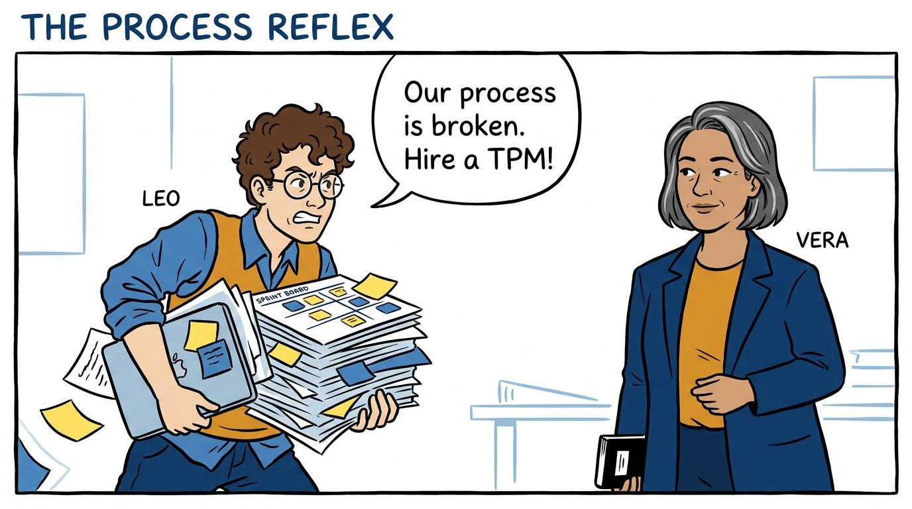
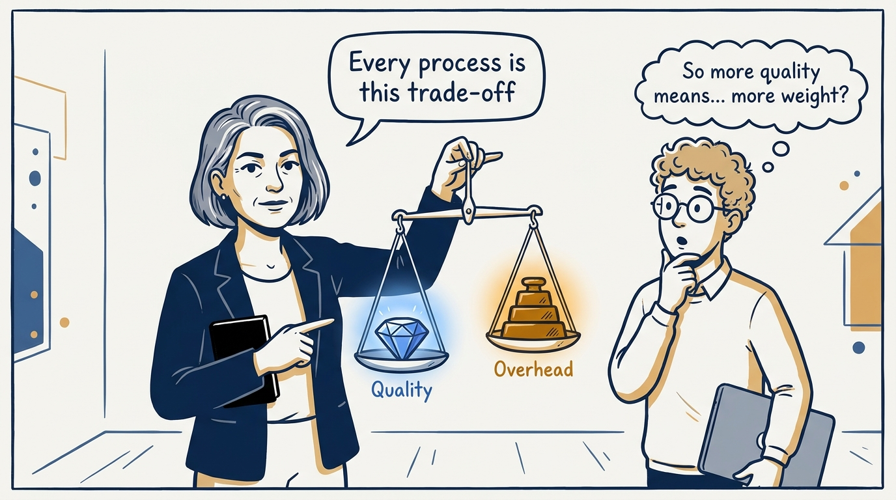
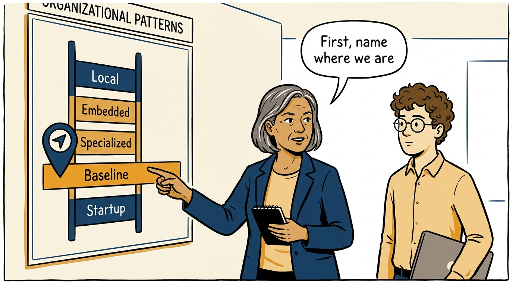
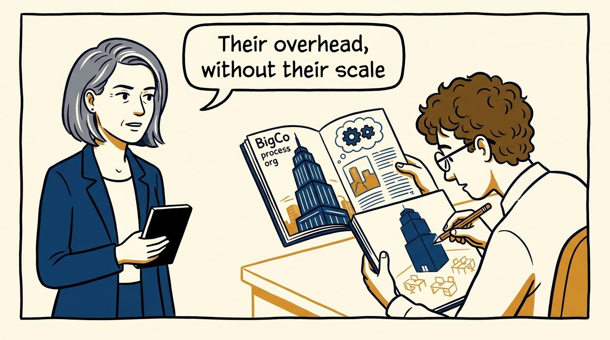
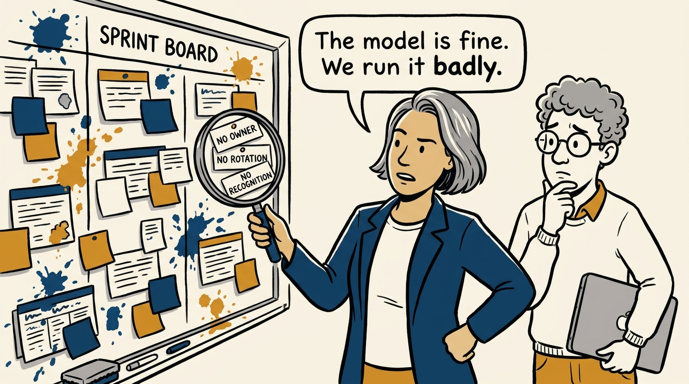
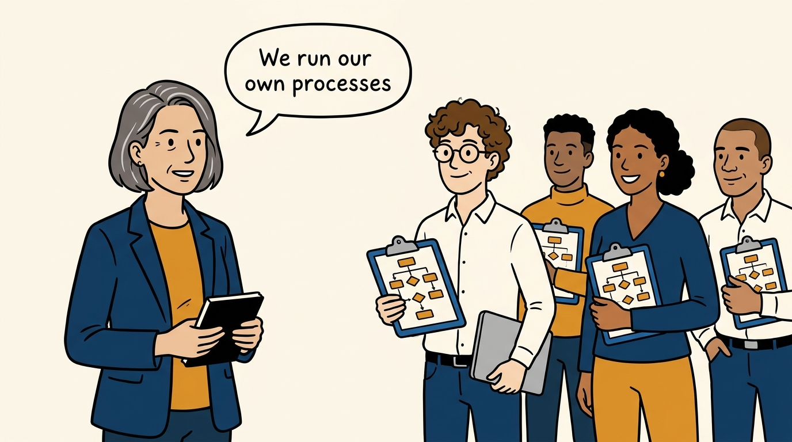
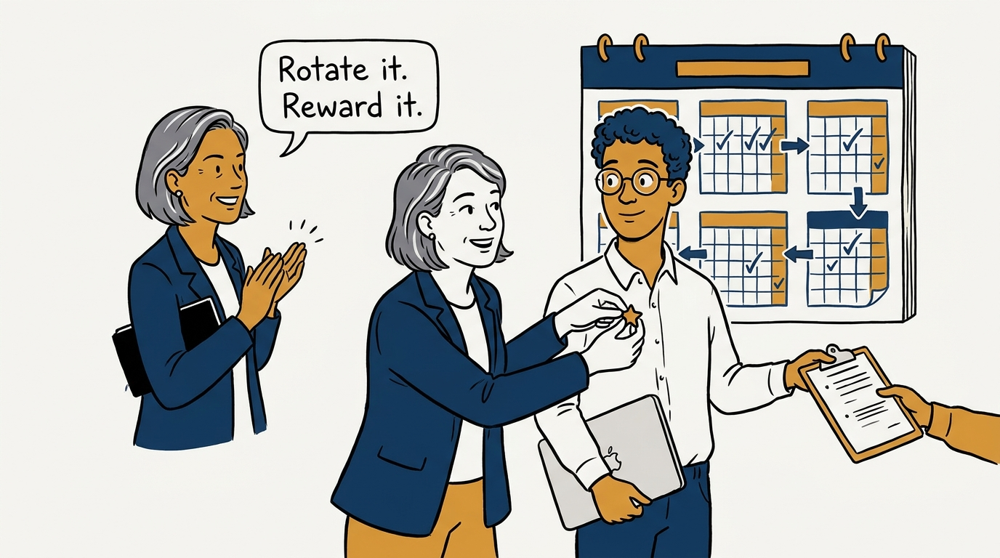
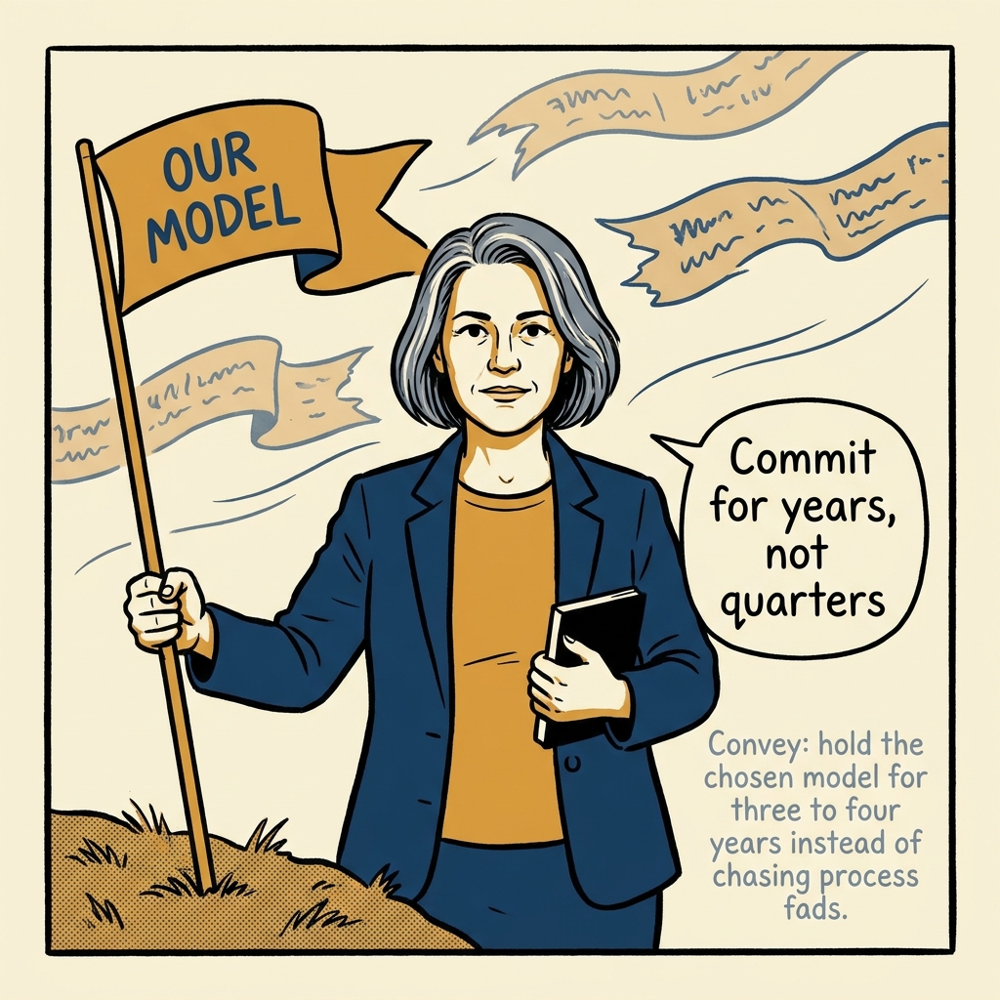

Who should run engineering processes? Usually: we should — in eight panels.

<!-- comic-style
{
  "cast": "VERA: a calm, seasoned engineering executive, short gray-streaked hair, dark blazer over a plain t-shirt, carries a small black notebook. LEO: an eager young engineering manager, curly hair, round glasses, laptop under one arm.",
  "style": "Clean two-tone explainer comic, thick ink outlines, flat colors with deep blue and amber accents on a light background, generous white space, hand-lettered speech bubbles with SHORT readable text, no photorealism."
}
-->

**Panel 1:** *The hook: a struggling process, and the reflex answer — hire a specialist.*

**Panel 2:** *The frame: every process trades quality against overhead — and must be worth its cost.*

**Panel 3:** *The first move: name the pattern you are actually in before proposing a new one.*

**Panel 4:** *The wrong way: cargo-culting a company ten times your size.*

**Panel 5:** *The diagnosis: is the model truly failing, or are we under-executing within it? Usually the latter.*

**Panel 6:** *The principle: default to baseline — engineers and managers run engineering-scoped processes themselves.*

**Panel 7:** *What makes it durable: rotations, overlapping handoffs, and process work that visibly counts.*

**Panel 8:** *The closer: ground the model in beliefs, commit for three to four years, and change intentionally — never fashionably.*
