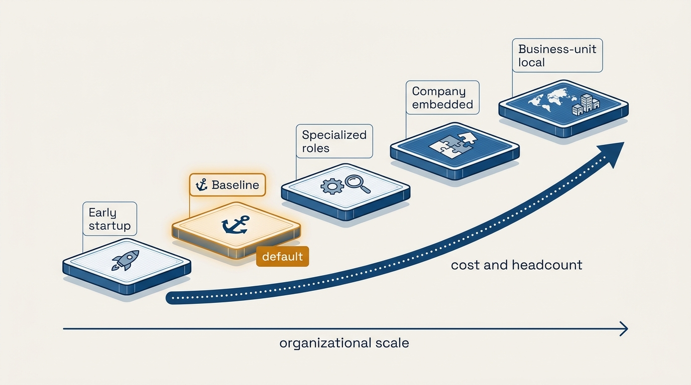
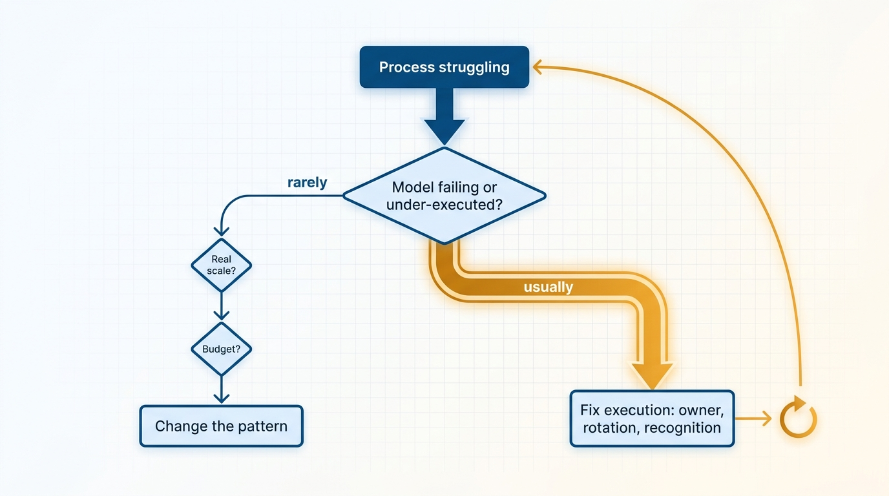
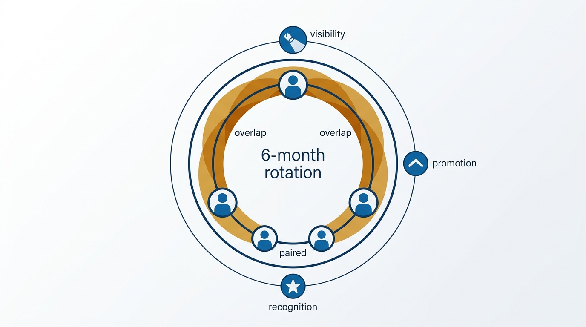

> **Status**: DRAFT
>
> **Principle**: Every process is a trade-off between quality and overhead, so before changing who runs engineering processes I first identify which organizational pattern we are actually in — early startup, baseline, specialized roles, company embedded, or business-unit local. My default is baseline: engineers and managers running engineering-scoped processes themselves. When a process struggles, my first question is whether the model is truly failing or we are under-executing within it — and the answer is usually under-execution. I make process ownership sustainable and valued, check the budget reality before moving up the cost curve, and commit to a model for three to four years rather than chasing process fads. I leave baseline only when scale clearly demands it.

## Statement

My commitments on who runs engineering processes:

- **Philosophy first.** Every process trades quality against overhead. I decide how much process sophistication the organization can realistically sustain, avoid over-optimizing for perfection at the expense of usability, and insist that each process is worth its operational cost.
- **Name the current pattern.** Early startup (founders run processes directly), baseline (centralized functions run company-scoped processes; engineers and managers run engineering-scoped ones), specialized engineering roles (dedicated EngOps/TPM headcount), company embedded (dedicated Engineering partners inside Recruiting, People, Finance), or business-unit local. Each has real pros and real costs; I evaluate the one we are in before proposing another.
- **Default to baseline and make it work.** Below roughly a hundred engineers I reconsider specialized roles very carefully. Within baseline I make ownership sustainable — six-month rotations, overlapping transitions, pairing on key roles — and valued: exposure to strategic discussions, ties to promotion criteria, public recognition.
- **Check the budget reality.** Moving up the pattern curve costs headcount. I only propose it during growth phases, with clarity on whose budget absorbs the roles and readiness for cross-executive pushback.
- **Hold the model.** Ground processes in a clear set of beliefs, commit for 3–4 years, and change intentionally — never reactively, never because a trend demands it.

**Figure 1:** *The five patterns on the cost curve: name where you are, default to baseline, and move up only when scale demands it.*

## How to Read This

This record tells engineering leaders in my organization why I will usually answer "who should run this process?" with "we should" — and tells peer executives and Finance why I argue against premature specialized process headcount. It is a vision of how I choose the pattern, not an EngOps hiring plan for any specific company. The working checklist — pattern identification, the baseline playbook, the budget reality check, and the final decision filter — lives in the **Checklist** tab of this post.

## Rationale

**Specialized roles too early ossify processes.** A dedicated process specialist brings expertise and efficiency — and an incentive problem: specialists are incentivized to improve processes, not to eliminate them. Processes acquire owners whose role depends on the process existing, overhead compounds, and the organization loses the healthy instinct to ask whether a process should exist at all. Engineers and managers who run their own processes keep that instinct, and process ownership doubles as leadership development — which is why I encourage engineers to serve in process roles before moving into Staff+ or management.

**Under-execution is usually the real problem.** When a process performs badly, the tempting diagnosis is structural: we need a different model, a dedicated role, a new framework. The more common truth is that the current model is run poorly — ownerless, unrotated, unrecognized. So my decision filter asks first: is the model truly failing, or are we under-executing within it? Are we solving a real scale problem, or reacting to a perceived sophistication gap compared to much larger companies? Improving execution is almost always cheaper than changing structure, and it reveals whether a structural change is actually needed.

**Figure 2:** *The decision filter: fix execution within the pattern first — structural change waits for real scale and a budget reality check.*

**Sustainability and status are what make baseline durable.** Baseline fails when process work is treated as a career dead-end dumped on whoever objects least. I prevent that deliberately: ownership rotates on a schedule, transitions overlap to preserve continuity, key roles are paired, process owners are exposed to strategic discussions, the work counts toward promotion, and contributors are publicly recognized. Valued work gets done well; invisible work decays.

**Figure 3:** *What keeps baseline durable: scheduled rotation, overlapping handoffs, pairing — and ownership that visibly counts.*

**Models need years, not quarters.** Process fads — Agile extremes, management pendulum swings — offer perpetual reasons to reorganize how work is run. Every switch resets learning curves and burns credibility. Grounding processes in a clear set of beliefs and committing to a model for 3–4 years lets the organization get good at it — and makes an eventual intentional change meaningful instead of merely fashionable.

## What This Means in Practice

| What this principle says | What it does **not** say |
| --- | --- |
| Default to baseline; engineers and managers run their own processes. | Baseline is forever — scale can genuinely demand specialized roles. |
| Improve execution before changing structure. | Tolerate failing processes — under-execution gets fixed, deliberately. |
| Reconsider specialized roles carefully below ~100 engineers. | Never hire a TPM — the bar is scale-driven need, not headcount vanity. |
| Commit to a model for 3–4 years. | Never adjust — changes are made intentionally, not reactively. |
| Check the budget reality before moving up the cost curve. | Process quality is Finance's decision — the trade-off analysis is mine to own. |

## Anti-Patterns

- **Cargo-culting the big company.** Copying the process structure of an organization ten times our size because it looks sophisticated — importing its overhead without its scale.
- **The premature specialist.** Hiring dedicated process roles at a size where engineers and managers could run the processes themselves — and creating specialists incentivized to improve processes rather than eliminate them.
- **Process fad chasing.** Reorganizing how work runs every time a new methodology trends, resetting the organization's learning curve each time.
- **Invisible process work.** Assigning process ownership with no rotation, no recognition, and no promotion relevance — then acting surprised when the process decays and the owner burns out.
- **Structure as the answer to execution.** Responding to a poorly run process with a reorg or a new role instead of first fixing ownership, cadence, and accountability within the current pattern.
- **Cost-curve climbing in a downturn.** Proposing new specialized process headcount while the company is in cost-reduction mode, without knowing whose budget absorbs it.

## Related Records

- [[meetings]] — the recurring sessions many of these processes run through; that record covers the portfolio, this one covers who owns it.
- [[calibrating-your-standards]] — what "good" looks like inside a process; this record decides who is responsible for reaching it.
- [[engineering-onboarding]] — a canonical engineering-scoped process that baseline puts in the hands of engineers and managers.
- [[inspected-trust]] — rotated, delegated process ownership works because delegation comes with inspection, not blind trust.

## Scope and Revisiting

This principle governs how I assign ownership of engineering processes in any organization I lead. The commitment horizon is explicit: hold the chosen model for 3–4 years, revisiting earlier only if the final decision filter shows the model truly failing at real scale — not merely under-executed — and the budget reality supports a change.

## Authoritative References

- Will Larson, *The Engineering Executive's Primer* (O'Reilly, 2024) — the engineering-processes chapter this record's checklist distills; the principle above is my operating commitment to it.
- Will Larson, [Who runs Engineering processes?](https://lethain.com/who-runs-eng-process/) — the freely available companion essay.
