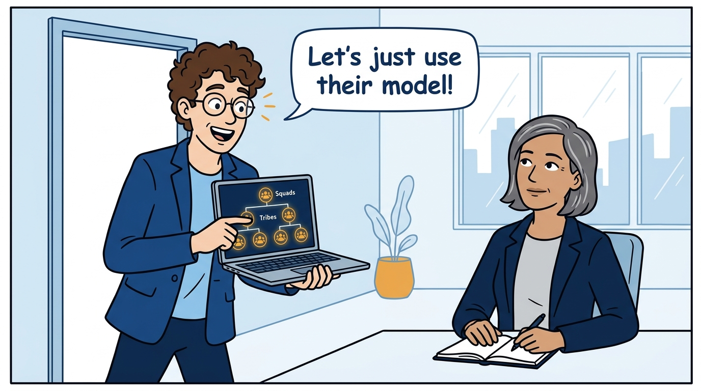
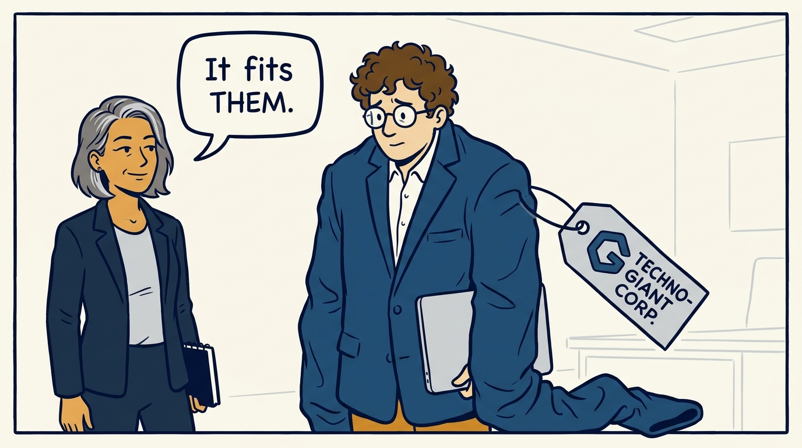
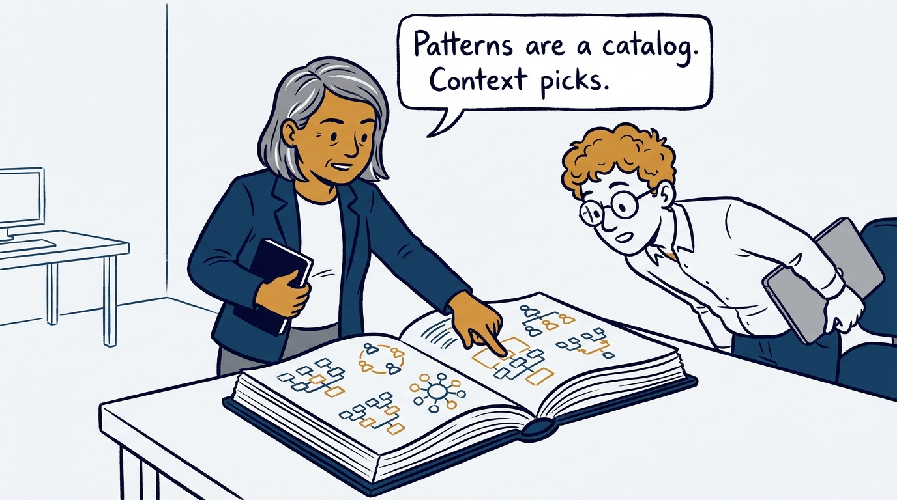
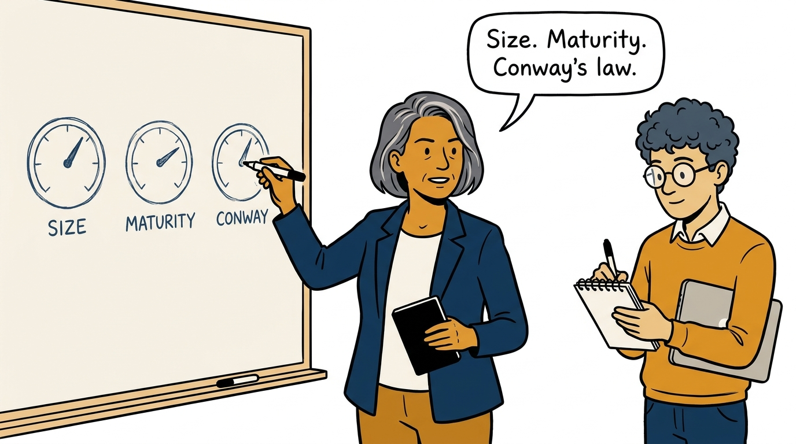
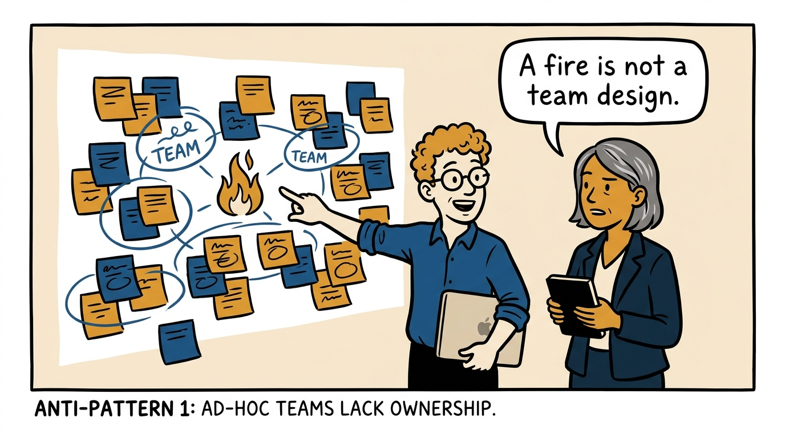
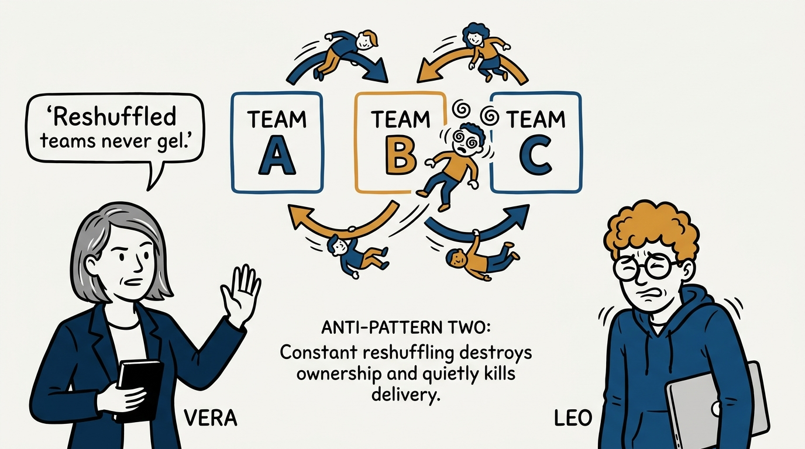
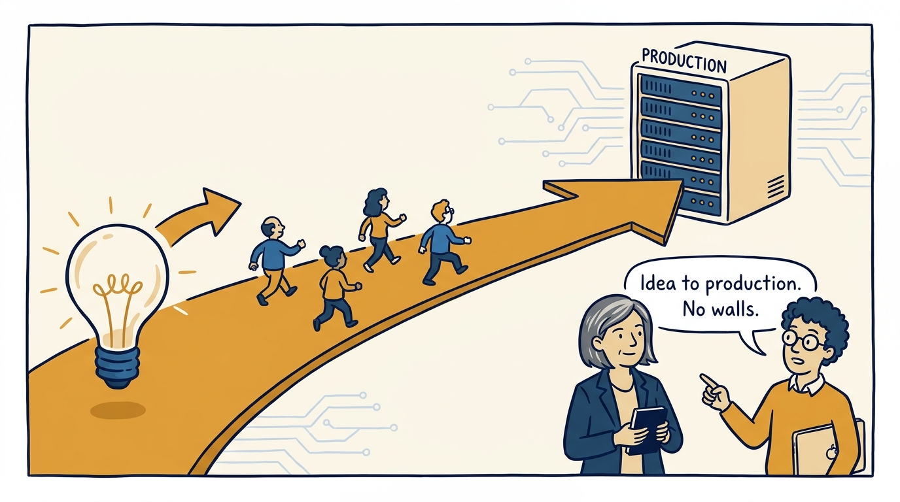
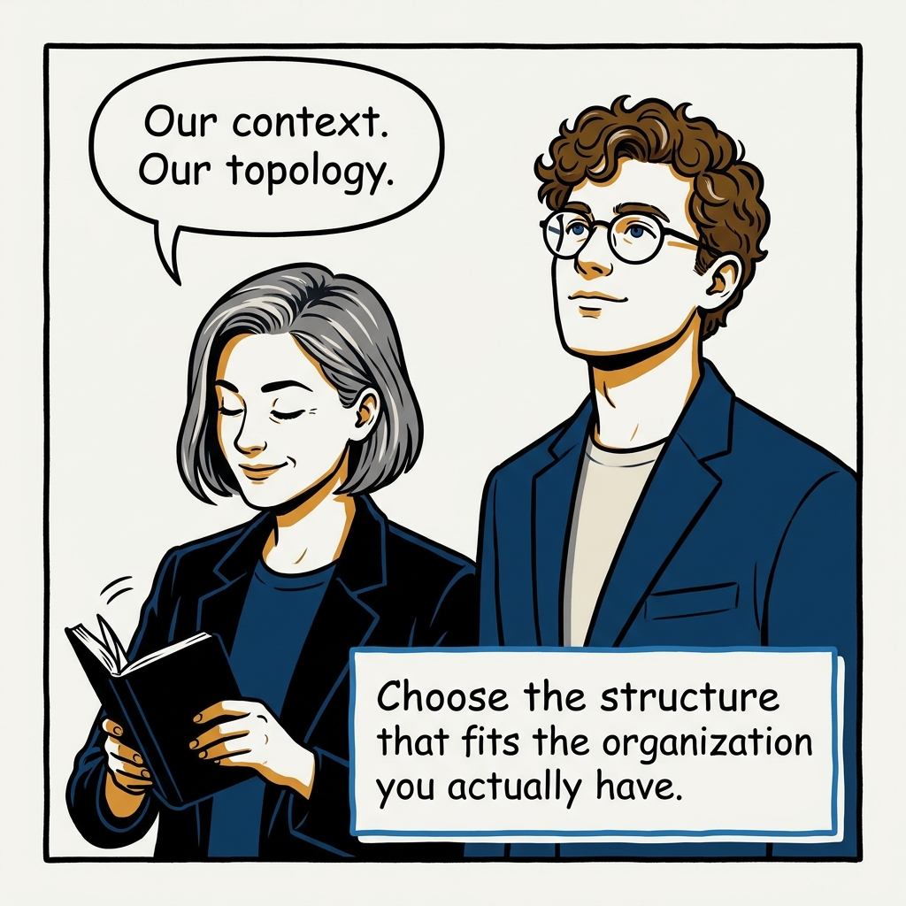

Patterns are a catalog, context is the selector — why copying a famous company's team model fails, in eight panels.

<!-- comic-style
{
  "cast": "VERA: a calm, seasoned engineering executive, short gray-streaked hair, dark blazer over a plain t-shirt, carries a small black notebook. LEO: an eager young engineering manager, curly hair, round glasses, laptop under one arm.",
  "style": "Clean two-tone explainer comic, thick ink outlines, flat colors with deep blue and amber accents on a light background, generous white space, hand-lettered speech bubbles with SHORT readable text, no photorealism."
}
-->

**Panel 1:** *The hook: if it worked for them, it will work for us — right?*

**Panel 2:** *The problem: the model fits the company it grew in — context does not copy.*

**Panel 3:** *The principle: patterns are a catalog, context is the selector.*

**Panel 4:** *The test: judge every pattern against size, maturity, and Conway's law.*

**Panel 5:** *Anti-pattern one: ad-hoc teams assembled around whatever is on fire.*

**Panel 6:** *Anti-pattern two: constant reshuffling — no team ever gels, ownership becomes fiction.*

**Panel 7:** *The payoff: long-lived teams, aligned to a stream, flowing idea to production without handoffs.*

**Panel 8:** *The closer: not their model — the topology that fits us.*
