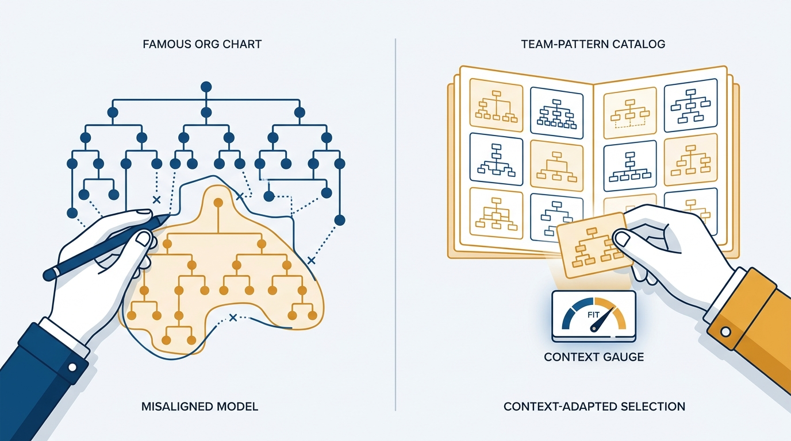
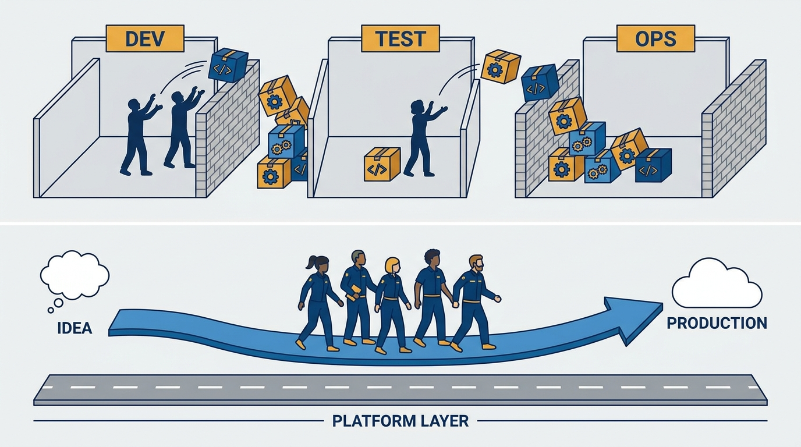
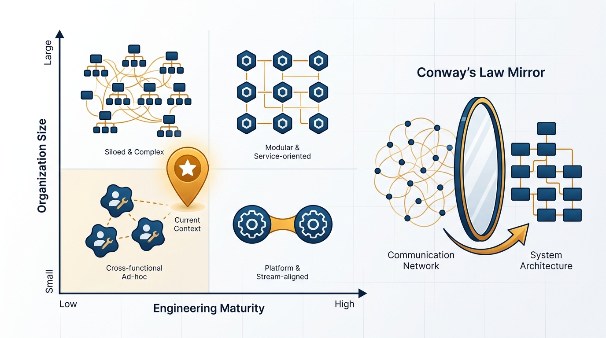

> **Status**: DRAFT
>
> **Principle**: I choose team structures from known patterns judged against our context — organization size, software scale, engineering and cultural maturity, and Conway's law — never by copying another company's model. Patterns are a catalog; context is the selector. I design teams intentionally, keep them long-lived and aligned to value streams, and organize them for flow of change rather than local efficiency. And I treat ad-hoc team design and constant reshuffling as the two anti-patterns that quietly destroy delivery.

## Statement

My operating model for choosing team structures has five parts:

- **Design intentionally, never ad hoc.** Teams are long-lived, stable, and aligned to business domains or value streams — not reactions to short-term problems or project groupings that disband after delivery.
- **Optimize for flow of change.** Work moves from idea to production with minimal handoffs; teams feel fast feedback from live systems. Fast, safe change beats local team efficiency.
- **Select from the catalog, judge by context.** Known topologies — stream-aligned product teams, platform teams, feature teams, SRE — are options, not prescriptions. Size, maturity, and Conway's law decide which fits *our current context*, not an ideal future state.
- **Make conditional patterns earn their preconditions.** Feature teams require high engineering maturity and trust; SRE requires scale that justifies it; product teams require a self-service support system.
- **Manage dependencies and silos deliberately.** I track dependencies between teams, decide which to remove and which to accept, and make specialized teams enablers rather than blockers.

**Figure 1:** *Patterns are a catalog, context is the selector: another company's model traced onto a differently-shaped organization does not fit.*

## How to Read This

This is an **appendix record**: unlike the core records in this journal, grounded in Will Larson's *The Engineering Executive's Primer*, this one is grounded in Matthew Skelton and Manuel Pais's *Team Topologies* — read here through an executive lens, complementing the Primer-grounded records. The book catalogs team patterns observed across many organizations; I read it as the executive deciding which pattern my organization gets — and which fashionable pattern it does not. If you lead teams here, this record explains why I ask "what is our context?" before any structural proposal, and why "company X does it this way" is never, by itself, an argument. The working checklist — all eleven sections — lives in the **Checklist** tab of this post.

## Rationale

**Copied models fail because context does not copy.** The famous topologies — Spotify's squads and tribes most of all — were answers to one company's size, maturity, culture, and constraints at one moment in time. Importing the org chart imports none of those. Skelton and Pais are blunt: there is no single "best" topology, and the anti-pattern is not any specific structure but adopting one without considering your own context. So every structural proposal must answer four questions first: how big are we and our software, how mature is our engineering discipline (automation, testing, deployment, monitoring), how mature is our culture, and what does Conway's law say our communication structure will do to the design? The topology that fits our *current* context wins — not the one that fits the organization we hope to be.

**Ad-hoc design and constant reshuffling are the quiet killers.** Neither shows up in an incident review, which is why both survive. A team assembled reactively around a short-term problem inherits no domain, no ownership, and no reason to invest in the code it touches. A team reshuffled every quarter never gels and learns that ownership is temporary — so it behaves accordingly. Long-lived teams aligned to business domains or value streams are the unit of ownership; everything else in this record assumes them.

**Flow of change is the objective function.** I organize teams so that work moves from idea to production with minimal handoffs, wait times shrink between development, testing, operations, and business-as-usual work, and delivery teams feel production directly — operational and customer signals both. The classic failure modes are all handoff shapes: work thrown over the wall between Dev, Test, and Ops; a separate "DevOps team" that becomes one more silo in the middle; routine delivery blocked on scarce specialist teams. A specialized team's job is to enable other teams through self-service, not to do the work for them.

**Figure 2:** *Organize for flow of change: minimal handoffs and a self-service platform beat locally efficient silos passing work over walls.*

**Conditional patterns are conditional.** The catalog's strongest patterns come with preconditions, and skipping them turns the pattern into its own anti-pattern. Stream-aligned product teams work when they can design, build, test, deploy, and operate their software, with non-blocking dependencies on infrastructure, QA, networking, and operations — which requires a support system of self-service platform capabilities around them. Feature teams work when engineering maturity is high, trust is sufficient to change shared code safely, and ownership boundaries are explicit — without that, they generate technical debt and erode trust. SRE works where scale and reliability needs justify it, with real coding and automation skill, defined SLOs and error budgets, and a relationship with application teams that stays dynamic — including handing operational responsibility back when appropriate. I invest in the preconditions before I adopt the pattern.

**Dependencies are a budget, not background noise.** Between teams I look for knowledge, task, and resource dependencies; I keep them visible, decide which to remove and which to accept and manage, and review the counts before they grow unchecked. Splitting responsibilities to reduce bottlenecks, letting teams own more of their delivery lifecycle, and designing shared services for low friction are all the same move: team interactions that improve flow rather than reinforce silos.

**Static is a snapshot, not a promise.** Even the right topology is right *for now*. Topology decisions get revisited as maturity, scale, and business needs change; temporary structures are stepping stones, never permanent silos. This record covers choosing the pattern; [[evolve-team-structures]] covers changing it — deliberately, which is the opposite of the constant reshuffling this record forbids.

**Figure 3:** *Judge by context: size, maturity, and Conway's law decide which topology fits — and the pin sits on the organization you have, not the one you want.*

## What This Means in Practice

| What this principle says | What it does **not** say |
| --- | --- |
| Choose from known patterns, judged against our context. | Invent nothing; the catalog is a straitjacket. |
| "Company X does it this way" is data, never an argument. | Other companies' experience is worthless. |
| Teams are long-lived and stable by default. | Structures are frozen forever — evolution is deliberate, not banned. |
| Feature teams, SRE, and embedded ops must earn their preconditions. | These patterns are bad — they are conditional. |
| Specialized teams enable through self-service. | Specialists disappear; platforms do everyone's work for them. |
| Dependencies are tracked and budgeted. | All dependencies are removed — some are accepted and managed. |

Concretely: every structural proposal that reaches me names the pattern it applies, the context evidence that it fits, and the anti-pattern it risks becoming. Proposals justified mainly by another company's example go back for a context assessment. Before I approve a feature-team or SRE adoption, I ask for precondition evidence — maturity, trust, ownership boundaries, SLOs — not aspiration.

## Anti-Patterns

- **The Spotify cargo cult.** Copying a famous company's model without considering our own size, maturity, and culture.
- **Ad-hoc team design.** Teams formed reactively around whatever is on fire — no domain, no ownership, no expected lifespan.
- **Constant reshuffling.** Rotating people so often that no team ever gels and ownership becomes a fiction.
- **Over-the-wall handoffs.** Dev, Test, Ops, and BAU passing work between silos — locally efficient, collectively slow.
- **The DevOps silo.** A separate DevOps team that becomes exactly the kind of silo it was meant to dissolve.
- **The specialist bottleneck.** Routine delivery queued behind scarce specialist teams instead of enabled through self-service.
- **Premature patterns.** Feature teams without the maturity and trust to change shared code safely; SRE without the scale to justify it.
- **The ideal-state topology.** Choosing the structure that fits the organization we aspire to be, instead of the one we are.

## Related Records

- [[organizational-design]] — appendix sibling; that record governs team sizing and investment sequencing, this one which shapes to pick.
- [[four-fundamental-team-topologies]] — appendix sibling; the four canonical team types this record's wider catalog narrows into.
- [[team-interaction-modes]] — appendix sibling; how the chosen teams collaborate.
- [[evolve-team-structures]] — appendix sibling; how topologies change deliberately over time.

## Scope and Revisiting

This principle governs how I evaluate and choose team structures across my organization. I revisit it whenever a structural proposal reaches my desk, whenever our size or maturity shifts enough to change the context-fit judgment, and whenever I catch a copied model — including one of ours — applied somewhere its context does not hold.

## Authoritative References

- Matthew Skelton & Manuel Pais, *Team Topologies: Organizing Business and Technology Teams for Fast Flow* (IT Revolution Press, 2019) — the static-topologies chapters this record's checklist distills.
- The authors maintain further materials, patterns, and training resources at [teamtopologies.com](https://teamtopologies.com/).
