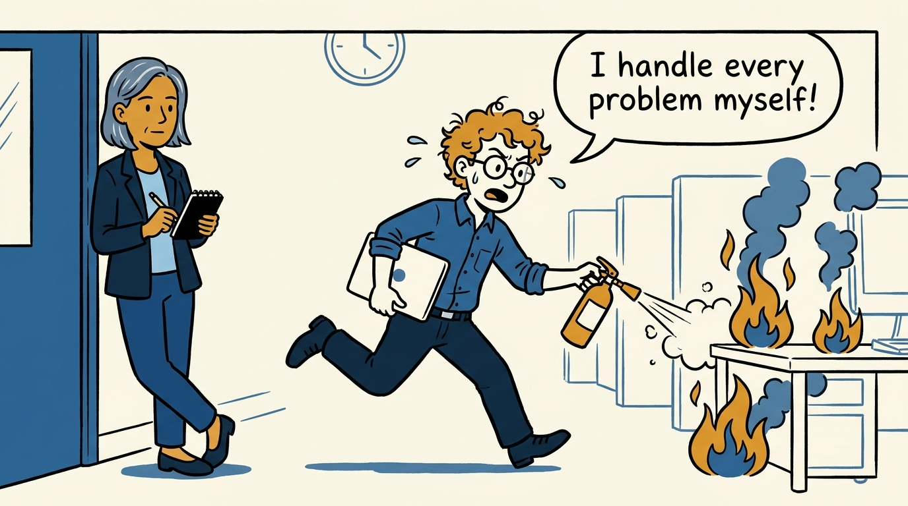
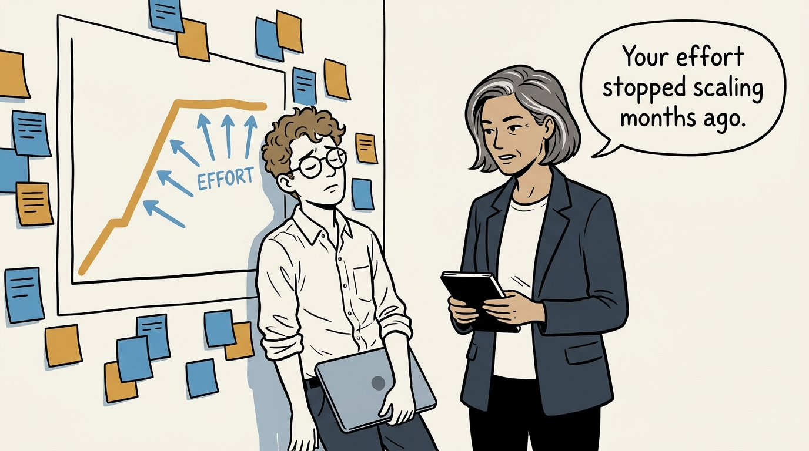
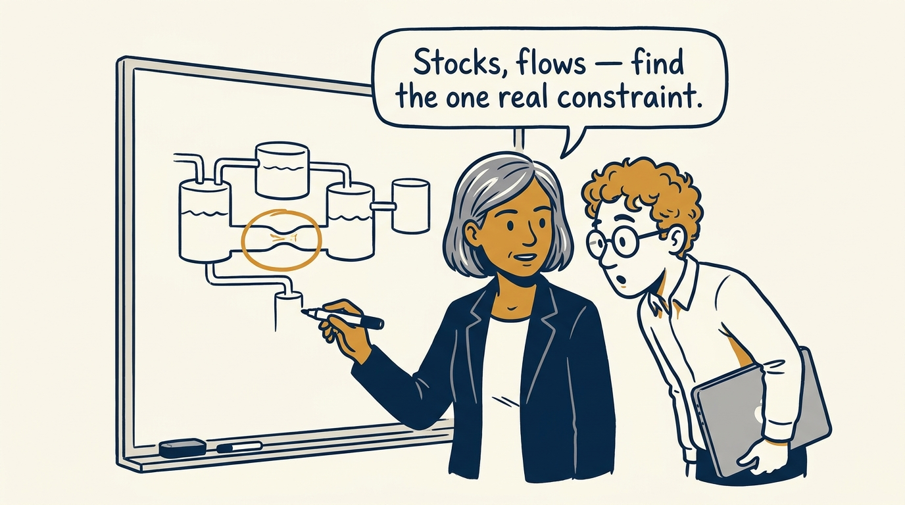
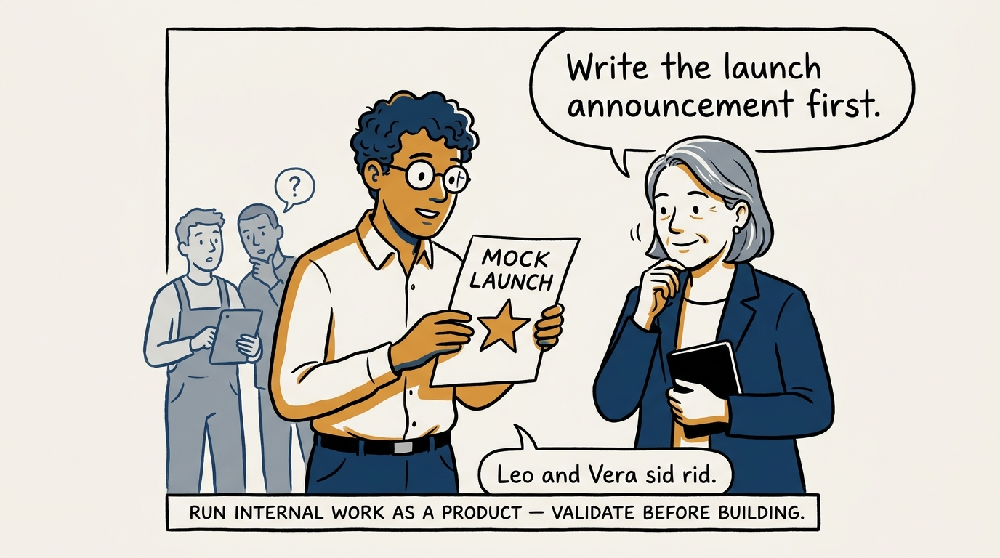
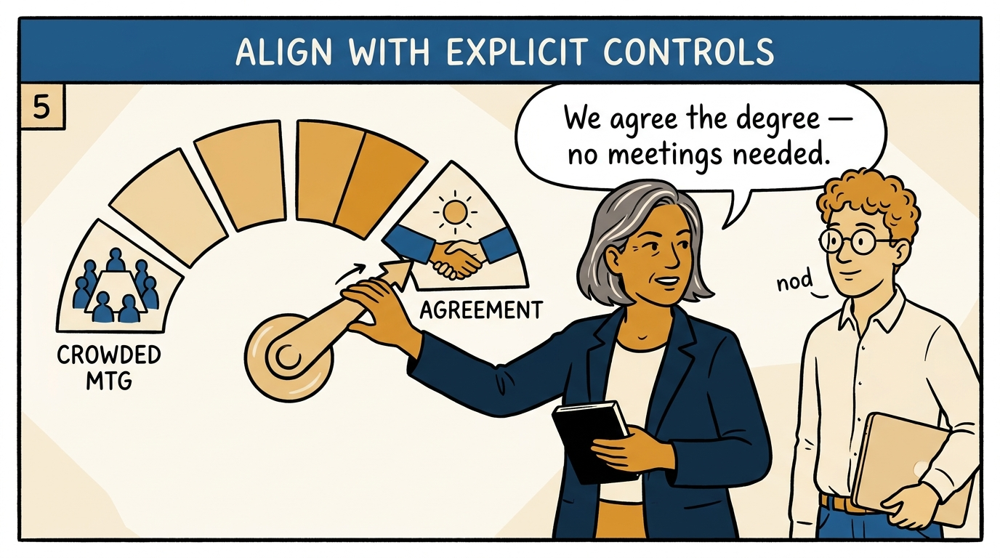
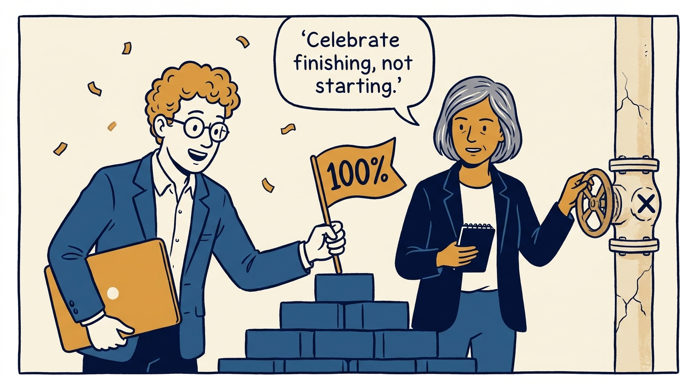
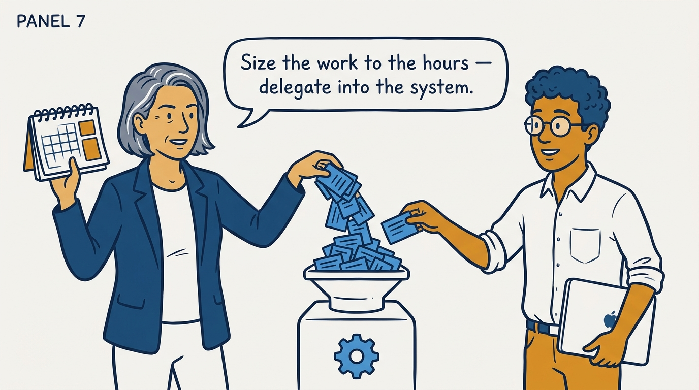
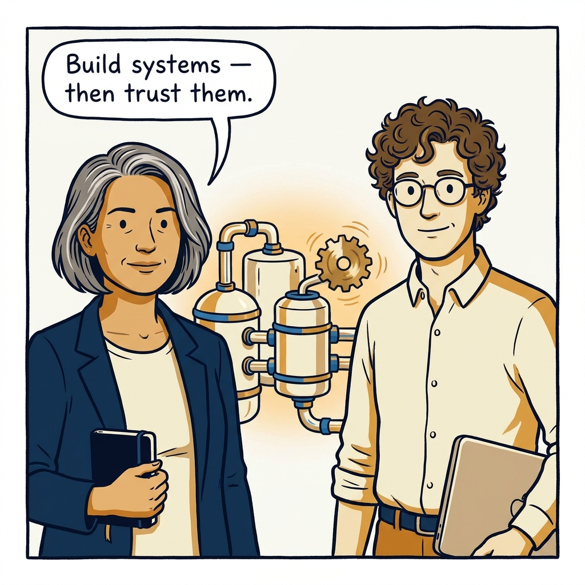

Manage through systems, not heroics — why effort that doesn't scale isn't leadership, in eight panels.

<!-- comic-style
{
  "cast": "VERA: a calm, seasoned engineering executive, short gray-streaked hair, dark blazer over a plain t-shirt, carries a small black notebook. LEO: an eager young engineering manager, curly hair, round glasses, laptop under one arm.",
  "style": "Clean two-tone explainer comic, thick ink outlines, flat colors with deep blue and amber accents on a light background, generous white space, hand-lettered speech bubbles with SHORT readable text, no photorealism."
}
-->

**Panel 1:** *The hook: every problem gets a hero. The same hero.*

**Panel 2:** *The problem: effort doesn't scale. Ever.*

**Panel 3:** *The principle: see the system — and fix the constraint, not the symptom.*

**Panel 4:** *Internal work is a product: discover, select, validate — before building.*

**Panel 5:** *Alignment is a dial, agreed explicitly — from 'I'll do it' to 'let me know'.*

**Panel 6:** *Migrations pay out at the finish line — so finish.*

**Panel 7:** *Time is the scarcest stock: size backward, block focus time, delegate in the system.*

**Panel 8:** *The closer: build the system, then trust the system.*
