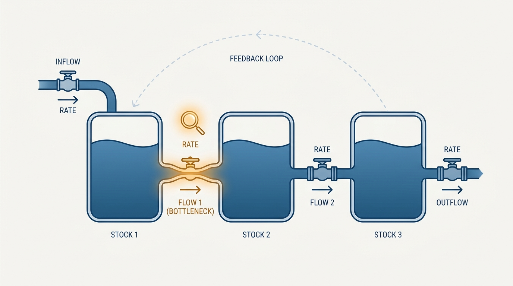
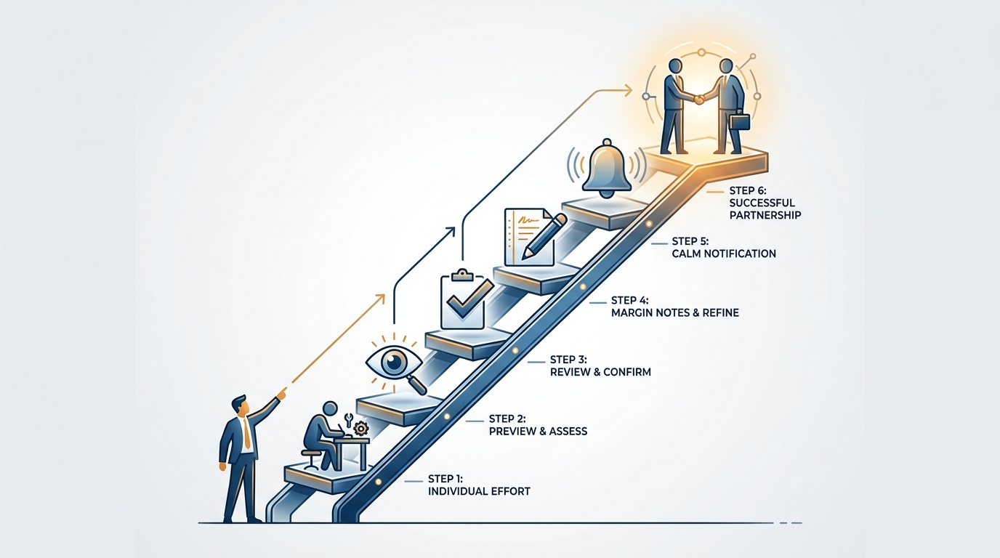
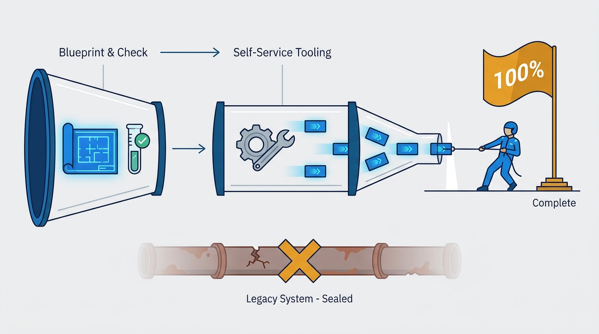

> **Status**: DRAFT
>
> **Principle**: I manage through systems, not heroics. I model management problems as stocks and flows and go after the real constraint, not the loudest symptom. I run internal work as a product — discovering problems, selecting them deliberately, validating solutions cheaply before building. I align my leaders through explicit controls with agreed degrees of alignment, so autonomy is designed rather than assumed. And I protect my own leverage: I size work backward from available time, finish the migrations I start, and delegate work into systems I then trust.

## Statement

The fifteen tools behind this record collapse into four commitments:

- **See the system before touching it.** Every management problem is stocks, flows, and feedback loops. I find the real constraint and refuse to optimize a rate whose downstream stock is already empty. Metrics follow the same discipline: every goal carries a target, a baseline, a trend, and a time frame, with investment goals counterbalanced by baseline goals.
- **Run internal work as a product.** Platform teams, process changes, and migrations have users too. I discover their real problems, select against three horizons — survive this round, survive the next round, win rounds — and validate cheaply: write the launch announcement before building, prefer experiments over analysis, never build the whole thing to validate it.
- **Align with explicit controls, not presence.** Metrics, visions, strategies, organization design, headcount, roadmaps, and performance reviews are my controls — and for each one, each leader and I agree on a degree of alignment, from "I'll do it" through preview, review, and notes, down to "no surprises" and "let me know." Alignment becomes a designed interface instead of an ambient anxiety.
- **Protect time and finish what you start.** I size work backward from the hours actually available and delegate work *in the system* — building the mechanism that handles it, not handing off one task at a time. Migrations get the same discipline: de-risk, enable with self-service tooling, then finish — stop the bleeding, drive to 100%, reserve recognition for completion.

**Figure 1:** *See the system first: stocks, flows, feedback loops — and one real constraint worth fixing.*

## How to Read This

This is an **appendix record**: it is grounded not in *The Engineering Executive's Primer*, like the core records of this journal, but in Will Larson's earlier, manager-focused book *An Elegant Puzzle: Systems of Engineering Management*, read here through an executive lens. The tools it catalogs are things I now mostly *charter and inspect* rather than run hands-on. It complements the Primer-grounded records rather than repeating them: strategy has its own record in [[engineering-strategy]], metrics in [[measuring-engineering-organizations]]; this record places both inside the wider toolbox. The full fifteen-section working checklist lives in the **Checklist** tab of this post.

## Rationale

**Heroics don't scale; systems do.** An executive who fixes problems personally becomes the constraint of their own organization. Modeling a problem as stocks and flows — how fast we hire managers, how fast we train them, where work queues — lets me test a hypothesis before committing an organization to it, and tells me when an intervention is pointless because the bottleneck is elsewhere.

**Internal work fails for product reasons, not engineering reasons.** Most failed platforms and process rollouts were built competently for a problem nobody selected carefully. Treating internal work as a product imports the missing discipline: discover pain points and hidden cohorts, select against explicit horizons, validate before building — the launch announcement written first is the cheapest falsification test I know. Change itself follows the same rule: **model, document, share** beats top-down mandate whenever slow adoption of a great approach is better than fast adoption of a good-enough one.

**Implicit alignment is the expensive kind.** Without explicit controls, alignment is bought with meetings, escalations, and surprise. Naming the controls — and agreeing per leader, per control, on the degree of alignment required — converts that into a cheap, inspectable interface, and gives me an honest micromanagement detector: if I cannot delegate a control to a strong leader at "no surprises," the problem is usually mine. The same explicitness applies to centralized decision groups: authoritative or advisory, decided deliberately, watching the four failure modes — domineering, bottlenecked, status-oriented, inert.

**Figure 2:** *The degrees of alignment: from "I'll do it" to "let me know" — agreed explicitly, per leader, per control.*

**Unfinished migrations are the silent tax.** Migrations are effectively the only way to pay down technical debt at scale, and their value arrives almost entirely at completion — a migration at 80% pays most of its cost and delivers little of its benefit, because the organization still carries both systems. So the executive's job is the *finish*: stop the bleeding so no new work lands on the old path, make the path incremental and self-service, and celebrate completion rather than launch.

**Time is the stock everything else draws from.** Every tool above consumes executive attention, and attention is finite in a way ambition is not. Sizing work backward from available hours, protecting two-hour focus blocks, decoupling meeting attendance from productivity, and hiring before I am overwhelmed keep the rest of this record from being fiction.

**Figure 3:** *Migrations pay out at the end: de-risk, enable, then finish — stop the bleeding and drive to 100%.*

## What This Means in Practice

| What this principle says | What it does **not** say |
| --- | --- |
| I model the system and fix the constraint. | I never act without a model. Some fires you fight first. |
| Internal work is run as a product. | Every internal effort needs a full product process. Cheap validation is the point. |
| Alignment degrees are agreed explicitly per leader and control. | The degree is fixed. It moves as trust and context change. |
| I delegate work into systems and then trust them. | I disengage. The systems I build stay inspected — see [[inspected-trust]]. |
| Migrations are driven to 100% and celebrated at completion. | Every migration must run to the end. Killing a bad one early is also finishing. |
| I size work backward from available time. | Ambition shrinks. The portfolio shrinks; the standard does not. |

In day-to-day terms: before chartering an initiative, I ask which stock or flow it moves and whether that is the constraint. Before funding an internal platform, I ask for the launch announcement and the reference users. When onboarding a new leader, we walk the controls and set an alignment degree for each. Each quarter I run a time retrospective. And when I present up, I start with the conclusion, make an explicit ask, and return to it at the end — prepare a lot, practice a little.

## Anti-Patterns

- **Optimizing the loudest rate.** Speeding up a flow whose downstream stock is already blocked — more hiring into an organization that cannot onboard.
- **Internal products without users.** Platforms built because the technology was interesting, validated by the team that built them, adopted by nobody.
- **Alignment by presence.** Substituting attendance at every meeting for explicit controls — the executive as a human broadcast protocol.
- **The 80% migration graveyard.** Launching migrations with fanfare and abandoning them once the exciting part ends, leaving the organization to run both systems forever.
- **Delegating tasks, not systems.** Handing off individual exceptions one at a time while remaining the routing layer for all of them.
- **Reorg as avoidance.** Reaching for structural change to route around a people problem or a broken relationship.
- **The heroic calendar.** Sizing commitments to ambition instead of available hours, then wondering why nothing finishes.

## Related Records

- [[engineering-strategy]] — strategy in depth; this record supplies the diagnosis-policies-actions toolbox it draws on.
- [[measuring-engineering-organizations]] — metrics in depth; here they appear as one leadership control among several.
- [[internal-communication]] — the machinery that carries visions, strategies, and migration status through the organization.
- [[managing-energy]] — the personal-energy counterpart to this record's time discipline.
- [[organizational-design]] — appendix sibling: team sizing, states of teams, and reorg planning in full.
- [[management-approaches]] — appendix sibling: the management philosophy these tools serve.

## Scope and Revisiting

This principle governs how I select, charter, and inspect management work across my organization — and how I spend my own time. I revisit it when the tools stop earning their keep: models built but ignored in decisions, alignment degrees documented but surprises still arriving, a time retrospective showing the same imbalance two quarters in a row. Any of those means I am performing the system rather than running it.

## Authoritative References

- Will Larson, *An Elegant Puzzle: Systems of Engineering Management* (Stripe Press, 2019) — the book whose systems-and-tools checklist this record distills.
- Many of the book's chapters began as freely available essays on [lethain.com](https://lethain.com/), where Larson continues to publish.
