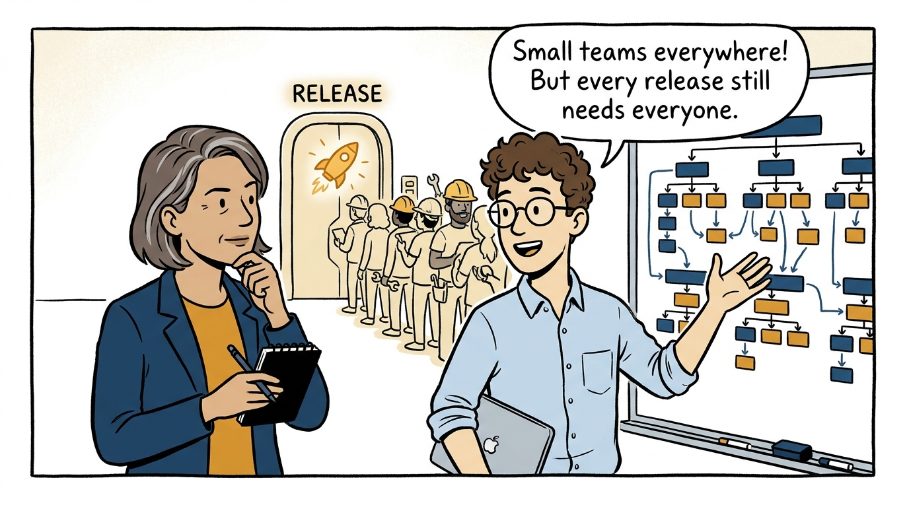
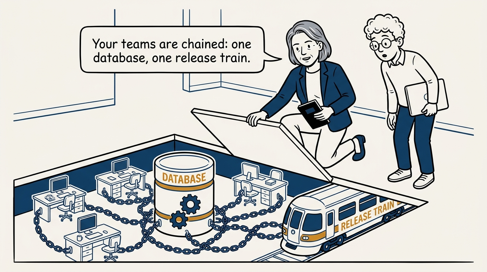
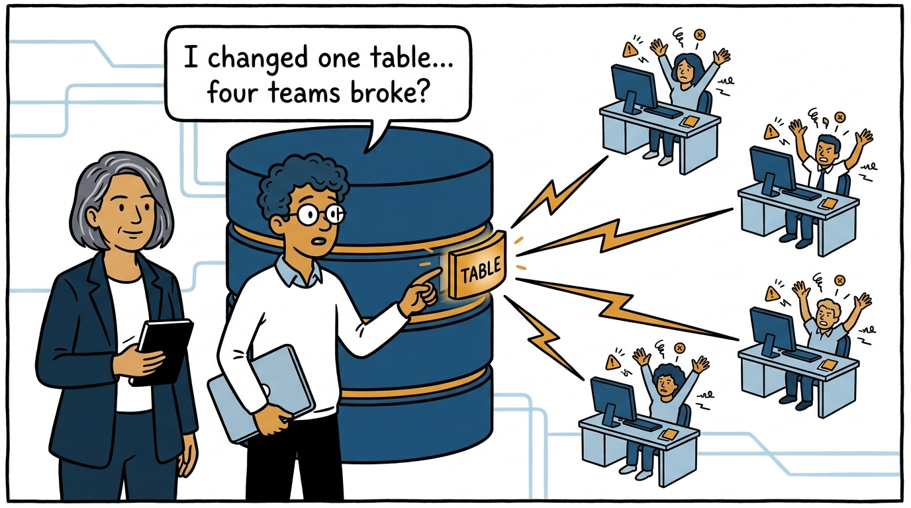
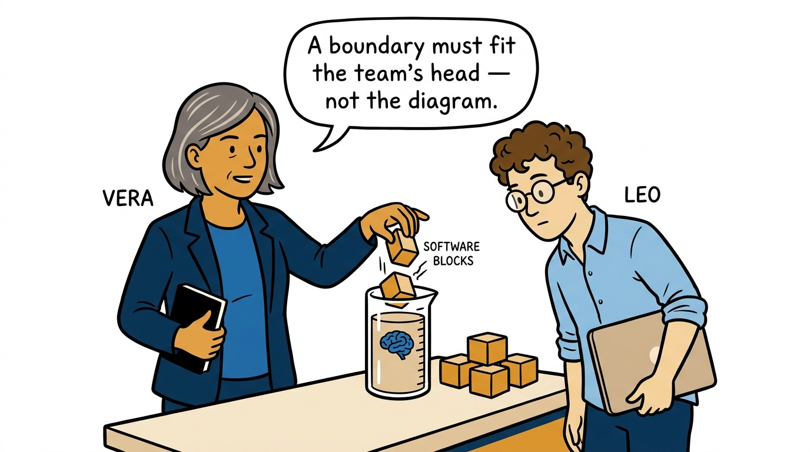
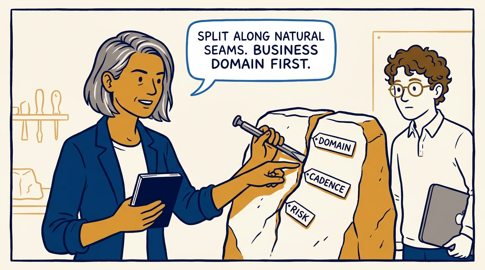
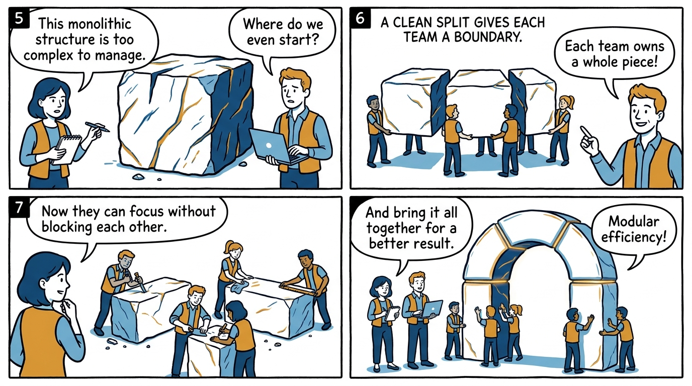
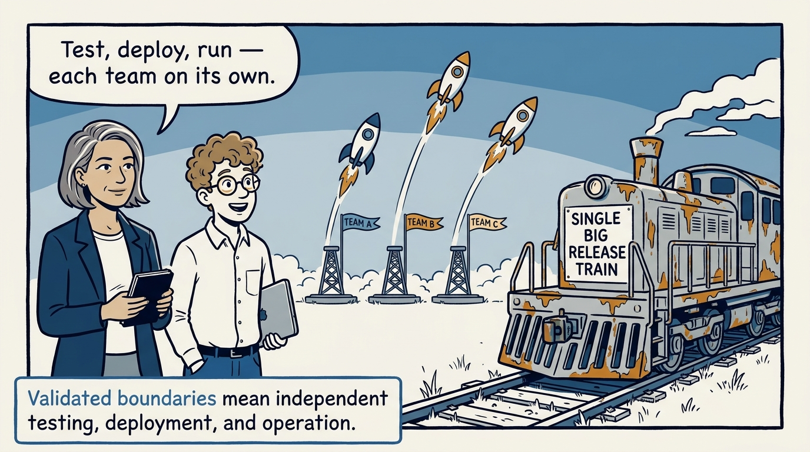
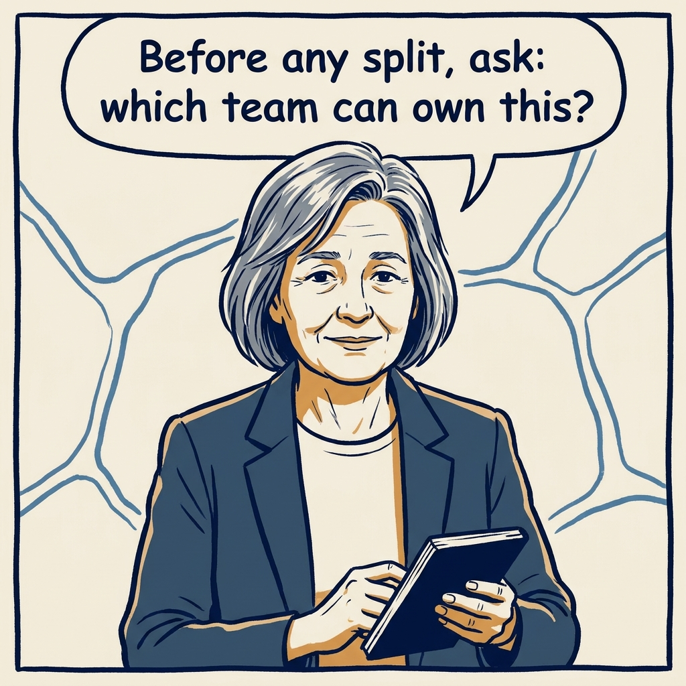

Small teams, hidden chains — why boundaries must fit the team, not the org chart, in eight panels.

<!-- comic-style
{
  "cast": "VERA: a calm, seasoned engineering executive, short gray-streaked hair, dark blazer over a plain t-shirt, carries a small black notebook. LEO: an eager young engineering manager, curly hair, round glasses, laptop under one arm.",
  "style": "Clean two-tone explainer comic, thick ink outlines, flat colors with deep blue and amber accents on a light background, generous white space, hand-lettered speech bubbles with SHORT readable text, no photorealism."
}
-->

**Panel 1:** *The hook: the org chart says small teams — the release calendar says one big one.*

**Panel 2:** *The problem: hidden monoliths — the shared database and the joined release train under the floor.*

**Panel 3:** *One schema change, four broken teams — the coupling is invisible until you touch it.*

**Panel 4:** *The principle: boundaries are sized to the team's cognitive-load budget.*

**Panel 5:** *Find the fracture planes — the system's natural seams — and start with the business domain.*

**Panel 6:** *A clean split: one team, one whole piece, owned end to end.*

**Panel 7:** *The payoff: independent releases — the validation gate is test, deploy, and operate alone.*

**Panel 8:** *The closer: start with the team, not the architecture.*
