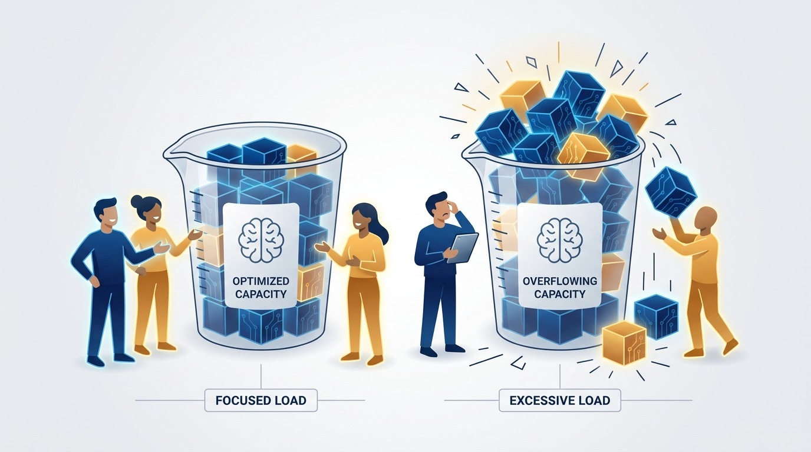
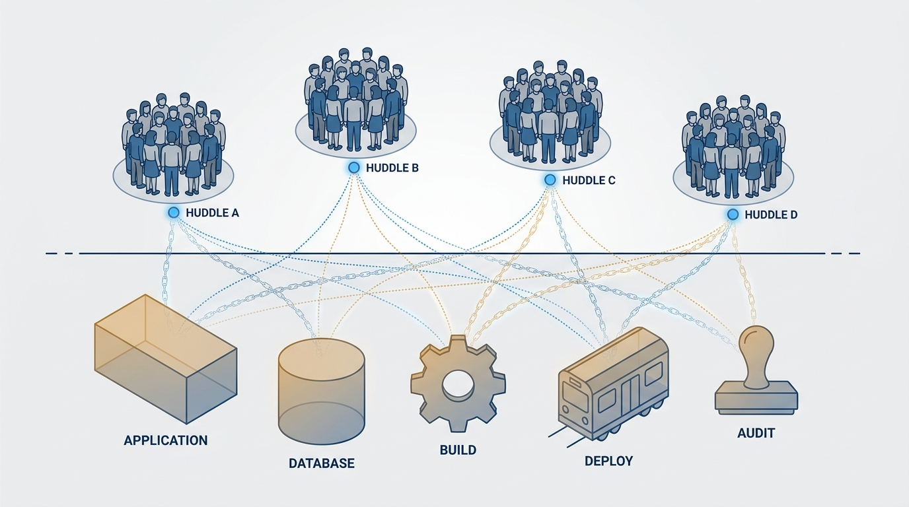
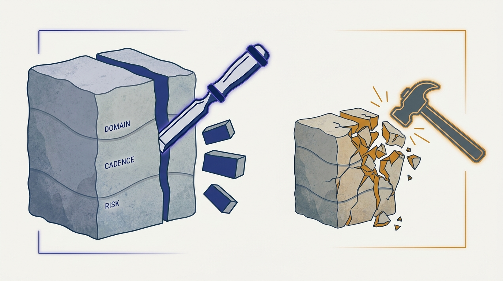

> **Status**: DRAFT
>
> **Principle**: I size software boundaries to team cognitive load, hunt the hidden monoliths that couple teams invisibly — the joined database, the shared build, the coordinated release, the one-size-fits-all standard — and split systems along natural fracture planes, business domain first, rather than along technology layers or the org chart of the moment. A boundary earns approval only when one team can understand it, change it, test it, deploy it, and operate it without waiting on everyone else.

## Statement

My operating model for drawing software boundaries has four parts:

- **Start with the team, not the architecture.** A boundary is right-sized when one team can understand, own, and evolve it, has the skills to build, test, deploy, and operate it, and finds its cognitive load reduced — not added to. Teams are accountable for outcomes, not components.
- **Hunt the hidden monoliths.** Microservices on the org chart mean nothing if teams still share a database schema, need one large build to release, ship in a single coordinated release train, force one domain model across every context, or are strangled by one-size-fits-all standards. Those are monoliths wearing a disguise.
- **Split along fracture planes.** Systems have natural seams: business domain first, then regulatory compliance, change cadence, team location, risk profile, performance isolation, technology, and user personas. I cut along seams, not across them.
- **Validate before approving.** A boundary passes only if the subsystem can be tested, deployed, observed, and supported independently, with explicit contracts between teams — and if the split improves flow instead of quietly creating a distributed monolith.

**Figure 1:** *The sizing unit is the team's cognitive-load budget: when the software overflows it, the boundary is wrong — not the team.*

## How to Read This

This is an **appendix record**: unlike the core records in this journal, grounded in Will Larson's *The Engineering Executive's Primer*, this one is grounded in Matthew Skelton and Manuel Pais's *Team Topologies* — read here through an executive lens, complementing the Primer-grounded records. The book speaks to anyone organizing teams and software for fast flow; I read it as the executive who ultimately approves the boundaries and pays for the ones drawn badly. If you work in my organization, this record explains why I ask "which team can own this end to end?" before I ask "is this the right architecture?", and why a beautiful decomposition diagram does not survive contact with a shared database. The working checklist — all six sections, every fracture plane — lives in the **Checklist** tab of this post.

## Rationale

**Cognitive load is the real sizing unit.** Architecture debates usually argue about the software: too big, too small, too coupled? The team-first move inverts the question: is the boundary small enough for one team to understand, own, and evolve — and can that team change it without waiting on many others? A technically elegant boundary that exceeds its team's cognitive-load budget will be owned in name only; corners get cut exactly where nobody has capacity to look. When boundary and team disagree, the boundary moves, not the team's working hours.

**The dangerous monoliths are the hidden ones.** Nobody defends the big-ball-of-mud application anymore; the couplings that actually slow my organization are quieter. Multiple services tied to one database schema. A single large shared build. Components bundled into one coordinated release. One domain model forced across contexts that speak different languages. Standards so uniform they remove useful autonomy. And "microservices" that still cannot ship without a full end-to-end test pass. Each makes teams that look independent on the org chart wait on each other in practice — an unpaid coordination tax I hunt explicitly.

**Figure 2:** *The hidden monoliths: teams that look independent on the org chart, chained together by a shared application, joined database, shared build, coordinated release, and one-size-fits-all standards.*

**Fracture planes make splits cheap; arbitrary cuts make them expensive.** A rock splits cleanly along its natural seams and shatters everywhere else. Software is the same. The best seam is almost always the **business domain**: a bounded context with its own language, model, and rules, legible to business and technical people alike. When domain lines are not enough, the other planes earn their keep — isolating regulated functionality to shrink audit blast radius; separating fast-changing areas so the system stops moving at the speed of its slowest part; matching boundaries to how distributed teams actually communicate; isolating high-risk from low-risk change; carving out genuinely different load and availability profiles; splitting on technology only when real constraints justify it; and splitting by user persona when user groups truly need different things. Technology sits deliberately near the bottom: layer-shaped teams — frontend, backend, database — own layers instead of outcomes, and every user-visible change crosses all of them.

**A boundary is a claim that must be tested.** Every proposed split predicts that the team will move faster afterward. I make the prediction falsifiable before approving: can the subsystem be provided as a service, tested, deployed, observed, and supported independently? Are the contracts — APIs, events — explicit, and the remaining dependencies minimal and intentional? If most changes still touch several services, if a database change still fans out across many teams, if end-to-end testing is still the only source of confidence, the split has manufactured a distributed monolith: all the coordination cost of the old system plus network latency. That is worse than not splitting at all.

**Figure 3:** *Split along fracture planes — business domain first — and the system separates cleanly; cut against the grain and it shatters.*

## What This Means in Practice

| What this principle says | What it does **not** say |
| --- | --- |
| Size boundaries to team cognitive load. | Smaller is always better — maximal fragmentation is its own monolith. |
| Business domain is the default fracture plane. | The other planes never apply — compliance, cadence, location, risk, performance, technology, and personas all earn splits. |
| Hunt hidden monoliths: database, build, release, standards. | Shared platforms are forbidden — deliberate, well-bounded sharing is fine; invisible coupling is not. |
| A boundary must pass the independent test/deploy/operate gate. | A passing gate today is forever — boundaries are revisited as the system and teams evolve. |
| Teams own business outcomes. | Teams own technical layers and hand work across them. |
| Standards serve teams. | Uniformity is a goal in itself — standards that remove useful autonomy are a hidden monolith. |

Concretely: boundary proposals reach me framed as "this team will own this outcome," not as component diagrams. Before any split I ask for the hidden-monolith scan — database schemas, build coupling, release trains, forced shared models, standards. The final decision test is the checklist's: I approve only when most of these hold — a meaningful business or operational concern, one team owning it sustainably with minimal external coordination, reduced cognitive load, improved flow, no unnecessary coupling, and a team that can build, run, observe, and evolve it over time.

## Anti-Patterns

- **Architecture-first decomposition.** Drawing the "right" service boundaries on a whiteboard, then discovering no team can hold any of them in its head.
- **The distributed monolith.** Fifty services, one database schema, one release train — every cost of microservices, none of the benefits.
- **The end-to-end safety blanket.** "Independent" services no one dares release without a full regression pass; the test suite is the monolith now.
- **Layer-shaped teams.** Frontend, backend, and database teams each owning a layer, so every user-visible change needs three teams and two handoffs.
- **Standardization as coupling.** One-size-fits-all mandates forcing every team through the same tools and pace regardless of context.
- **Splitting by convenience.** Cutting on technology or team availability because it is easy today, across a domain seam that will bleed forever.
- **The unfalsifiable split.** Approving a boundary with no independent-deploy test, so nobody ever learns whether it worked.

## Related Records

- [[organizational-design]] — sizes and staffs the teams; this record sizes the software each of those teams owns.
- [[engineering-strategy]] — boundary choices are strategy made physical; the strategy names the domains worth owning cleanly.
- [[conways-law]] — appendix sibling on the mirroring force between organization and architecture; this record chooses where to cut given that force.
- [[four-fundamental-team-topologies]] — appendix sibling; the boundaries drawn here are what stream-aligned teams own end to end.
- [[team-first-thinking]] — appendix sibling; cognitive load as the sizing unit comes from putting the team first everywhere.

## Scope and Revisiting

This principle governs how software boundaries are proposed, evaluated, and approved in my organization — new systems, monolith splits, and platform carve-outs alike. I revisit it whenever a boundary fails its validation gate in production, whenever team cognitive load visibly outgrows what a boundary assumed, and at any reorganization, because moving teams without re-examining boundaries just relocates the hidden monoliths.

## Authoritative References

- Matthew Skelton & Manuel Pais, *Team Topologies: Organizing Business and Technology Teams for Fast Flow* (IT Revolution Press, 2019) — the team-first boundaries chapter this record's checklist distills.
- The authors maintain further material, patterns, and training resources at [teamtopologies.com](https://teamtopologies.com/).
