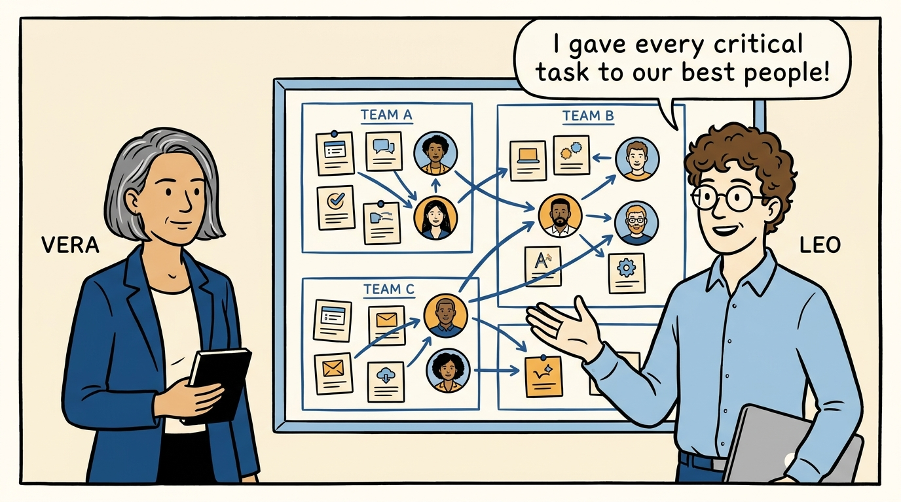
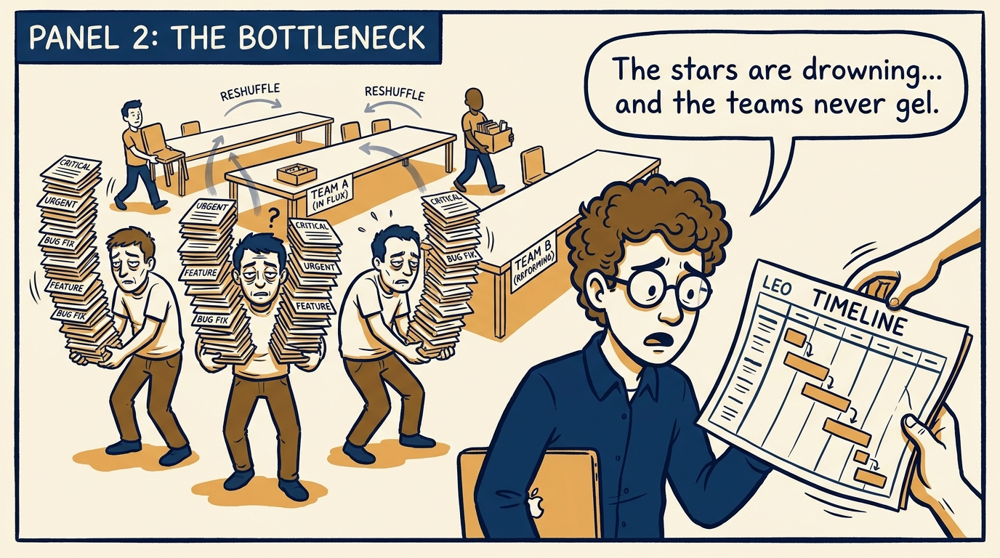
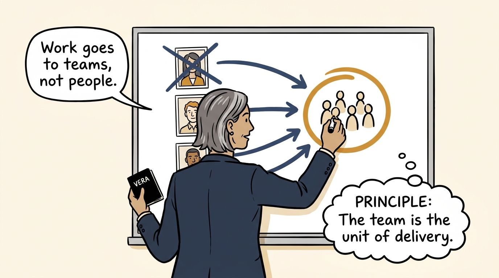
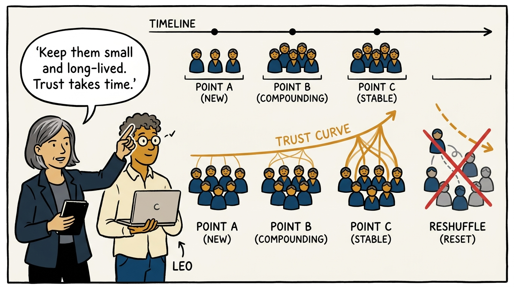
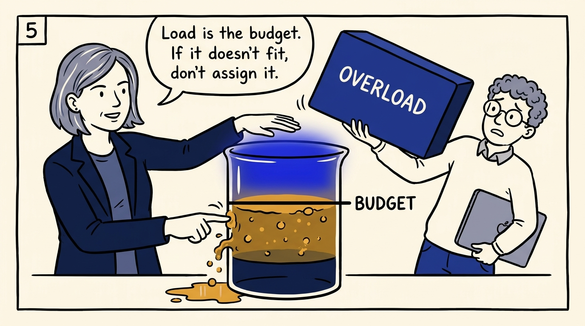
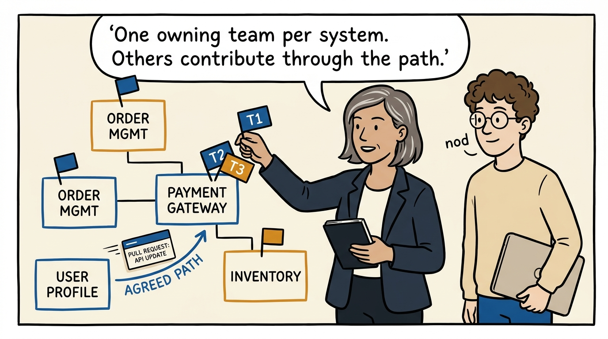
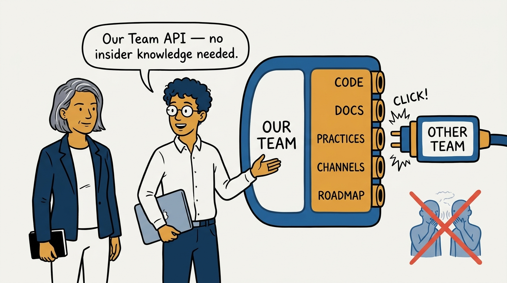
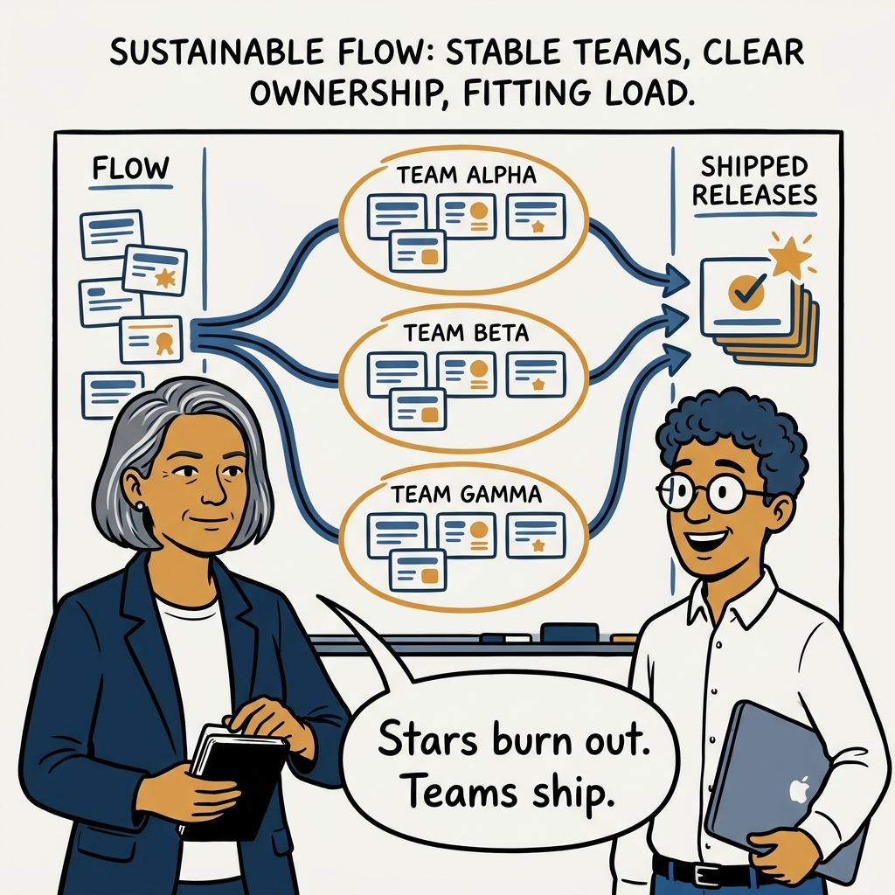

Teams over stars — why the long-lived team, not the individual, is the unit of delivery, in eight panels.

<!-- comic-style
{
  "cast": "VERA: a calm, seasoned engineering executive, short gray-streaked hair, dark blazer over a plain t-shirt, carries a small black notebook. LEO: an eager young engineering manager, curly hair, round glasses, laptop under one arm.",
  "style": "Clean two-tone explainer comic, thick ink outlines, flat colors with deep blue and amber accents on a light background, generous white space, hand-lettered speech bubbles with SHORT readable text, no photorealism."
}
-->

**Panel 1:** *The hook: route everything to the stars — what could go wrong?*

**Panel 2:** *The problem: heroes overload, teams reshuffle, nothing compounds.*

**Panel 3:** *The principle: the team is the unit of delivery.*

**Panel 4:** *Small and long-lived: trust compounds only when the team stays together.*

**Panel 5:** *Cognitive load is the budget every assignment must fit within.*

**Panel 6:** *Exactly one owner per system — stewards, with clear paths for contributors.*

**Panel 7:** *The Team API: what the team exposes so others need no insider knowledge.*

**Panel 8:** *The closer: stars burn out — teams ship.*
