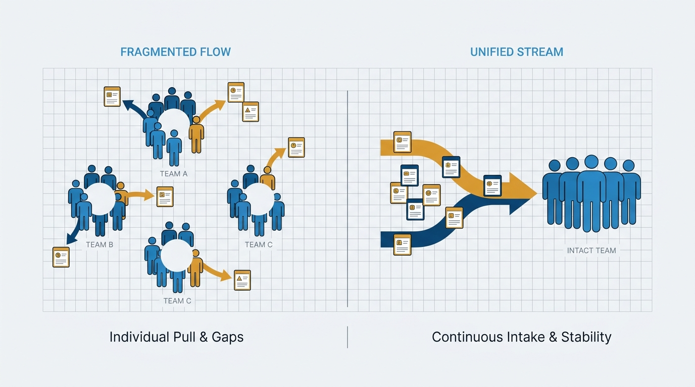
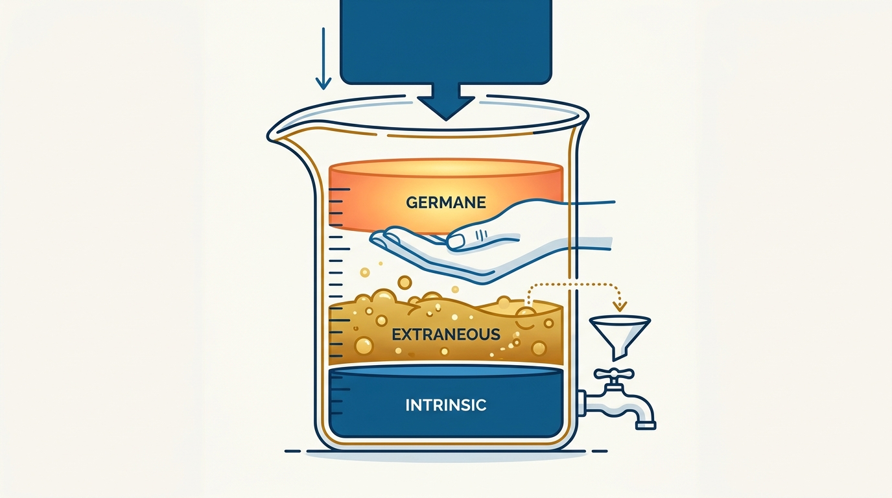
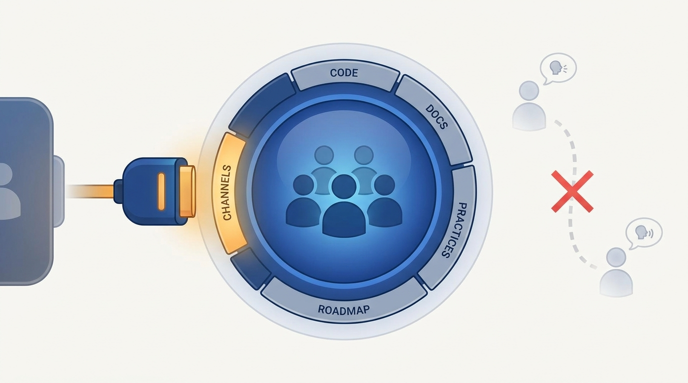

> **Status**: DRAFT
>
> **Principle**: I treat the long-lived team, not the individual, as the unit of delivery: work flows to teams, ownership belongs to teams, rewards go to teams, and team cognitive load is the budget every assignment must fit within. I keep teams small and stable, give every system exactly one owning team that acts as steward rather than private owner, and expect every team to publish a Team API — code, docs, working practices, and channels — so others can work with it without insider knowledge.

## Statement

My operating model for team-first thinking has five parts:

- **The team is the unit of delivery.** I assign software work to teams, never directly to individuals. Teams are small — ideally 5–9 people — long-lived, and not casually disrupted.
- **Stability earns trust; trust earns speed.** Teams are designed around high trust, psychological safety, and shared goals, with time to pass through forming, storming, norming, and performing.
- **Every system has exactly one owning team.** No shared ownership of code, libraries, or components. The owner is responsible for operability, maintenance, and evolution — as steward, not private owner — and other teams contribute through agreed paths.
- **Cognitive load is the budget.** Every domain assignment and software boundary must fit within what the team can actually hold: accept the intrinsic load, eliminate the extraneous, protect the germane.
- **Every team publishes a Team API.** Code, endpoints, documentation, working practices, communication channels, and roadmap — so other teams can interact without informal insider knowledge.

**Figure 1:** *Work flows to teams, not to individuals: pulling people onto projects breaks teams; routing work to stable teams keeps them whole.*

## How to Read This

This is an **appendix record**: unlike the core records in this journal, grounded in Will Larson's *The Engineering Executive's Primer*, this one is grounded in Matthew Skelton and Manuel Pais's *Team Topologies* — read here through an executive lens, complementing the Primer-grounded records. I read the book as the executive who decides what the unit of delivery, ownership, and reward actually is. If you lead teams here, this record explains why I push back when a plan names individuals instead of teams, and why "the team is overloaded" is a design problem on my desk, not a motivation problem on theirs. The working checklist — all fifteen sections — lives in the **Checklist** tab of this post.

## Rationale

**Individuals don't scale; teams do.** A single engineer carries context that leaves when they do. A small, long-lived team compounds: shared context, mutual trust, and practiced ways of working take months to build and an afternoon to destroy, which is why I avoid reshuffling teams without a clear need. When a team grows past 5–9 people, the symptoms are predictable — slower decisions, weaker trust, coordination friction — and the fix is a deliberate split, not a bigger standup.

**Shared ownership is deferred conflict.** When three teams change the same codebase, nobody maintains it and everybody blames it. So every system, service, component, and subsystem has exactly one owning team, responsible for its operability, maintenance, and evolution. Ownership means stewardship, not a fence: other teams contribute through pull requests and agreed collaboration paths.

**Cognitive load is the real constraint, not headcount.** A team's capacity is not the sum of its hours; it is what the team can hold in its collective head. I separate three kinds of load. *Intrinsic* load — the essential complexity of the domain — I accept and staff for. *Extraneous* load — needless process, tooling friction, handoffs, poor documentation — I hunt down and eliminate, because it is pure waste. *Germane* load — learning, domain mastery, problem-solving — I protect, because it is where the value lives. This is why I never give one team a complex domain plus extras, or multiple complicated domains: the budget does not stretch, it snaps. And it is why software boundaries follow team cognitive load, not the other way around — the monolith-versus-microservices debate is unanswerable until you know what the teams can carry.

**Figure 2:** *Cognitive load as the budget: accept the intrinsic, drain the extraneous, shield the germane — and refuse assignments that do not fit the container.*

**Rewards decide what people optimize.** If bonuses and praise flow to individual heroics, I get heroes — and the silos and burnout heroes create. So I reward whole teams, avoid incentives that set teammates against each other, share training budgets at the team level, and audit performance systems for anything that undermines collaboration. A team-first mindset — unblocking teammates before starting new work, exploring options instead of winning arguments — survives only when the reward system agrees with it. Diversity makes this stronger: multiple perspectives and disagreement treated as input are how small teams avoid groupthink.

**A team without an API is a bottleneck with a roadmap.** Other teams should not need to know whom to ping or which unwritten rule applies. So every team defines a Team API: the code, endpoints, and libraries it owns; versioning expectations; documentation and onboarding guides; working practices and communication channels; and current priorities. The test is empirical — I regularly check whether other teams actually find the API usable.

**Figure 3:** *The Team API: what a team exposes — code, docs, ways of working, channels, roadmap — so collaboration runs through the interface, not through favors.*

**Team-first design runs on engineering foundations.** Stable teams with clear ownership still stall without continuous delivery, test-supported development, first-class operability, and pipelines treated as products. A team that cannot safely release, observe, and operate its own software does not really own it. I fund these practices accordingly.

## What This Means in Practice

| What this principle says | What it does **not** say |
| --- | --- |
| Work is assigned to teams; teams decide who does what. | Individuals don't matter — they matter inside a team, not instead of one. |
| Teams are long-lived; reshuffles need a clear reason. | Teams are frozen — they evolve, deliberately. |
| Exactly one team owns each system, as steward. | Other teams are locked out — contribution flows through agreed paths. |
| Cognitive load caps what a team can be assigned. | "Overloaded" is solved by pep talks or more headcount by default. |
| Rewards go to whole teams. | Individual growth stops being recognized — it stops being the *unit*. |
| Every team publishes a usable Team API. | Every interaction needs a formal process — the API makes the informal unnecessary, not forbidden. |

Concretely: plans and roadmaps name teams, not people. Ownership maps have exactly one team per system; gaps and overlaps are incidents waiting to happen. Domain assignments are checked against load — one complex domain per team, never a pile of complicated ones. When a team says it is overloaded, my first question is what extraneous load we can remove, not who lacks motivation.

## Anti-Patterns

- **The star-routing habit.** Assigning critical work to named individuals across teams — single points of failure, while the teams around them never gel.
- **The perpetual reshuffle.** Reorganizing teams before they reach performing, then wondering why nothing compounds.
- **The commons codebase.** Multiple teams changing the same code with no owning team — shared ownership that is really no ownership.
- **The overloaded workhorse.** One team holding a complex domain plus three others, praised for coping until it quietly stops delivering.
- **Heroics on the bonus sheet.** Reward systems that pay for individual rescue missions, then act surprised by silos and burnout.
- **The insider interface.** Collaboration that works only if you know whom to ask — informal favors standing in for a Team API.
- **Team-first theater.** The vocabulary of stable teams and cognitive load, while pipelines, testing, and operability stay too weak for any team to truly own its software.

## Related Records

- [[organizational-design]] — appendix sibling; sizing defaults and state diagnosis sit on top of the team-first stance this record establishes.
- [[gelling-your-engineering-leadership-team]] — the leadership team is a team too; forming-storming-norming-performing applies at the top first.
- [[engineering-culture]] — the cultural substrate that team-first mindset and psychological safety depend on.
- [[team-first-boundaries]] — appendix sibling; how software boundaries are drawn once the team is the unit they serve.
- [[static-team-topologies]] — appendix sibling; the team types and structures team-first thinking composes into.

## Scope and Revisiting

This principle governs how I assign work, ownership, and rewards, and how I size what any single team is asked to carry. I revisit it whenever a plan names individuals instead of teams, an ownership map shows two teams on one system, or a team reports overload — each a signal that the design, not the people, needs attention. The warning-signs section of the checklist is the standing review trigger.

## Authoritative References

- Matthew Skelton & Manuel Pais, *Team Topologies: Organizing Business and Technology Teams for Fast Flow* (IT Revolution Press, 2019) — the team-first chapters this record's checklist distills.
- The authors maintain ongoing materials, training, and case studies at [teamtopologies.com](https://teamtopologies.com/).
