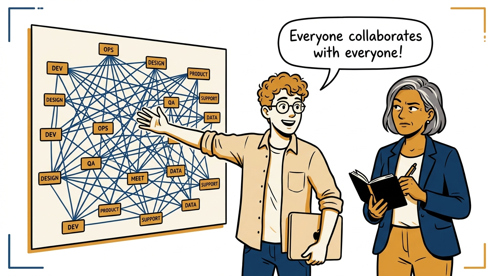
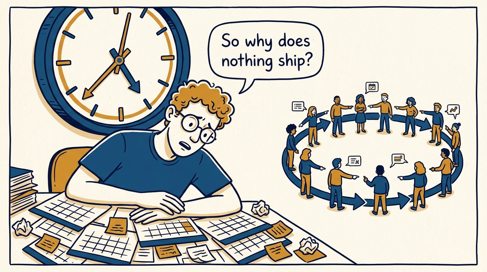
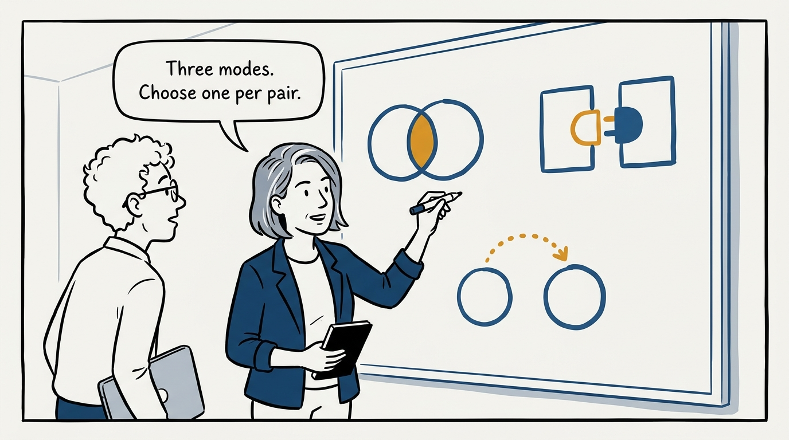
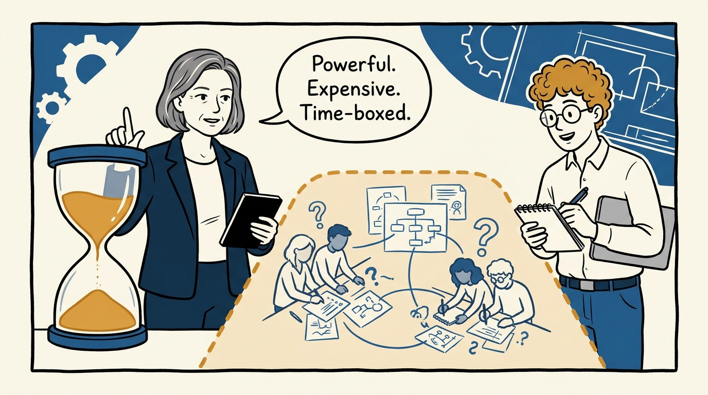
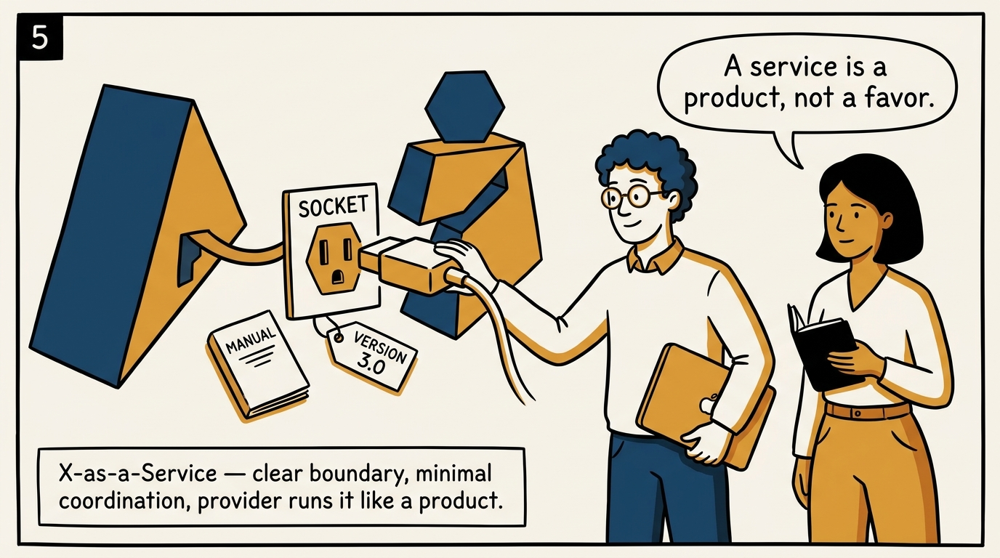
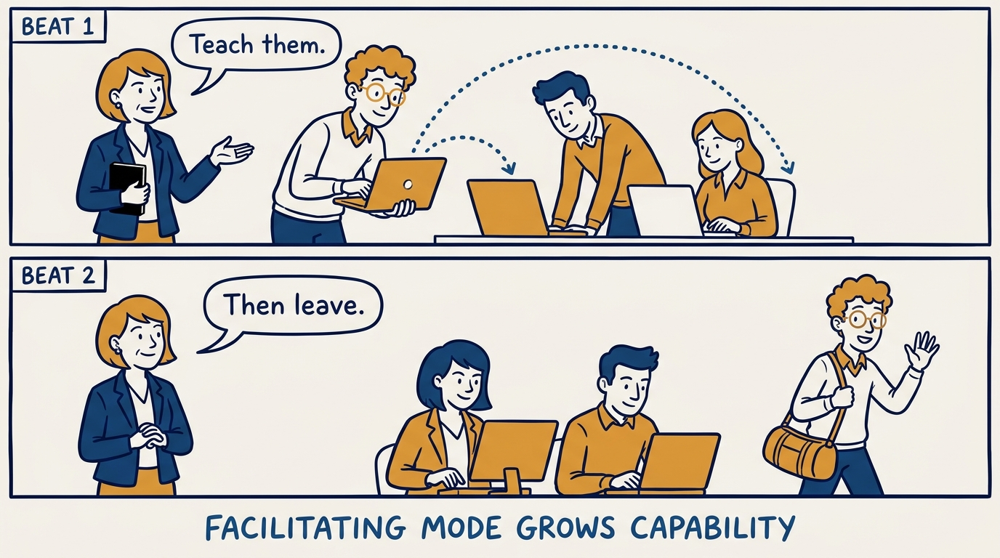
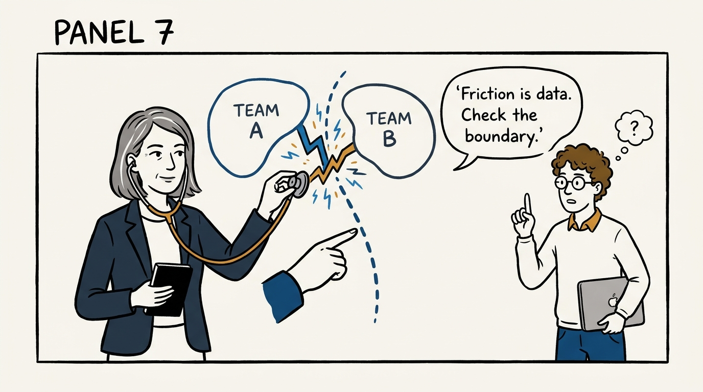
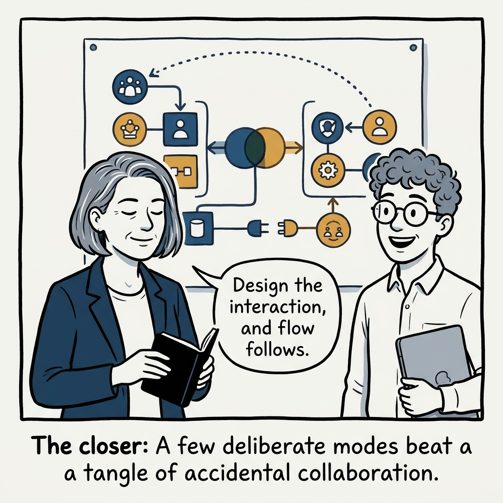

Choose the mode, don't inherit it — why three deliberate interaction modes beat collaboration everywhere, in eight panels.

<!-- comic-style
{
  "cast": "VERA: a calm, seasoned engineering executive, short gray-streaked hair, dark blazer over a plain t-shirt, carries a small black notebook. LEO: an eager young engineering manager, curly hair, round glasses, laptop under one arm.",
  "style": "Clean two-tone explainer comic, thick ink outlines, flat colors with deep blue and amber accents on a light background, generous white space, hand-lettered speech bubbles with SHORT readable text, no photorealism."
}
-->

**Panel 1:** *The hook: 'everyone collaborates with everyone' worn as a badge of honor.*

**Panel 2:** *The problem: all-to-all collaboration means gridlock — everything blocks on everything.*

**Panel 3:** *The principle: three modes — collaboration, X-as-a-Service, facilitating — chosen deliberately per team pair.*

**Panel 4:** *Collaboration: high-bandwidth discovery — worth its high cost only when time-boxed with an exit.*

**Panel 5:** *X-as-a-Service: a clean socket — clear ownership, strong docs, minimal day-to-day coordination.*

**Panel 6:** *Facilitating: grow the capability, agree what self-sufficient means, then step away.*

**Panel 7:** *Friction as sensing: an awkward interaction points at a wrong boundary or mode, not at bad people.*

**Panel 8:** *The closer: interaction by design — an explicit mode for every important pair, and room to flow.*
