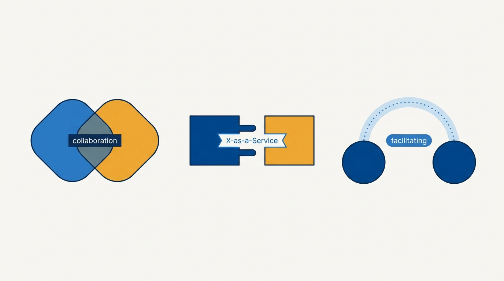
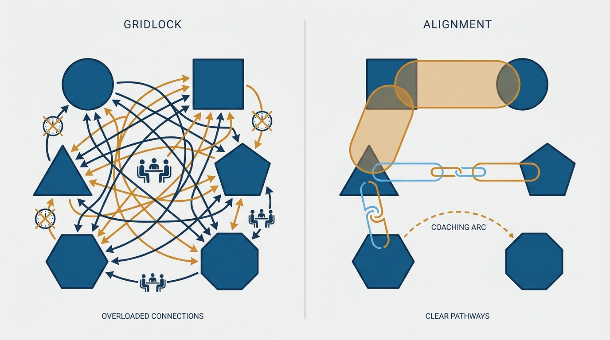
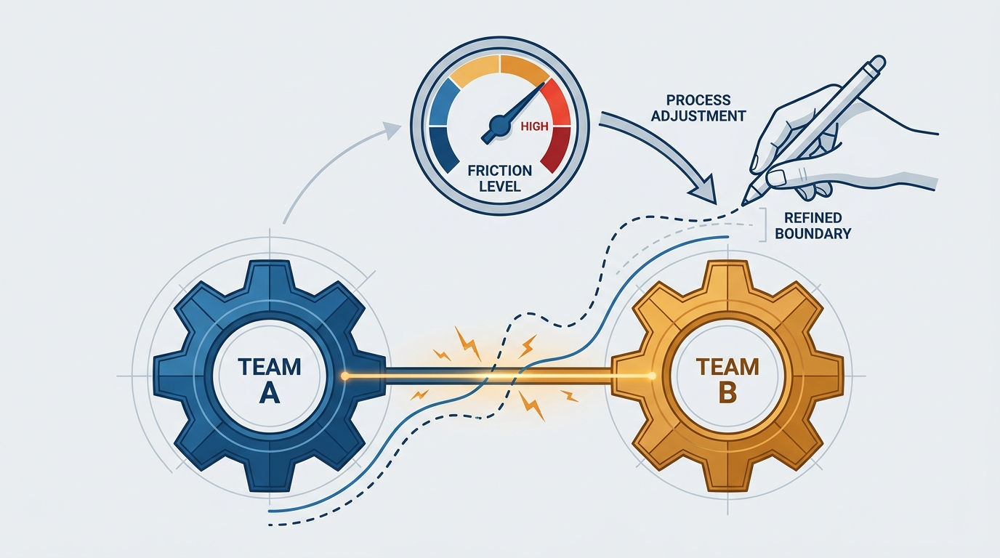

> **Status**: DRAFT
>
> **Principle**: I make how teams interact an explicit design decision with exactly three modes: **collaboration** for time-boxed, high-bandwidth discovery; **X-as-a-Service** for steady delivery across a clear, product-managed boundary; and **facilitating** to grow another team's capability and then step away. Every important team pair gets a deliberately chosen mode, matched to what each team is and what the work needs right now — and I read friction in these interactions as sensing data about where boundaries are wrong, not as evidence that people need to try harder.

## Statement

My operating model for team interactions has four parts:

- **Three modes, no more.** Every important team-to-team relationship runs in one of three modes: *collaboration* (working closely together for a defined period), *X-as-a-Service* (one team provides, another consumes, with minimal coordination), or *facilitating* (one team helps another learn, improve, or unblock itself). An interaction without an explicit mode is an interaction I have not designed yet.
- **Choose per pair, deliberately.** For each relationship I identify the teams and their topology — stream-aligned, enabling, complicated-subsystem, or platform — decide the intended mode, and make it explicit: who owns what, which channels, what cadence.
- **Respect each mode's economics.** Collaboration buys discovery at the price of high cognitive load, so it is time-boxed, limited to at most one other team at a time, and carries a plan to end. X-as-a-Service buys flow at the price of upfront boundary design, so the provider manages the service like a product. Facilitating buys capability at the price of expert time, so its goal is always self-sufficiency, never permanent dependency.
- **Use friction as an instrument.** Awkward, expensive, or unclear interactions signal a misplaced boundary, a missing capability, or the wrong mode — and they feed boundary redesign, not blame.

**Figure 1:** *The three interaction modes as three different connectors: an overlapping zone (collaboration), a socket (X-as-a-Service), and a coaching arc (facilitating).*

## How to Read This

This is an **appendix record**: unlike the core records in this journal, grounded in Will Larson's *The Engineering Executive's Primer*, this one is grounded in Matthew Skelton and Manuel Pais's *Team Topologies* — read here through an executive lens, complementing the Primer-grounded records. The book gives teams a shared vocabulary for working together; I read it as the executive's instrument panel: the modes are how I design coordination on purpose, and friction in them is how I sense when the design has drifted. If you lead teams in my organization, this record explains why "let's just collaborate closely with everyone" gets pushback from me, and why I ask "what mode is this relationship in?" before anything else about a cross-team problem. The working checklist — every mode's entry criteria and warning signs — lives in the **Checklist** tab of this post.

## Rationale

**Undesigned interaction defaults to everyone talking to everyone.** Left alone, a growing organization drifts toward maximum communication: every team syncs with every other team, calendars fill, and coordination cost grows faster than headcount. The fix is not better meeting hygiene; it is refusing to require every team to communicate with every other team, and designing each important relationship deliberately instead. Intentional communication is a structural property, not a behavioral aspiration.

**Collaboration is a discovery tool, not a default posture.** Close joint work is exactly right when there is significant uncertainty or novelty, boundaries are not yet known, and both teams bring expertise worth combining. It is also expensive: responsibilities blur and cognitive load rises. So I treat it like any expensive instrument — used where the expected benefit justifies the load, time-boxed, limited to one other team at a time, with an explicit plan to step down to a service relationship once the boundary or API becomes clear. Collaboration that continues too long is not warmth; it is a sign the team boundaries may be wrong.

**X-as-a-Service is where flow lives.** When one team provides a component, platform, or capability that another consumes with minimal day-to-day coordination, both sides get their attention back. But the mode only works if the provider treats the service like a product: a well-chosen boundary, clear documentation, strong developer experience, versioning taken seriously, a roadmap — and the discipline to consider consumer requests without automatically building them. A service that consumers need constant help to use is not a service; it is collaboration wearing a service's clothes.

**Facilitating exists to make itself unnecessary.** When a team needs help closing a capability gap, a facilitating team coaches, mentors, and removes impediments — without taking ownership of the helped team's main work. The goal is self-sufficiency, agreed by both sides, on a temporary basis. A facilitator who ends up doing the work has failed at the actual job; a facilitating team that becomes a permanent dependency is a bottleneck with good intentions.

**Figure 2:** *Collaboration everywhere is gridlock; a few deliberately chosen interactions per team pair is a design.*

**Modes follow team types.** Stream-aligned teams typically collaborate when discovery is needed, consume capabilities as a service, and occasionally receive facilitation; enabling teams live mostly in facilitating mode; complicated-subsystem and platform teams typically provide their capability as a service and drop into collaboration only when a boundary needs discovery or refinement. When a relationship runs in a mode that contradicts what the teams are, one of the two is misdefined.

**Friction is data, and I refuse to waste it.** The most valuable thing the mode vocabulary gives me is a sensing instrument. When an interaction feels awkward, slow, or unclear, the tempting explanation is interpersonal — this pair of leads doesn't click. The usually correct explanation is structural: a missing capability, a misplaced boundary, or a mode that no longer fits the architecture or the stage of work. So I ask whether the current mode is helping flow or creating friction, review whether the boundaries still make sense, and use techniques like event storming or context mapping to redraw them. I also change modes deliberately as a probe: running collaboration temporarily to discover a better service boundary, or swapping modes to build empathy across a seam. The organization's interaction pains are its most honest telemetry.

**Figure 3:** *Friction as sensing: the gauge on the interaction feeds the redesign of the boundary.*

## What This Means in Practice

| What this principle says | What it does **not** say |
| --- | --- |
| Every important team pair has an explicitly chosen mode. | Every pair of teams needs a relationship at all. |
| Collaboration is time-boxed and limited to one other team at a time. | Collaboration is bad — it is the right tool for genuine discovery. |
| Providers manage their service like a product. | Consumers get everything they ask for. |
| Facilitation ends when the helped team is self-sufficient. | Enabling teams are a permanent staffing shortcut. |
| Friction in an interaction is a structural signal. | Interpersonal problems never exist — but structure is my first suspect. |
| Modes change as technology, size, and market needs change. | The mode chosen at design time is fixed forever. |

Concretely: when a cross-team initiative lands on my desk, the first question is "what mode is each relationship in, and did anyone choose it?" New collaborations state their time box and their exit — usually a service boundary — up front. Platform and complicated-subsystem teams are reviewed as product organizations, with developer experience a first-class metric. And when two teams grind against each other, I open the boundary question before the personnel question.

## Anti-Patterns

- **Collaboration everywhere.** Every team pairs closely with every other team; meetings metastasize, ownership blurs, and nothing ships because everything blocks on everything.
- **Mode by accident.** Teams interact however history left them interacting; nobody can say whether a relationship is collaboration or a service, so expectations are guessed, not known.
- **The eternal collaboration.** A "temporary" joint effort with no time box and no exit plan — comfortable, expensive, and a standing sign that the boundary was never found.
- **The service that isn't.** An "as-a-Service" boundary whose consumers need constant hand-holding — collaboration's coordination cost with neither mode's clarity.
- **The facilitator who stays.** An enabling team that quietly becomes a permanent dependency, doing the work instead of growing the capability.
- **Blaming the people.** Treating a structurally awkward interaction as a personality conflict, and burning goodwill on the wrong fix.

## Related Records

- [[four-fundamental-team-topologies]] — appendix sibling; the four team types whose relationships these modes govern.
- [[evolve-team-structures]] — appendix sibling; mode friction is the sensing input, structure evolution is the response.
- [[internal-communication]] — the communication system these modes make intentional rather than accidental.
- [[working-with-your-ceo-peers-and-engineering]] — the same explicit-interaction discipline, applied at the executive seam.

## Scope and Revisiting

This principle governs how I design, review, and evolve team-to-team relationships. I revisit each important interaction's mode when technology, organization size, market needs, or team experience changes; whenever a collaboration passes its time box; and whenever friction telemetry says a boundary has drifted. The final test: every important interaction has an explicit mode, communication is intentional rather than accidental, and the structure is ready to evolve when the modes say it must.

## Authoritative References

- Matthew Skelton & Manuel Pais, *Team Topologies: Organizing Business and Technology Teams for Fast Flow* (IT Revolution Press, 2019) — the interaction-modes chapters this record's checklist distills.
- The authors maintain further material, tools, and case studies at [teamtopologies.com](https://teamtopologies.com/).
