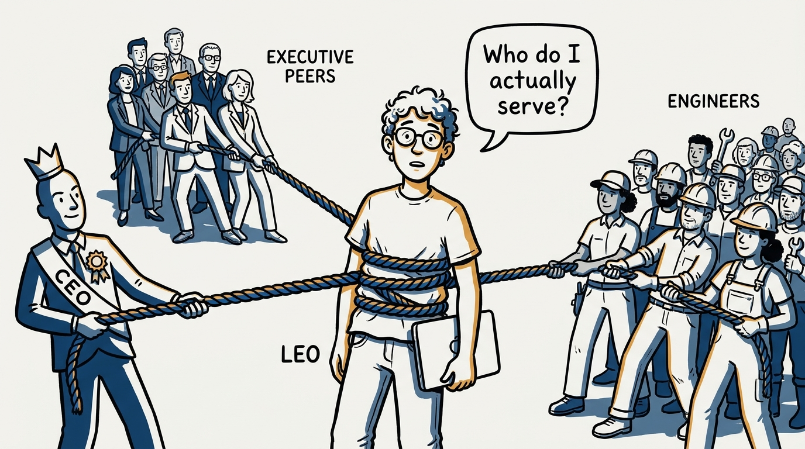
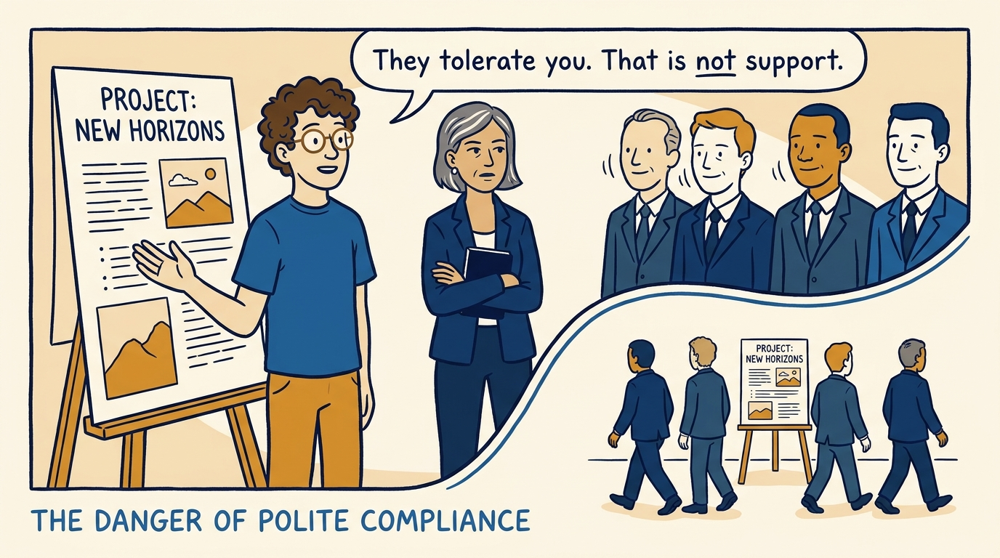
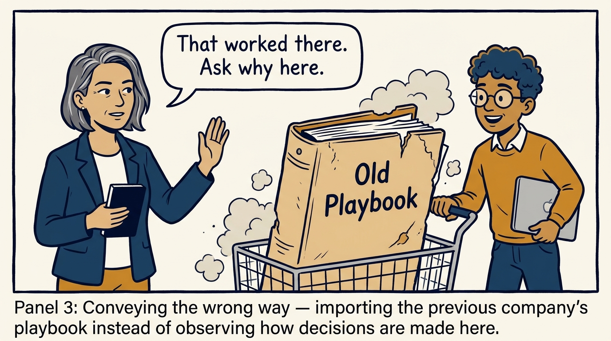
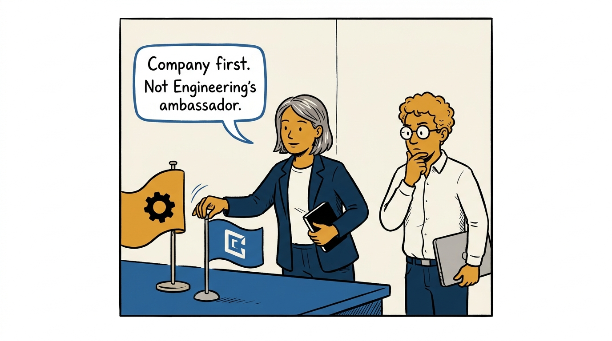
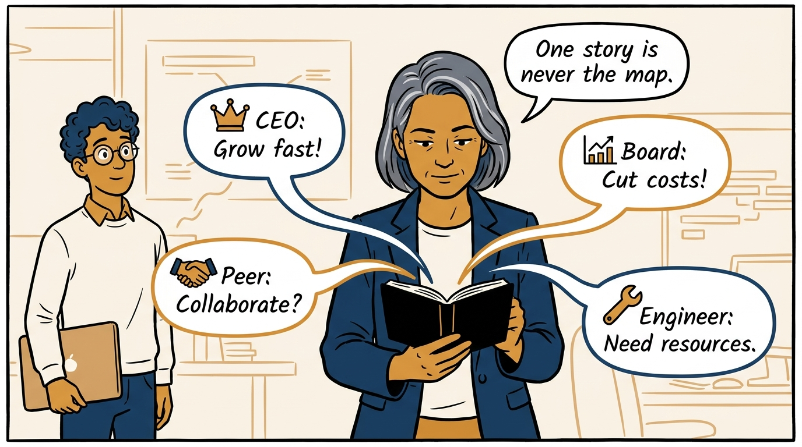
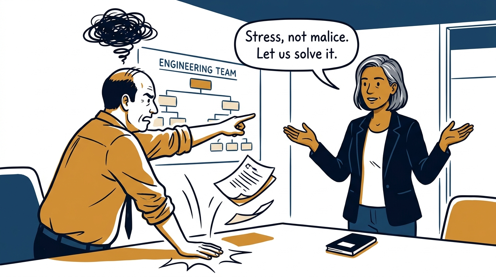
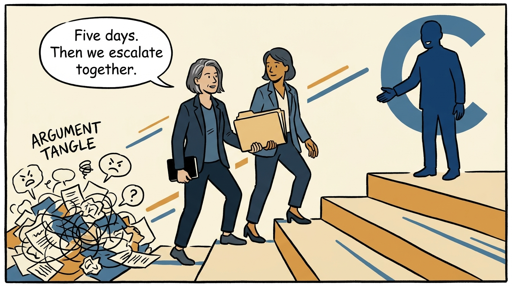
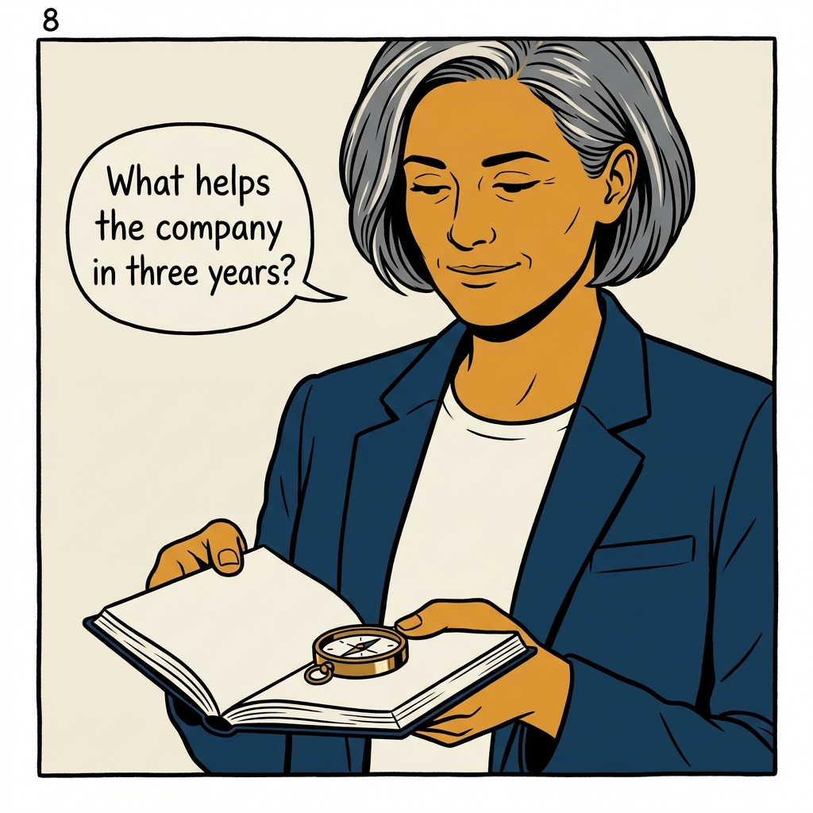

Serving the CEO, your peers, and Engineering without failing all three — in eight panels.

<!-- comic-style
{
  "cast": "VERA: a calm, seasoned engineering executive, short gray-streaked hair, dark blazer over a plain t-shirt, carries a small black notebook. LEO: an eager young engineering manager, curly hair, round glasses, laptop under one arm.",
  "style": "Clean two-tone explainer comic, thick ink outlines, flat colors with deep blue and amber accents on a light background, generous white space, hand-lettered speech bubbles with SHORT readable text, no photorealism."
}
-->

**Panel 1:** *The hook: three constituencies, one executive.*

**Panel 2:** *The problem: mistaking toleration for support.*

**Panel 3:** *The wrong way: assuming the last company's playbook transfers intact.*

**Panel 4:** *The principle: company-first, with Engineering represented inside that frame.*

**Panel 5:** *The discipline: gather perspectives before acting — the CEO's view is one input.*

**Panel 6:** *The move: assume stress before malice when a peer panics.*

**Panel 7:** *The mechanism: structured escalation, then everyone commits.*

**Panel 8:** *The closer: the three-year question resolves most dilemmas.*
