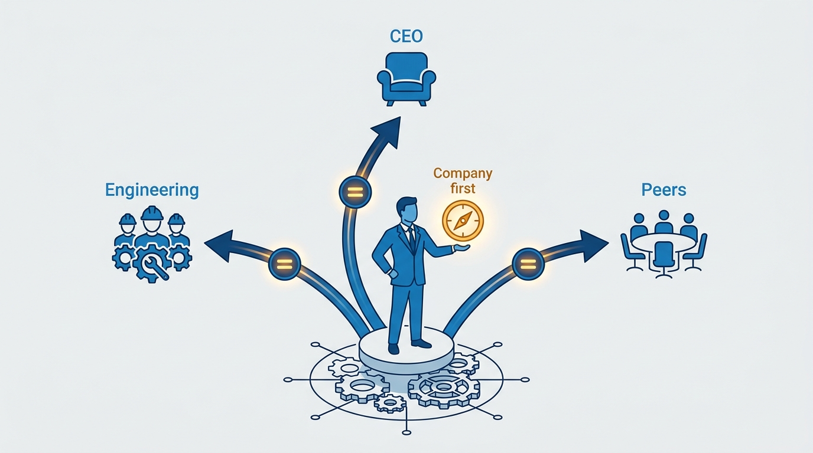
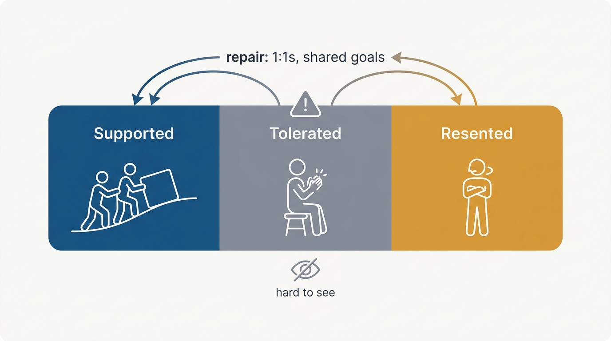
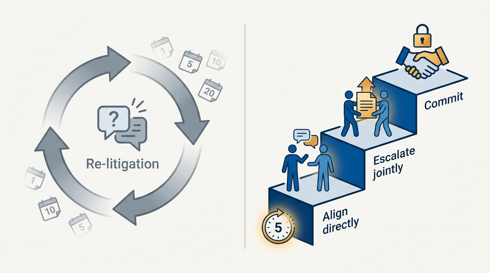

> **Status**: DRAFT
>
> **Principle**: I operate as a company-first leader, not as Engineering's ambassador. I diagnose honestly whether my work is supported, tolerated, or merely resented — and treat anything short of supported as a problem to fix. I gather perspectives beyond the CEO's narrative before acting, bridge conflicting cross-functional stories into company-first framings, resist importing my previous company's playbook, and limit how many changes I run at once. I treat conflict as a signal of growth rather than dysfunction, resolve the unhealthy kind through structured escalation — and when uncertain, I ask what maximizes company impact over the next three years.

## Statement

An engineering executive serves three constituencies at once — the CEO, executive peers, and Engineering itself — and serving any one exclusively fails all three. My commitments:

- **Diagnose my support level honestly.** Supported means peers proactively help my initiatives succeed; tolerated means they comply without helping; resented means my work reads as a distraction. If I am not clearly supported, I identify which functions are indifferent or resistant, schedule 1:1s to understand their concerns, and clarify shared goals and success metrics.
- **Look past the CEO's narrative.** Before acting on a diagnosis of Engineering, I gather perspectives from the CEO, the board, my peers, and my own team; I confirm whether Engineering is the problem or reacting to a broader one, distinguish symptoms from root causes, and validate assumptions directly with my team.
- **Bridge conflicting narratives.** When functions tell incompatible stories, I list each perspective, find the overlap, build a unified explanation that integrates the concerns, and frame solutions as company-first, not function-first.
- **Don't anchor to my past.** I do not assume my previous company's playbook, decision rights, or resource levels transfer. I observe how decisions are made, ask why processes exist, and adapt before implementing change.
- **Build an alignment habit.** After exec meetings I ask what I could have done better — narrow, specific questions — thank people, and demonstrate visible improvement. Feedback loops run with peers and directs alike.
- **Limit concurrent changes.** Before launching new initiatives, I review the outcomes of prior ones, confirm existing changes are working, and deliver visible wins before opening new fronts.
- **Embrace healthy conflict; resolve unhealthy conflict.** Disagreement is not dysfunction. Recurring unresolved debates and re-litigated decisions are — and they get structured escalation with a committed outcome.

**Figure 1:** *Three constituencies, one compass: serving any single one exclusively fails all three.*

## How to Read This

This record is for the CEO and peer executives who want to know how I will engage with them and handle disagreement, and for engineering leaders navigating the same three-way balance. The team I assemble below me is a separate record — [[gelling-your-engineering-leadership-team]]; this one is about the table I sit at. The working checklist — the support diagnostic, the escalation steps, the peer-panic playbook, the long-term questions — lives in the **Checklist** tab of this post.

## Rationale

**Tolerated is not good enough.** The dangerous state is not resentment — resentment is at least visible. It is toleration: peers comply with my initiatives without improving or championing them, everything moves slowly, and nothing compounds. An executive who cannot tell supported from tolerated will misread polite compliance as alignment until a crisis reveals the difference. The diagnosis has to be honest and periodic, and anything short of supported triggers deliberate repair work: 1:1s, understood concerns, shared success metrics.

**Figure 2:** *The support diagnosis: toleration is the dangerous state — visible compliance, invisible stall.*

**The CEO's narrative is one input, not the map.** The CEO's view of Engineering arrives pre-filtered — by their history, by whoever complained most recently, by what is visible from their seat. Anchoring to it exclusively means solving the wrong problem with full confidence. Gathering perspectives from the board, peers, and my own team — and validating directly before acting — is the same discipline as [[inspected-trust]] applied sideways and upward: narratives filter structurally, so I go to diverse sources before prescribing.

**Disagreement is not dysfunction.** Conflict at the executive table signals growth and complexity, not failure — a company where executives never disagree is a company where someone is not saying what they think. What *is* dysfunction: recurring unresolved debates and the re-litigation of settled decisions. For those I use structured escalation — agree to resolve within five days, prioritize direct alignment, jointly escalate with shared context if still stuck, and commit to the escalated decision. And I ask the uncomfortable reflective question: am I the one preventing resolution?

**Figure 3:** *Unhealthy conflict gets a bounded path: five days, direct alignment, joint escalation, committed outcome.*

**Peers panic; the response is empathy before defense.** When a peer starts blaming Engineering, the base rate says stress, not malice. I seek to understand their pressure and solve the problem together; if the behavior becomes disruptive, I focus on improving execution over replacing them where feasible, shield my team from the chaos, and encourage the CEO to clarify leadership decisions when needed.

**The three-year question resolves most dilemmas.** When constituencies pull in different directions, the tiebreaker is not who is loudest: what maximizes company impact over the next three years, will this build or erode executive trust, and am I operating as a company-first leader?

## What This Means in Practice

| What this principle says | What it does **not** say |
| --- | --- |
| Operate company-first, not function-first. | Abandon Engineering's interests — I represent them inside a company-first frame. |
| Gather perspectives beyond the CEO's narrative. | Distrust the CEO — their view is essential input, just not the whole map. |
| Embrace healthy conflict at the executive table. | Tolerate endless re-litigation — settled decisions stay settled or get escalated once. |
| Limit concurrent major initiatives. | Never change anything — I sequence changes and prove value before opening new fronts. |
| Assume stress before malice when a peer panics. | Absorb disruptive behavior indefinitely — my team gets shielded and the CEO gets engaged. |

## Anti-Patterns

- **Importing the previous company's playbook.** Assuming the decision rights, resources, and processes of my last role transfer intact — and prescribing solutions before understanding why things here are the way they are.
- **Starting multiple migrations at once.** Opening several major fronts simultaneously, so nothing finishes, prior changes go unreviewed, and the organization learns that initiatives are weather.
- **Re-litigating settled decisions.** Letting the same debate resurface monthly under new framing — the signature of unhealthy conflict, and a tax on everyone's trust in decisions.
- **Anchoring to the CEO's narrative.** Acting on a second-hand diagnosis of Engineering without validating with my own team whether Engineering is the problem or is reacting to one.
- **Assuming malice when a peer panics.** Meeting a stressed peer's blame with a counter-offensive instead of empathy — converting a recoverable moment into a broken relationship.
- **Mistaking toleration for support.** Reading polite compliance as alignment, and discovering the difference only when an initiative that needed champions finds none.

## Related Records

- [[gelling-your-engineering-leadership-team]] — the team below me; this record covers the table around and above me.
- [[onboarding-peer-executives]] — how I help a new peer land well, applying this record's stance from their day one.
- [[internal-communication]] — extracting the kernel behind executive feedback is the communication half of the alignment habit.
- [[inspected-trust]] — the same go-to-diverse-sources discipline, applied to my own organization.
- [[first-90-days]] — the ramp where the support diagnosis and the no-anchoring rule first get exercised.

## Scope and Revisiting

This principle governs my relationships with the CEO, the board, and my executive peers in any executive role I hold. I revisit the support diagnosis periodically rather than once; I revisit the whole record when the executive table changes materially — a new CEO, a reorganization, a merger per [[mergers-and-acquisitions]] — and whenever I notice myself answering the three-year question in favor of my function rather than the company.

## Authoritative References

- Will Larson, *The Engineering Executive's Primer* (O'Reilly, 2024) — the "Working with Your CEO, Peers, and Engineering" chapter this record's checklist distills; the principle above is my operating commitment to it.
- Will Larson, [Balancing your CEO, peers, and Engineering](https://lethain.com/balancing-ceo-peers-engineering/) — the freely available companion essay.
