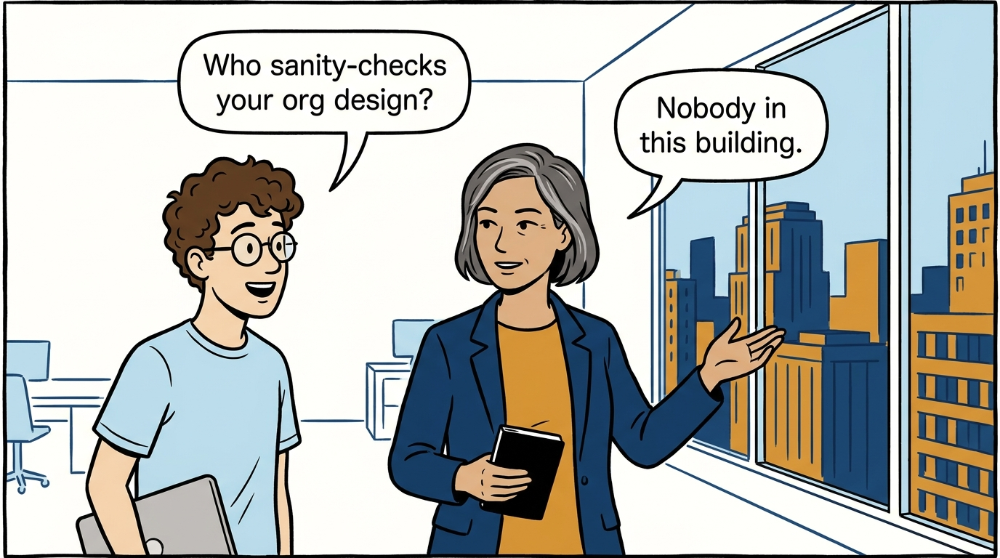
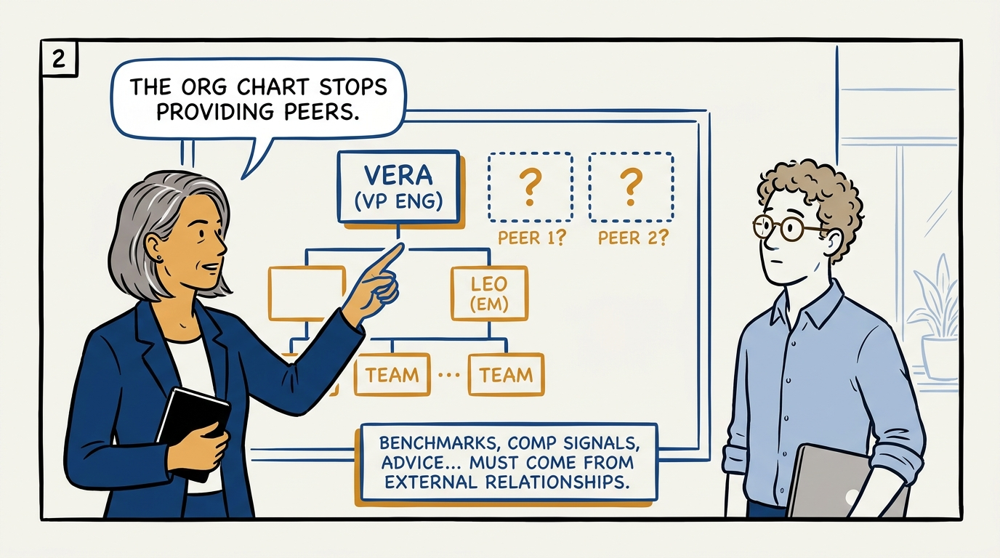
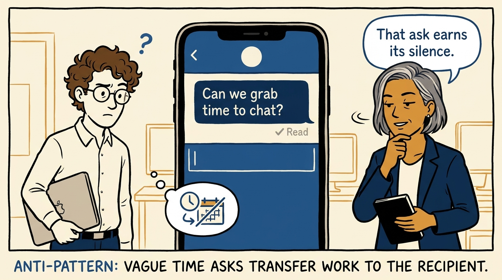
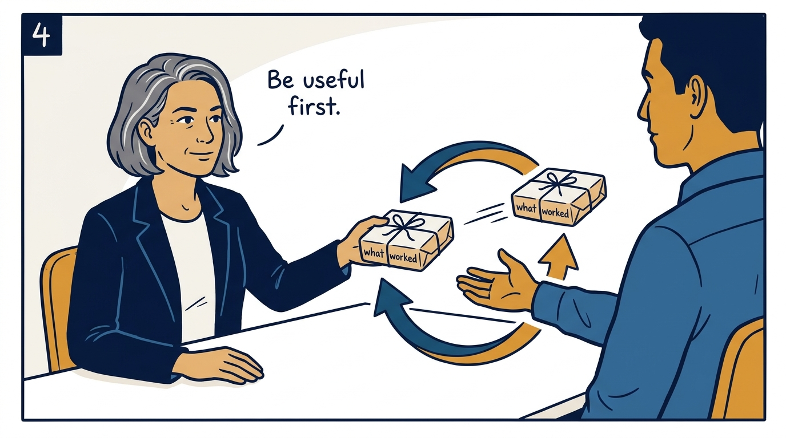
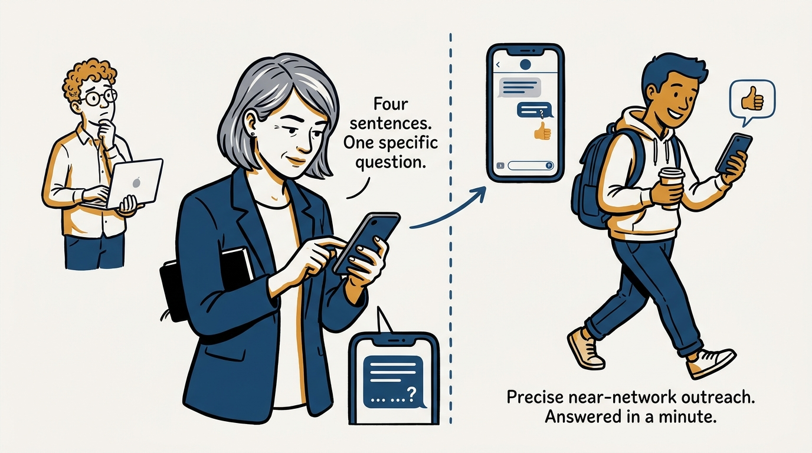
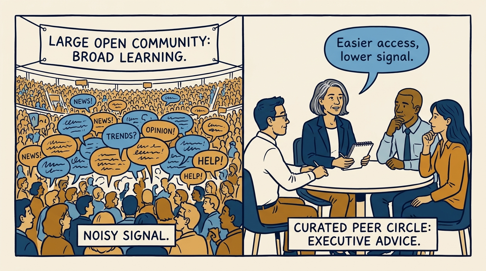
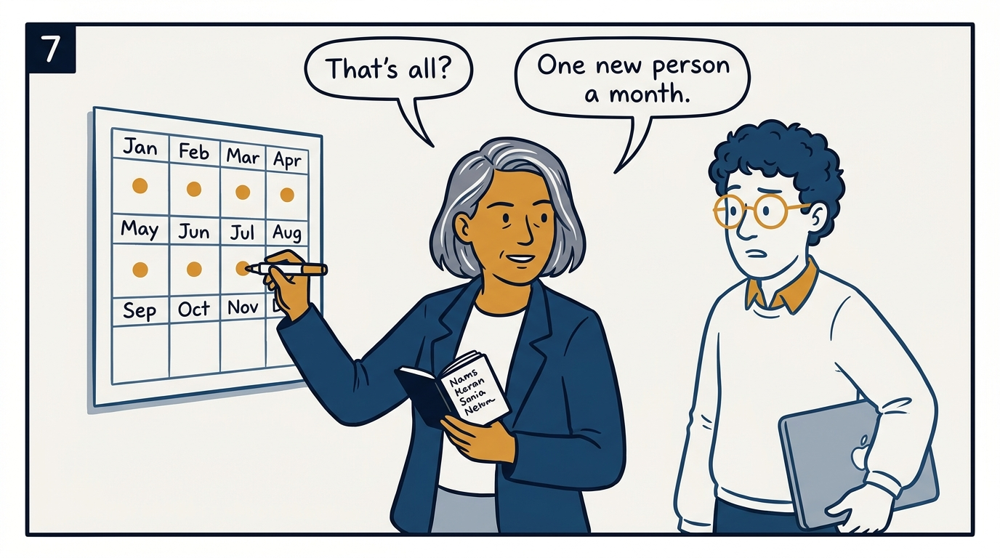

Why an executive network is infrastructure, and how to build one without it becoming a second job.

<!-- comic-style
{
  "cast": "VERA: a calm, seasoned engineering executive, short gray-streaked hair, dark blazer over a plain t-shirt, carries a small black notebook. LEO: an eager young engineering manager, curly hair, round glasses, laptop under one arm.",
  "style": "Clean two-tone explainer comic, thick ink outlines, flat colors with deep blue and amber accents on a light background, generous white space, hand-lettered speech bubbles with SHORT readable text, no photorealism."
}
-->

**Panel 1:** *The hook: the questions that matter most cannot be asked internally.*

**Panel 2:** *The problem: at the top, the org chart no longer provides a peer group.*

**Panel 3:** *Anti-pattern: the vague ask makes the recipient do all the work.*

**Panel 4:** *The principle: a network is a long-term exchange of value, not extraction.*

**Panel 5:** *Outreach discipline: two to four sentences, one clear question, answerable in a minute.*

**Panel 6:** *Small and curated beats large and open for sensitive questions.*

**Panel 7:** *The rhythm: consistency over intensity — about one new person a month.*

**Panel 8:** *Closer: the network stays important — and never becomes the job.*
