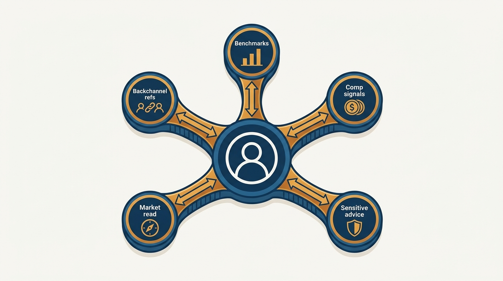
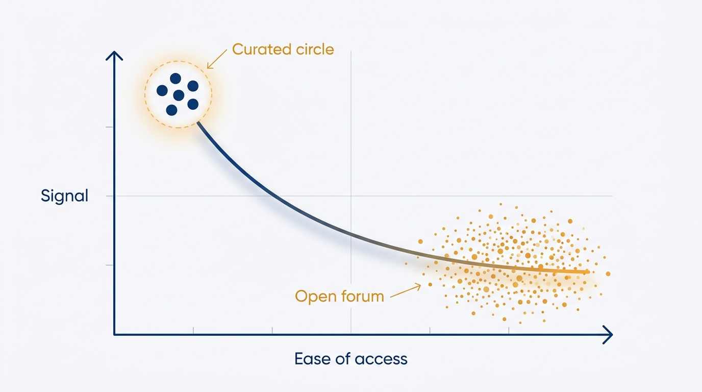

> **Status**: DRAFT
>
> **Principle**: I build and use my executive network as a long-term exchange of value, not extraction. I clarify one or two learning goals and prioritize relationships aligned to what I am actively learning; I favor working together and precise near-network outreach — two to four sentences, one specific question — over vague "can we chat" asks; and I prefer small curated peer circles to large forums, because easier access means lower signal. The whole practice runs at a sustainable, modest rhythm: networking stays important, but it is never my top priority.

## Statement

A curated network is executive infrastructure — the channel through which I benchmark team sizes and org structures, calibrate vendor pricing and compensation, get sensitive executive-team advice, read the job market, and run backchannel references on senior hires. None of that comes from a database; all of it comes from relationships. Four commitments govern how I build and use them:

- **Exchange of value, not extraction.** I focus on being useful to others, not just getting help. I respect people's time and social capital, and I assume the whole thing takes consistent effort over years.
- **Goals before contacts.** I define one or two specific learning goals — org design, pricing, hiring — and prioritize relationships aligned to what I am actively learning, rather than accumulating contacts indiscriminately.
- **Precision in outreach.** The best network-building is working together. When I reach out cold, it is to my near network (mutual connections), in two to four concise sentences, with one clear, specific question — never a vague ask, never a demand on someone's calendar, never repeated follow-ups into silence.
- **Small and curated over large and open.** For executive-level discussion I prefer a small, private peer circle with thoughtful members and a code of conduct. Large communities are for broad learning, not for sensitive questions.

**Figure 1:** *The network as executive infrastructure: two-way relationships carrying what no internal channel can.*

## How to Read This

This record tells engineering leaders — including future me — how much I invest in networking and how, and tells peers and near-network contacts what an outreach or exchange with me looks like. The working practices, from outreach discipline to the sustainable rhythm, live in the **Checklist** tab of this post. Public writing and speaking appear here only as a secondary networking channel; as a reputation strategy they belong to [[personal-and-organizational-prestige]], and using the network to find a role belongs to [[getting-the-job]].

## Rationale

**Executives need an outside network because the inside cannot answer their questions.** Once I am the most senior engineering leader in a company, nobody inside it can benchmark my org design, sanity-check a vendor renewal, calibrate executive compensation, or advise on a sensitive executive-team conflict. The questions that matter most at this level are exactly the ones that cannot be asked internally — so the network is not a career accessory; it is the peer group the org chart no longer provides.

**Value flows back to people who send it out.** A network built on extraction depletes itself: people notice one-way relationships and quietly stop responding. So I close loops deliberately — after receiving help, I share the outcome and what worked, and I thank people for the specific advice. Being useful first is not politeness; it is what keeps the channel alive for the next decade.

**Easier access means lower signal.** Large open communities are valuable for broad learning, but they cannot carry executive-grade discussion: sensitive details do not belong in public spaces, and complex issues rarely get high-quality answers there. The advice worth having concentrates in small, private, curated circles — which is why I invest in one, with strong communicators, a code of conduct, and a real commitment to operating the group.

**Figure 2:** *Easier access means lower signal: executive-grade discussion concentrates in small, private, curated circles.*

**Vague asks are the tax that kills outreach.** "Can we grab some time to chat?" transfers all the work to the recipient: they must guess the topic, estimate the cost, and schedule the meeting. A two-to-four-sentence message with one specific question can be answered from a phone in a minute. The discipline is not etiquette — it is what makes the difference between outreach that works and outreach that gets ignored. And when outreach isn't working, I ask for feedback on my approach rather than doubling the volume.

**Figure 3:** *Anatomy of outreach that works: two to four sentences, one specific question, no work transferred to the recipient.*

**A modest rhythm outlasts a sprint.** Networking rewards consistency over intensity: one new person a month, light periodic follow-ups with useful context, a simple record of who I have connected with. Anything heavier competes with the actual job — and per [[managing-energy]], the practice has to stay important without becoming a top priority.

## What This Means in Practice

| What this principle says | What it does **not** say |
| --- | --- |
| Networking is a long-term exchange of value. | Keep score on every favor — the repayment is eventual and diffuse. |
| Focus relationships on 1–2 active learning goals. | Ignore people outside the goals — working relationships remain the high-leverage path. |
| Cold outreach: near network, 2–4 sentences, one specific question. | Never reach out cold — done precisely, it works. |
| Prefer small curated circles for executive discussion. | Abandon large communities — they are still where I learn broadly. |
| Keep a modest, sustainable rhythm (about one new person a month). | Networking is my top priority — it stays important, never first. |

Beyond peers, three other networks get deliberate, lighter-touch investment: **founders** (for perspective, and for advice when navigating founder dynamics), **venture capitalists** (pattern-level relationships for portfolio- and industry-level questions, met through CEO and board connections), and **executive recruiters** (relationships built before I need a job, maintained with periodic light-touch contact). Each is a thin variation of the same exchange-of-value principle.

## Anti-Patterns

- **The vague ask.** "Can we grab some time to chat?" — a time-based request with no question in it. It signals that my convenience outranks their cost, and it deserves the silence it usually gets.
- **Extraction networking.** Appearing only when I need something — a reference, an introduction, a job — and vanishing between needs. Networks route around one-way nodes.
- **The multi-part request.** Bundling three questions and two introduction asks into one message. Confusing requests get deferred forever; one clear question gets answered today.
- **Introductions without mutual value.** Asking someone to spend their social capital connecting me with no story for why the other side benefits.
- **Overconsuming communities.** Harvesting answers from other people's forums and circles without ever contributing back.
- **Content as the primary strategy.** Relying on writing and speaking to build the network. I write when I enjoy it — but weighed against direct outreach and working relationships, content is the secondary channel, per [[personal-and-organizational-prestige]].

## Related Records

- [[personal-and-organizational-prestige]] — the passive-awareness complement: prestige makes people receptive; the network is the active relationships.
- [[getting-the-job]] — where the network gets spent: finding and evaluating the next role.
- [[onboarding-peer-executives]] — the deepest form of network-building: turning a new peer into a long-term working relationship.
- [[working-with-your-ceo-peers-and-engineering]] — the internal peer network this external one complements.
- [[managing-energy]] — the sustainable-rhythm constraint that keeps networking from becoming a second job.

## Scope and Revisiting

This principle governs my own networking practice — the mindset, the outreach discipline, and the rhythm. I revisit it when my learning goals change (which should redirect where the effort goes), when outreach stops getting responses (a signal to seek feedback on my approach, not to increase volume), and at role transitions, when the network's value becomes most visible.

## Authoritative References

- Will Larson, *The Engineering Executive's Primer* (O'Reilly, 2024) — the "Your Network" chapter this record's checklist distills; the principle above is my operating commitment to it.
- Will Larson, [Building your executive network](https://lethain.com/building-exec-network/) — the freely available companion essay.
