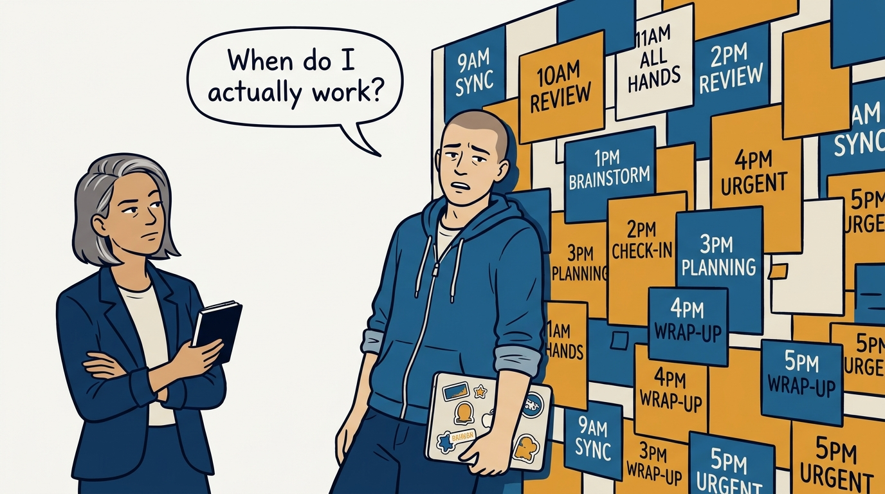
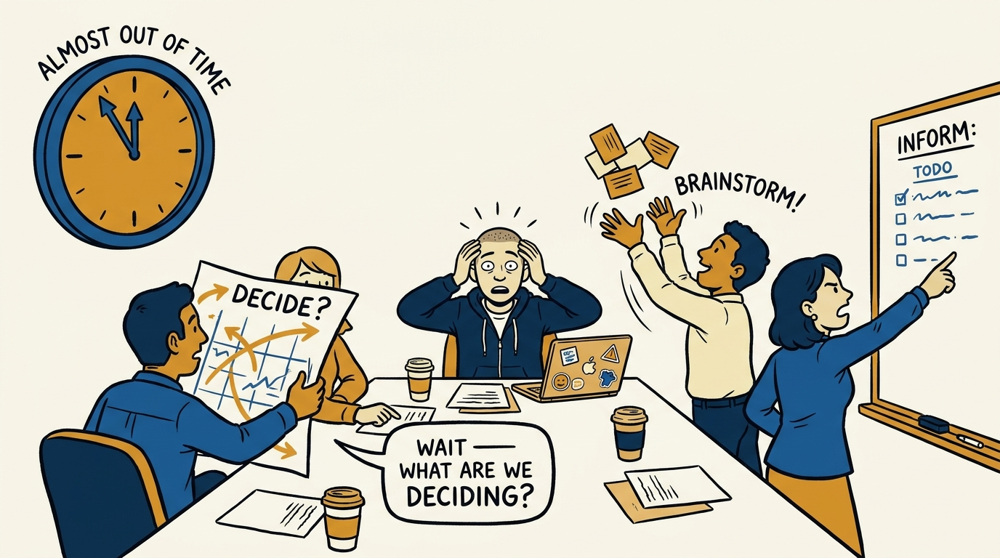
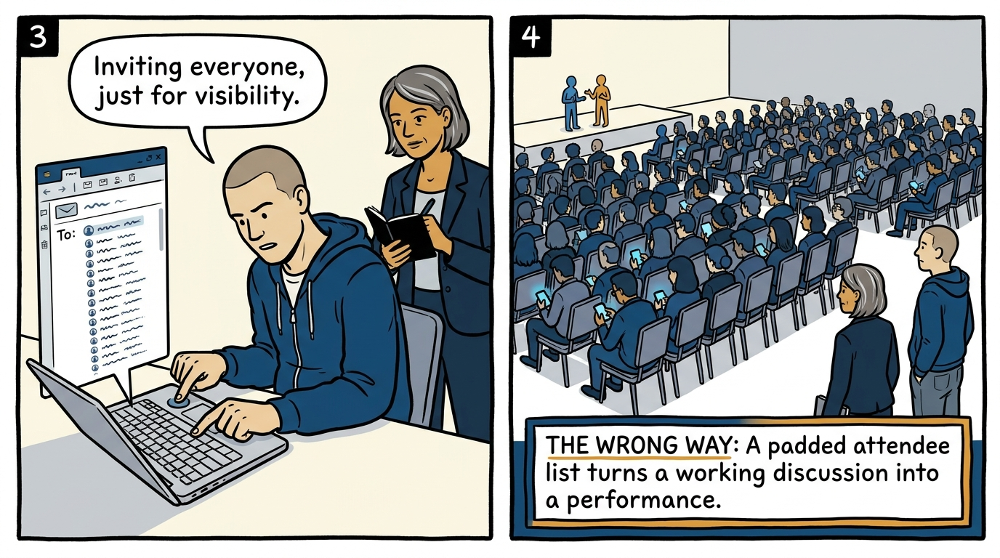
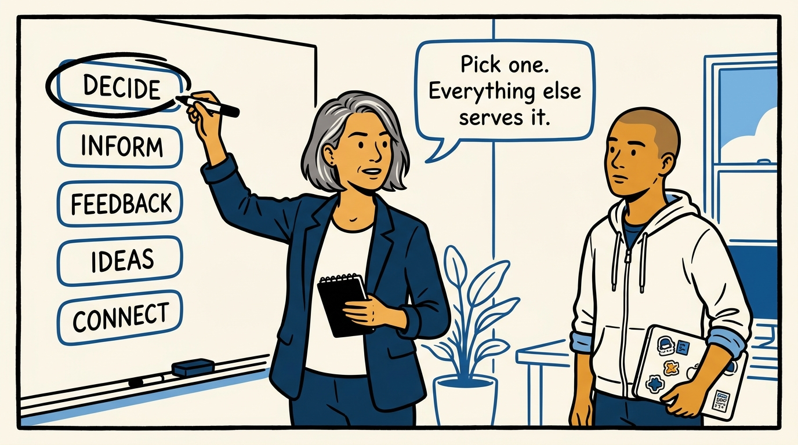
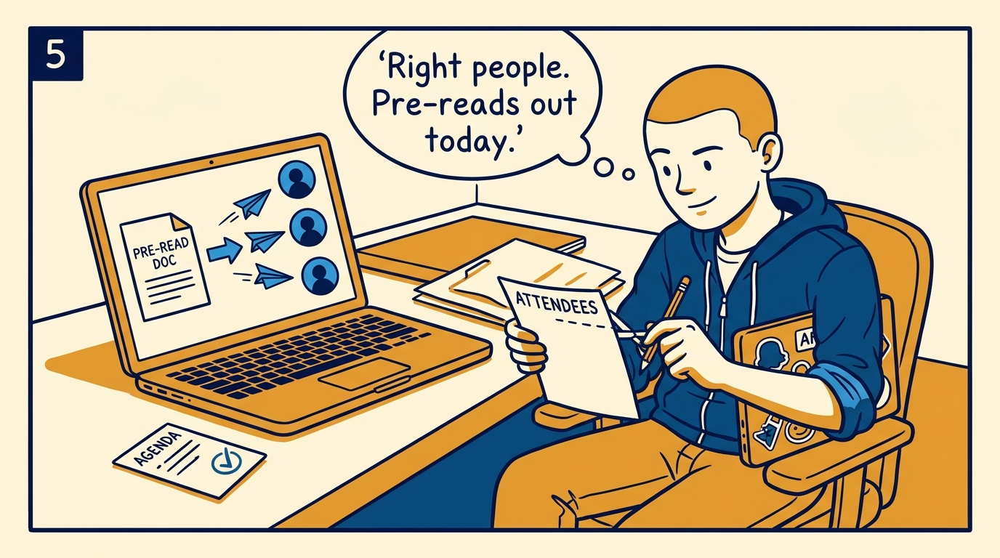
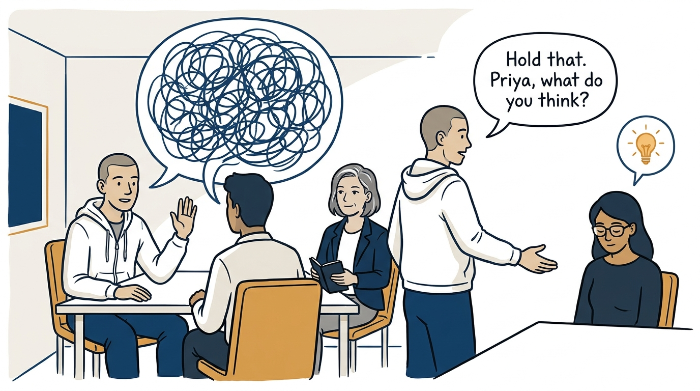
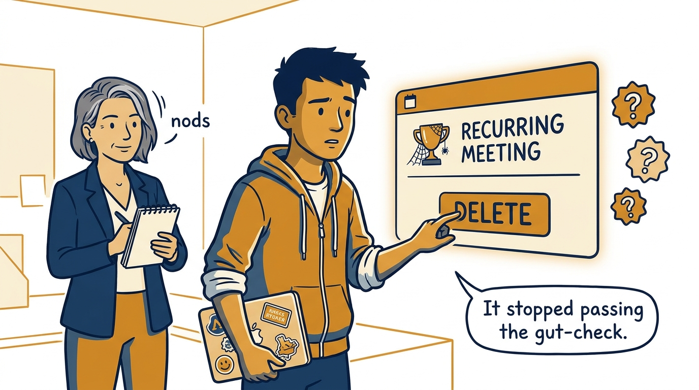
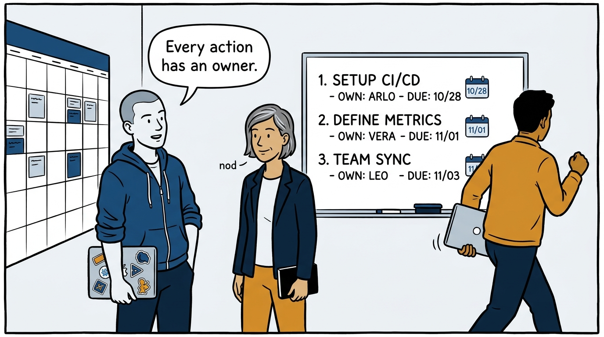

Why a meeting earns its slot with one primary purpose — and dies by the gut-check when it stops passing — in eight panels.

<!-- comic-style
{
  "cast": "VERA: a calm, seasoned engineering executive, short gray-streaked hair, dark blazer over a plain t-shirt, carries a small black notebook. ARLO: an engineer newly stepping into management, buzz-cut hair, zip-up hoodie with rolled sleeves, sticker-covered laptop under one arm.",
  "style": "Clean two-tone explainer comic, thick ink outlines, flat colors with deep blue and amber accents on a light background, generous white space, hand-lettered speech bubbles with SHORT readable text, no photorealism."
}
-->

**Panel 1:** *The hook: a calendar full of meetings that were never asked to justify themselves.*

**Panel 2:** *The problem: the everything meeting — three purposes at once, none of them served.*

**Panel 3:** *The wrong way: the audience meeting — observers are not free, and the loop has cheaper channels.*

**Panel 4:** *The principle: one primary purpose, stateable as an outcome — the constraint that makes every other choice decidable.*

**Panel 5:** *How it runs: the meeting is designed before it opens — necessary people only, context sent ahead.*

**Panel 6:** *The mechanic: facilitation is active work — the loudest voices are not a representative sample.*

**Panel 7:** *The cost: the gut-check spares no one — including the meeting you created.*

**Panel 8:** *The closer: outcomes summarized, every action owned — and a calendar that shows the meetings that no longer happen.*
