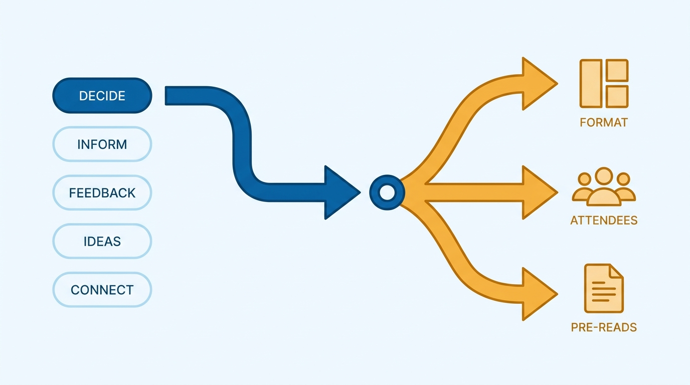
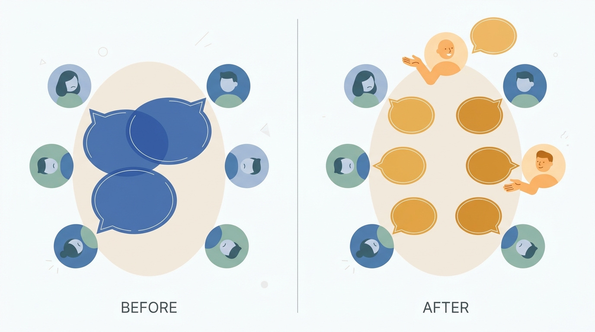
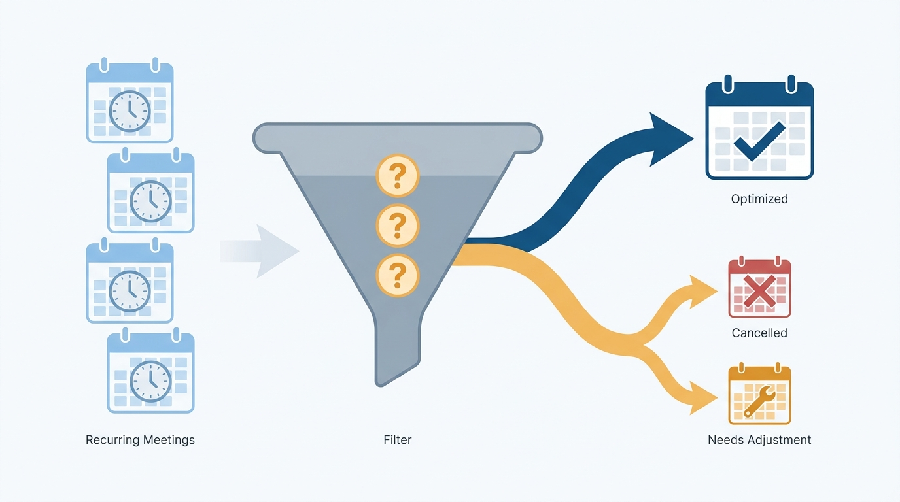

> **Status**: DRAFT
>
> **Principle**: A meeting earns its slot on other people's calendars by having one primary purpose — making a decision, sharing information, giving feedback, generating ideas, or building relationships — and by everything else serving that purpose: the format, the attendee list, the pre-reads, the facilitation. A meeting trying to do three of these does none of them; a meeting whose purpose I cannot state should not happen. And the last check is always the honest one: is this a good use of everyone's time, does it truly need to happen, and do I personally need to be there?

## Statement

My operating model for meetings has six parts:

- **One primary purpose, stated as an outcome.** Before I run a meeting, I know which of the five things it is mainly for — making a decision, sharing information, providing feedback, generating ideas, or strengthening relationships — and I can clearly state what success looks like by the end. One meeting does not get to do too many things.
- **Format and attendees follow the purpose.** The structure fits the goal; off-topic discussion gets redirected and parked. Everyone necessary is invited, no one extraneous is, the people affected are represented, and the list supports useful discussion rather than passive observation.
- **Preparation is the organizer's job.** The agenda goes out in advance, pre-reads and slides are shared when needed, participants have enough context to contribute thoughtfully, and I have planned how follow-ups will be captured before the meeting starts.
- **Participation is made safe, and airtime is managed.** I explicitly encourage questions, dissent, and honest input; use formats that help quieter people contribute; watch for interruptions; make space for people who have not spoken; use directed questions; and limit overtalking politely but firmly.
- **Every meeting closes with clarity.** Decisions, feedback, or ideas are summarized before the end; next steps are agreed; every action item has an owner and a timeline or next check-in.
- **Every meeting passes the gut-check — or gets cancelled.** Is this a good use of people's time? Will attendees leave with new knowledge, clearer next steps, a sense of engagement? Does this meeting truly need to happen, and do I personally need to be there? A "no" is an instruction, not a mood.

## How to Read This

This journal is my engineering-management operating model, each record grounded in one source. This record distills the meetings chapter of Julie Zhuo's *The Making of a Manager* (Portfolio/Penguin, 2019) — her taxonomy of five meeting purposes and her insistence that a great meeting is designed backward from the outcome its attendees should leave with. The runnable version — the general checklist plus the per-purpose checks for decision, information-sharing, feedback, idea-generation, and relationship-building meetings — lives in the **Checklist** tab of this post.

## Rationale

**A meeting without a stated purpose optimizes for nothing.** Zhuo's five purposes are not a filing system — they are a design constraint. A decision meeting needs a designated decision-maker, credible options presented objectively, and fair airtime for dissent; an idea-generation meeting needs quiet thinking time and a format that collects ideas from everyone; a relationship-building meeting needs openness, not an agenda packed with status. These requirements conflict, which is exactly why a meeting trying to decide, inform, and brainstorm at once does all three badly. Naming the primary purpose is what makes every other design choice decidable.

**Figure 1:** *One primary purpose is the design constraint: once it is named, format, attendee list, and preparation all become decidable.*

**The attendee list is a design decision, not a courtesy broadcast.** Every missing necessary person turns the meeting into a rehearsal for the real one; every extraneous attendee dilutes the discussion and normalizes passive observation. The tests are symmetric: everyone necessary, no one extraneous, the affected people represented. Inviting someone "to keep them in the loop" is what written summaries are for.

**Unprepared attendees spend the meeting becoming prepared.** If the agenda, pre-reads, and context arrive with the meeting instead of before it, the first half of the slot is consumed reconstructing what a document could have delivered. Sending materials in advance is not politeness — it moves the ramp-up out of the room so the shared time is spent on what actually requires being together. Planning in advance how follow-ups will be captured serves the same end: the close of the meeting is designed before it opens.

**The loudest voices are not a representative sample.** Left alone, a meeting's airtime distributes by confidence and interruption tolerance, not by who has the most useful thing to say. Managing this is the facilitator's job, and it is active work: explicitly inviting dissent, setting norms for respectful discussion, choosing formats that help quieter people contribute, watching for interruptions, directing questions at people who have not spoken, and limiting overtalking — politely, but firmly. A decision that only the talkers shaped will also be a decision only the talkers feel bound by.

**Figure 2:** *Left alone, airtime distributes by confidence; facilitated, it distributes by who has something useful to say.*

**A meeting that ends without owners ends without consequences.** The summary before the close — what we decided, what feedback was given, which ideas we are carrying forward — is what converts an hour of talk into a record. Next steps without an owner and a timeline are wishes. And the discipline runs one level higher too: the recurring meeting that no longer passes the gut-check — no longer a good use of time, no longer truly necessary, no longer needing me in the room — gets restructured, delegated, or cancelled rather than ritually attended.

**Figure 3:** *The gut-check runs as a standing filter: a recurring meeting that no longer passes gets cancelled or restructured, not ritually attended.*

## What This Means in Practice

| What this record says | What it does **not** say |
| --- | --- |
| Every meeting has one stated primary purpose and a definition of success. | A standing meeting justifies itself by being on the calendar. |
| Format, attendees, and prep are chosen to serve that purpose. | One format — status-round-plus-discussion — fits every meeting. |
| Everyone necessary is in the room; no one extraneous is. | Inviting broadly is a safe default — observers are free. |
| Agendas and pre-reads go out in advance. | Context can be delivered live in the first twenty minutes. |
| I actively manage airtime and invite dissent. | Whoever talks most has the most to say. |
| Meetings close with summarized outcomes, owners, and timelines. | "Great discussion" is an acceptable ending. |
| Meetings that fail the gut-check are cancelled or restructured. | Cancelling a recurring meeting is an insult to its organizer. |

Concretely: anyone attending my meetings can state the meeting's purpose in one sentence, received the materials in advance, and leaves knowing the decisions made, who owns each next step, and when it is due. And my calendar shows the negative space too — meetings I declined because I was not needed, and recurring meetings I killed when the gut-check said no.

## Anti-Patterns

- **The everything meeting.** One slot trying to decide, inform, brainstorm, and bond at once — leaving every purpose half-served and every attendee unsure why they were there.
- **The purposeless recurring meeting.** A standing invite that outlived its reason, attended out of ritual because no one asked the gut-check questions.
- **The audience meeting.** An attendee list padded with observers "for visibility," turning a working discussion into a performance.
- **Live ramp-up.** No agenda, no pre-reads — the meeting spends its first half delivering context a document could have carried.
- **Facilitation by gravity.** Letting airtime settle on the loudest voices, treating quiet as agreement and interruption as enthusiasm.
- **The ownerless close.** Ending on "great discussion" with next steps that belong to no one and are due never.
- **The fake decision meeting.** Convening people to "decide" something already decided — a special case of a meeting whose real purpose is not the stated one.

## Related Records

- [[getting-things-done]] — meetings are where much of a team's execution is coordinated; this record keeps that coordination from becoming its own tax.
- [[leading-a-small-team]] — the team rhythm these meetings serve; 1:1s are the relationship-building purpose run on a cadence.
- [[feedback]] — the feedback-meeting checks in this record apply the feedback discipline to work-in-progress reviews.
- [[meetings]] (executive journal) — the executive-calendar counterpart: which meetings an executive runs and attends; this record governs how any single meeting is designed and facilitated.

## Scope and Revisiting

This record is `draft`. It governs every meeting I organize or run — its purpose, format, attendee list, preparation, facilitation, and close — and the standing gut-check applied to recurring meetings I attend. I revisit it if attendees cannot state a meeting's purpose when asked, if action items from my meetings recur without owners, or if a quarter passes without a single recurring meeting being restructured or cancelled — a sign the gut-check has stopped running.

## Authoritative References

- Julie Zhuo, *The Making of a Manager: What to Do When Everyone Looks to You* (Portfolio/Penguin, 2019) — the "Amazing Meetings" chapter this record distills.
