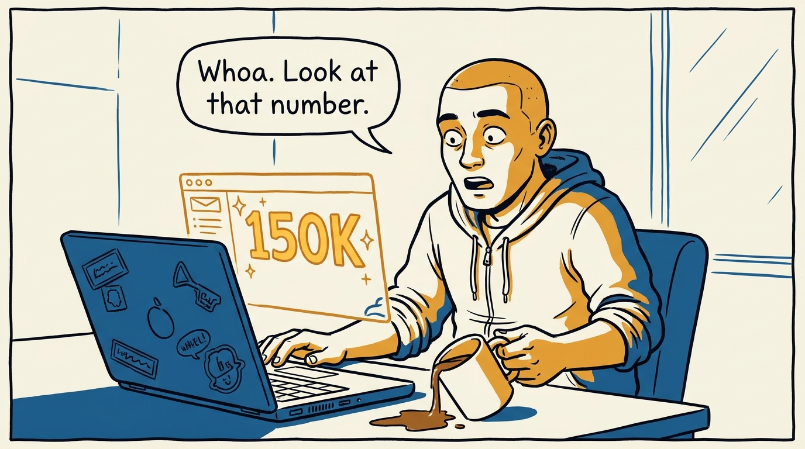
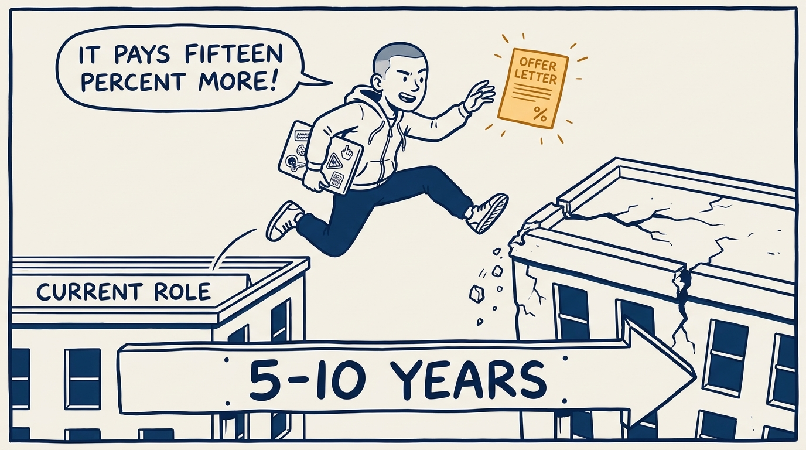
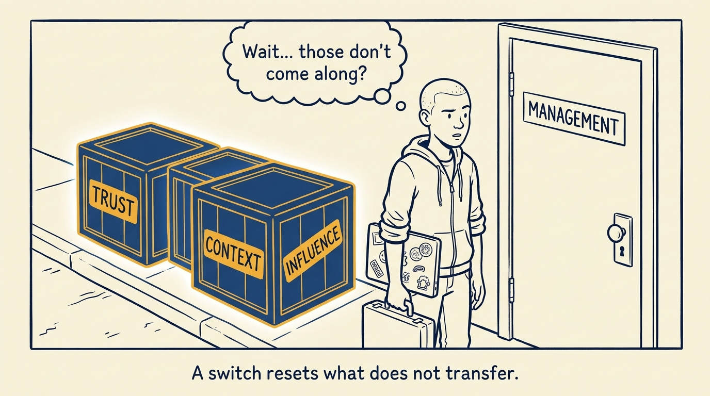
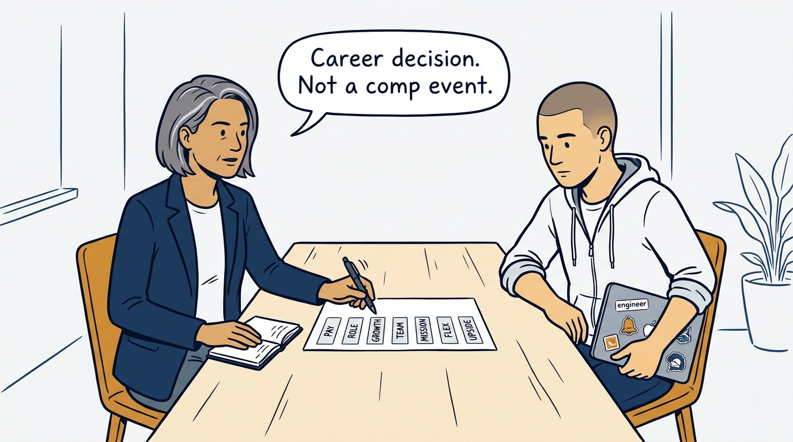
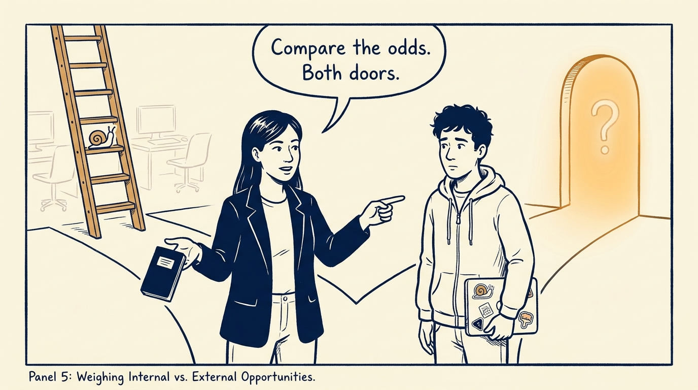
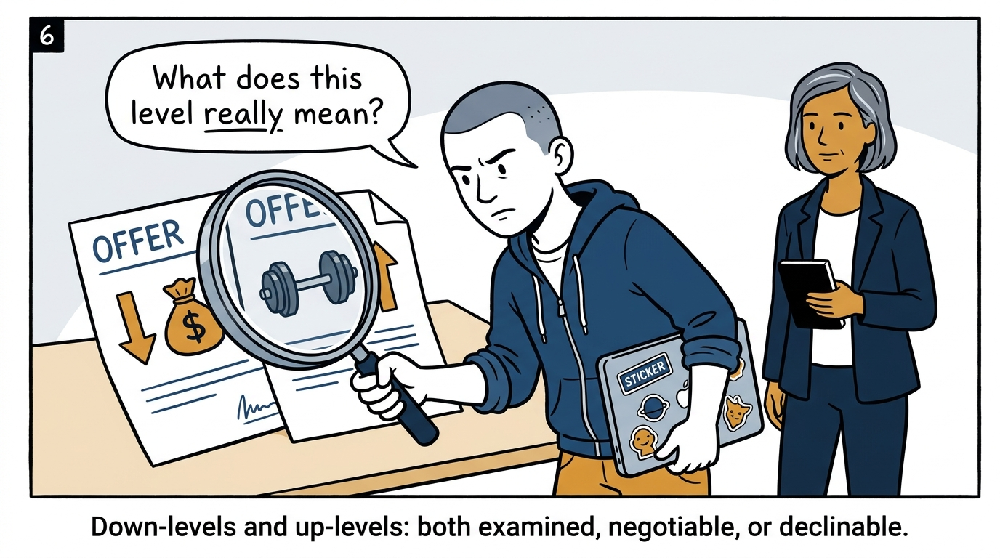
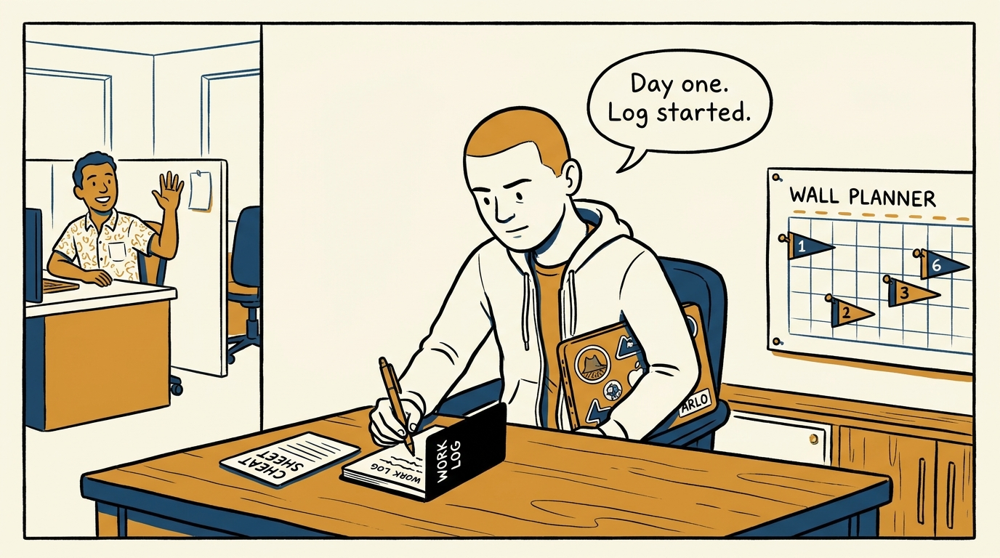
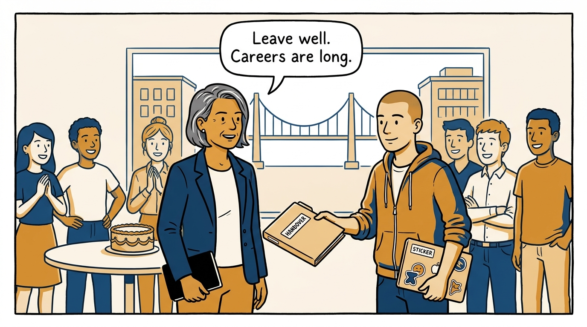

Why a job change is a 5–10 year career decision, not a compensation event — in eight panels.

<!-- comic-style
{
  "cast": "VERA: a calm, seasoned engineering executive, short gray-streaked hair, dark blazer over a plain t-shirt, carries a small black notebook. ARLO: an eager early-career engineer climbing the ladder — in some strips a new lead or manager, in others the engineer being coached — buzz-cut hair, zip-up hoodie with rolled sleeves, sticker-covered laptop under one arm.",
  "style": "Clean two-tone explainer comic, thick ink outlines, flat colors with deep blue and amber accents on a light background, generous white space, hand-lettered speech bubbles with SHORT readable text, no photorealism."
}
-->

**Panel 1:** *The hook: a flattering number lands in the inbox — and starts driving the search.*

**Panel 2:** *The problem: a move judged on the next offer letter, not the 5–10 year career it lands in.*

**Panel 3:** *The wrong way: pricing what the switch pays but not what it resets — trust, context, and influence stay behind.*

**Panel 4:** *The principle: a job change is a 5–10 year career decision — compared on every axis, coached honestly, even toward the door.*

**Panel 5:** *How it runs: someone already at the next level weighs internal odds against external offers — with the manager's honest help.*

**Panel 6:** *The mechanic: a down-level is judged on title and pay together — and an up-level is higher expectations from day one.*

**Panel 7:** *The follow-through: the move is won in the first months — goals at one, three, and six months, work log from day one.*

**Panel 8:** *The closer: lose someone well rather than keep them badly — an engineer who leaves deliberately stays a colleague for decades.*
