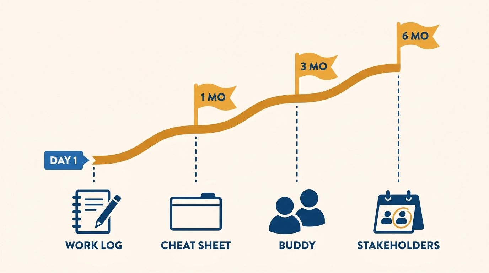

> **Status**: DRAFT
>
> **Principle**: A job change is a career decision with a 5–10 year horizon, not a compensation event — and I coach it that way, even when the honest advice points out the door. I expect engineers to explore deliberately rather than react to recruiter mail, to weigh internal promotion against switching with full awareness of what a switch resets — trust, context, influence — to treat interviewing as a learnable skill and leveling as negotiable, and to take onboarding as seriously as the interview. I would rather lose an engineer well than keep them badly: someone who leaves deliberately and lands well stays a colleague for decades.

## Statement

What I expect from engineers navigating a job change, and how I coach each stage:

- **Know your stance before you engage.** I expect engineers to decide whether they are actively looking, passively open, or happy but curious — and to know what would actually make a move worth pursuing, so recruiter conversations inform rather than destabilize. Comparing opportunities means comparing compensation, role, growth, team, mission, flexibility, and long-term upside — not one number.
- **Weigh promotion against switching honestly — with my help.** Someone already performing at the next level, inside a slow or backward-looking promotion process, should compare internal odds with external offers. I will make that comparison with them honestly, including the part that argues for staying: a switch resets trust, context, and influence, and for senior roles tenure and relationships are much of the value.
- **Treat interviewing as a learnable skill.** Ask the recruiter what the process looks like; prepare specifically for coding, system design, behavioral, and domain rounds; expect deeper and additional rounds at staff+ levels. Interview performance is prepared, not innate, and I say so plainly.
- **Handle leveling with clear eyes.** A down-leveled offer is judged on title *and* compensation together, against what the offered level means at that company — and it can be pushed back on or walked away from. An up-leveled offer needs clear expectations, an understanding of why they believe you're ready, and the support to deliver from day one.
- **Onboard as seriously as you interviewed.** Celebrate the offer, then prepare: ask the future manager how to prepare, clarify goals for the first one, three, and six months, keep a work log from day one, learn how reviews and promotions work, and meet key people early.
- **Leave well.** The move is part of a long career among the same people. No burned bridges, no coasting notice periods — the way someone leaves my team is the last thing everyone remembers.

## How to Read This

This journal is my engineering-management operating model. This record is grounded in the Changing Jobs material of Gergely Orosz's *The Software Engineer's Guidebook* (Pragmatic Engineer, 2023), read from the manager's side of the table: the book tells engineers how to run the move; this record states how I coach engineers through it — including honestly toward the door when that is the right answer. The runnable version — the checklist I hand an engineer weighing or making a move — lives in the **Checklist** tab of this post.

**Figure 1:** *The move is one arc, not one event: it starts before the recruiter mail and keeps counting years after the offer is signed.*

## Rationale

**A manager who can't discuss leaving can't coach a career.** If the only career conversations I can hold are the ones where the answer is "stay," my coaching is advertising. Engineers know when their promotion path is blocked or their growth has flattened, and pretending otherwise costs me credibility on everything else. Coaching the job-change arc openly means the engineers who stay are staying deliberately — and the ones who leave, leave as allies who recommend the team, refer candidates, and sometimes come back senior.

**Optimizing for title or compensation alone is the classic mispriced trade.** The source is blunt about this: think about the 5–10 year career impact, not the next offer letter. A move that pays 15% more but lands in a stagnant team, a weak manager, or work with no growth is expensive at that horizon. So I push engineers to compare opportunities on the full set — role, growth, team, mission, flexibility, long-term upside — and to treat the offer number as one input, not the verdict.

**A switch resets more than most engineers price in.** Trust, context, and influence do not transfer; they are rebuilt from zero at the new company. For an engineer early in their career that reset is cheap. For a senior engineer whose effectiveness rests on years of relationships and system knowledge, it is a real cost that an external offer's shine hides — which is why I put "what does the switch reset?" next to "what does the switch pay?" in every such conversation.

**Figure 2:** *What the switch pays is printed on the offer; what it resets — trust, context, influence — is rebuilt from zero, and costs most at senior levels.*

**Leveling at the offer stage sets the slope of the next several years.** A down-level is not automatically an insult — some companies genuinely hold higher bars, and pay can exceed the old title's — but it must be examined: what does the offered level mean, what does the next one require, can the committee reconsider? And it is legitimate to walk away if the level is badly misaligned with the career. An up-level is not automatically a win either: it is higher expectations from day one, and taking it without clear success criteria and support is how strong engineers get set up to fail.

**Onboarding is where the move is actually won or lost.** The interview gets you the job; the first months determine what the job becomes. The engineers who land well do it deliberately — goals clarified for one, three, and six months; a work log and a weekly journal from the start; a cheat sheet for acronyms, systems, and people; a buddy; early meetings with key stakeholders. At senior and staff levels the bar rises: understand the business context, meet peer staff engineers, spend time with product and cross-functional partners. I hold my own new joiners to this, and I tell departing engineers to hold themselves to it wherever they land.

**Figure 3:** *The interview gets the job; the landing decides what it becomes — goals at one, three, and six months, with the work log and the map of people started on day one.*

## What This Means in Practice

| What this record says | What it does **not** say |
| --- | --- |
| I coach job-change decisions honestly, including toward the door. | I encourage attrition — most honest conversations end with a better reason to stay. |
| Compare promotion odds with external offers when the path is slow. | Jump at the first stall — the switch's reset costs are real. |
| Weigh offers across role, growth, team, mission, and upside. | Compensation doesn't matter — it is one axis among several, and market value is worth knowing. |
| A down-leveled offer can be questioned, negotiated, or declined. | A down-level is always wrong — some companies' bars and pay make it a fair trade. |
| An up-level is accepted with clear expectations and support. | An up-level is free — it is higher expectations from day one. |
| Onboarding is prepared as seriously as the interview. | The move ends at the signed offer — the first six months decide what the move was worth. |

Concretely: an engineer on my team weighing a move can bring it to me without fear; they leave that conversation with an honest read on their internal odds, a clear-eyed comparison of what a switch buys and resets, and — if they go — a proper handover, a warm goodbye, and the onboarding checklist for their first ninety days somewhere else.

## Anti-Patterns

- **The reactive jump.** Interviewing because a recruiter's number was flattering, without ever deciding what would make a move worth it — the stance drives the search, not the inbox.
- **Optimizing for the offer letter.** Taking the highest title-and-compensation package while ignoring team, manager, growth, and the 5–10 year trajectory.
- **Ignoring what the switch resets.** Pricing the new salary but not everything rebuilt from zero — especially expensive at senior levels, where tenure is much of the value.
- **Winging the interviews.** Treating interview performance as a fixed trait instead of a prepared skill — not even asking the recruiter what the process looks like.
- **Swallowing a down-level unexamined.** Accepting a lower title without asking what the level means, whether it can be reconsidered, or whether it is misaligned enough to decline.
- **Taking an up-level without support.** Accepting the bigger title without clear expectations or the backing to meet them — arriving set up to fail.
- **Celebrating instead of preparing.** Coasting from signed offer to day one, then improvising onboarding — no goals, no work log, no map of who matters.
- **Leaving badly.** Burning bridges, coasting the notice period, or hoarding context on the way out — the last impression is the durable one.

## Related Records

- [[promotions]] — the internal alternative: what a promotion campaign here requires, and the odds a job change is weighed against.
- [[own-your-career]] — the ownership contract that makes an engineer's move deliberate rather than reactive.
- [[engineering-career-paths]] — the map of company types, ladders, and tiers a job change navigates across.
- [[thriving-in-different-environments]] — what awaits after the move: reading the new environment and adapting to it.
- [[first-three-months]] — the same landing problem from the manager's side; the onboarding discipline is shared.

## Scope and Revisiting

This record is `draft`. It governs how I coach engineers on my teams through exploring, deciding, interviewing, negotiating level, and onboarding — whether the move is internal or out the door. I revisit it if departures start surprising me — which means the honest-conversation loop has failed — if departing engineers' exit decisions repeatedly cite the same fixable internal blocker, or if the hiring market shifts enough that the leveling and preparation guidance no longer matches what engineers actually face.

## Authoritative References

- Gergely Orosz, *The Software Engineer's Guidebook* (Pragmatic Engineer, 2023) — the Changing Jobs material this record distills, via its companion checklist.
