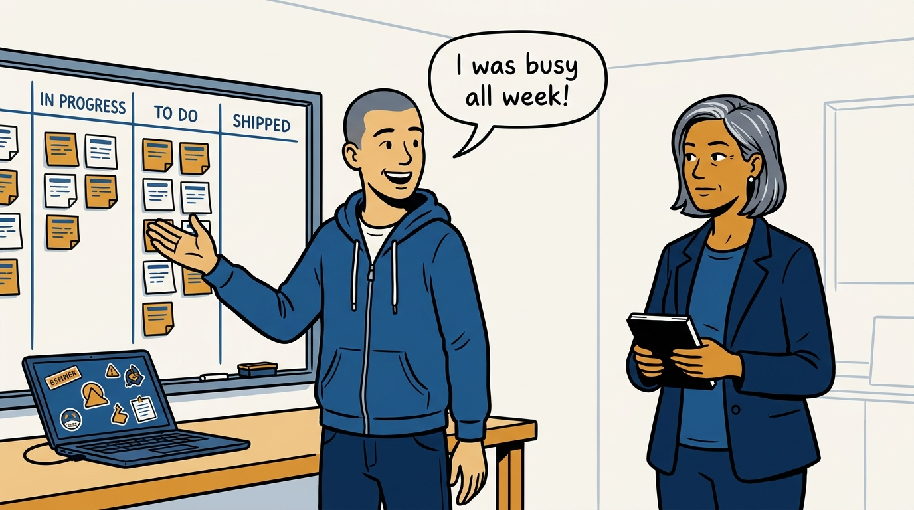
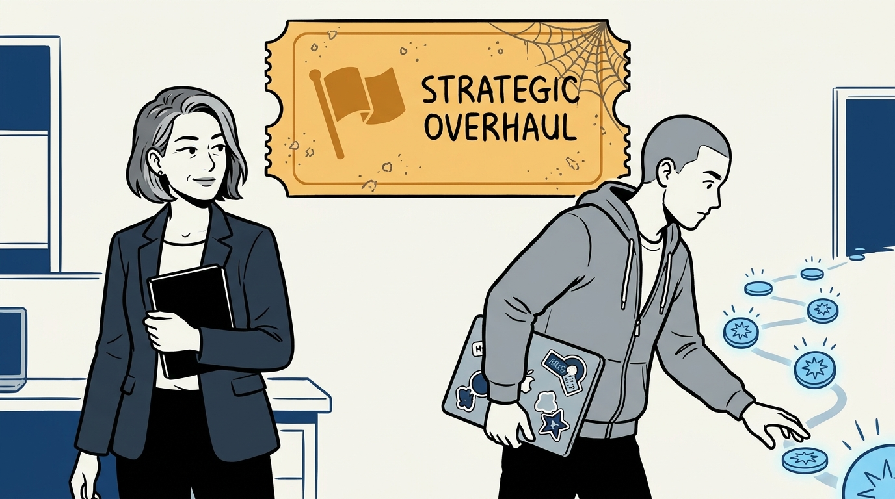
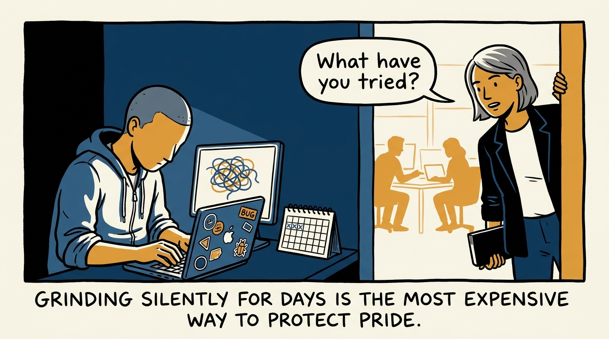
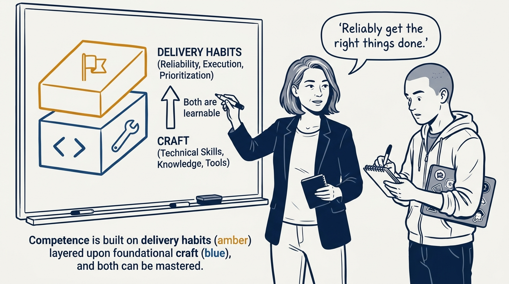
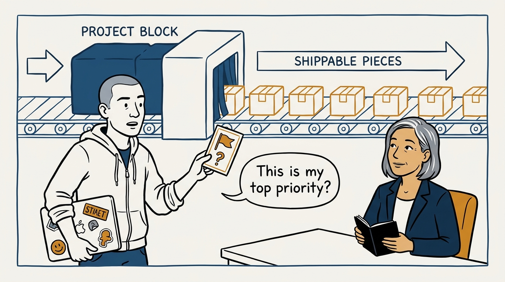
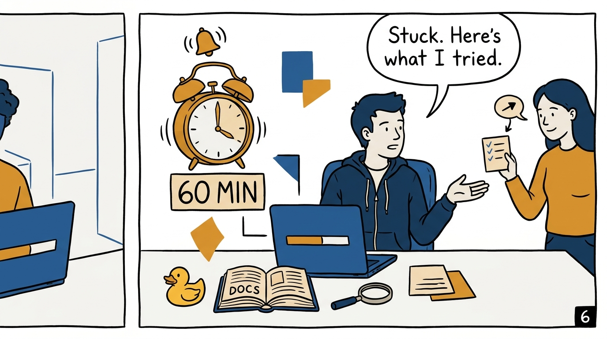
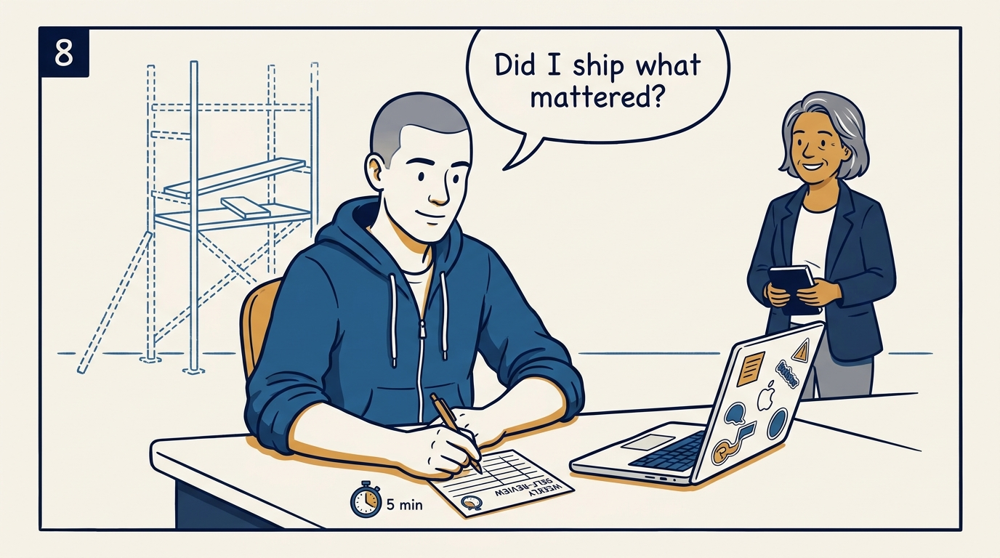

Why competence is reliably getting the right things done — not cleverness — in eight panels.

<!-- comic-style
{
  "cast": "VERA: a calm, seasoned engineering executive, short gray-streaked hair, dark blazer over a plain t-shirt, carries a small black notebook. ARLO: an engineer newly stepping into management, buzz-cut hair, zip-up hoodie with rolled sleeves, sticker-covered laptop under one arm.",
  "style": "Clean two-tone explainer comic, thick ink outlines, flat colors with deep blue and amber accents on a light background, generous white space, hand-lettered speech bubbles with SHORT readable text, no photorealism."
}
-->

**Panel 1:** *The hook: the most common failure mode is not weak code — it is busy weeks that ship nothing.*

**Panel 2:** *The problem: the top priority was never named — or was quietly displaced by whatever felt easier.*

**Panel 3:** *The wrong way: the silent grinder — days without progress and no signal to anyone.*

**Panel 4:** *The principle: competence is not cleverness — delivery habits on top of craft, and both layers are learnable.*

**Panel 5:** *How it runs: name the week's most important task, confirm it when unsure, and break work into shippable pieces.*

**Panel 6:** *The mechanic: no progress after 30-60 minutes means blocked — run the repertoire, then ask with 'here is what I tried.'*

**Panel 7:** *The cost: the craft is a floor, not a flourish — tests, small refactors, and defensive code, practiced daily.*

**Panel 8:** *The closer: five minutes a week — the self-review is what remains when the coaching scaffolding comes down.*
