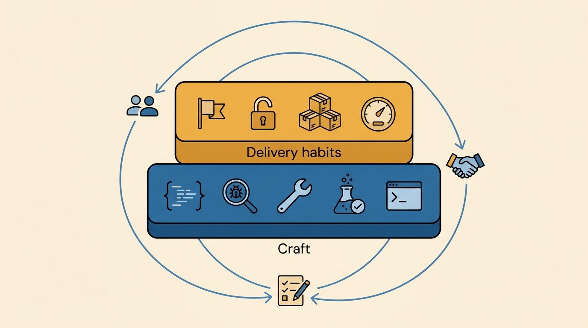
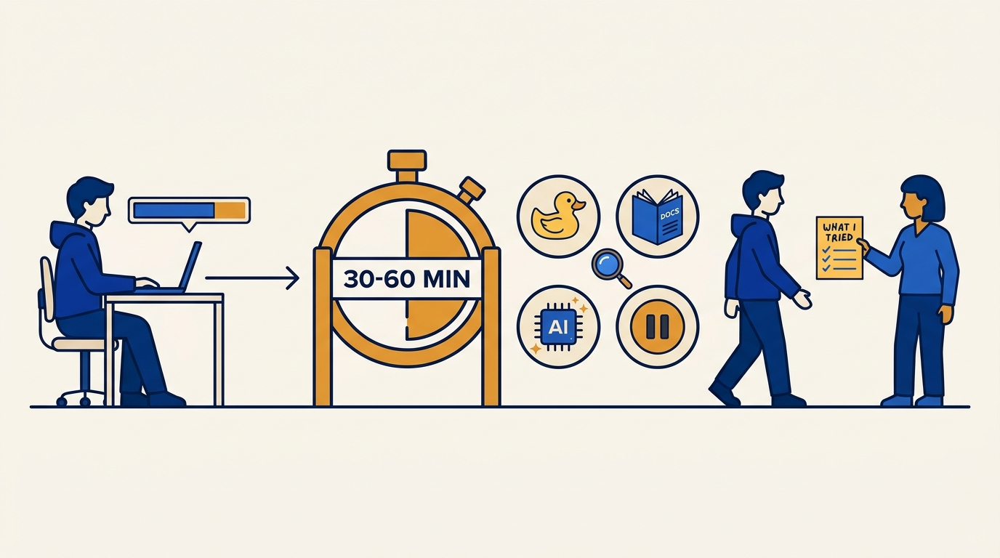
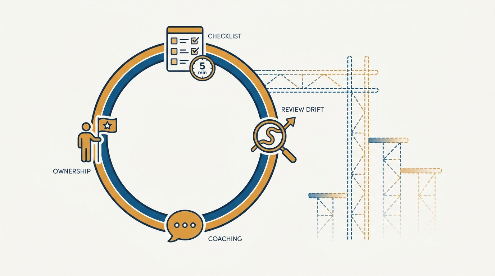

> **Status**: DRAFT
>
> **Principle**: Competence in a software engineer is not cleverness — it is reliably getting the right things done. The baseline I hold every engineer to has two layers: delivery habits (know your top priority each week and ship it, notice you are blocked within 30–60 minutes and act, break work into shippable pieces, estimate honestly and update loudly) and the craft underneath (readable defensive code, real debugging, everyday refactoring, testing as part of development, mastered tools). Both layers are learnable, so I coach them explicitly — through mentors, through goodwill on the team, and through a short weekly self-review — rather than waiting for engineers to absorb them by osmosis.

## Statement

The expectations I hold every engineer to, and coach them along:

- **Getting things done is the baseline, not a bonus.** I expect every engineer to know their single most important task each week, confirm it with their manager when unsure, deliver it in the agreed timeframe, and say "no" or renegotiate — with tradeoffs stated — when lower-priority work threatens it.
- **Blocked is a state you notice and exit.** The rule of thumb I coach: no meaningful progress after 30–60 minutes means you are blocked. Try different approaches first — rubber-duck it, draw it, read the docs, search, ask a channel, use AI tools carefully and verify, take a break, undo recent changes — then ask a teammate, explaining what you already tried. When another person is the blocker, escalate politely and preserve the relationship.
- **Work arrives broken down and honestly estimated.** Large projects split into epics, stories, and tasks until each is clear and actionable; the golden path identified and edge cases separated; estimates anchored on similar past work, prototyped where unfamiliar, worst-cased where uncertain, and updated when new information appears.
- **Craft is practiced, not assumed.** Coding regularly on real problems, reading other people's code before changing it, writing readable code that follows team conventions, and writing defensive code: validate inputs, treat external input as potentially malicious, expect error states, prefer safe defaults.
- **Debugging, refactoring, and testing are part of development.** A debugger used properly, root cause confirmed before fixing, refactoring as an everyday habit with small steps and tests after each, and testing — including edge cases and regression tests for bugs — done before review, not thrown to a later phase.
- **Tools are mastered.** The IDE learned deeply, Git and the command line used confidently, basic SQL and regular expressions in hand, AI assistants used carefully, and pull requests kept small, focused, and clearly summarized.
- **Growth is deliberate.** Every engineer at this stage seeks mentors — dedicated, ad hoc, and online — maintains goodwill by coming prepared and helping others back, takes initiative only after expected work is done, and runs a short weekly self-review.

**Figure 1:** *Two learnable layers — delivery habits on top of craft — held together by a deliberate growth loop of mentors, goodwill, and the weekly self-review.*

## How to Read This

This journal is my engineering-management operating model; this record is the engineer career ladder seen from the manager's side. It is grounded in the Competent Software Developer chapters of Gergely Orosz's *The Software Engineer's Guidebook* (Pragmatic Engineer, 2023) — getting things done, coding, software development skills, and the tools of the productive developer. The article states the expectations I hold engineers to at this first career stage and how I coach them; the checklist I hand the engineer — written in their voice, ending with the weekly self-review — lives in the **Checklist** tab.

## Rationale

**Getting things done is what separates a competent engineer from a promising one.** The most common failure mode I see in early-career engineers is not weak code — it is busy weeks that ship nothing, because the single most important task was never identified or was quietly displaced by easier work. That is why the first expectation is prioritization, not syntax: name the top priority, confirm it when unsure, deliver it, and treat every extra request as a tradeoff to state out loud. An engineer who does only this reliably is already more valuable than a brilliant one who does not.

**Self-unblocking is a learnable skill, and the 30–60 minute rule makes it coachable.** Left alone, engineers err in both directions — grinding silently for days, or asking for help before trying anything. The source's rule of thumb gives me a concrete standard to coach against: if there is no meaningful progress after 30–60 minutes, you are blocked, and being blocked triggers a repertoire — rubber-ducking, drawing it on paper, docs, search, a Q&A channel, AI tools with verification, a break, an undo — before it triggers a teammate. Asking with "here is what I tried" attached is what keeps help-seeking cheap for the team; it is also how goodwill is built, and goodwill is a real currency I watch.

**Figure 2:** *Blocked is a state you notice and exit: the timer triggers the self-service repertoire first, and the ask arrives with "here is what I tried" attached.*

**Readable, defensive code is a team obligation, not a style preference.** Code at this level is read and modified by others far more often than it is written, so I hold engineers to the team's conventions, small functions, names that explain themselves, comments that say why, and no unnecessary complexity or over-abstracted DRY. Defensiveness is the same obligation pointed at runtime: validate inputs, treat external input as potentially malicious, expect invalid responses and unknown states, prefer safe defaults. None of this is advanced — which is exactly why I treat it as a floor rather than a distinction.

**Debugging, refactoring, and testing are the craft; tooling fluency is the multiplier.** I expect engineers to confirm a root cause before fixing, to refactor in small tested steps as a daily habit rather than a big-bang event without a safety net, and to treat testing — edge cases thought through, regression tests added for bugs — as part of development, not a separate afterthought. Around that craft sits tooling: an IDE learned deeply, Git and the shell used confidently, fast feedback loops preferred over slow edit-compile-run cycles. Tooling fluency is invisible in any single task and decisive over a year, which is why I ask about it in coaching conversations even when nothing is on fire.

**The weekly self-review turns all of this into a habit loop.** The source closes with nine questions — did I deliver my most important work, ask for help early enough, break work into shippable pieces, communicate estimates and risks, write readable tested code, learn something, get feedback, help someone, improve my workflow — and I ask engineers at this stage to run them weekly. It takes five minutes, it surfaces drift before I have to, and it hands the engineer ownership of their own baseline, which is the point: my coaching is scaffolding, and the self-review is what remains when the scaffolding comes down.

**Figure 3:** *Five minutes a week: the self-review surfaces drift before the manager has to — and it is what remains when the coaching scaffold comes down.*

## What This Means in Practice

| What this record says | What it does **not** say |
| --- | --- |
| Every engineer knows and delivers their top priority each week. | Engineers only work on one thing — extra work is fine when the tradeoff is stated and the top priority is safe. |
| No meaningful progress after 30–60 minutes means you are blocked, and blocked means act. | Ask for help the moment something is hard — the repertoire of self-service attempts comes first. |
| Estimates are anchored, worst-cased under uncertainty, and updated loudly. | Estimates are commitments — they are honest forecasts that change when the facts do. |
| Refactoring is an everyday habit in small, tested steps. | Large risky rewrites are welcome — not without a safety net. |
| Testing happens before review, including edge cases and regression tests. | Every change needs every kind of automated test — manual verification and judgment still apply. |
| Initiative is welcome — documenting, investigating, helping out. | Side efforts before the expected work is done — initiative comes after delivery, not instead of it. |
| Growth runs on mentors, goodwill, and a weekly self-review. | Growth is the manager's job alone — I coach it, but the engineer owns it. |

Concretely: when I coach an engineer at this stage, our 1:1 starts from their top priority and their self-review answers, not from a status list. When one is stuck, my first question is "what have you tried?" — and if the answer is "nothing yet, it's been two days," the coaching topic is the blocked rule, not the bug.

## Anti-Patterns

- **The silent grinder.** Days without meaningful progress and no signal to anyone — the most expensive way to protect one's pride.
- **Busy on everything, delivering nothing.** A full calendar and an untouched top priority; extra requests accepted without ever naming the tradeoff.
- **The unbreakable task.** Week-sized tasks with no golden path and edge cases tangled in — unshippable, unreviewable, unestimatable.
- **The heroic estimate.** Best-case numbers given under pressure, never worst-cased, never updated when reality diverges — until the delay announces itself.
- **Clever, hostile code.** Unnecessary abstraction, names only the author understands, inputs trusted blindly — code optimized for writing, not reading or running.
- **Help without homework.** Asking teammates before trying anything, arriving unprepared, never helping back — burning the goodwill the whole team runs on.
- **Initiative as escape.** Starting side investigations and tool research while expected work slips — distraction dressed as proactivity.

## Related Records

- [[well-rounded-senior-engineer]] — the next stage: the developer-to-engineer shift this baseline prepares for.
- [[own-your-career]] — the career-ownership habits that sit alongside this competence baseline.
- [[mentoring]] — the manager's side of the mentor-seeking this record expects from engineers.
- [[management-101]] — the two-sided contract this record plugs into: what I owe every report, and what I ask them to own.
- [[getting-things-done]] — the manager's version of the same discipline: prioritization and delivery at the team level.

## Scope and Revisiting

This record is `draft`. It governs the expectations I hold engineers to at the first career stage — delivery habits, coding craft, tooling, and self-directed growth — and how I coach against them. I revisit it if AI-assisted development shifts what "competent" means at this level (the source already flags careful, verified AI use; the balance may move), if the weekly self-review stops surfacing anything in coaching conversations, or if I find myself repeatedly excusing missed top priorities as circumstance rather than coaching them as habit.

## Authoritative References

- Gergely Orosz, *The Software Engineer's Guidebook* (Pragmatic Engineer, 2023) — the Competent Software Developer chapters (getting things done, coding, software development skills, tools of the productive developer) this record distills.
