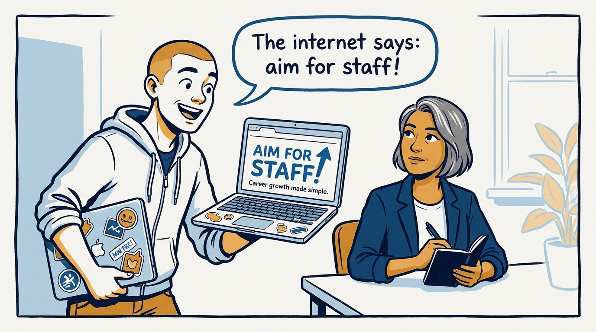
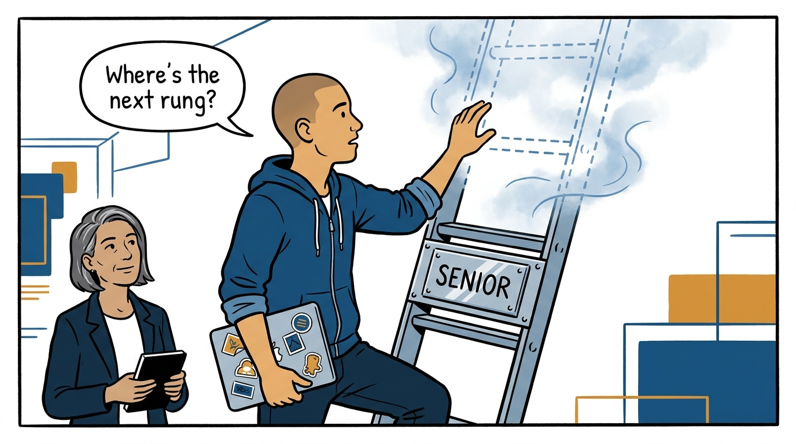
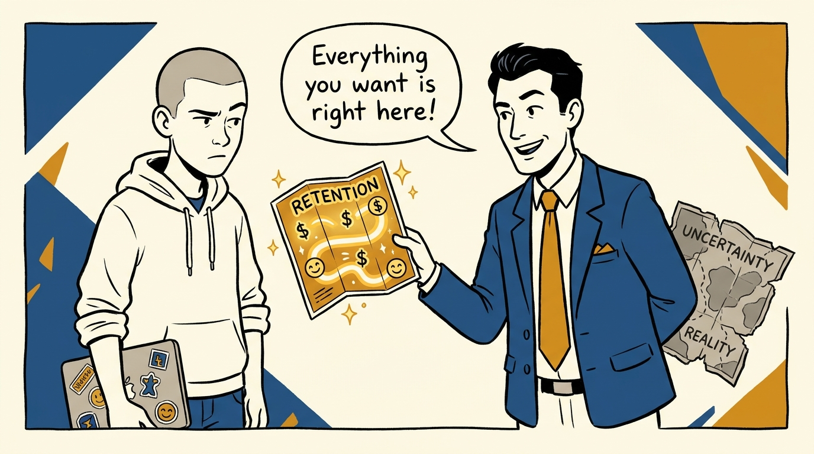
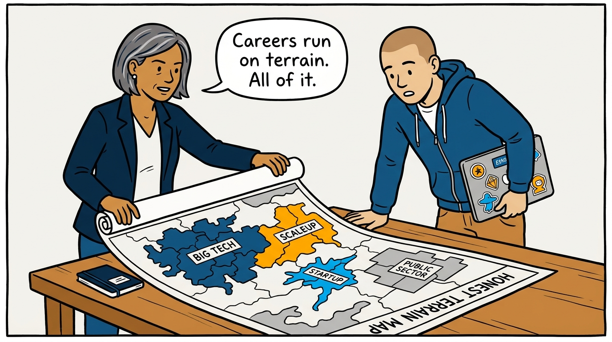
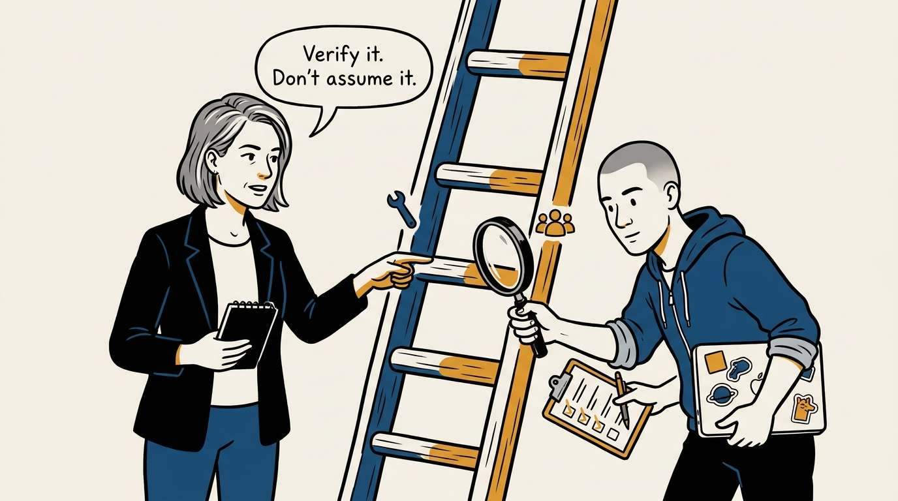
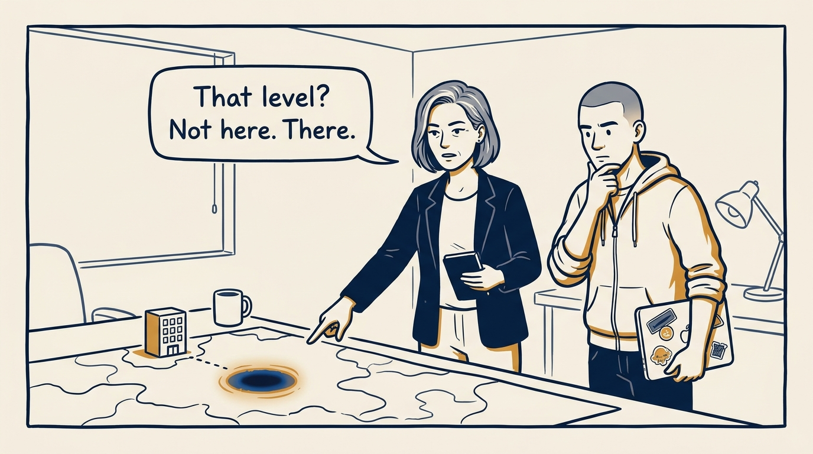
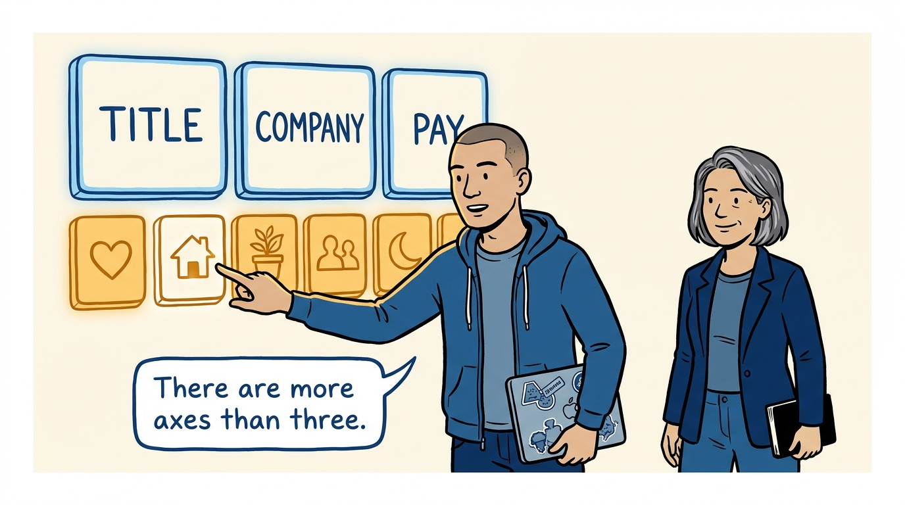

Why career advice is noise until you know the terrain it runs on — in eight panels.

<!-- comic-style
{
  "cast": "VERA: a calm, seasoned engineering executive, short gray-streaked hair, dark blazer over a plain t-shirt, carries a small black notebook. ARLO: an engineer newly stepping into management, buzz-cut hair, zip-up hoodie with rolled sleeves, sticker-covered laptop under one arm.",
  "style": "Clean two-tone explainer comic, thick ink outlines, flat colors with deep blue and amber accents on a light background, generous white space, hand-lettered speech bubbles with SHORT readable text, no photorealism."
}
-->

**Panel 1:** *The hook: advice from the internet arrives without the terrain it was written for.*

**Panel 2:** *The problem: career plans built on a ladder that doesn't exist here waste years.*

**Panel 3:** *The wrong way: coaching from a flattering map — showing only the terrain that favors retention.*

**Panel 4:** *The principle: careers run on terrain — and the map is coached honestly, including the parts this company cannot offer.*

**Panel 5:** *How it runs: verify the ladder as it actually is — tracks, terminal levels, and the highest realistic IC rung.*

**Panel 6:** *The mechanic: promotions, bonuses, and downturn survival track team position — profit center or cost center — more than people believe.*

**Panel 7:** *The cost: honest terrain-coaching sometimes points away from home — and that honesty is what makes the rest of the coaching credible.*

**Panel 8:** *The closer: title, company, and pay are three axes of a dozen — the full scoreboard, reweighted per life stage, is the real measure.*
