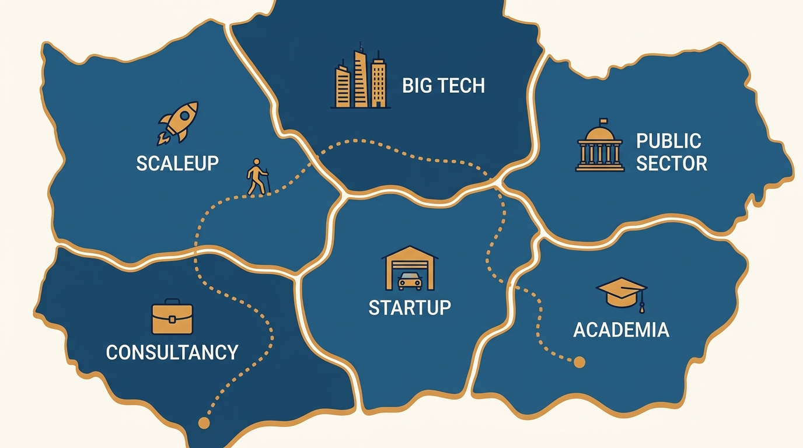
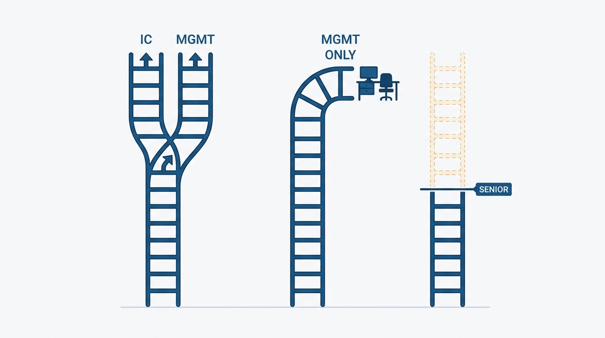
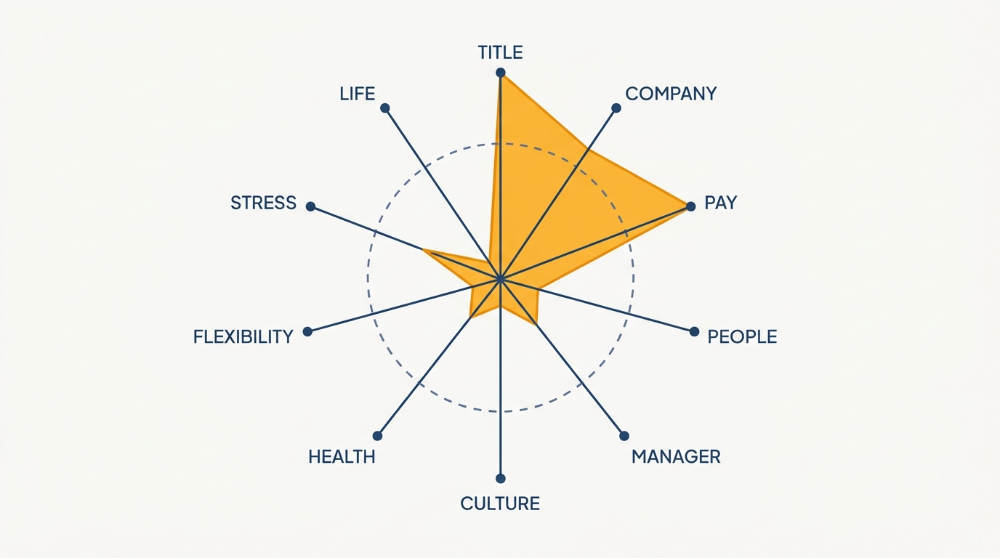

> **Status**: DRAFT
>
> **Principle**: Careers run on terrain, and most bad career advice comes from ignoring it. What "senior" means, how far an IC track goes, what a promotion is worth, and how safe a job is all depend on company type, ladder shape, compensation tier, and whether the team is a profit center or a cost center. I expect engineers to know the terrain they are actually on — and I coach the map honestly, including the ladders my company doesn't have, the tiers it doesn't pay, and the paths that lead away from it. A manager who only shows the parts of the map that favor retention isn't coaching; that's advertising.

## Statement

What I expect engineers to understand about the terrain, and what I commit to in coaching it:

- **Know your company type — it sets the rules.** Big Tech, medium-to-large tech company, scaleup, startup, traditional company with a tech division, tech-heavy traditional company, small non-VC company, public sector, nonprofit, consultancy, academia: each has different ladders, pay, stability, and growth. I expect engineers to know which one they are at and which they are targeting — and to remember that team quality can matter as much as company category.
- **Know the ladder as it actually is.** Whether the company runs a single track or a dual IC/manager track, what the highest realistic IC level is, and whether advancing past senior or staff quietly requires moving into management. Career plans built on a ladder that doesn't exist here waste years.
- **Take non-standard paths seriously.** Lifelong engineer, specialist, generalist/specialist pendulum, niche-field engineer, contractor, tech lead, engineering manager, founder, a move into PM or DevRel or TPM, the engineer/manager pendulum, or a frankly non-linear path — there is no single "good" career, and I refuse to coach as if there were.
- **Understand compensation in tiers, and in total.** Companies cluster into rough tiers; the comparison is total compensation — base, bonus, equity — with liquid and illiquid equity treated very differently. Each tier prices in a tradeoff: stability and balance at one end, extreme pay with extreme hiring difficulty and performance pressure at the other.
- **Know whether you sit in a profit center or a cost center.** Whether the team's work visibly drives revenue changes promotions, bonuses, transfer options, attrition risk, and job security. I expect engineers to know their position — and to learn to succeed in both.
- **Measure progress on more than title, company, and pay.** People, manager relationship, culture, mission, growth, health, flexibility, ability to disconnect, stress, and life outside work are all real axes — and the right balance shifts with life stage. I coach engineers to revisit their priorities before every move, not after.

## How to Read This

This journal is my engineering-management operating model. This record is grounded in the Engineering Career Paths chapter of Gergely Orosz's *The Software Engineer's Guidebook* (Pragmatic Engineer, 2023), read from the manager's side of the table: the book gives engineers the map; this record states how I use that map in coaching — as the shared, honest terrain every career conversation on my teams runs across. The runnable version — the checklist I hand an engineer thinking about where their career is and where it could go — lives in the **Checklist** tab of this post.

## Rationale

**Context-free career advice is noise.** "Aim for staff" means nothing at a company whose IC ladder tops out at senior; "optimize for equity" is bad advice when the equity is illiquid paper at a company that may never exit; "job security first" reads differently in a profit center than in a cost center one reorg away from a cut. The source's core move is to make advice conditional on terrain — company type, ladder, tier, team position — and that conditionality is what I import into every career conversation I run.

**Figure 1:** *Careers run on terrain: each company type is a different region with its own ladders, pay, and stability — advice that ignores the region is noise.*

**Honest maps beat flattering maps, even for retention.** It costs me something to tell an engineer that our IC ladder realistically ends at a level below their ambition, or that a Tier-3 company would pay them double for double the pressure. I tell them anyway, because engineers discover the terrain eventually — and a manager caught curating the map loses the credibility that makes all other coaching work. Paradoxically, honest terrain-coaching retains better: people stay longer where their eyes were open when they chose.

**The dual-track ladder is a fact to verify, not an assumption to inherit.** Many engineers assume every company runs a Big Tech-style dual track with parity to director level and beyond. Many companies don't: the track is single, or the IC ladder exists on paper but the highest realistic level is senior, or advancement past staff quietly requires management. I expect engineers to verify the ladder where they are — and I expect myself to answer truthfully what the highest realistic IC level here is, terminal levels included.

**Figure 2:** *Verify the ladder as it actually is: dual tracks are not universal, and some upper IC rungs exist only on paper.*

**Non-standard paths are the norm stretched over a long career.** Over decades, the "standard" junior-to-staff arc is the exception: people pendulum between specialist and generalist, between engineering and management; they contract, found companies, move into product or developer relations, and come back. Treating these as detours to warn against — rather than patterns to choose deliberately — narrows my coaching to the one path that happens to keep people on my ladder. The source's instruction to review examples of non-linear careers is one I pass on verbatim.

**Tier and team position quietly dominate outcomes engineers attribute to performance.** Two engineers of equal skill diverge enormously based on choices that look secondary: which compensation tier they entered, and whether they sat in a funded, executive-visible profit center or an invisible cost center. Promotions, bonuses, and even survival in a downturn track team position more than individuals like to believe. I make this explicit so engineers place themselves deliberately — and so those in cost centers know the game is different, not unwinnable.

**Title, company, and pay are three axes of a dozen.** The source's final move is the one I care most about as a manager: broaden the scoreboard. The colleagues, the manager, the culture, the mission, health, flexibility, stress, life outside work — these determine whether a career is worth having, and their weights shift with life stage. An engineer optimizing the three visible axes while the other nine collapse is not succeeding, and it is part of my job to say so before the collapse, not after.

**Figure 3:** *Three axes of a dozen: maxing title, company, and pay while the other nine collapse is not succeeding — and the right weights shift with life stage.*

## What This Means in Practice

| What this record says | What it does **not** say |
| --- | --- |
| Know your company type and what it implies for pay, growth, and stability. | One type is best — each trades something for something; team quality can outweigh category. |
| Verify the ladder: tracks, highest realistic IC level, terminal levels. | The published ladder is the real one — realism means what actually gets promoted here. |
| Non-standard paths are legitimate and worth choosing deliberately. | Everyone should leave the standard path — many thrive on it; the point is choice, not churn. |
| Compare total compensation across tiers, with equity liquidity in view. | Chase the highest tier — the top tier prices in hiring difficulty and performance pressure. |
| Know whether your team is a profit center or a cost center. | Cost-center work is a dead end — it can be excellent work; the game is different and learnable. |
| Measure progress on people, health, flexibility, and life — not just title and pay. | Ambition is suspect — the point is a full scoreboard, weighted for your life stage. |

Concretely: every engineer I coach can tell me what type of company we are, what the highest realistic IC level here is, which tier we pay in, and whether their team is a profit or cost center — and our career conversations use that shared map, including the honest parts about what this company cannot offer them.

## Anti-Patterns

- **Coaching from a flattering map.** Showing engineers only the parts of the terrain that favor retention — the ladder we wish we had, the tier we claim to pay — and losing all coaching credibility when they discover the rest.
- **Assuming every ladder is Big Tech's ladder.** Planning a staff-and-beyond IC career at a company whose real ladder ends at senior, and calling the resulting stall a performance problem.
- **The one-true-path reflex.** Treating specialist pendulums, management stints, contracting, founding, or moves into PM as failures to warn against instead of patterns to choose.
- **Reading equity at face value.** Comparing offers on paper equity without asking whether it is liquid — private-company equity may never become valuable, and the source says so bluntly.
- **Ignoring team position.** Attributing promotion and layoff outcomes purely to individual performance while ignoring profit-center versus cost-center dynamics that dominated them.
- **The three-axis scoreboard.** Evaluating a career only by title, company name, and compensation while manager quality, health, stress, and life outside work go unmeasured.
- **Static priorities.** Carrying the optimization function of one life stage into the next unexamined — never revisiting what balance matters now, especially before changing jobs.

## Related Records

- [[own-your-career]] — the ownership contract; this record is the map that contract gets executed on.
- [[promotions]] — the campaign for the next rung; this record tells you which ladder, at which kind of company, the rung is on.
- [[changing-jobs]] — moving across the terrain: how a move between company types and tiers is actually made.
- [[thriving-in-different-environments]] — behavior inside an environment; this record is about choosing and evaluating environments.
- [[career-conversations]] (people journal) — the conversation format where this map meets an individual's history and motivations.

## Scope and Revisiting

This record is `draft`. It governs the shared map I use in career coaching: company types, ladder realism, non-standard paths, compensation tiers, profit-versus-cost-center position, and the broadened scoreboard. I revisit it if our own ladder or compensation position changes materially — the honest answers about "here" must stay current — if the market re-tiers (compensation structures have shifted before and will again), or if I catch a career conversation running on the flattering map instead of the real one.

## Authoritative References

- Gergely Orosz, *The Software Engineer's Guidebook* (Pragmatic Engineer, 2023) — the Engineering Career Paths chapter this record distills, via its companion checklist.
