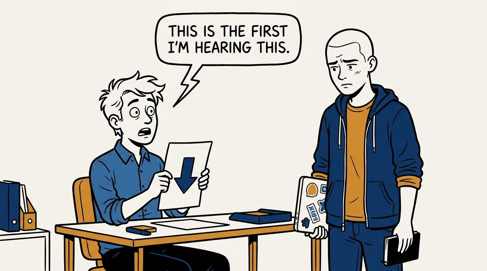
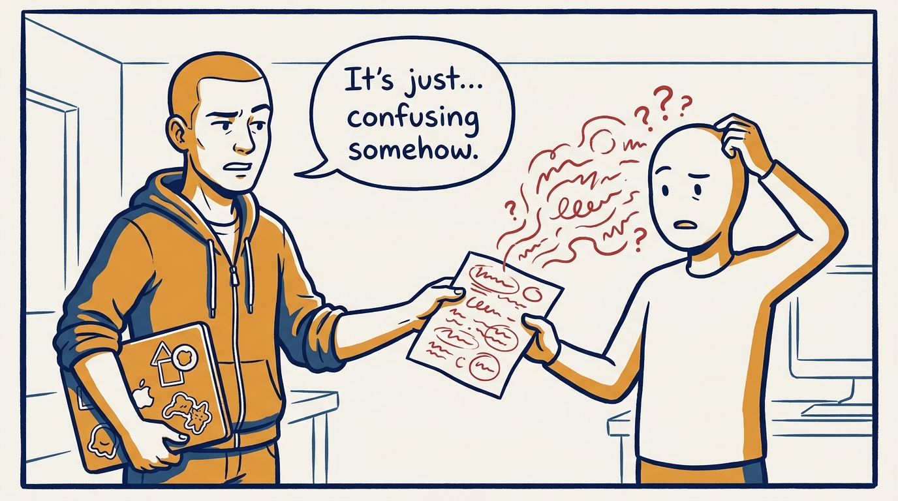
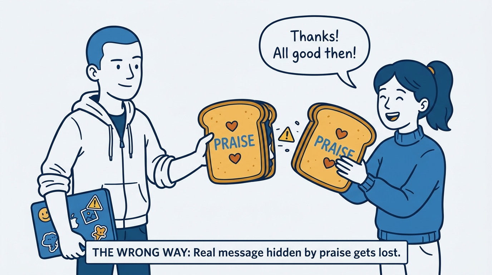
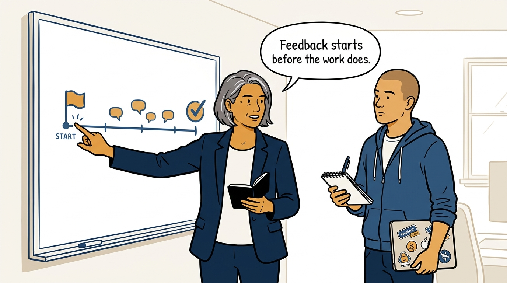
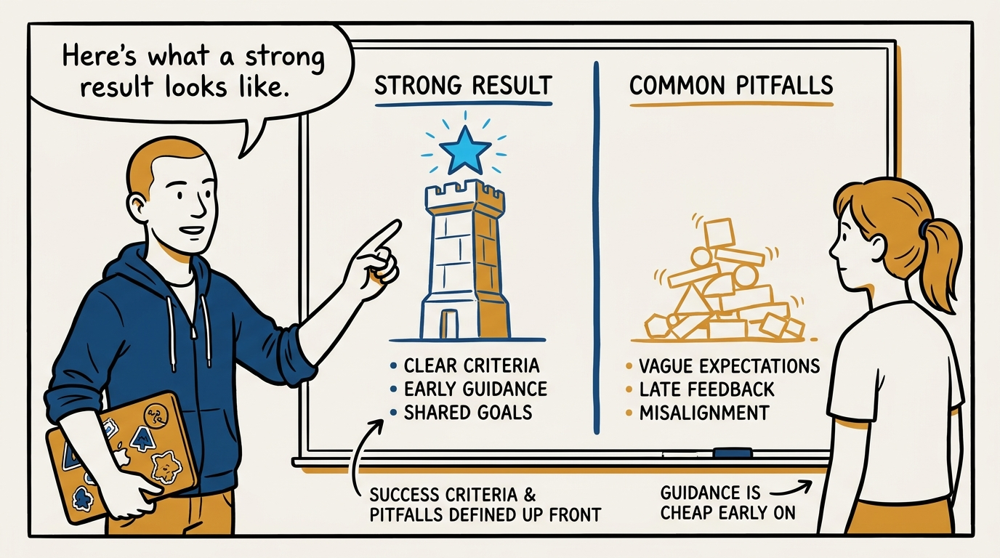
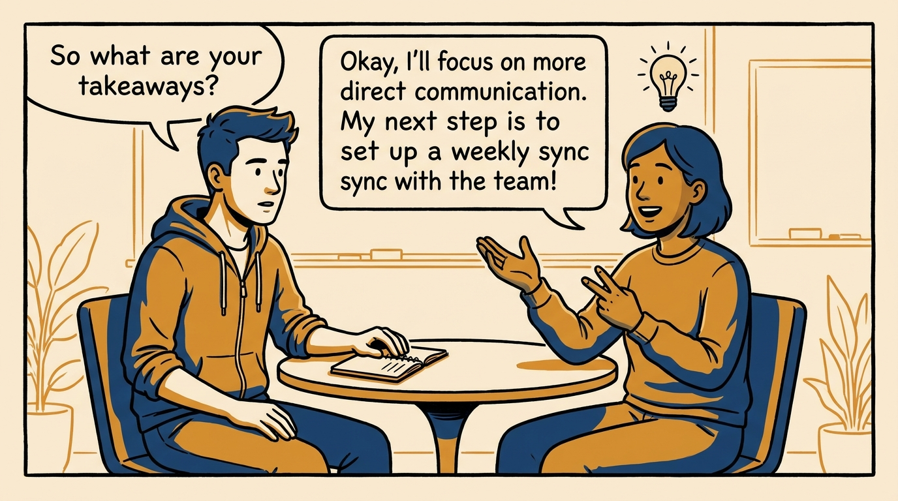
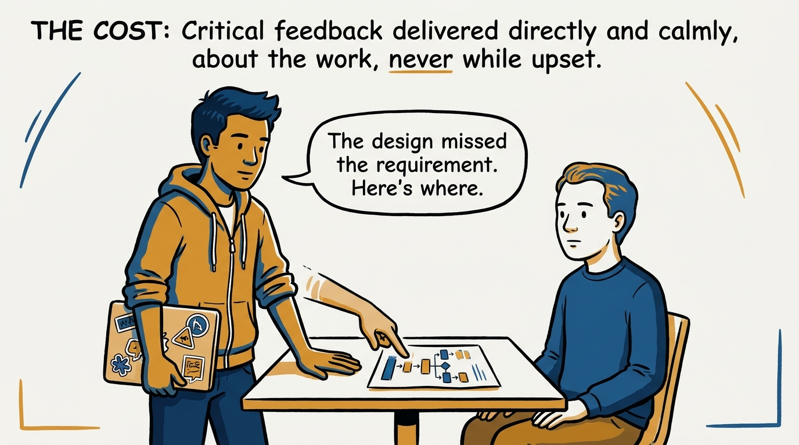
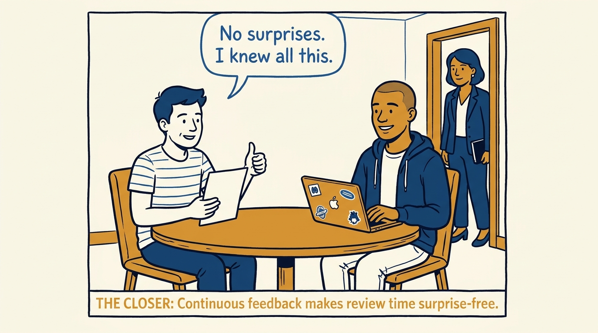

Why feedback starts before the work does — and only counts when it lands — in eight panels.

<!-- comic-style
{
  "cast": "VERA: a calm, seasoned engineering executive, short gray-streaked hair, dark blazer over a plain t-shirt, carries a small black notebook. ARLO: an engineer newly stepping into management, buzz-cut hair, zip-up hoodie with rolled sleeves, sticker-covered laptop under one arm.",
  "style": "Clean two-tone explainer comic, thick ink outlines, flat colors with deep blue and amber accents on a light background, generous white space, hand-lettered speech bubbles with SHORT readable text, no photorealism."
}
-->

**Panel 1:** *The hook: the review-time ambush — months of unsaid feedback, delivered all at once.*

**Panel 2:** *The problem: 'this is confusing' is a mood, not feedback — nothing to repeat, nothing to change.*

**Panel 3:** *The wrong way: the compliment sandwich — the person walks away remembering only the bread.*

**Panel 4:** *The principle: feedback is a system set up before the work starts — not a reaction after it ends.*

**Panel 5:** *How it runs: strong versus weak named before the work begins — the cheapest feedback there is.*

**Panel 6:** *The mechanic: the landing check — their takeaways, their next steps, not your recitation.*

**Panel 7:** *The cost: directness takes a breath and a steady voice — comfort-seeking is what feedback fails from.*

**Panel 8:** *The closer: the measure of the system — a review with nothing new in it.*
