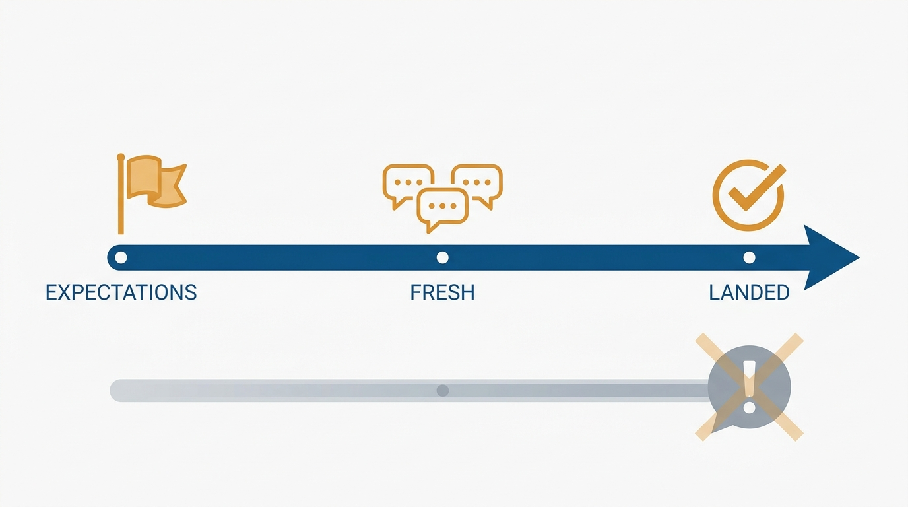
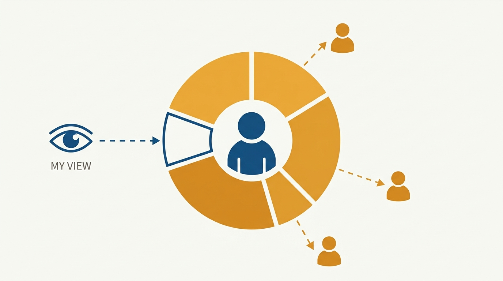
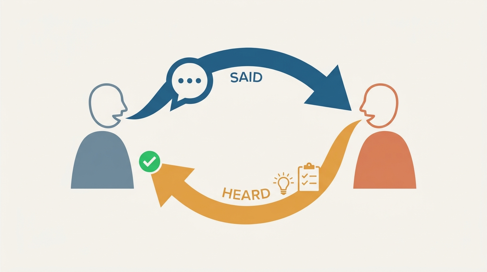

> **Status**: DRAFT
>
> **Principle**: Feedback is not something I deliver after work goes wrong — it is a system I set up before the work starts and run continuously while it happens. I state what success looks like up front, comment on work while it is fresh, describe exact behaviors with concrete examples, and say plainly whether I am setting an expectation or making a suggestion. The measure of my feedback is never how it felt to give: it is whether the person heard it, agrees on what it means, and knows what to do next.

## Statement

My operating model for feedback has six parts:

- **Feedback starts before the work does.** Before a piece of work begins, I explain what success looks like, what separates a strong result from a weak one, how to get started well, and which common pitfalls to avoid. Expectations set early are feedback; expectations raised only after problems appear are complaints.
- **Frequent and fresh beats rare and polished.** I give feedback regularly, not just during reviews — commenting on recent work while it is still fresh, balancing praise with improvement feedback, and covering skills, growth, and career trajectory, not only the task at hand.
- **Specific or it doesn't count.** I describe the exact behavior, action, or output, use concrete examples, and explain why it was effective or ineffective. "This was confusing" without details is not feedback; it is a mood.
- **Behavioral feedback is part of the job, delivered with care.** I look for patterns across multiple situations, share observations about habits, tendencies, and working style, and always support them with examples — knowing this kind of feedback feels more personal and deserves more thought.
- **My eyes are not the only ones.** I collect input from collaborators when useful — what should this person do more of, what should they change or stop — and use 360-style feedback for a fuller picture than my own vantage point allows.
- **Feedback only counts when it lands.** I make the person feel safe enough to listen, show that my goal is to help rather than attack, ask for their perspective, confirm understanding by asking for their takeaways and next steps, and follow up in writing when clarity would help.

**Figure 1:** *Feedback is a system across the whole timeline of the work — not one reaction composed after it ends.*

## How to Read This

This journal is my engineering-management operating model, each record grounded in one source. This record distills the feedback chapter of Julie Zhuo's *The Making of a Manager* (Portfolio/Penguin, 2019) — her argument that great feedback is frequent, specific, actionable, and checked for landing, and her guidance on delivering critical feedback without softening it into fog. The runnable version — the full working checklist from setup through the final test — lives in the **Checklist** tab of this post.

## Rationale

**Expectations set up front are the cheapest feedback I will ever give.** Every correction I make after work goes sideways could have been a sentence before it started: here is what a strong result looks like, here is how people usually stumble. Zhuo's insight is that feedback begins before the work does — a manager who only reacts to finished work has forfeited the moment when guidance was cheapest and least personal. Setting expectations early also makes later critical feedback fair: I am comparing work against a bar the person knew about, not one I invented afterward.

**Vague feedback transfers a feeling; specific feedback transfers information.** "Great job" and "this was confusing" produce the same result: the person knows how I felt and nothing about what to repeat or change. Naming the exact behavior, showing a concrete example, and explaining why it worked or didn't turns my reaction into something the person can act on. The same discipline applies doubly to behavioral feedback — observations about habits and working style land as judgments of character unless they are anchored to patterns I can actually point to across multiple situations.

**I see a fraction of anyone's work, so I borrow other people's eyes.** My reports spend most of their week in rooms I am not in. Asking collaborators what someone should do more of and what they should change gives me a picture no amount of my own observation can, and it protects the person from feedback distorted by my narrow sample. 360-style input is not bureaucracy; it is how behavioral feedback gets the evidence base it needs.

**Figure 2:** *I see a fraction of anyone's work; collaborators' perspectives give behavioral feedback the evidence base my narrow sample cannot.*

**Feedback that was said but not heard did not happen.** The transaction completes on the receiving end, not the sending end. That is why I ask for the person's perspective, ask them to tell me their takeaways and next steps rather than reciting mine, and put things in writing when clarity would help. It is also why I am explicit about register: an expectation the person treated as a suggestion — or a suggestion they treated as an order — is a failure of my delivery, not their listening.

**Figure 3:** *The transaction completes on the receiving end: their takeaways and their next steps, not my recitation.*

**Critical feedback delivered directly and calmly is a form of respect.** The common mistakes all share one root: protecting my own comfort at the person's expense. Waiting for review season, burying the message in a compliment sandwich, softening the conversation until the real issue is unclear, or staging a "discussion" about a decision already made — each spares me an awkward moment and costs the person weeks of not knowing. The respectful version is plainer: state the concern, explain what led me to it, keep the focus on the work or behavior rather than the person's character, never deliver it while upset, and work out the resolution together.

## What This Means in Practice

| What this record says | What it does **not** say |
| --- | --- |
| Expectations about success are set before the work starts. | Feedback is a reaction I compose after seeing the finished result. |
| Feedback is frequent, and given while the work is fresh. | Feedback is saved up and batch-delivered at review time. |
| Feedback names exact behaviors with concrete examples. | General impressions ("be more strategic") count as feedback. |
| Behavioral feedback on habits and working style is in scope. | Task feedback alone is enough to grow a person. |
| I gather collaborators' perspectives for a fuller picture. | My own observations are a sufficient evidence base. |
| I check the feedback landed: their takeaways, their next steps. | Saying it clearly is the same as it being heard. |
| Critical feedback is direct, calm, and about the work. | Directness licenses accusatory language or feedback delivered angry. |

Concretely: when I hand someone a piece of work, they can repeat back what a strong result looks like. When I give feedback, I can point to the specific example behind it, and the person can tell me — in their words — what they took away and what they will do next. Serious issues never surprise anyone at review time, because they were raised the week I noticed them.

## Anti-Patterns

- **Review-time ambush.** Sitting on a serious issue for months and raising it first in a performance review — the person loses the entire period they could have used to improve.
- **The compliment sandwich.** Hiding the real message between two layers of praise so thoroughly that the person walks away remembering only the bread.
- **Softness that obscures.** Making the conversation so gentle that the person cannot tell a problem was raised at all — kindness in tone, cruelty in effect.
- **Fake discussions.** Presenting a decision that is already made as if it were open for debate, spending the person's trust to buy myself an easier meeting.
- **Task-only feedback.** Commenting endlessly on individual deliverables while never addressing the behavioral patterns or career trajectory that actually determine someone's growth.
- **Vague verdicts.** "This was confusing," "this needs more polish" — statements that assert a problem without giving the person a single concrete detail to act on.
- **Feedback while upset.** Delivering criticism in the heat of frustration, when accusatory and emotionally loaded language is most likely and least useful.

## Related Records

- [[management-101]] — the two-sided contract with every report; honest, timely feedback is one of the things I owe them under it.
- [[leading-a-small-team]] — the team context where most of this feedback is delivered, 1:1 by 1:1.
- [[performance-review-cycle]] — the formal cycle works only when it summarizes feedback already given; this record is what makes reviews surprise-free.
- [[performance-reviews]] (people journal) — the written-evaluation toolkit; this record covers the continuous feedback that feeds it.

## Scope and Revisiting

This record is `draft`. It governs how I give feedback to the people I manage: the expectations I set before work starts, the cadence and specificity of ongoing feedback, the use of behavioral and 360-style input, and the delivery of critical feedback. I revisit it if a report is genuinely surprised by anything in a performance review, if I catch myself sitting on a serious issue for more than a week, or if someone acts on a "suggestion" I meant as an expectation — each is evidence the system, not the person, failed.

## Authoritative References

- Julie Zhuo, *The Making of a Manager: What to Do When Everyone Looks to You* (Portfolio/Penguin, 2019) — the feedback chapter ("The Art of Feedback") this record distills.
